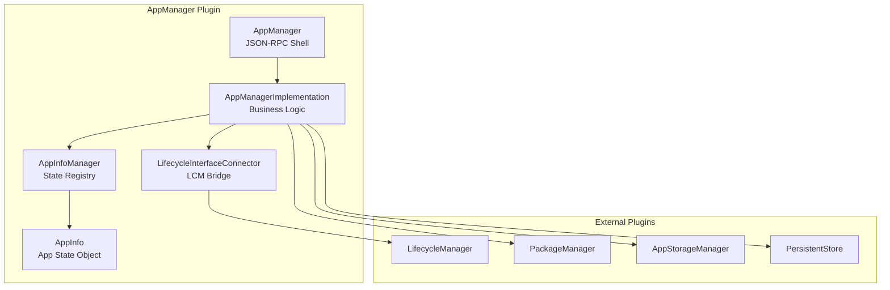
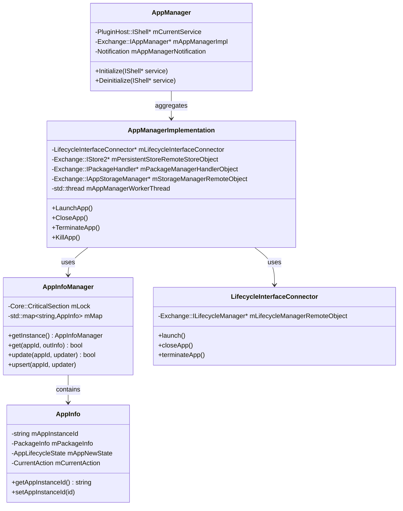
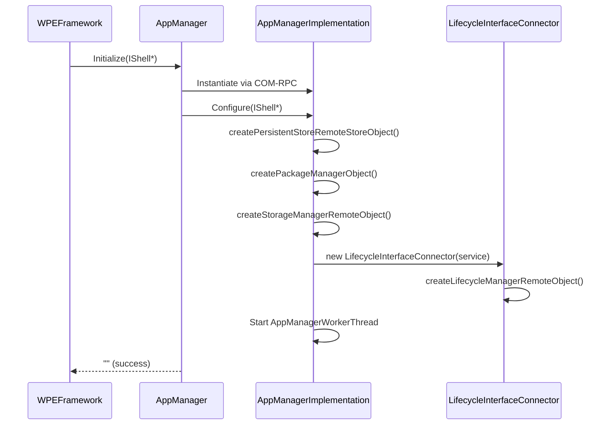
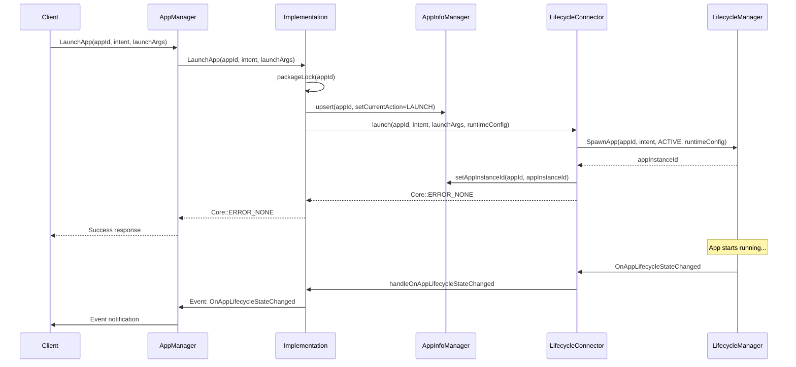
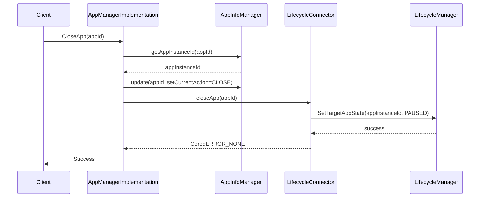
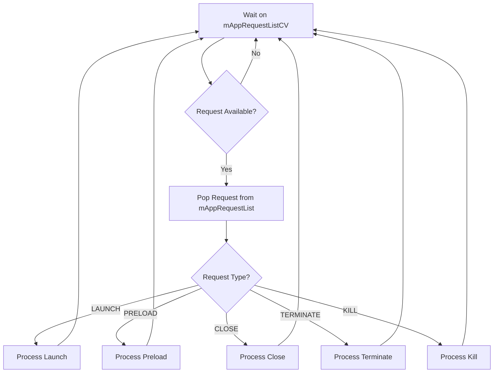
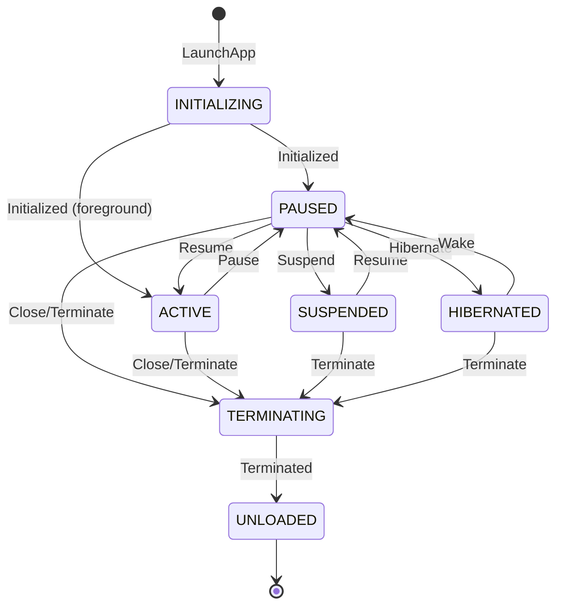
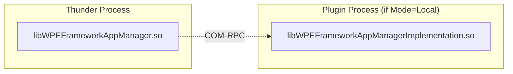

# AppManager Plugin Documentation

> Primary API for Application Management in RDK Infrastructure

## 1. High-Level Purpose & Architecture

### Role in ENT / RDK Infrastructure

The **AppManager** plugin serves as the primary entry point for application management operations in the RDK ecosystem. It provides a unified JSON-RPC API that orchestrates:

- Application launching and lifecycle control
- Package installation status queries
- Application data management
- Lifecycle state change notifications

### Responsibilities

- **Application Orchestration**: Coordinate app launch, close, terminate, and kill operations
- **Package Integration**: Query installed packages and manage package locks
- **Storage Management**: Clear application data via AppStorageManager
- **State Tracking**: Maintain application state information via `AppInfoManager`
- **Event Propagation**: Notify clients of lifecycle state changes, installations, and unloads

### Interacting Subsystems

| Subsystem | Interaction Type | Purpose |
|-----------|-----------------|---------|
| LifecycleManager | COM-RPC | Delegate lifecycle operations (spawn, state changes, unload, kill) |
| PackageManager | COM-RPC | Lock/unlock packages, query installed apps |
| AppStorageManager | COM-RPC | Clear application storage |
| PersistentStore | COM-RPC | Store/retrieve application properties |

### What It Does NOT Do

- Does not directly manage OCI containers (delegated to RuntimeManager)
- Does not handle package downloads (delegated to PackageManager/DownloadManager)
- Does not manage display/window creation (delegated to RDKWindowManager)

---

## 2. Architectural Overview

### Major Components



### Component Interactions

1. **AppManager (Shell)**: Receives JSON-RPC requests and dispatches to implementation
2. **AppManagerImplementation**: Core business logic, manages worker thread for async operations
3. **LifecycleInterfaceConnector**: Bridge to LifecycleManager for lifecycle operations
4. **AppInfoManager**: Thread-safe singleton registry for all loaded application state
5. **AppInfo**: Individual application state container

---

## 3. Code Organization

### Directory Structure

```
AppManager/
├── AppManager.cpp              # Plugin shell implementation
├── AppManager.h                # Plugin shell header
├── AppManagerImplementation.cpp # Core business logic
├── AppManagerImplementation.h   # Implementation header
├── AppInfo.cpp                 # Application state class
├── AppInfo.h                   # AppInfo header
├── AppInfoManager.cpp          # Thread-safe state registry
├── AppInfoManager.h            # AppInfoManager header
├── AppManagerTypes.h           # Type definitions and enums
├── LifecycleInterfaceConnector.cpp # LCM bridge
├── LifecycleInterfaceConnector.h   # LCM bridge header
├── AppManagerTelemetryReporting.cpp # Telemetry utilities
├── AppManagerTelemetryReporting.h   # Telemetry header
├── Module.cpp                  # Plugin module registration
├── Module.h                    # Module header
├── CMakeLists.txt             # Build configuration
├── AppManager.config          # Plugin configuration
└── AppManager.conf.in         # Configuration template
```

### File-by-File Breakdown

#### AppManager.h / AppManager.cpp

**Purpose**: JSON-RPC shell plugin that exposes the AppManager API to external clients.

**Key Elements**:
- Implements `PluginHost::IPlugin` and `PluginHost::JSONRPC`
- Contains `Notification` inner class for event handling
- Aggregates `Exchange::IAppManager` interface to implementation

```cpp
// From AppManager.h (lines 32-35)
class AppManager: public PluginHost::IPlugin, public PluginHost::JSONRPC
{
    // ...
    BEGIN_INTERFACE_MAP(AppManager)
    INTERFACE_ENTRY(PluginHost::IPlugin)
    INTERFACE_ENTRY(PluginHost::IDispatcher)
    INTERFACE_AGGREGATE(Exchange::IAppManager, mAppManagerImpl)
    END_INTERFACE_MAP
```

#### AppManagerImplementation.h / AppManagerImplementation.cpp

**Purpose**: Core business logic implementing `Exchange::IAppManager` and `Exchange::IConfiguration`.

**Key Types**:
- `ApplicationType`: UNKNOWN, INTERACTIVE, SYSTEM
- `CurrentAction`: NONE, LAUNCH, PRELOAD, SUSPEND, RESUME, CLOSE, TERMINATE, HIBERNATE, KILL
- `CurrentActionError`: Error codes for operations
- `AppManagerRequest`: Request structure for worker thread queue

**Key Methods**:
```cpp
Core::hresult LaunchApp(const string& appId, const string& intent, const string& launchArgs);
Core::hresult CloseApp(const string& appId);
Core::hresult TerminateApp(const string& appId);
Core::hresult KillApp(const string& appId);
Core::hresult GetLoadedApps(Exchange::IAppManager::ILoadedAppInfoIterator*& appData);
Core::hresult PreloadApp(const string& appId, const string& intent, const string& launchArgs, string& error);
Core::hresult GetInstalledApps(string& apps);
Core::hresult ClearAppData(const string& appId);
Core::hresult ClearAllAppData();
```

#### AppInfo.h / AppInfo.cpp

**Purpose**: Encapsulates runtime state for a single loaded application.

**Key Members**:
| Member | Type | Description |
|--------|------|-------------|
| `mAppInstanceId` | `std::string` | Unique instance identifier |
| `mActiveSessionId` | `std::string` | Active session ID |
| `mPackageInfo` | `AppManagerTypes::PackageInfo` | Package metadata |
| `mAppNewState` | `Exchange::IAppManager::AppLifecycleState` | Latest app lifecycle state |
| `mTargetAppState` | `Exchange::IAppManager::AppLifecycleState` | Target state requested by current action |
| `mAppOldState` | `Exchange::IAppManager::AppLifecycleState` | Previous app lifecycle state |
| `mAppLifecycleState` | `Exchange::ILifecycleManager::LifecycleState` | LifecycleManager-reported state |
| `mLastActiveStateChangeTime` | `timespec` | Timestamp of last active-state change |
| `mCurrentAction` | `AppManagerTypes::CurrentAction` | Current in-flight action |
| `mCurrentActionTime` | `time_t` | Time when current action started |

#### AppInfoManager.h / AppInfoManager.cpp

**Purpose**: Thread-safe singleton registry for all `AppInfo` entries.

**Key Features**:
- Copy-update-swap strategy for multi-field updates
- Lock-free callbacks for deadlock prevention
- Convenience field getters/setters

```cpp
// Usage patterns from AppInfoManager.h (lines 37-55)
// Single-field read:
std::string id = AppInfoManager::getInstance().getAppInstanceId(appId);

// Multi-field atomic read:
AppInfo snap;
if (AppInfoManager::getInstance().get(appId, snap)) { ... }

// Multi-field update (insert-or-update):
AppInfoManager::getInstance().upsert(appId, [&](AppInfo& a) {
    a.setAppInstanceId(instanceId);
    a.setTargetAppState(state);
});
```

#### LifecycleInterfaceConnector.h / LifecycleInterfaceConnector.cpp

**Purpose**: Bridge between AppManager and LifecycleManager for lifecycle operations.

**Key Methods**:
```cpp
Core::hresult launch(const string& appId, const string& intent, const string& launchArgs, 
                     WPEFramework::Exchange::RuntimeConfig& runtimeConfigObject);
Core::hresult preLoadApp(const string& appId, const string& intent, const string& launchArgs,
                         WPEFramework::Exchange::RuntimeConfig& runtimeConfigObject, string& error);
Core::hresult closeApp(const string& appId);
Core::hresult terminateApp(const string& appId);
Core::hresult killApp(const string& appId);
Core::hresult sendIntent(const string& appId, const string& intent);
```

---

## 4. Class & Interface Documentation

### Exchange::IAppManager Interface

The primary interface implemented by AppManagerImplementation:

```cpp
// Key interface methods
Core::hresult Register(Exchange::IAppManager::INotification *notification);
Core::hresult Unregister(Exchange::IAppManager::INotification *notification);
Core::hresult LaunchApp(const string& appId, const string& intent, const string& launchArgs);
Core::hresult CloseApp(const string& appId);
Core::hresult TerminateApp(const string& appId);
Core::hresult KillApp(const string& appId);
Core::hresult GetLoadedApps(Exchange::IAppManager::ILoadedAppInfoIterator*& appData);
Core::hresult SendIntent(const string& appId, const string& intent);
Core::hresult PreloadApp(const string& appId, const string& intent, const string& launchArgs, string& error);
Core::hresult GetAppProperty(const string& appId, const string& key, string& value);
Core::hresult SetAppProperty(const string& appId, const string& key, const string& value);
Core::hresult GetInstalledApps(string& apps);
Core::hresult IsInstalled(const string& appId, bool& installed);
Core::hresult ClearAppData(const string& appId);
Core::hresult ClearAllAppData();
```

### INotification Interface

Event notification interface for clients:

```cpp
class INotification {
    void OnAppInstalled(const string& appId, const string& version);
    void OnAppUninstalled(const string& appId);
    void OnAppLifecycleStateChanged(const string& appId, const string& appInstanceId,
                                    AppLifecycleState newState, AppLifecycleState oldState,
                                    AppErrorReason errorReason);
    void OnAppLaunchRequest(const string& appId, const string& intent, const string& source);
    void OnAppUnloaded(const string& appId, const string& appInstanceId);
};
```

### AppLifecycleState Enumeration

```cpp
enum AppLifecycleState {
    INITIALIZING,   // App is loading/initializing
    PAUSED,         // App is paused (background)
    ACTIVE,         // App is active (foreground)
    SUSPENDED,      // App is suspended (low memory state)
    HIBERNATED,     // App state saved to disk
    TERMINATING,    // App is shutting down
    UNLOADED        // App is unloaded from memory
};
```

### Class Relationships



---

## 5. Configuration & Build Integration

### Plugin Configuration (AppManager.config)

```cmake
set (autostart ${PLUGIN_APP_MANAGER_AUTOSTART})
set (preconditions Platform)
set (callsign "org.rdk.AppManager")

map()
   key(root)
   map()
       kv(mode ${PLUGIN_APP_MANAGER_MODE})
       kv(locator lib${PLUGIN_IMPLEMENTATION}.so)
   end()
end()
ans(configuration)
```

### CMake Build Options

| Option | Description | Default |
|--------|-------------|---------|
| `PLUGIN_APP_MANAGER_MODE` | Execution mode (Off/Local/Container) | Off |
| `PLUGIN_APP_MANAGER_AUTOSTART` | Auto-start on Thunder boot | false |
| `PLUGIN_APP_MANAGER_STARTUPORDER` | Plugin startup order | "" |
| `PLUGIN_APP_MANAGER_EXTRA_LIBRARIES` | Additional link libraries | "" |

### Build Targets

- `${NAMESPACE}AppManager` - Shell plugin library
- `${NAMESPACE}AppManagerImplementation` - Implementation library

---

## 6. Internal Workflows & Execution Flow

### Plugin Initialization



### Application Launch Flow



### Application Close Flow



### Worker Thread Processing

The `AppManagerWorkerThread` processes requests asynchronously:



---

## 7. Diagrams & Visual Aids

### State Transition Diagram (AppLifecycleState)



### Component Deployment



---

## 8. Testing & Quality Analysis

### Existing Tests

Located in `Tests/L1Tests/tests/test_AppManager.cpp`:

| Test Category | Description |
|---------------|-------------|
| Launch Tests | Verify app launch with various parameters |
| Close Tests | Verify graceful app closure |
| Terminate Tests | Verify forced termination |
| Kill Tests | Verify immediate kill |
| Property Tests | Verify get/set app properties |
| Installation Tests | Verify installed app queries |
| Storage Tests | Verify clear data operations |

### Test Coverage Gaps

Based on code analysis, the following areas may need additional coverage:

1. **Error Handling**: Edge cases for package lock failures
2. **Concurrent Operations**: Multiple simultaneous launch/close requests
3. **Notification Delivery**: Event ordering and delivery guarantees
4. **Worker Thread**: Thread synchronization and shutdown scenarios

### Suggested Test Cases

```cpp
// Test concurrent launch attempts for same app
TEST(AppManagerTest, ConcurrentLaunchSameApp) {
    // Should serialize or reject duplicate launches
}

// Test launch with invalid package
TEST(AppManagerTest, LaunchNonExistentPackage) {
    // Should return appropriate error code
}

// Test notification delivery order
TEST(AppManagerTest, NotificationOrder) {
    // State changes should be delivered in order
}
```

---
