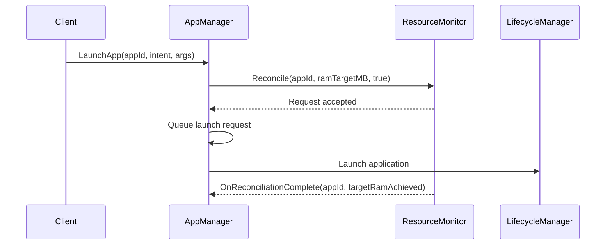
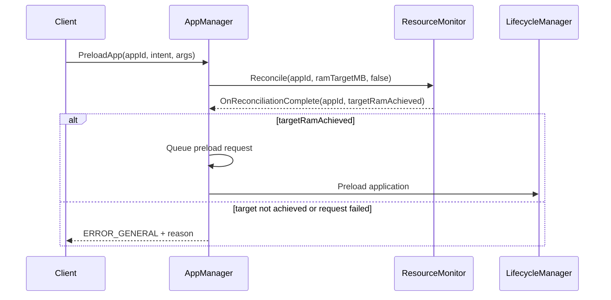
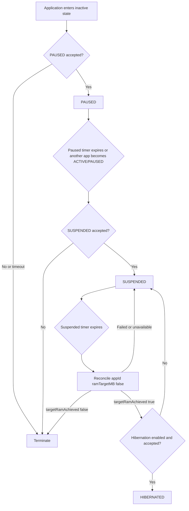

# AppManager Resource Monitoring Integration

## Overview

AppManager now coordinates with the App System Resource Monitor before launching or preloading applications and drives inactive applications through the lifecycle described by the App Resource Monitoring HLA.

The implementation covers three areas:

1. Foreground launches request resource reconciliation without waiting for completion.
2. Preloads wait for reconciliation and proceed only when the RAM target is achieved.
3. Confirmed PAUSED and SUSPENDED lifecycle states are advanced by a timer-driven state-transition worker.

ResourceMonitor remains responsible for observing platform-level signals such as `MemAvailable`, PSI, and swap usage. AppManager does not duplicate that monitoring. Each reconciliation request identifies the application and the maximum RAM target it needs.

## ResourceMonitor Contract

The COM-RPC interface is defined in `entservices-apis/apis/ResourceMonitor/IResourceMonitor.h`.

```cpp
struct IResourceMonitor : virtual public Core::IUnknown {
    struct INotification : virtual public Core::IUnknown {
      virtual void OnReconciliationComplete(const string& appId, bool targetRamAchieved) = 0;
    };

    virtual Core::hresult Register(INotification* notification) = 0;
    virtual Core::hresult Unregister(INotification* notification) = 0;
    virtual Core::hresult Reconcile(const string& appId, uint32_t ramTargetMB, bool allowTerminate) = 0;
};
```

The callsign used by AppManager is:

```text
org.rdk.ResourceMonitor
```

The interface and notification IDs are reserved in `entservices-apis/apis/Ids.h`.

The ResourceMonitor team's final interface must use the same callsign, method parameters, notification parameters, and interface IDs. If its final contract differs, both repositories must be updated together before integration.

## Initialization and Lifetime

During `AppManagerImplementation::Configure`:

1. AppManager queries `org.rdk.ResourceMonitor` through `QueryInterfaceByCallsign`.
2. It registers `ResourceMonitorNotification` for reconciliation completion events.
3. Failure to find ResourceMonitor does not prevent AppManager initialization.
4. Reconciliation methods retry interface discovery, allowing ResourceMonitor to activate after AppManager.
5. The inactive-state worker is configured and started.

During destruction:

1. The state-transition worker is stopped first.
2. LifecycleManager and ResourceMonitor interfaces are then unregistered and released.
3. This ordering prevents the worker from using released COM-RPC interfaces.

## Launch Flow

`LaunchApp` validates the request and then calls:

```cpp
Reconcile(appId, ramTargetMB, true);
```

`ramTargetMB` is derived from the application's configured system-memory limit. `allowTerminate=true` permits ResourceMonitor to invoke victim eviction if resource headroom is insufficient.

AppManager does not wait for `OnReconciliationComplete`. After the `Reconcile` method accepts the asynchronous request, the launch request is queued normally. Failure to start reconciliation is logged but does not reject the foreground launch.



AppManager releases its administrative lock around the COM-RPC call so ResourceMonitor and VictimSelector can call back into AppManager without causing a cross-plugin deadlock.

## Preload Flow

`PreloadApp` calls:

```cpp
ReconcileAndWait(appId, ramTargetMB, false, targetRamAchieved);
```

`allowTerminate=false` requests an availability check without evicting applications for an optional preload.

The method waits for `OnReconciliationComplete` for up to 30 seconds:

- `targetRamAchieved=true`: queue and execute the preload.
- `targetRamAchieved=false`: reject the preload with `Core::ERROR_GENERAL`.
- ResourceMonitor unavailable, request failure, or timeout: reject the preload with `Core::ERROR_GENERAL`.

The output `error` string distinguishes insufficient RAM from reconciliation failure or timeout.



## Reconciliation Synchronization

The ResourceMonitor contract does not include a separate request ID, but it includes the request `appId` in both the request and completion event. AppManager therefore serializes reconciliation requests using:

- `mReconcileRequestLock`: permits one submitted/waited reconciliation at a time.
- `mReconcileResultLock`: protects callback state.
- `mReconcileResultCV`: wakes the waiting preload or state-transition worker.
- `mReconcilePending`: identifies whether a completion event is outstanding.
- `mReconcileAppId`: correlates a completion event to the outstanding request.
- `mTargetRamAchieved`: stores the completion result.

Before submitting a new request, AppManager waits for the previous completion event. The completion's `appId` must match `mReconcileAppId`, which prevents a foreground-launch completion from being mistaken for a later preload result.

A request identifier in the future ResourceMonitor contract would allow safe concurrent reconciliation requests without serialization.

## Inactive Application State Flow

`AppStateTransitionManager` runs on a dedicated worker thread. Lifecycle callbacks only update timer state; they do not sleep or perform blocking transitions.



### PAUSED behavior

When AppManager receives a confirmed PAUSED event:

- It records a deadline using `pausedToSuspendedTimeout`.
- Only one application is tracked as the current paused application.
- If another app becomes ACTIVE or PAUSED, the previous paused application's deadline is advanced immediately.
- At the deadline, AppManager requests SUSPENDED through LifecycleManager.
- If PAUSED was rejected or not confirmed by the existing close timeout, AppManager terminates the app.
- If SUSPENDED is rejected, AppManager terminates the app.

### SUSPENDED behavior

When AppManager receives a confirmed SUSPENDED event:

- It records a deadline using `suspendedToHibernatedTimeout`.
- At the deadline, it calls `Reconcile(appId, ramTargetMB, false)` and waits for the proactive resource result.
- If the resource check cannot be completed, the app remains suspended and the timer is rearmed.
- If the RAM target is not achieved, AppManager terminates the app.
- If the RAM target is achieved and hibernation is enabled, AppManager requests HIBERNATED.
- If hibernation is unavailable or rejected, the app remains suspended.

### Other states

ACTIVE, HIBERNATED, TERMINATING, UNLOADED, and unrelated states remove the application from timer tracking. App removal also explicitly clears any scheduler entry.

## LifecycleManager Integration

`LifecycleInterfaceConnector::setTargetAppState` provides the scheduler with a generic transition path:

1. Resolve `appId` to `appInstanceId` through `AppInfoManager`.
2. Call `ILifecycleManager::SetTargetAppState`.
3. Update AppManager's target-state bookkeeping after a successful request.
4. Wait for normal lifecycle notifications to confirm the actual state.

The scheduler never writes lifecycle state directly.

## Configuration

The following CMake cache variables are available:

| Variable | Default | Meaning |
|---|---:|---|
| `PLUGIN_APP_MANAGER_PAUSED_TO_SUSPENDED_TIMEOUT` | `60` | Seconds an app may remain PAUSED |
| `PLUGIN_APP_MANAGER_SUSPENDED_TO_HIBERNATED_TIMEOUT` | `300` | Seconds before evaluating a SUSPENDED app |
| `PLUGIN_APP_MANAGER_HIBERNATION_ENABLED` | `1` | Enables automatic hibernation (`0` or `1`) |

They are emitted into the generated AppManager configuration as:

```json
{
  "pausedToSuspendedTimeout": 60,
  "suspendedToHibernatedTimeout": 300,
  "hibernationEnabled": 1
}
```

Both modern `AppManager.conf.in` and legacy `AppManager.config` generation paths contain these values.

## Files Changed

### entservices-apis

- `apis/ResourceMonitor/IResourceMonitor.h`
  - Defines reconciliation and completion notification COM-RPC contracts.
- `apis/Ids.h`
  - Reserves ResourceMonitor interface IDs.

### entservices-appmanagers

- `AppManager/AppManagerImplementation.h/.cpp`
  - Owns ResourceMonitor connection, notification sink, synchronization, launch/preload integration, and scheduler lifetime.
- `AppManager/AppStateTransitionManager.h/.cpp`
  - Implements timer-driven inactive-state progression.
- `AppManager/LifecycleInterfaceConnector.h/.cpp`
  - Adds generic target-state requests and termination on failed/unconfirmed PAUSED transitions.
- `AppManager/AppManager.conf.in`
  - Adds modern configuration values.
- `AppManager/AppManager.config`
  - Adds legacy configuration values.
- `AppManager/CMakeLists.txt`
  - Adds state-flow configuration defaults and builds the scheduler source.
- `Tests/L0Tests/CMakeLists.txt`
  - Includes the scheduler source in the AppManager L0 target.

## Validation and Test Coverage

Completed locally:

- Editor diagnostics for new scheduler and modified lifecycle files.
- CMake diagnostics check.
- `git diff --check` in both repositories.

A full build was not available because the local environment has no configured CMake target and lacks the Linux/Thunder development include path.

Focused tests should cover:

1. Launch calls `Reconcile(appId, ramTargetMB, true)` and does not wait for completion.
2. Preload proceeds after `targetRamAchieved=true`.
3. Preload fails after `targetRamAchieved=false`.
4. Preload fails on timeout and ResourceMonitor unavailability.
5. A second reconciliation cannot consume the previous request's callback.
6. PAUSED advances after its timeout.
7. A new ACTIVE or PAUSED app immediately advances the prior paused app.
8. Failed PAUSED or SUSPENDED requests terminate the app.
9. SUSPENDED advances to HIBERNATED after successful resource check.
10. Failed resource checks leave the app suspended.
11. Resource pressure terminates a suspended app.
12. Disabled or failed hibernation leaves the app suspended.
13. Plugin destruction stops the worker before releasing COM-RPC dependencies.

## Known Limitations

- The ResourceMonitor API currently has no request correlation ID, so AppManager serializes reconciliation requests.
- Application support for PAUSED, SUSPENDED, and HIBERNATED is inferred from LifecycleManager request/confirmation behavior. Explicit capability metadata is not currently available through AppManager's package data.
- The 30-second reconciliation wait timeout is currently a source constant rather than plugin configuration.
- Unit tests for the newly added flows still need to be implemented.
