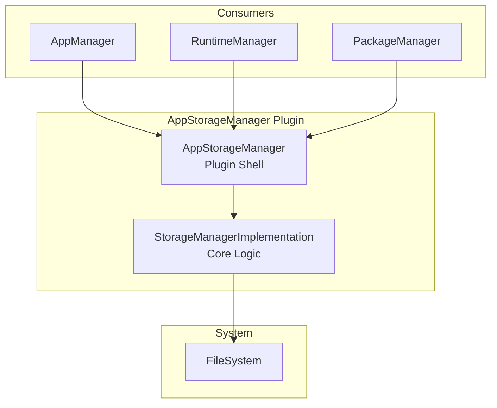
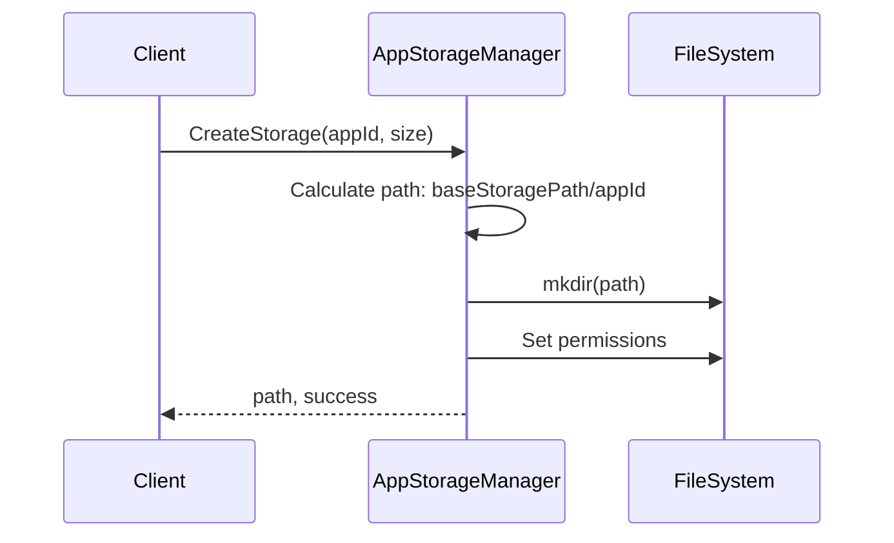
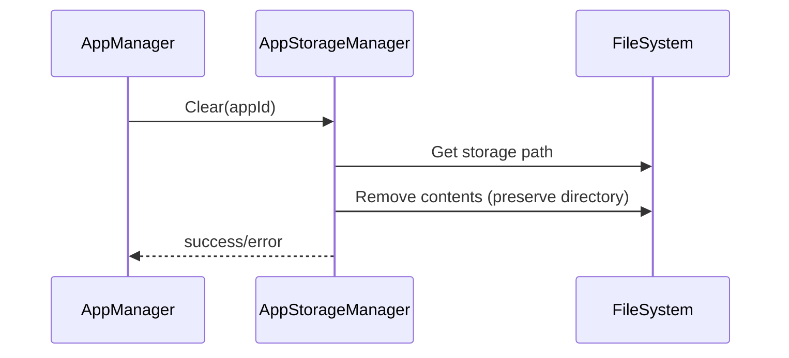
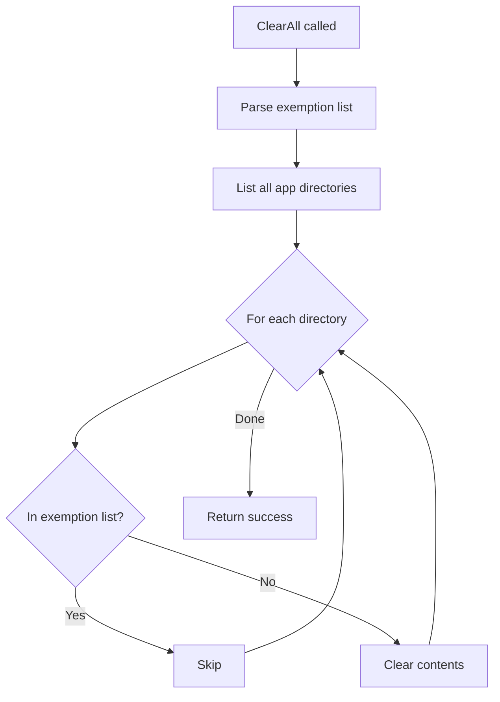

# AppStorageManager Plugin Documentation

> Application-Specific Storage Allocation and Management for RDK Infrastructure

## 1. High-Level Purpose & Architecture

### Role in ENT / RDK Infrastructure

The **AppStorageManager** plugin provides dedicated storage management for applications, handling creation, access, and cleanup of application-specific storage directories with proper ownership and permissions.

### Responsibilities

- **Storage Creation**: Create dedicated storage directories for applications
- **Storage Access**: Provide storage paths with proper UID/GID ownership
- **Storage Cleanup**: Clear individual or all application storage
- **Quota Management**: Track storage usage per application

### Interacting Subsystems

| Subsystem | Interaction Type | Purpose |
|-----------|-----------------|---------|
| AppManager | COM-RPC (inbound) | Clear app data requests |
| RuntimeManager | COM-RPC (inbound) | Get app storage info |
| PackageManager | COM-RPC (inbound) | Storage allocation |

---

## 2. Architectural Overview



---

## 3. Code Organization

### Directory Structure

```
AppStorageManager/
├── AppStorageManager.cpp              # Plugin shell
├── AppStorageManager.h                # Shell header
├── AppStorageManagerImplementation.cpp # Core implementation
├── AppStorageManagerImplementation.h   # Implementation header
├── RequestHandler.cpp                 # Request processing
├── RequestHandler.h                   # RequestHandler header
├── AppStorageManagerTelemetryReporting.cpp # Telemetry
├── AppStorageManagerTelemetryReporting.h   # Telemetry header
├── Module.cpp                         # Plugin module
├── Module.h                           # Module header
├── CMakeLists.txt                     # Build configuration
├── AppStorageManager.config           # Plugin configuration
└── AppStorageManager.conf.in          # Configuration template
```

---

## 4. Class & Interface Documentation

### Exchange::IAppStorageManager Interface

```cpp
interface IAppStorageManager {
    hresult CreateStorage(const string& appId, uint32_t size,
                          string& path, string& errorReason);
    hresult GetStorage(const string& appId, int32_t userId, int32_t groupId,
                       string& path, uint32_t& size, uint32_t& used);
    hresult DeleteStorage(const string& appId, string& errorReason);
    hresult Clear(const string& appId, string& errorReason);
    hresult ClearAll(const string& exemptionAppIds, string& errorReason);
};
```

### StorageManagerImplementation

```cpp
// From AppStorageManagerImplementation.h
class StorageManagerImplementation : public Exchange::IAppStorageManager,
                                     public Exchange::IConfiguration {
private:
    class Config : public Core::JSON::Container {
    public:
        Core::JSON::String Path;  // Base storage path
    };

    Config _config;
    PluginHost::IShell* mCurrentservice;
    std::string mBaseStoragePath;

public:
    Core::hresult CreateStorage(const string& appId, const uint32_t& size,
                                string& path, string& errorReason) override;
    Core::hresult GetStorage(const string& appId, const int32_t& userId,
                             const int32_t& groupId, string& path,
                             uint32_t& size, uint32_t& used) override;
    Core::hresult DeleteStorage(const string& appId, string& errorReason) override;
    Core::hresult Clear(const string& appId, string& errorReason) override;
    Core::hresult ClearAll(const string& exemptionAppIds, string& errorReason) override;
    uint32_t Configure(PluginHost::IShell* service) override;
};
```

---

## 5. Internal Workflows

### Storage Creation Flow



### Storage Clear Flow



### ClearAll with Exemptions



---

## 6. Configuration

### Plugin Configuration

```cmake
set (autostart false)
set (preconditions Platform)
set (callsign "org.rdk.AppStorageManager")
```

### Runtime Configuration

```json
{
    "path": "/opt/persistent/apps"
}
```

### Storage Structure

```
/opt/persistent/apps/
├── com.example.app1/
│   ├── data/
│   └── cache/
├── com.example.app2/
│   ├── data/
│   └── cache/
└── ...
```

---

## 7. Testing

### Existing Tests

Located in `Tests/L1Tests/tests/test_AppStorageManager.cpp`

| Test | Description |
|------|-------------|
| CreateStorage | Storage directory creation |
| GetStorage | Storage info retrieval |
| Clear | Individual app storage clear |
| ClearAll | Clear all with exemptions |
| DeleteStorage | Storage deletion |

---

## 8. Best Practices

1. **Always check return values** for storage operations
2. **Use exemption lists** carefully in ClearAll to prevent data loss
3. **Set proper UID/GID** when getting storage for container use
4. **Monitor storage usage** to prevent disk space exhaustion
