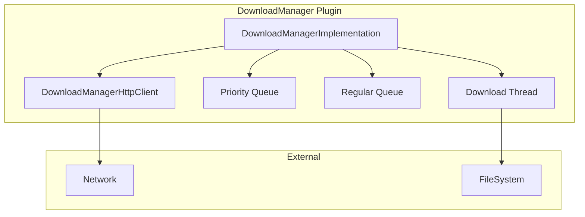
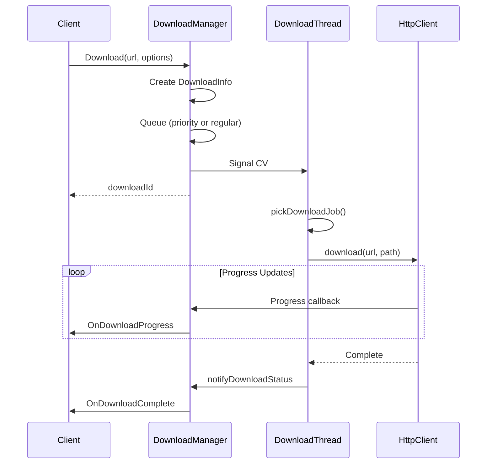

# DownloadManager Plugin Documentation

> HTTP Download Management with Priority Queuing for RDK Infrastructure

## 1. High-Level Purpose & Architecture

### Role in ENT / RDK Infrastructure

The **DownloadManager** plugin provides a dedicated HTTP download service with priority queuing, rate limiting, and retry mechanisms. It is designed as a standalone download service separate from PackageManager for general-purpose download needs.

### Responsibilities

- **HTTP Downloads**: Manage HTTP/HTTPS file downloads
- **Priority Queuing**: Support priority and regular download queues
- **Rate Limiting**: Enforce download rate limits per request
- **Retry Logic**: Automatic retry with exponential backoff
- **Progress Reporting**: Report download progress to subscribers

### Interacting Subsystems

| Subsystem | Interaction Type | Purpose |
|-----------|-----------------|---------|
| PackageManager | COM-RPC (potential) | May delegate downloads |
| FileSystem | Direct | Store downloaded files |

---

## 2. Architectural Overview

### Major Components



---

## 3. Code Organization

### Directory Structure

```
DownloadManager/
├── DownloadManager.cpp              # Plugin shell
├── DownloadManager.h                # Shell header
├── DownloadManagerImplementation.cpp # Core implementation
├── DownloadManagerImplementation.h   # Implementation header
├── DownloadManagerHttpClient.cpp    # HTTP client
├── DownloadManagerHttpClient.h      # HTTP client header
├── DownloadManagerTelemetryReporting.cpp # Telemetry
├── DownloadManagerTelemetryReporting.h   # Telemetry header
├── Module.cpp                       # Plugin module
├── Module.h                         # Module header
├── CMakeLists.txt                   # Build configuration
├── DownloadManager.config           # Plugin configuration
└── DownloadManager.conf.in          # Configuration template
```

### Key Implementation Details

```cpp
// From DownloadManagerImplementation.h
class DownloadManagerImplementation : public Exchange::IDownloadManager {
    class DownloadInfo {
        string id;
        string url;
        bool priority;
        uint8_t retries;
        uint32_t rateLimit;
        string fileLocator;
        bool isCancelled;
    };

    typedef std::shared_ptr<DownloadInfo> DownloadInfoPtr;
    typedef std::queue<DownloadInfoPtr> DownloadQueue;

private:
    std::unique_ptr<DownloadManagerHttpClient> mHttpClient;
    DownloadQueue mPriorityDownloadQueue;
    DownloadQueue mRegularDownloadQueue;
    std::unique_ptr<std::thread> mDownloadThreadPtr;
    std::atomic<bool> mDownloaderRunFlag;
    DownloadInfoPtr mCurrentDownload;
    uint32_t mDownloadId;
    std::string mDownloadPath;
};
```

---

## 4. Class & Interface Documentation

### Exchange::IDownloadManager Interface

```cpp
interface IDownloadManager {
    enum FailReason {
        NONE = 0,
        DISK_PERSISTENCE_FAILURE,
        DOWNLOAD_FAILURE
    };

    // Options fields are documented in table format below.

    interface INotification {
        void OnDownloadComplete(const string& downloadId, const string& fileLocator,
                               FailReason reason);
        void OnDownloadProgress(const string& downloadId, uint8_t percent);
    };

    hresult Download(const string& url, const Options& options, string& downloadId);
    hresult Pause(const string& downloadId);
    hresult Resume(const string& downloadId);
    hresult Cancel(const string& downloadId);
    hresult Delete(const string& fileLocator);
    hresult Progress(const string& downloadId, uint8_t& percent);
    hresult RateLimit(const string& downloadId, uint32_t limit);
    hresult Register(INotification* notification);
    hresult Unregister(INotification* notification);
    hresult Initialize(PluginHost::IShell* service);
    hresult Deinitialize(PluginHost::IShell* service);
};
```

`IDownloadManager::Options` fields:

| Field | Type | Description |
|-------|------|-------------|
| `priority` | `bool` | Indicates whether the download goes to priority queue |
| `retries` | `uint8_t` | Number of retry attempts |
| `rateLimit` | `uint32_t` | Download speed limit |

---

## 5. Internal Workflows

### Download Processing Flow



### Retry Logic with Golden Ratio Backoff

```cpp
// Golden-ratio-based retry delay.
int nextRetryDuration(int n) {
    const double goldenRatio = (1 + std::sqrt(5)) / 2.0;
    double next = n * goldenRatio;
    return static_cast<int>(std::round(next));
}
// Example: n=1 -> 2s, n=2 -> 3s, n=3 -> 5s, n=4 -> 6s

---

## 6. Configuration

### Plugin Configuration

```cmake
set (autostart false)
set (preconditions Platform)
set (callsign "org.rdk.DownloadManager")
```

### Runtime Configuration

```json
{
    "downloadDir": "/tmp/downloads",
    "downloadId": 1
}
```

---

## 7. Testing

### Existing Tests

Located in `Tests/L1Tests/tests/test_DownloadManager.cpp`

| Test | Description |
|------|-------------|
| Download | Basic download functionality |
| Priority | Priority queue handling |
| Cancel | Download cancellation |
| Progress | Progress reporting |
