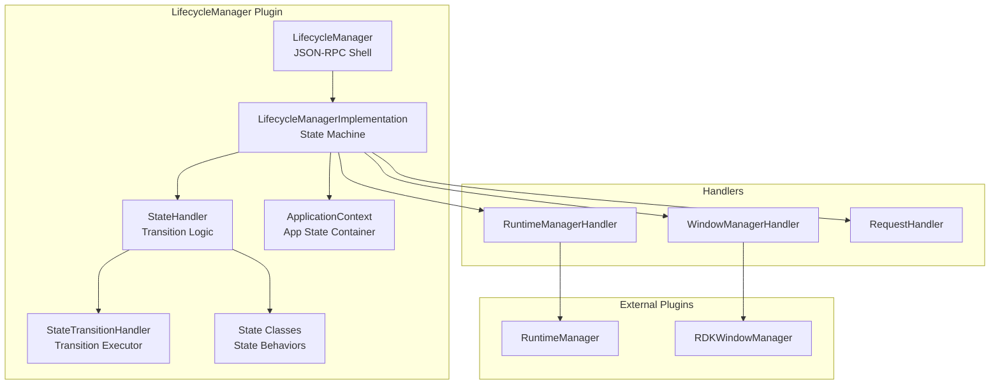
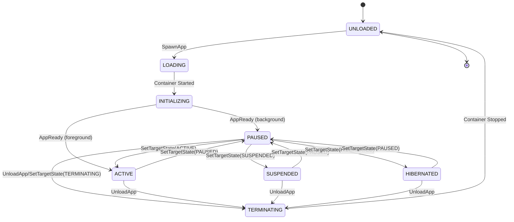
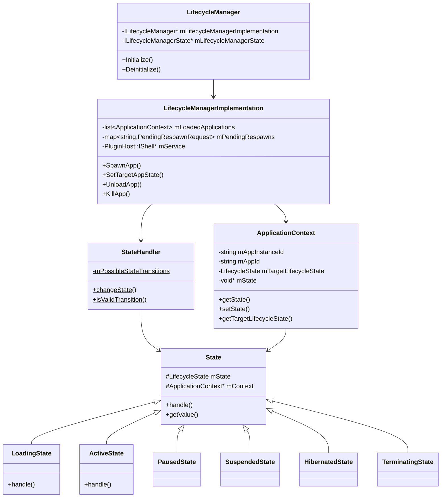
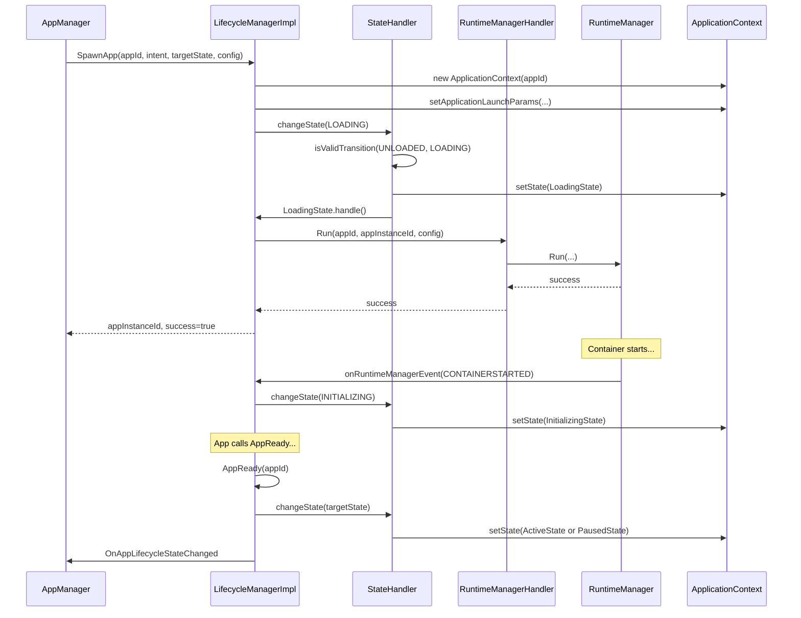
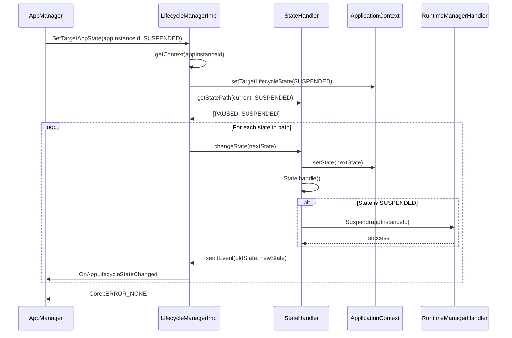
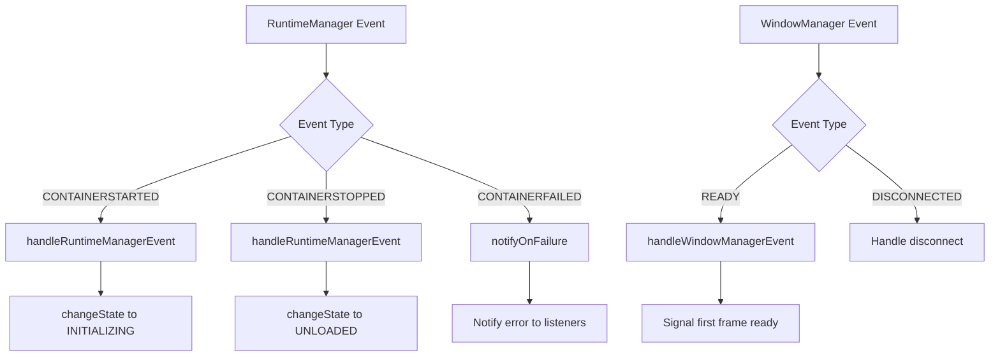
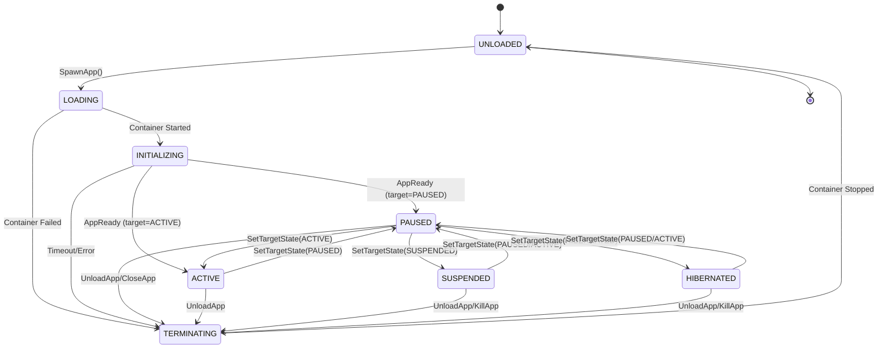
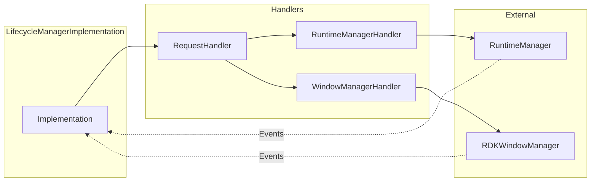

# LifecycleManager Plugin Documentation

> State Machine for Application Lifecycle Transitions in RDK Infrastructure

## 1. High-Level Purpose & Architecture

### Role in ENT / RDK Infrastructure

The **LifecycleManager** plugin implements the core state machine that governs application lifecycle transitions. It acts as the central coordinator between the AppManager (which initiates requests) and the RuntimeManager (which executes container operations).

### Responsibilities

- **State Machine Management**: Implement and enforce valid lifecycle state transitions
- **Application Context Tracking**: Maintain context for each loaded application
- **Runtime Coordination**: Delegate container operations to RuntimeManager
- **Window Management**: Coordinate with RDKWindowManager for display operations
- **State Change Notifications**: Propagate lifecycle state changes to subscribers

### Interacting Subsystems

| Subsystem | Interaction Type | Purpose |
|-----------|-----------------|---------|
| AppManager | COM-RPC (inbound) | Receives SpawnApp, SetTargetAppState, UnloadApp, KillApp requests |
| RuntimeManager | COM-RPC (outbound) | Delegates Run, Suspend, Resume, Hibernate, Wake, Terminate |
| RDKWindowManager | COM-RPC (outbound) | Coordinates display creation and focus |

### What It Does NOT Do

- Does not directly manage OCI containers (delegated to RuntimeManager)
- Does not handle JSON-RPC client communication directly (handled by AppManager)
- Does not manage package installation (handled by PackageManager)

---

## 2. Architectural Overview

### Major Components



### State Machine States



---

## 3. Code Organization

### Directory Structure

```
LifecycleManager/
├── LifecycleManager.cpp              # Plugin shell
├── LifecycleManager.h                # Shell header
├── LifecycleManagerImplementation.cpp # Core state machine logic
├── LifecycleManagerImplementation.h   # Implementation header
├── ApplicationContext.cpp            # Application context container
├── ApplicationContext.h              # Context header
├── State.cpp                         # State base class and derived states
├── State.h                           # State class headers
├── StateHandler.cpp                  # State transition coordinator
├── StateHandler.h                    # StateHandler header
├── StateTransitionHandler.cpp        # Transition execution logic
├── StateTransitionHandler.h          # Transition header
├── StateTransitionRequest.h          # Transition request structure
├── RequestHandler.cpp                # Request processing
├── RequestHandler.h                  # RequestHandler header
├── RuntimeManagerHandler.cpp         # RuntimeManager bridge
├── RuntimeManagerHandler.h           # RuntimeManagerHandler header
├── WindowManagerHandler.cpp          # WindowManager bridge
├── WindowManagerHandler.h            # WindowManagerHandler header
├── IEventHandler.h                   # Event handler interface
├── LifecycleManagerTelemetryReporting.cpp # Telemetry
├── LifecycleManagerTelemetryReporting.h   # Telemetry header
├── Module.cpp                        # Plugin module
├── Module.h                          # Module header
├── CMakeLists.txt                    # Build configuration
├── LifecycleManager.config           # Plugin configuration
└── LifecycleManager.conf.in          # Configuration template
```

### File-by-File Breakdown

#### LifecycleManager.h / LifecycleManager.cpp

**Purpose**: JSON-RPC shell plugin exposing the LifecycleManager API.

**Key Elements**:
- Implements `PluginHost::IPlugin` and `PluginHost::JSONRPC`
- Contains `Notification` inner class for `ILifecycleManagerState::INotification`
- Aggregates both `ILifecycleManager` and `ILifecycleManagerState` interfaces

```cpp
// From LifecycleManager.h (lines 91-97)
BEGIN_INTERFACE_MAP(LifecycleManager)
INTERFACE_ENTRY(PluginHost::IPlugin)
INTERFACE_ENTRY(PluginHost::IDispatcher)
INTERFACE_AGGREGATE(Exchange::ILifecycleManager, mLifecycleManagerImplementation)
INTERFACE_AGGREGATE(Exchange::ILifecycleManagerState, mLifecycleManagerState)
END_INTERFACE_MAP
```

#### LifecycleManagerImplementation.h / LifecycleManagerImplementation.cpp

**Purpose**: Core state machine logic implementing `ILifecycleManager`, `ILifecycleManagerState`, and `IEventHandler`.

**Key Interfaces Implemented**:
- `Exchange::ILifecycleManager` - Main lifecycle control API
- `Exchange::ILifecycleManagerState` - State reporting and app-side callbacks
- `Exchange::IConfiguration` - Plugin configuration
- `IEventHandler` - Internal event handling

**Key Methods**:
```cpp
// ILifecycleManager methods
Core::hresult SpawnApp(const string& appId, const string& launchIntent, 
                       LifecycleState targetLifecycleState,
                       const RuntimeConfig& runtimeConfigObject,
                       const string& launchArgs, string& appInstanceId,
                       string& errorReason, bool& success);
Core::hresult SetTargetAppState(const string& appInstanceId, 
                                LifecycleState targetLifecycleState,
                                const string& launchIntent);
Core::hresult UnloadApp(const string& appInstanceId, string& errorReason, bool& success);
Core::hresult KillApp(const string& appInstanceId, string& errorReason, bool& success);
Core::hresult SendIntentToActiveApp(const string& appInstanceId, const string& intent,
                                     string& errorReason, bool& success);

// ILifecycleManagerState methods
Core::hresult AppReady(const string& appId);
Core::hresult StateChangeComplete(const string& appId, uint32_t stateChangedId, bool success);
Core::hresult CloseApp(const string& appId, AppCloseReason closeReason);
```

#### ApplicationContext.h / ApplicationContext.cpp

**Purpose**: Encapsulates all runtime context for a single application instance.

**Key Members**:
```cpp
class ApplicationContext : public std::enable_shared_from_this<ApplicationContext> {
private:
    std::string mAppInstanceId;      // Unique instance ID
    std::string mAppId;              // Application ID
    timespec mLastLifecycleStateChangeTime;
    std::string mActiveSessionId;
    LifecycleState mTargetLifecycleState;
    std::string mMostRecentIntent;
    void* mState;                    // Current State object
    uint32_t mStateChangeId;         // State change counter
    ApplicationLaunchParams mLaunchParams;
    ApplicationKillParams mKillParams;
    time_t mRequestTime;
    RequestType mRequestType;

public:
    sem_t mReachedLoadingStateSemaphore;
    sem_t mFirstFrameAfterResumeSemaphore;
    bool mPendingStateTransition;
    std::vector<LifecycleState> mPendingStates;
    LifecycleState mPendingOldState;
    std::string mPendingEventName;
};
```

#### State.h / State.cpp

**Purpose**: State pattern implementation with base class and derived state classes.

**State Classes**:
```cpp
class State {
public:
    State(ApplicationContext* context, LifecycleState state);
    virtual bool handle(string& errorReason);
    virtual LifecycleState getValue();
    virtual ApplicationContext* getContext();
protected:
    LifecycleState mState;
    ApplicationContext* mContext;
};

class UnloadedState : public State { /* ... */ };
class LoadingState : public State { /* ... */ };
class InitializingState : public State { /* ... */ };
class PausedState : public State { /* ... */ };
class ActiveState : public State { /* ... */ };
class SuspendedState : public State { /* ... */ };
class HibernatedState : public State { /* ... */ };
class TerminatingState : public State { /* ... */ };
```

#### StateHandler.h / StateHandler.cpp

**Purpose**: Coordinates state transitions, validates transition paths, and dispatches events.

**Key Methods**:
```cpp
class StateHandler {
public:
    static void initialize();
    static bool changeState(StateTransitionRequest& request, string& errorReason);

private:
    static State* createState(ApplicationContext* context, LifecycleState state);
    static bool isValidTransition(LifecycleState start, LifecycleState target,
                                  std::map<LifecycleState, bool>& pathSequence,
                                  std::vector<LifecycleState>& foundPath);
    static bool updateState(ApplicationContext* context, LifecycleState state, 
                           string& errorReason);
    static void sendEvent(ApplicationContext* context, LifecycleState oldState,
                         LifecycleState newState, string& errorReason);
    static bool getStatePath(ApplicationContext* context, LifecycleState target,
                            std::vector<LifecycleState>& statePath, string& errorReason);
    
    static std::map<LifecycleState, std::list<LifecycleState>> mPossibleStateTransitions;
};
```

---

## 4. Class & Interface Documentation

### Exchange::ILifecycleManager Interface

Primary interface for lifecycle control:

```cpp
interface ILifecycleManager {
    // Notification interface for state changes
    interface INotification {
        void OnAppStateChanged(const string& appId, LifecycleState state, 
                              const string& errorReason);
    };

    hresult Register(INotification* notification);
    hresult Unregister(INotification* notification);
    hresult GetLoadedApps(bool verbose, string& apps);
    hresult IsAppLoaded(const string& appId, bool& loaded);
    hresult SpawnApp(const string& appId, const string& launchIntent,
                     LifecycleState targetState, const RuntimeConfig& config,
                     const string& launchArgs, string& appInstanceId,
                     string& errorReason, bool& success);
    hresult SetTargetAppState(const string& appInstanceId, LifecycleState target,
                              const string& launchIntent);
    hresult UnloadApp(const string& appInstanceId, string& errorReason, bool& success);
    hresult KillApp(const string& appInstanceId, string& errorReason, bool& success);
    hresult SendIntentToActiveApp(const string& appInstanceId, const string& intent,
                                   string& errorReason, bool& success);
};
```

### Exchange::ILifecycleManagerState Interface

Interface for app-side state reporting:

```cpp
interface ILifecycleManagerState {
    interface INotification {
        void OnAppLifecycleStateChanged(const string& appId, const string& appInstanceId,
                                        LifecycleState oldState, LifecycleState newState,
                                        const string& navigationIntent);
    };

    hresult Register(INotification* notification);
    hresult Unregister(INotification* notification);
    hresult AppReady(const string& appId);
    hresult StateChangeComplete(const string& appId, uint32_t stateChangedId, bool success);
    hresult CloseApp(const string& appId, AppCloseReason closeReason);
};
```

### LifecycleState Enumeration

```cpp
enum LifecycleState {
    UNLOADED = 0,     // App not loaded
    LOADING,          // Container starting
    INITIALIZING,     // App initializing
    PAUSED,           // App in background
    ACTIVE,           // App in foreground
    SUSPENDED,        // App suspended (low memory)
    HIBERNATED,       // App state persisted to disk
    TERMINATING       // App shutting down
};
```

### Class Relationships



---

## 5. Configuration & Build Integration

### Plugin Configuration (LifecycleManager.config)

```cmake
set (autostart false)
set (preconditions Platform)
set (callsign "org.rdk.LifecycleManager")

map()
   key(root)
   map()
       kv(mode ${PLUGIN_LIFECYCLE_MANAGER_MODE})
       kv(locator lib${MODULE_NAME}.so)
   end()
end()
ans(configuration)
```

### CMake Build Options

| Option | Description | Default |
|--------|-------------|---------|
| `PLUGIN_LIFECYCLE_MANAGER_MODE` | Execution mode (Off/Local) | Off |
| `PLUGIN_LIFECYCLE_MANAGER_AUTOSTART` | Auto-start on boot | false |
| `ENABLE_UNIT_TESTS` | Enable unit test compilation | OFF |

### Source Files

```cmake
set(PLUGIN_LIFECYCLE_MANAGER_SOURCES
    LifecycleManager.cpp
    LifecycleManagerImplementation.cpp
    Module.cpp
    LifecycleManagerTelemetryReporting.cpp
    ApplicationContext.cpp
    RequestHandler.cpp
    RuntimeManagerHandler.cpp
    WindowManagerHandler.cpp
    State.cpp
    StateHandler.cpp
    StateTransitionHandler.cpp)
```

---

## 6. Internal Workflows & Execution Flow

### SpawnApp Flow



### SetTargetAppState Flow



### State Transition Validation

The `StateHandler` maintains a map of valid transitions:

```cpp
// Conceptual representation of mPossibleStateTransitions
{
    UNLOADED:     [LOADING],
    LOADING:      [INITIALIZING, TERMINATING],
    INITIALIZING: [PAUSED, ACTIVE, TERMINATING],
    PAUSED:       [ACTIVE, SUSPENDED, HIBERNATED, TERMINATING],
    ACTIVE:       [PAUSED, TERMINATING],
    SUSPENDED:    [PAUSED, TERMINATING],
    HIBERNATED:   [PAUSED, TERMINATING],
    TERMINATING:  [UNLOADED]
}
```

### Event Handling Flow



---

## 7. Diagrams & Visual Aids

### Complete State Transition Diagram



### Handler Interaction Diagram



---

## 8. Testing & Quality Analysis

### Existing Tests

Located in `Tests/L1Tests/tests/test_LifecycleManager.cpp`:

| Test Category | Description |
|---------------|-------------|
| SpawnApp Tests | Verify app spawning with various configurations |
| State Transition Tests | Verify valid state transitions |
| Invalid Transition Tests | Verify rejection of invalid transitions |
| UnloadApp Tests | Verify app unloading |
| KillApp Tests | Verify forced termination |
| Event Tests | Verify event delivery |

### Test Coverage Gaps

1. **Concurrent State Changes**: Multiple simultaneous SetTargetAppState calls
2. **Pending State Queue**: Verification of pending state handling
3. **Respawn Logic**: Testing of pending respawn mechanism
4. **Timeout Handling**: State transition timeout scenarios

### Suggested Test Cases

```cpp
// Test rapid state transitions
TEST(LifecycleManagerTest, RapidStateTransitions) {
    // ACTIVE -> PAUSED -> SUSPENDED -> PAUSED -> ACTIVE in quick succession
}

// Test pending respawn
TEST(LifecycleManagerTest, PendingRespawn) {
    // Spawn during termination should queue respawn
}

// Test state path calculation
TEST(LifecycleManagerTest, StatePathCalculation) {
    // ACTIVE to HIBERNATED should go through PAUSED
}
```

---

## 9. Beginner-to-Expert Learning Path

### Must Know First

1. **State Pattern**: Understand the Gang of Four State design pattern
2. **WPEFramework Plugins**: Basic Thunder plugin architecture
3. **COM-RPC**: Inter-plugin communication mechanism

### Beginner Level

1. Read `State.h` to understand the state class hierarchy
2. Examine `LifecycleManager.config` for plugin configuration
3. Trace a simple SpawnApp call from entry to container start

### Intermediate Level

1. Study `StateHandler` for transition validation logic
2. Understand `ApplicationContext` lifecycle
3. Trace the event flow from RuntimeManager back to AppManager

### Advanced Level

1. Study the pending state queue mechanism in `ApplicationContext`
2. Analyze respawn handling in `mPendingRespawns`
3. Understand handler separation (RuntimeManagerHandler, WindowManagerHandler)

### Expert Level

1. Add new lifecycle states to the state machine
2. Implement custom state transition behaviors
3. Optimize state path calculation algorithm
4. Add new event types and handlers
