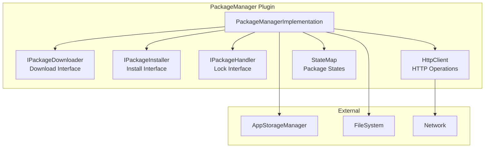
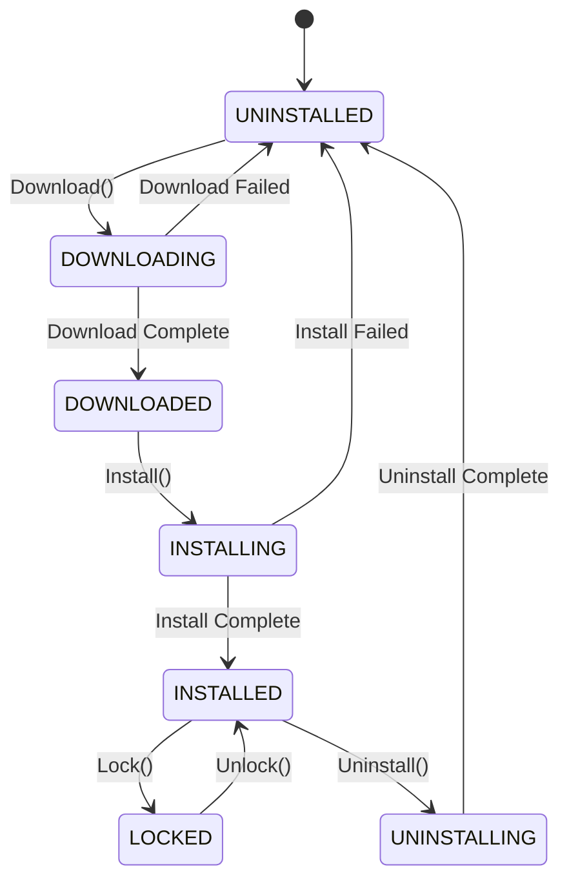
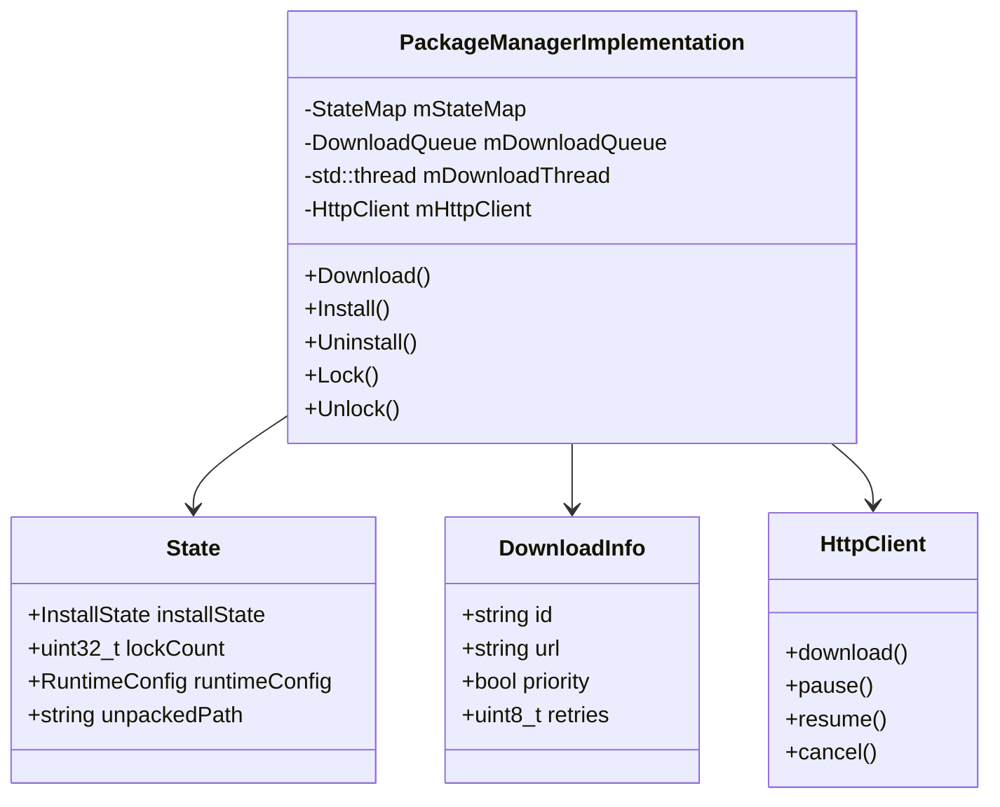
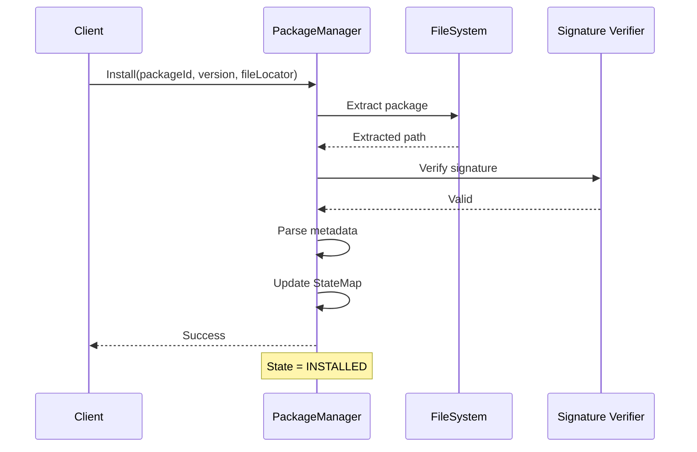
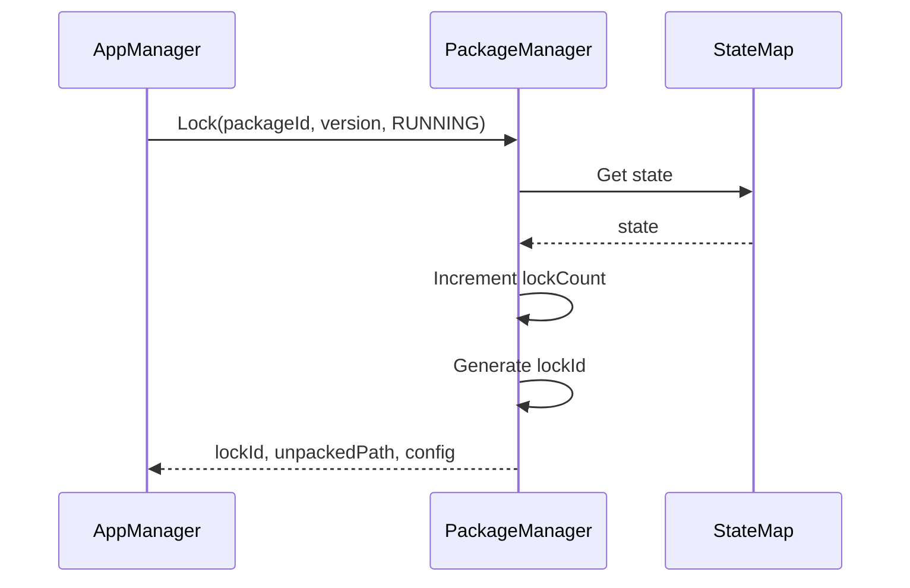
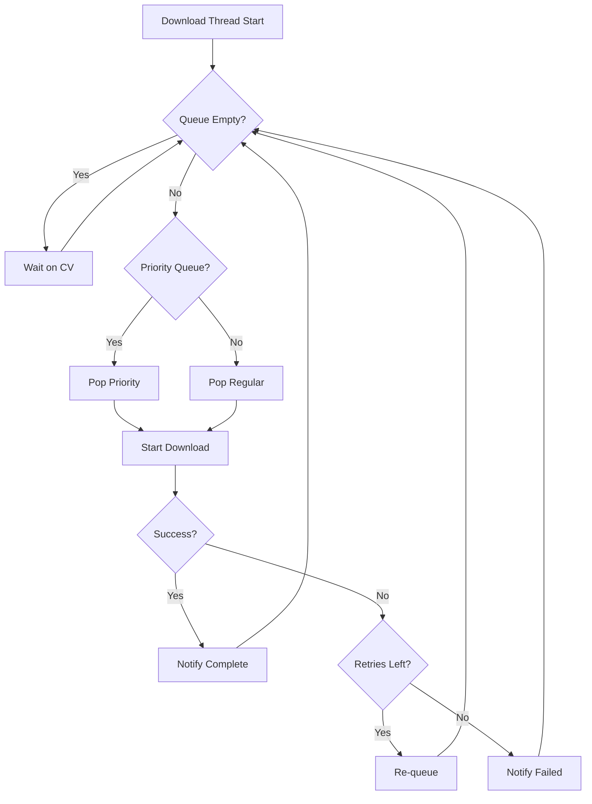
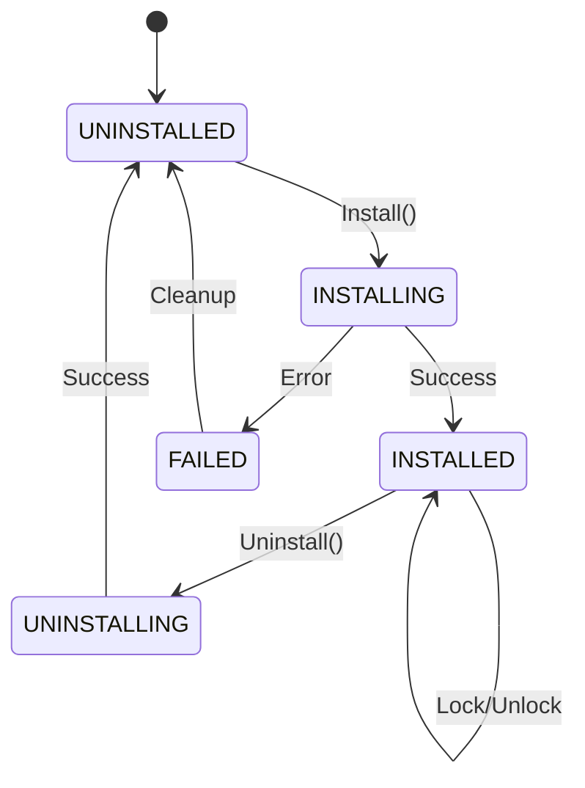
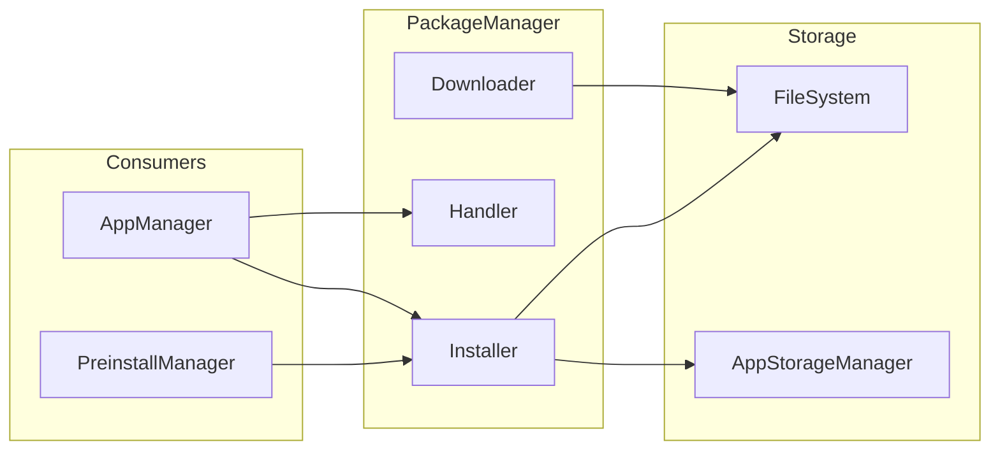

# PackageManager Plugin Documentation

> Package Download, Installation, and Management for RDK Infrastructure

## 1. High-Level Purpose & Architecture

### Role in ENT / RDK Infrastructure

The **PackageManager** plugin provides comprehensive package management capabilities including downloading, installing, locking, and uninstalling application packages. It serves as the central authority for package state and metadata.

### Responsibilities

- **Package Download**: Download packages via HTTP with retry and rate limiting
- **Package Installation**: Install packages with signature verification and metadata extraction
- **Package Locking**: Lock packages during app execution to prevent modification
- **Package State Management**: Track installation state for all packages
- **Runtime Configuration**: Provide runtime configuration metadata to callers

### Interacting Subsystems

| Subsystem | Interaction Type | Purpose |
|-----------|-----------------|---------|
| AppManager | COM-RPC (inbound) | Lock/unlock packages, list installed apps |
| PreinstallManager | COM-RPC (inbound) | Install pre-loaded packages |
| AppStorageManager | COM-RPC (outbound) | Manage package storage |

### What It Does NOT Do

- Does not manage application lifecycle (handled by LifecycleManager)
- Does not run containers (handled by RuntimeManager)
- Does not manage application-specific data (handled by AppStorageManager)

---

## 2. Architectural Overview

### Major Components



### Package Lifecycle



---

## 3. Code Organization

### Directory Structure

```
PackageManager/
├── PackageManager.cpp              # Plugin shell (if separate)
├── PackageManager.h                # Shell header
├── PackageManagerImplementation.cpp # Core implementation
├── PackageManagerImplementation.h   # Implementation header
├── HttpClient.cpp                  # HTTP download client
├── HttpClient.h                    # HttpClient header
├── PackageManagerTelemetryReporting.cpp # Telemetry
├── PackageManagerTelemetryReporting.h   # Telemetry header
├── Module.cpp                      # Plugin module
├── Module.h                        # Module header
├── cmake/                          # CMake modules
├── CMakeLists.txt                  # Build configuration
├── PackageManager.conf.in          # Configuration template
└── PackageManager.md               # Original documentation
```

### File-by-File Breakdown

#### PackageManagerImplementation.h / PackageManagerImplementation.cpp

**Purpose**: Core package management implementing three interfaces.

**Key Interfaces**:
- `Exchange::IPackageDownloader` - Download management
- `Exchange::IPackageInstaller` - Installation management
- `Exchange::IPackageHandler` - Lock/unlock management

**Key Types**:
```cpp
// Package state tracking
class State {
public:
    InstallState installState = InstallState::UNINSTALLED;
    uint32_t mLockCount = 0;
    Exchange::RuntimeConfig runtimeConfig;
    string gatewayMetadataPath;
    string unpackedPath;
    FailReason failReason = FailReason::NONE;
    std::list<AdditionalLock> additionalLocks;
    string runtimeType;
    std::pair<std::string, std::string> runtimeApp;
};

// Download job information
class DownloadInfo {
    string id;
    string url;
    bool priority;
    uint8_t retries;
    long rateLimit;
    string fileLocator;
    bool cancel;
};
```

**Key Methods**:
```cpp
// IPackageDownloader
Core::hresult Download(const string& url, const Options& options, DownloadId& downloadId);
Core::hresult Pause(const string& downloadId);
Core::hresult Resume(const string& downloadId);
Core::hresult Cancel(const string& downloadId);
Core::hresult Delete(const string& fileLocator);
Core::hresult Progress(const string& downloadId, ProgressInfo& progress);

// IPackageInstaller
Core::hresult Install(const string& packageId, const string& version,
                      IKeyValueIterator* additionalMetadata,
                      const string& fileLocator, FailReason& failReason);
Core::hresult Uninstall(const string& packageId, string& errorReason);
Core::hresult ListPackages(IPackageIterator*& packages);
Core::hresult Config(const string& packageId, const string& version,
                     RuntimeConfig& configMetadata);
Core::hresult PackageState(const string& packageId, const string& version,
                           InstallState& state);

// IPackageHandler
Core::hresult Lock(const string& packageId, const string& version,
                   LockReason lockReason, uint32_t& lockId,
                   string& unpackedPath, RuntimeConfig& configMetadata,
                   ILockIterator*& appMetadata);
Core::hresult Unlock(const string& packageId, const string& version);
Core::hresult GetLockedInfo(const string& packageId, const string& version,
                            string& unpackedPath, RuntimeConfig& configMetadata,
                            string& gatewayMetadataPath, bool& locked);
```

#### HttpClient.h / HttpClient.cpp

**Purpose**: HTTP client for package downloads with progress reporting.

**Key Features**:
- Resumable downloads
- Progress callbacks
- Rate limiting support
- Retry logic

---

## 4. Class & Interface Documentation

### Exchange::IPackageDownloader Interface

```cpp
interface IPackageDownloader {
    enum Reason {
        NONE = 0,
        DISK_PERSISTENCE_FAILURE,
        DOWNLOAD_FAILURE,
        CANCELLED
    };

    struct Options {
        bool priority;
        uint8_t retries;
        uint64_t rateLimit;
    };

    interface INotification {
        void OnDownloadComplete(const string& downloadId, const string& fileLocator,
                               Reason reason);
        void OnDownloadProgress(const string& downloadId, uint32_t percent);
    };

    hresult Download(const string& url, const Options& options, string& downloadId);
    hresult Pause(const string& downloadId);
    hresult Resume(const string& downloadId);
    hresult Cancel(const string& downloadId);
    hresult Delete(const string& fileLocator);
    hresult Progress(const string& downloadId, ProgressInfo& progress);
    hresult Register(INotification* notification);
    hresult Unregister(INotification* notification);
};
```

### Exchange::IPackageInstaller Interface

```cpp
interface IPackageInstaller {
    enum InstallState {
        UNINSTALLED = 0,
        INSTALLING,
        INSTALLED,
        UNINSTALLING,
        FAILED
    };

    enum FailReason {
        NONE = 0,
        SIGNATURE_VERIFICATION_FAILED,
        PACKAGE_MISMATCH,
        INVALID_METADATA,
        PERSISTENCE_FAILURE,
        VERSION_NOT_FOUND
    };

    struct Package {
        string id;
        string version;
        InstallState state;
    };

    interface INotification {
        void OnAppInstallationStatus(const string& jsonResponse);
    };

    hresult Install(const string& packageId, const string& version,
                    IKeyValueIterator* metadata, const string& fileLocator,
                    FailReason& failReason);
    hresult Uninstall(const string& packageId, string& errorReason);
    hresult ListPackages(IPackageIterator*& packages);
    hresult Config(const string& packageId, const string& version,
                   RuntimeConfig& config);
    hresult PackageState(const string& packageId, const string& version,
                         InstallState& state);
    hresult Register(INotification* notification);
    hresult Unregister(INotification* notification);
};
```

### Exchange::IPackageHandler Interface

```cpp
interface IPackageHandler {
    enum LockReason {
        RUNNING = 0,
        PRELOADED,
        SYSTEM
    };

    hresult Lock(const string& packageId, const string& version,
                 LockReason reason, uint32_t& lockId,
                 string& unpackedPath, RuntimeConfig& config,
                 ILockIterator*& metadata);
    hresult Unlock(const string& packageId, const string& version);
    hresult GetLockedInfo(const string& packageId, const string& version,
                          string& unpackedPath, RuntimeConfig& config,
                          string& gatewayMetadataPath, bool& locked);
};
```

### Class Relationships



---

## 5. Configuration & Build Integration

### CMake Build Options

| Option | Description | Default |
|--------|-------------|---------|
| `PLUGIN_PACKAGE_MANAGER_MODE` | Execution mode | Off |
| `PLUGIN_PACKAGE_MANAGER_AUTOSTART` | Auto-start | false |

### Configuration Parameters

```json
{
    "downloadDir": "/tmp/packages",
    "maxConcurrentDownloads": 2,
    "defaultRetries": 3,
    "defaultRateLimit": 0
}
```

---

## 6. Internal Workflows & Execution Flow

### Package Installation Flow



### Package Lock Flow



### Download Queue Processing



---

## 7. Diagrams & Visual Aids

### Package State Diagram



### Component Integration



---

## 8. Testing & Quality Analysis

### Existing Tests

Located in `Tests/L1Tests/tests/test_PackageManager.cpp`:

| Test Category | Description |
|---------------|-------------|
| Download Tests | HTTP download with various options |
| Install Tests | Package installation and verification |
| Uninstall Tests | Package removal |
| Lock/Unlock Tests | Package locking mechanism |
| State Tests | State transitions |

### Test Coverage Gaps

1. **Concurrent Downloads**: Multiple simultaneous downloads
2. **Rate Limiting**: Download rate limit enforcement
3. **Signature Verification**: Various signature scenarios
4. **Lock Contention**: Multiple lock requests

---

## 9. Beginner-to-Expert Learning Path

### Must Know First
1. HTTP protocol basics
2. Package formats and signatures
3. File system operations

### Beginner Level
1. Understand the three interfaces (Downloader, Installer, Handler)
2. Trace a simple install flow

### Intermediate Level
1. Study download queue management
2. Understand lock counting mechanism

### Advanced Level
1. Implement custom package formats
2. Add new verification methods

### Expert Level
1. Optimize download performance
2. Add delta update support
