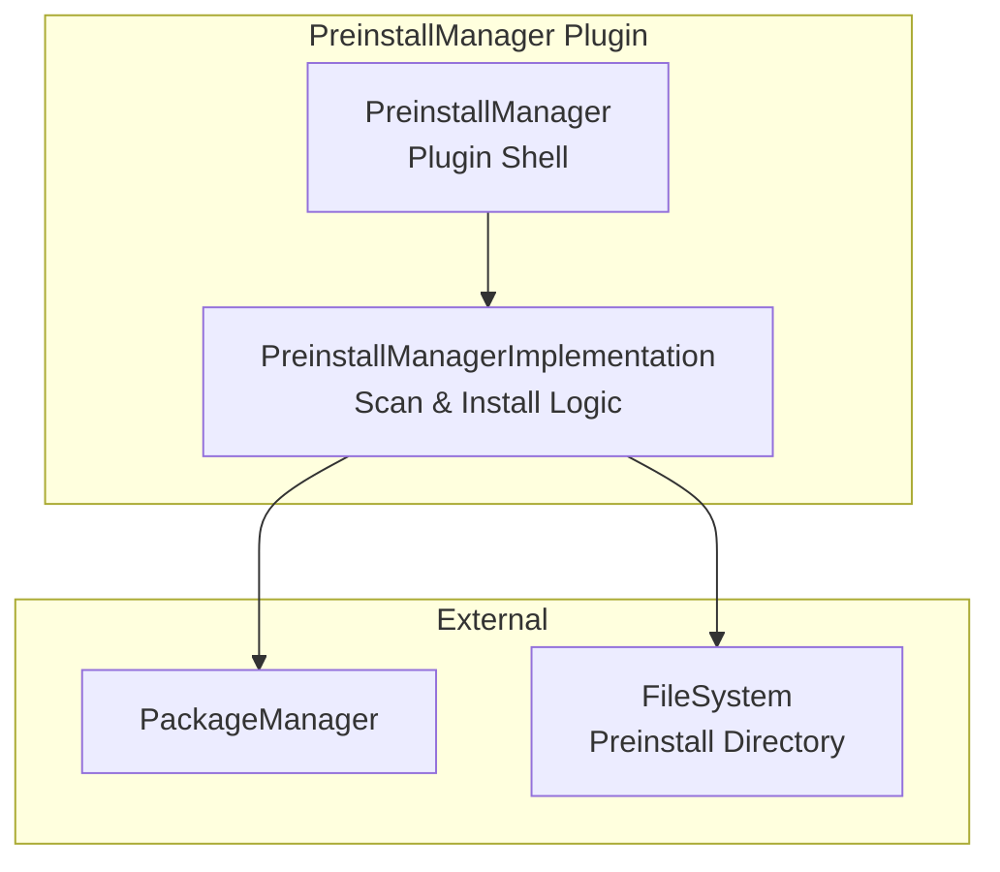
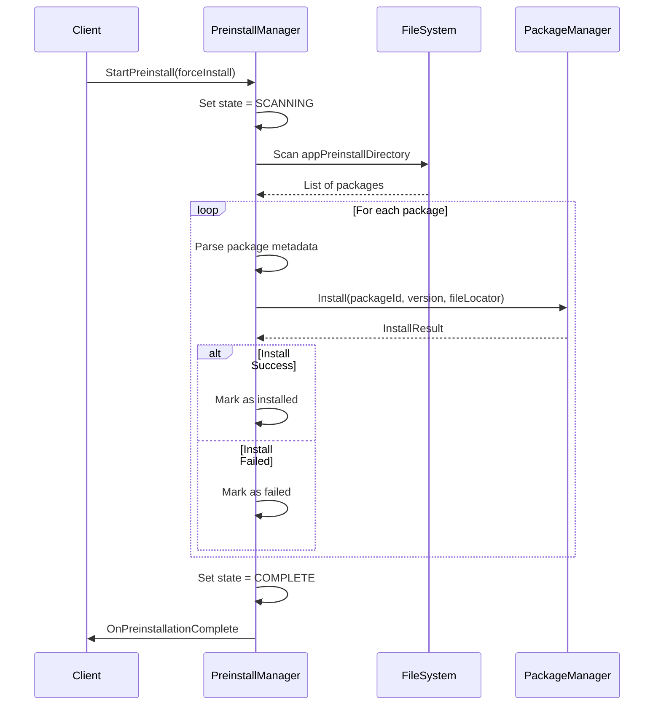
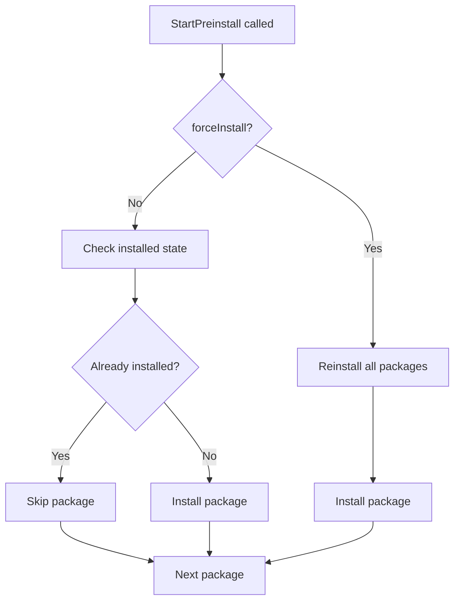

# PreinstallManager Plugin Documentation

> Pre-installed Application Scanning and Installation for RDK Infrastructure

## 1. High-Level Purpose & Architecture

### Role in ENT / RDK Infrastructure

The **PreinstallManager** plugin handles the discovery and installation of pre-loaded applications from a designated directory on the device. It scans for application packages at startup or on-demand and triggers their installation through PackageManager.

### Responsibilities

- **Package Discovery**: Scan designated directories for pre-installed packages
- **Installation Trigger**: Initiate package installation via PackageManager
- **State Tracking**: Track preinstallation progress and completion
- **Force Install**: Support forced reinstallation of packages

### Interacting Subsystems

| Subsystem | Interaction Type | Purpose |
|-----------|-----------------|---------|
| PackageManager | COM-RPC (outbound) | Install discovered packages |

---

## 2. Architectural Overview



---

## 3. Code Organization

### Directory Structure

```
PreinstallManager/
├── PreinstallManager.cpp              # Plugin shell
├── PreinstallManager.h                # Shell header
├── PreinstallManagerImplementation.cpp # Core implementation
├── PreinstallManagerImplementation.h   # Implementation header
├── Module.cpp                         # Plugin module
├── Module.h                           # Module header
├── CMakeLists.txt                     # Build configuration
├── PreinstallManager.config           # Plugin configuration
├── PreinstallManager.conf.in          # Configuration template
└── PreinstallManagerPlugin.json       # Plugin metadata
```

---

## 4. Class & Interface Documentation

### Exchange::IPreinstallManager Interface

```cpp
interface IPreinstallManager {
    enum State {
        IDLE = 0,
        SCANNING,
        INSTALLING,
        COMPLETE,
        FAILED
    };

    enum PreinstallFailReason {
        NONE = 0,
        SCAN_FAILED,
        INSTALL_FAILED,
        PACKAGE_INVALID
    };

    interface INotification {
        void OnPreinstallationComplete(State state, PreinstallFailReason reason);
    };

    hresult Register(INotification* notification);
    hresult Unregister(INotification* notification);
    hresult StartPreinstall(bool forceInstall);
    hresult GetPreinstallState(State& state);
};
```

### PreinstallManagerImplementation

```cpp
// From PreinstallManagerImplementation.h
class PreinstallManagerImplementation : public Exchange::IPreinstallManager,
                                        public Exchange::IConfiguration {
public:
    typedef struct _PackageInfo {
        string fileLocator;
        string packageId;
        string version;
        Exchange::RuntimeConfig configMetadata;
        string installStatus;
    } PackageInfo;

private:
    class Configuration : public Core::JSON::Container {
    public:
        Core::JSON::String appPreinstallDirectory;
    };

    Configuration mConfig;
    std::map<string, PackageInfo> mPackageMap;
    State mCurrentState;

public:
    Core::hresult StartPreinstall(bool forceInstall) override;
    Core::hresult GetPreinstallState(State& state) override;
    uint32_t Configure(PluginHost::IShell* service) override;
};
```

---

## 5. Internal Workflows

### Preinstall Scan and Install Flow



### Force Install Logic



---

## 6. Configuration

### Plugin Configuration

```cmake
set (autostart false)
set (preconditions Platform)
set (callsign "org.rdk.PreinstallManager")
```

### Runtime Configuration

```json
{
    "appPreinstallDirectory": "/opt/preinstall/apps"
}
```

### Preinstall Directory Structure

```
/opt/preinstall/apps/
├── com.example.app1.pkg
├── com.example.app2.pkg
└── com.example.app3.pkg
```

---

## 7. Testing

### Existing Tests

Located in `Tests/L1Tests/tests/test_PreinstallManager.cpp`

| Test | Description |
|------|-------------|
| StartPreinstall | Basic scan and install |
| ForceInstall | Forced reinstallation |
| GetState | State retrieval |
| Notifications | Event delivery |

---

## 8. Usage Notes

1. **Startup Sequence**: PreinstallManager typically runs early in boot to ensure apps are available
2. **Force Install**: Use sparingly as it reinstalls even up-to-date packages
3. **Package Format**: Packages must be in a format understood by PackageManager
4. **Error Handling**: Check OnPreinstallationComplete for failure reasons
