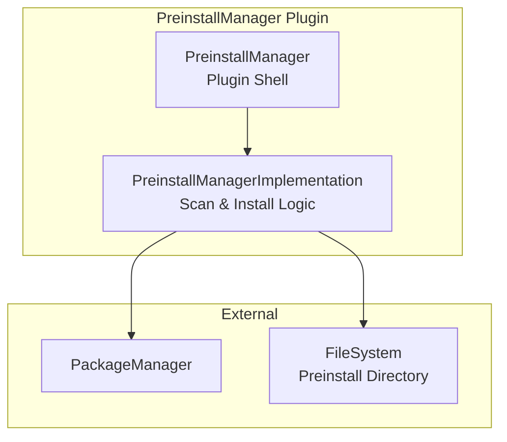
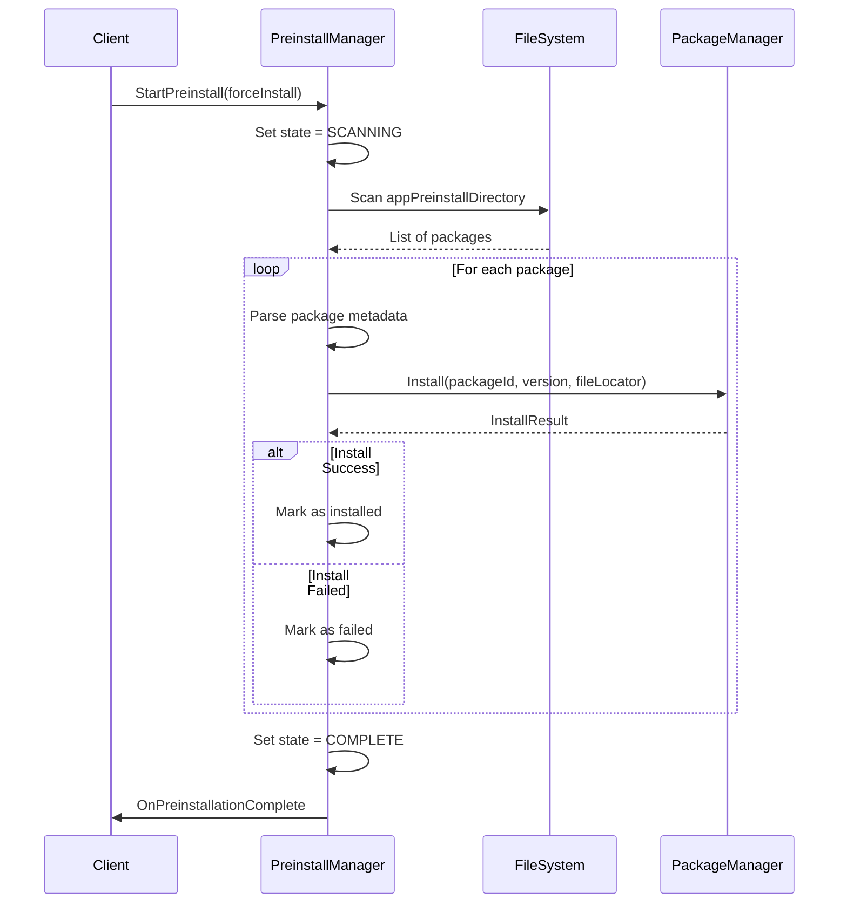
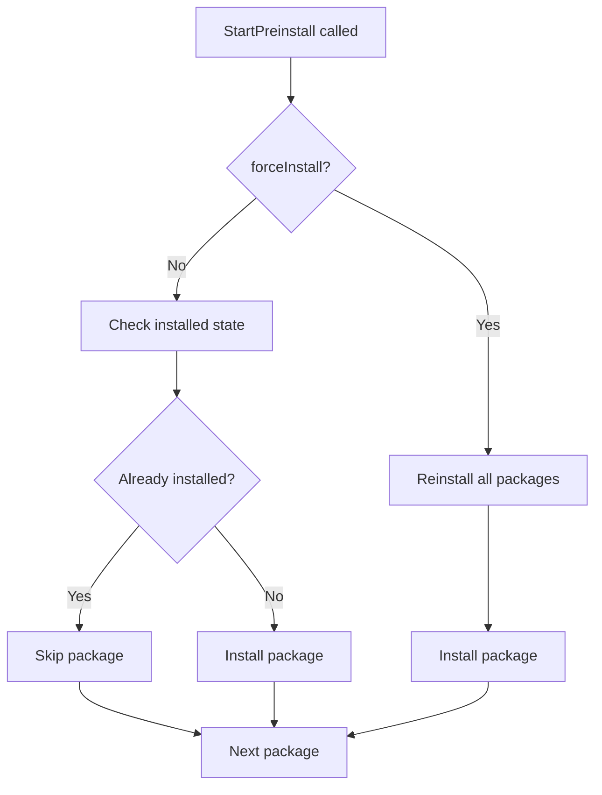
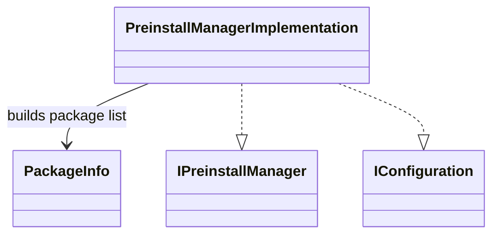
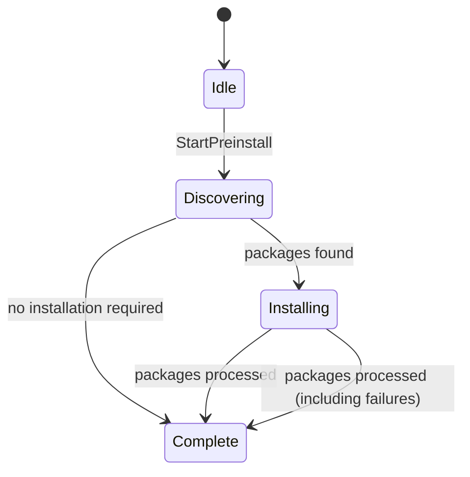

# PreinstallManager Plugin Documentation

> Pre-installed Application Scanning and Installation for RDK Infrastructure

## 1. High-Level Purpose & Architecture

### Role in ENT / RDK Infrastructure

The **PreinstallManager** plugin handles the discovery and installation of pre-loaded applications from a designated directory on the device. It scans for application packages at startup or on-demand and triggers their installation through PackageManager.

### Responsibilities

- **Package Discovery**: Scan designated directories for pre-installed packages
- **Installation Trigger**: Initiate package installation via PackageManager
- **State Tracking**: Track preinstallation progress and completion
- **Force Install**: Support forced reinstallation of packages

### Interacting Subsystems

| Subsystem | Interaction Type | Purpose |
|-----------|-----------------|---------|
| PackageManager | COM-RPC (outbound) | Install discovered packages |

---

## 2. Architectural Overview


```mermaid
graph TB
    subgraph "PreinstallManager Plugin"
        Shell[PreinstallManager<br/>Plugin Shell]
        Impl[PreinstallManagerImplementation<br/>Scan & Install Logic]
    end

    subgraph "External"
        PKG[PackageManager]
        FS[FileSystem<br/>Preinstall Directory]
    end

    Shell --> Impl
    Impl --> PKG
    Impl --> FS
```

---

## 3. Code Organization (Folder & File-Level)

### Directory Structure

```
PreinstallManager/
├── PreinstallManager.cpp              # Plugin shell
├── PreinstallManager.h                # Shell header
├── PreinstallManagerImplementation.cpp # Core implementation
├── PreinstallManagerImplementation.h   # Implementation header
├── Module.cpp                         # Plugin module
├── Module.h                           # Module header
├── CMakeLists.txt                     # Build configuration
├── PreinstallManager.config           # Plugin configuration
├── PreinstallManager.conf.in          # Configuration template
└── PreinstallManagerPlugin.json       # Plugin metadata
```

---

## 4. Class & Interface Documentation

### Exchange::IPreinstallManager Interface

```cpp
interface IPreinstallManager {
    enum State {
        NOT_STARTED = 0,
        IN_PROGRESS,
        COMPLETED
    };

    enum PreinstallFailReason {
        NONE = 0,
        SCAN_FAILED,
        INSTALL_FAILED,
        PACKAGE_INVALID
    };

    interface INotification {
        void OnPreinstallationComplete(State state, PreinstallFailReason reason);
    };

    hresult Register(INotification* notification);
    hresult Unregister(INotification* notification);
    hresult StartPreinstall(bool forceInstall);
    hresult GetPreinstallState(State& state);
};
```

### PreinstallManagerImplementation

`PackageInfo` fields:

| Field | Type | Description |
|-------|------|-------------|
| `fileLocator` | `string` | Source package file path |
| `packageId` | `string` | Package identifier |
| `version` | `string` | Package version |
| `configMetadata` | `Exchange::RuntimeConfig` | Runtime configuration metadata |
| `installStatus` | `string` | Install status/result marker |

Core implementation members:

| Member | Type | Description |
|--------|------|-------------|
| `mConfig` | `Configuration` | Plugin configuration container |
| `mPackageMap` | `std::map<string, PackageInfo>` | Package metadata map used during scan/install |
| `mCurrentState` | `State` | Current preinstall state |

---

## 5. Configuration & Build Integration

The implementation configuration key is `appPreinstallDirectory`; plugin settings include `mode`, `locator`, and `autostart`. The checked-in [PreinstallManager.config](PreinstallManager.config) omits `appPreinstallDirectory` even though [PreinstallManager.conf.in](PreinstallManager.conf.in) declares it. [CMakeLists.txt](CMakeLists.txt) wraps filesystem calls for L1 tests.

## 6. Internal Workflows & Execution Flow

### Preinstall Scan and Install Flow


```mermaid
sequenceDiagram
    participant Client
    participant PM as PreinstallManager
    participant FS as FileSystem
    participant PKG as PackageManager

    Client->>PM: StartPreinstall(forceInstall)
    PM->>PM: Set state = SCANNING
    PM->>FS: Scan appPreinstallDirectory
    FS-->>PM: List of packages

    loop For each package
        PM->>PM: Parse package metadata
        PM->>PKG: Install(packageId, version, fileLocator)
        PKG-->>PM: InstallResult
        alt Install Success
            PM->>PM: Mark as installed
        else Install Failed
            PM->>PM: Mark as failed
        end
    end

    PM->>PM: Set state = COMPLETE
    PM->>Client: OnPreinstallationComplete
```

### Force Install Logic


```mermaid
flowchart TD
    A[StartPreinstall called] --> B{forceInstall?}
    B -->|Yes| C[Reinstall all packages]
    B -->|No| D[Check installed state]
    D --> E{Already installed?}
    E -->|Yes| F[Skip package]
    E -->|No| G[Install package]
    C --> H[Install package]
    F --> I[Next package]
    G --> I
    H --> I
```

---

## 7. Diagrams & Visual Aids


```mermaid
classDiagram
    class PreinstallManagerImplementation
    class PackageInfo
    PreinstallManagerImplementation --> PackageInfo : builds package list
    PreinstallManagerImplementation ..|> IPreinstallManager
    PreinstallManagerImplementation ..|> IConfiguration
```


```mermaid
stateDiagram-v2
    [*] --> Idle
    Idle --> Discovering: StartPreinstall
    Discovering --> Installing: packages found
    Discovering --> Complete: no installation required
    Installing --> Complete: packages processed
    Installing --> Complete: packages processed (including failures)
```

## 8. Testing & Quality Analysis

### Plugin Configuration

```cmake
set (autostart false)
set (preconditions Platform)
set (callsign "org.rdk.PreinstallManager")
```

### Runtime Configuration

```json
{
    "appPreinstallDirectory": "/opt/preinstall/apps"
}
```

### Preinstall Directory Structure

```
/opt/preinstall/apps/
├── com.example.app1.pkg
├── com.example.app2.pkg
└── com.example.app3.pkg
```

---

### Existing Tests

Located in `Tests/L1Tests/tests/test_PreinstallManager.cpp`

| Test | Description |
|------|-------------|
| StartPreinstall | Basic scan and install |
| ForceInstall | Forced reinstallation |
| GetState | State retrieval |
| Notifications | Event delivery |

Extensive L0 tests are under [Tests/L0Tests/PreinstallManager](../Tests/L0Tests/PreinstallManager), including lifecycle, implementation, component, version filtering, failure, event, and thread cases; L1 coverage also exists. Add malformed metadata, duplicate-version, permissions, forced-rerun, and shutdown-during-install tests.

## 9. Beginner-to-Expert Teaching Mode

**Must know first:** this plugin scans package artifacts and delegates installation to AppPackageManager; it is not the package installer itself.

**Advanced path:** trace directory discovery into `PackageInfo`, semantic-version filtering, install-state/error mapping, asynchronous completion, and thread teardown.

---

## 10. Usage Notes

1. **Startup Sequence**: PreinstallManager typically runs early in boot to ensure apps are available
2. **Force Install**: Use sparingly as it reinstalls even up-to-date packages
3. **Package Format**: Packages must be in a format understood by PackageManager
4. **Error Handling**: Check OnPreinstallationComplete for failure reasons
