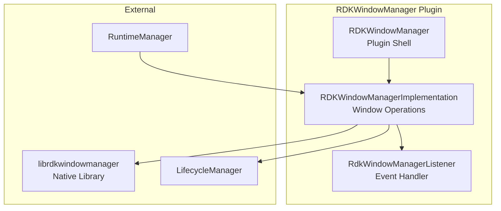
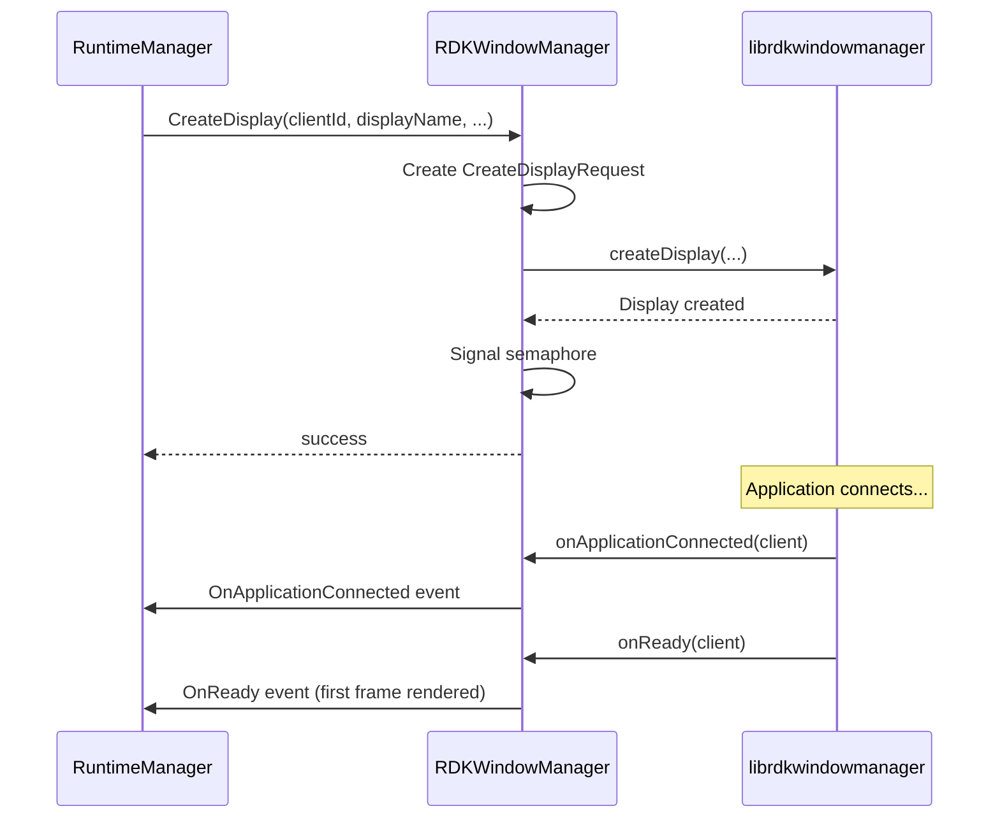
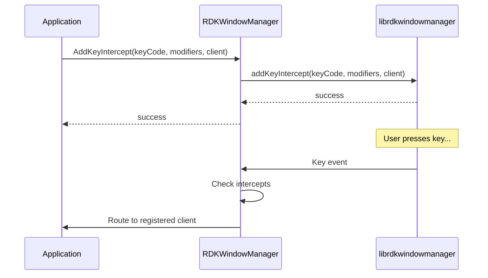
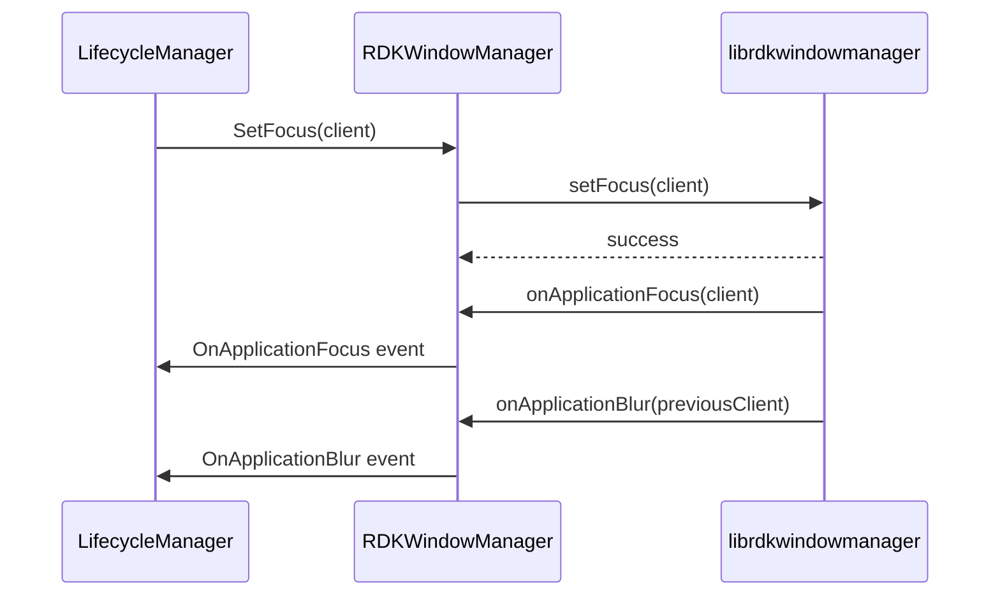
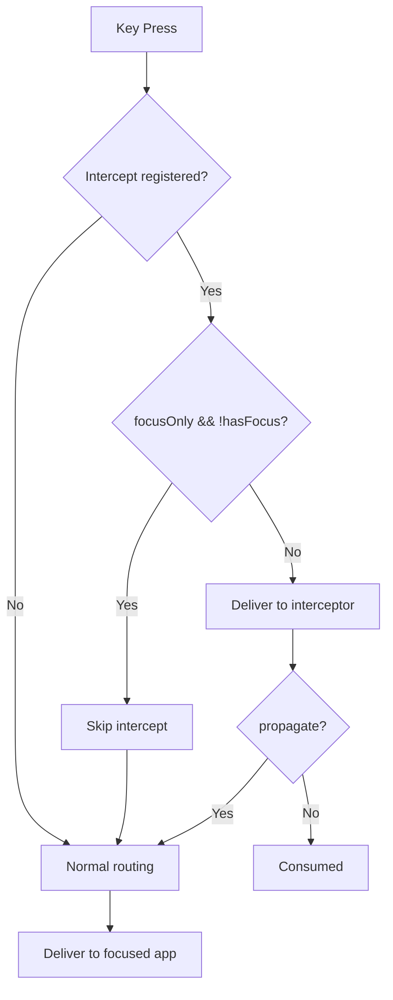

# RDKWindowManager Plugin Documentation

> Display Creation, Focus Control, and Key Intercepts for RDK Infrastructure

## 1. High-Level Purpose & Architecture

### Role in ENT / RDK Infrastructure

The **RDKWindowManager** plugin provides window and display management services for applications running on RDK devices. It handles display creation, focus management, visibility control, key event routing, and user inactivity detection.

### Responsibilities

- **Display Management**: Create and destroy application displays
- **Focus Control**: Manage application focus and Z-order
- **Key Handling**: Intercept, route, and inject key events
- **Visibility Control**: Show/hide application windows
- **Inactivity Detection**: Monitor and report user inactivity
- **VNC Server**: Remote display access (optional)

### Interacting Subsystems

| Subsystem | Interaction Type | Purpose |
|-----------|-----------------|---------|
| RuntimeManager | COM-RPC (inbound) | Display creation for containers |
| LifecycleManager | COM-RPC (inbound) | Window events notification |
| rdkwindowmanager library | Native | Underlying window management |

---

## 2. Architectural Overview

### Major Components



---

## 3. Code Organization

### Directory Structure

```
RDKWindowManager/
├── RDKWindowManager.cpp              # Plugin shell
├── RDKWindowManager.h                # Shell header
├── RDKWindowManagerImplementation.cpp # Core implementation
├── RDKWindowManagerImplementation.h   # Implementation header
├── RDKWindowManagerTelemetryReporting.cpp # Telemetry
├── RDKWindowManagerTelemetryReporting.h   # Telemetry header
├── Module.cpp                        # Plugin module
├── Module.h                          # Module header
├── test/                             # Test files
├── CMakeLists.txt                    # Build configuration
├── RDKWindowManager.config           # Plugin configuration
└── RDKWindowManager.conf.in          # Configuration template
```

---

## 4. Class & Interface Documentation

### Exchange::IRDKWindowManager Interface

```cpp
interface IRDKWindowManager {
    interface INotification {
        void OnUserInactivity(double minutes);
        void OnApplicationDisconnected(const string& client);
        void OnReady(const string& client);
        void OnApplicationConnected(const string& client);
        void OnApplicationVisible(const string& client);
        void OnApplicationHidden(const string& client);
        void OnApplicationFocus(const string& client);
        void OnApplicationBlur(const string& client);
        void OnScreenshotComplete(bool success);
    };

    hresult Initialize(PluginHost::IShell* service);
    hresult Deinitialize(PluginHost::IShell* service);
    hresult Register(INotification* notification);
    hresult Unregister(INotification* notification);

    // Display Management
    hresult CreateDisplay(const string& clientId, const string& displayName,
                          uint32_t displayWidth, uint32_t displayHeight,
                          bool virtualDisplay, uint32_t virtualWidth, uint32_t virtualHeight,
                          uint32_t ownerId, uint32_t groupId,
                          bool topmost, bool focus);
    hresult GetApps(string& appIds) const;

    // Key Management
    hresult AddKeyIntercept(const string& intercept);
    hresult AddKeyIntercepts(const string& clientId, const string& intercepts);
    hresult RemoveKeyIntercept(const string& clientId, uint32_t keyCode, const string& modifiers);
    hresult AddKeyListener(const string& keyListeners);
    hresult RemoveKeyListener(const string& keyListeners);
    hresult InjectKey(uint32_t keyCode, const string& modifiers);
    hresult GenerateKey(const string& keys, const string& client);
    hresult EnableKeyRepeats(bool enable);
    hresult GetKeyRepeatsEnabled(bool& keyRepeat) const;
    hresult IgnoreKeyInputs(bool ignore);
    hresult EnableInputEvents(const string& clients, bool enable);
    hresult KeyRepeatConfig(const string& input, const string& keyConfig);
    hresult GetLastKeyInfo(uint32_t& keyCode, uint32_t& modifiers, uint64_t& timestamp) const;

    // Focus & Visibility
    hresult SetFocus(const string& client);
    hresult SetVisible(const string& client, bool visible);
    hresult GetVisibility(const string& client, bool& visible);
    hresult SetZOrder(const string& clientId, int32_t zOrder);
    hresult GetZOrder(const string& clientId, int32_t& zOrder);

    // Rendering
    hresult RenderReady(const string& client, bool& status) const;
    hresult EnableDisplayRender(const string& client, bool enable);

    // Inactivity
    hresult EnableInactivityReporting(bool enable);
    hresult SetInactivityInterval(uint32_t interval);
    hresult ResetInactivityTime();

    // VNC & Screenshot
    hresult StartVncServer();
    hresult StopVncServer();
    hresult GetScreenshot();
};
```

### RDKWindowManagerImplementation Key Types

```cpp
// Display creation request structure
struct CreateDisplayRequest {
    std::string mClient;
    std::string mDisplayName;
    uint32_t mDisplayWidth;
    uint32_t mDisplayHeight;
    bool mVirtualDisplayEnabled;
    uint32_t mVirtualWidth;
    uint32_t mVirtualHeight;
    bool mTopmost;
    bool mFocus;
    sem_t mSemaphore;
    bool mResult;
    uint32_t mOwnerId;
    uint32_t mGroupId;
};

// Window manager events
enum Event {
    RDK_WINDOW_MANAGER_EVENT_UNKNOWN,
    RDK_WINDOW_MANAGER_EVENT_ON_USER_INACTIVITY,
    RDK_WINDOW_MANAGER_EVENT_APPLICATION_DISCONNECTED,
    RDK_WINDOW_MANAGER_EVENT_ON_READY,
    RDK_WINDOW_MANAGER_EVENT_APPLICATION_CONNECTED,
    RDK_WINDOW_MANAGER_EVENT_APPLICATION_VISIBLE,
    RDK_WINDOW_MANAGER_EVENT_APPLICATION_HIDDEN,
    RDK_WINDOW_MANAGER_EVENT_APPLICATION_FOCUS,
    RDK_WINDOW_MANAGER_EVENT_APPLICATION_BLUR,
    RDK_WINDOW_MANAGER_EVENT_SCREENSHOT_COMPLETE
};
```

### Event Listener Class

```cpp
class RdkWindowManagerListener : public RdkWindowManager::RdkWindowManagerEventListener {
public:
    virtual void onUserInactive(const double minutes);
    virtual void onApplicationDisconnected(const std::string& client);
    virtual void onReady(const std::string& client);
    virtual void onApplicationConnected(const std::string& client);
    virtual void onApplicationVisible(const std::string& client);
    virtual void onApplicationHidden(const std::string& client);
    virtual void onApplicationFocus(const std::string& client);
    virtual void onApplicationBlur(const std::string& client);
};
```

---

## 5. Internal Workflows

### Display Creation Flow



### Key Intercept Flow



### Focus Management Flow



---

## 6. Configuration

### Plugin Configuration

```cmake
set (autostart false)
set (preconditions Platform)
set (callsign "org.rdk.RDKWindowManager")
```

---

## 7. Key Management Features

### Key Intercept Options

| Option | Description |
|--------|-------------|
| `focusOnly` | Only intercept when client has focus |
| `propagate` | Allow key to propagate to other clients |
| `modifiers` | Key modifier requirements (ctrl, alt, shift) |

### Key Event Flow



---

## 8. Testing

### Existing Tests

Located in `Tests/L1Tests/tests/test_RDKWindowManager.cpp`

| Test | Description |
|------|-------------|
| CreateDisplay | Display creation |
| SetFocus | Focus management |
| KeyIntercept | Key interception |
| Visibility | Show/hide windows |
| Inactivity | Inactivity detection |
| ZOrder | Z-order management |

---

## 9. Integration Notes

### For RuntimeManager Integration

```cpp
// Before starting container, create display
windowManager->CreateDisplay(appInstanceId, displayName,
                             width, height,
                             virtualDisplay, virtualWidth, virtualHeight,
                             ownerId, groupId,
                             topmost, focus);

// Wait for OnReady before considering app "running"
```

### For LifecycleManager Integration

```cpp
// Monitor window events for lifecycle state
windowManager->Register(notification);
// OnApplicationDisconnected -> consider app crashed
// OnReady -> first frame rendered, transition to ACTIVE
```
