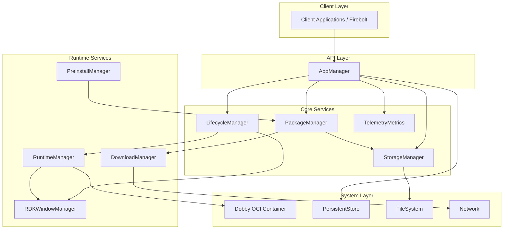
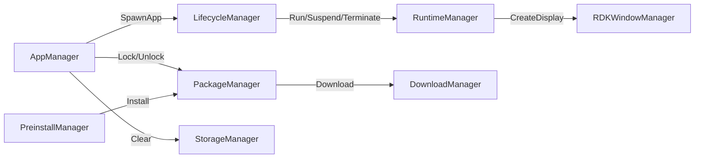
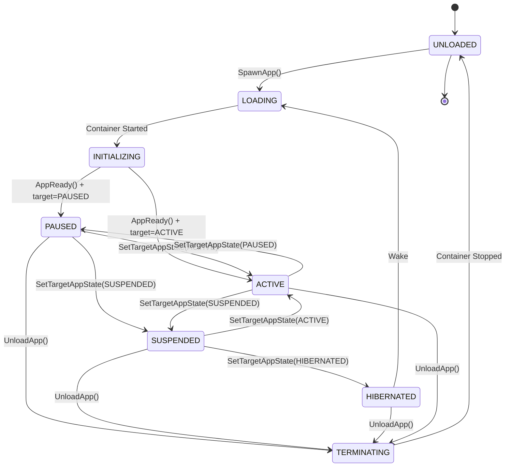
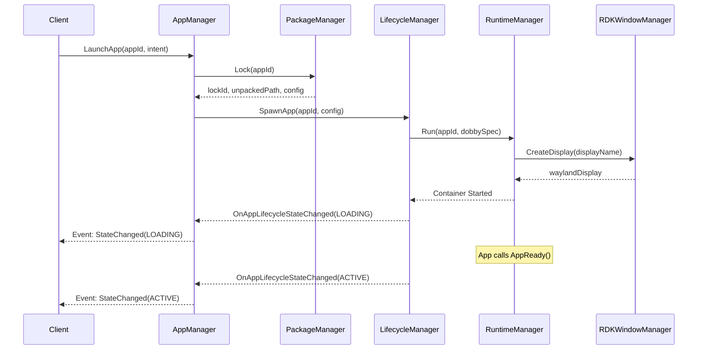

# ENT Services AppManagers

> Comprehensive Technical Documentation for RDK Application Management Infrastructure

## Overview

The **entservices-appmanagers** repository provides a comprehensive suite of WPEFramework plugins for managing application lifecycle, package installation, runtime containers, and system resources on RDK-based set-top boxes and streaming devices.

---

## System Architecture



---

## Module Relationships



---

## Module Documentation

| Module | Description | Documentation |
|--------|-------------|---------------|
| **AppManager** | Primary API for application management. Orchestrates app lifecycle operations. | [View →](./doc/AppManager.md) |
| **LifecycleManager** | State machine for application lifecycle transitions. | [View →](./doc/LifecycleManager.md) |
| **RuntimeManager** | Container runtime using Dobby OCI. Handles execution and hibernation. | [View →](./doc/RuntimeManager.md) |
| **PackageManager** | Package download, installation, locking, and uninstallation. | [View →](./doc/PackageManager.md) |
| **DownloadManager** | HTTP downloads with priority queuing and rate limiting. | [View →](./doc/DownloadManager.md) |
| **StorageManager** | Application-specific storage allocation and management. | [View →](./doc/StorageManager.md) |
| **PreinstallManager** | Pre-installed application scanning and installation. | [View →](./doc/PreinstallManager.md) |
| **RDKWindowManager** | Display creation, focus control, and key intercepts. | [View →](./doc/RDKWindowManager.md) |
| **TelemetryMetrics** | Performance metrics and analytics collection. | [View →](./doc/TelemetryMetrics.md) |
| **WebBridge** | WebSocket bridge for JSON-RPC communication. | [View →](./doc/WebBridge.md) |

---

## Module Interactions

| From | To | Interaction |
|------|-----|-------------|
| AppManager | LifecycleManager | `SpawnApp`, `SetTargetAppState`, `UnloadApp`, `KillApp` |
| AppManager | PackageManager | `Lock`, `Unlock`, `ListPackages` |
| AppManager | StorageManager | `Clear`, `ClearAll` |
| LifecycleManager | RuntimeManager | `Run`, `Suspend`, `Resume`, `Hibernate`, `Wake`, `Terminate` |
| RuntimeManager | RDKWindowManager | `CreateDisplay`, `DestroyDisplay` |
| PackageManager | StorageManager | `CreateStorage`, `DeleteStorage` |
| PackageManager | DownloadManager | `Download`, `Cancel`, `GetProgress` |
| PreinstallManager | PackageManager | `Install` (pre-installed apps) |

---

## Application Lifecycle States



---

## Application Launch Flow



---

## Quick Start

### Build Instructions

```bash
# Configure with CMake
cmake -DPLUGIN_APPMANAGER=ON \
      -DPLUGIN_LIFECYCLE_MANAGER=ON \
      -DPLUGIN_RUNTIME_MANAGER=ON \
      -DPLUGIN_PACKAGE_MANAGER=ON \
      -DPLUGIN_STORAGE_MANAGER=ON \
      ..

# Build
make -j$(nproc)

# Install
make install
```

### Configuration Files

| File | Purpose |
|------|---------|
| `AppManager.config` | Application manager settings |
| `LifecycleManager.config` | Lifecycle state timeouts |
| `RuntimeManager.config` | Container runtime paths |
| `PackageManager.conf` | Download directory settings |
| `StorageManager.config` | Storage path configuration |

---

## Repository Structure

```
entservices-appmanagers/
├── AppManager/              Application lifecycle API
├── LifecycleManager/        State machine implementation
├── RuntimeManager/          OCI container management
├── PackageManager/          Package installation
├── DownloadManager/         HTTP download service
├── StorageManager/          App storage management
├── PreinstallManager/       Pre-installed apps
├── RDKWindowManager/        Display management
├── TelemetryMetrics/        Metrics collection
├── WebBridge/               WebSocket JSON-RPC bridge
├── helpers/                 Shared utilities
├── Tests/                   L1/L2 test suites
├── CMakeLists.txt           Main build file
└── doc/                     Documentation (you are here)
```

---

## License

Copyright 2024-2026 RDK Management - Licensed under Apache License 2.0

---

*Documentation generated from source code analysis - January 2026*

