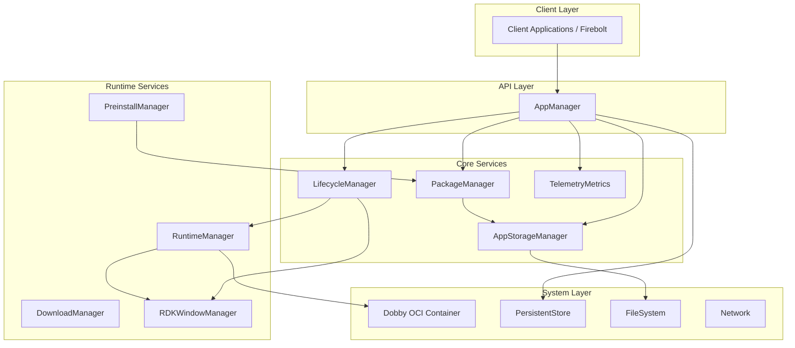
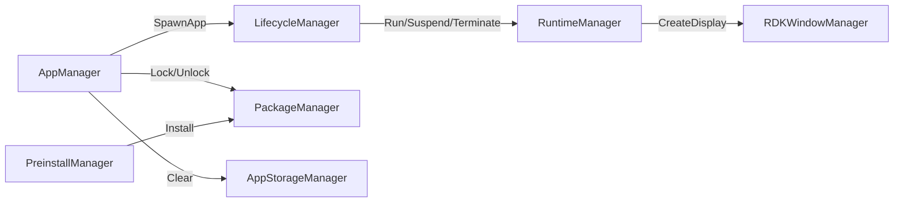
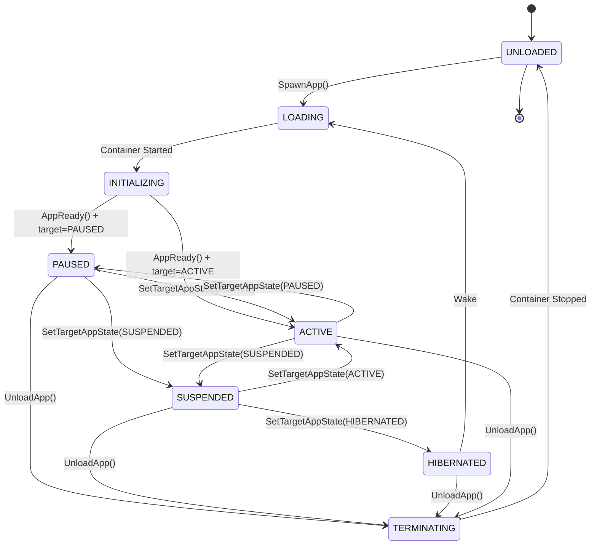
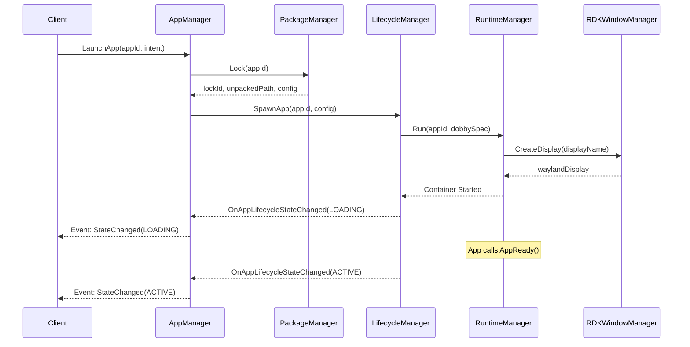

# ENT Services AppManagers

> Comprehensive Technical Documentation for RDK Application Management Infrastructure

## Overview

The **entservices-appmanagers** repository provides a comprehensive suite of WPEFramework plugins for managing application lifecycle, package installation, runtime containers, and system resources on RDK-based set-top boxes and streaming devices.

---

## System Architecture


```mermaid
graph TB
    subgraph "Client Layer"
        Client[Client Applications / Firebolt]
    end

    subgraph "API Layer"
        AppMgr[AppManager]
    end

    subgraph "Core Services"
        LCM[LifecycleManager]
        PkgMgr[PackageManager]
        AppStorMgr[AppStorageManager]
        Telemetry[TelemetryMetrics]
    end

    subgraph "Runtime Services"
        RTM[RuntimeManager]
        DLMgr[DownloadManager]
        PreMgr[PreinstallManager]
        WinMgr[RDKWindowManager]
    end

    subgraph "System Layer"
        Dobby[Dobby OCI Container]
        PStore[PersistentStore]
        FS[FileSystem]
        Network[Network]
    end

    Client --> AppMgr
    AppMgr --> LCM
    AppMgr --> PkgMgr
    AppMgr --> AppStorMgr
    AppMgr --> Telemetry
    LCM --> RTM
    LCM --> WinMgr
    PkgMgr --> AppStorMgr
    PreMgr --> PkgMgr
    RTM --> Dobby
    RTM --> WinMgr
    AppStorMgr --> FS
    AppMgr --> PStore
```

---

## Module Relationships


```mermaid
flowchart LR
    A[AppManager] -->|SpawnApp| B[LifecycleManager]
    A -->|Lock/Unlock| C[PackageManager]
    A -->|Clear| D[AppStorageManager]
    B -->|Run/Suspend/Terminate| E[RuntimeManager]
    E -->|CreateDisplay| F[RDKWindowManager]
    H[PreinstallManager] -->|Install| C
```

---

## Generated Subsystem Documentation

The manager-local documentation is organized by selected subsystem. Each file is self-contained and covers architecture, source organization, interfaces, configuration, workflows, diagrams, tests, and a beginner-to-expert learning path.

| Module | Description | Documentation |
|--------|-------------|---------------|
| **AppManager** | Application orchestration, metadata, lifecycle requests, and notifications. | [View →](AppManager/AppManager.md) |
| **AppStorageManager** | Per-application persistent storage and quota operations. | [View →](AppStorageManager/AppStorageManager.md) |
| **LifecycleManager** | Application state transitions and lifecycle notifications. | [View →](LifecycleManager/LifecycleManager.md) |
| **DownloadManager** | Asynchronous prioritized HTTP downloads and retries. | [View →](DownloadManager/DownloadManager.md) |
| **PreinstallManager** | Preinstalled package discovery and installation. | [View →](PreinstallManager/PreinstallManager.md) |
| **PackageManager** | Package download, installation, locking, metadata, and cache state. | [View →](PackageManager/PackageManager.md) |
| **RDKWindowManager** | Display, compositor, input, focus, and render control. | [View →](RDKWindowManager/RDKWindowManager.md) |
| **RuntimeManager** | OCI container execution and runtime state management. | [View →](RuntimeManager/RuntimeManager.md) |
| **TelemetryMetrics** | Thread-safe metric recording, filtering, and publication. | [View →](TelemetryMetrics/TelemetryMetrics.md) |
| **VictimSelector** | Memory-pressure victim selection and eviction escalation. | [View →](VictimSelector/VictimSelector.md) |

---

## Module Interactions

| From | To | Interaction |
|------|-----|-------------|
| AppManager | LifecycleManager | `SpawnApp`, `SetTargetAppState`, `UnloadApp`, `KillApp` |
| AppManager | PackageManager | `Lock`, `Unlock`, `ListPackages` |
| AppManager | AppStorageManager | `Clear`, `ClearAll` |
| LifecycleManager | RuntimeManager | `Run`, `Suspend`, `Resume`, `Hibernate`, `Wake`, `Terminate` |
| RuntimeManager | RDKWindowManager | `CreateDisplay`, `DestroyDisplay` |
| PackageManager | AppStorageManager | `CreateStorage`, `DeleteStorage` |
| PreinstallManager | PackageManager | `Install` (pre-installed apps) |

---

## Application Lifecycle States


```mermaid
stateDiagram-v2
    [*] --> UNLOADED
    UNLOADED --> LOADING: SpawnApp()
    LOADING --> INITIALIZING: Container Started
    INITIALIZING --> PAUSED: AppReady() + target=PAUSED
    INITIALIZING --> ACTIVE: AppReady() + target=ACTIVE
    PAUSED --> ACTIVE: SetTargetAppState(ACTIVE)
    ACTIVE --> PAUSED: SetTargetAppState(PAUSED)
    PAUSED --> SUSPENDED: SetTargetAppState(SUSPENDED)
    ACTIVE --> SUSPENDED: SetTargetAppState(SUSPENDED)
    SUSPENDED --> ACTIVE: SetTargetAppState(ACTIVE)
    SUSPENDED --> HIBERNATED: SetTargetAppState(HIBERNATED)
    HIBERNATED --> LOADING: Wake
    PAUSED --> TERMINATING: UnloadApp()
    SUSPENDED --> TERMINATING: UnloadApp()
    HIBERNATED --> TERMINATING: UnloadApp()
    ACTIVE --> TERMINATING: UnloadApp()
    TERMINATING --> UNLOADED: Container Stopped
    UNLOADED --> [*]
```

---

## Application Launch Flow


```mermaid
sequenceDiagram
    participant Client
    participant AppManager
    participant PackageManager
    participant LifecycleManager
    participant RuntimeManager
    participant RDKWindowManager

    Client->>AppManager: LaunchApp(appId, intent)
    AppManager->>PackageManager: Lock(appId)
    PackageManager-->>AppManager: lockId, unpackedPath, config
    AppManager->>LifecycleManager: SpawnApp(appId, config)
    LifecycleManager->>RuntimeManager: Run(appId, dobbySpec)
    RuntimeManager->>RDKWindowManager: CreateDisplay(displayName)
    RDKWindowManager-->>RuntimeManager: waylandDisplay
    RuntimeManager-->>LifecycleManager: Container Started
    LifecycleManager-->>AppManager: OnAppLifecycleStateChanged(LOADING)
    AppManager-->>Client: Event: StateChanged(LOADING)
    Note over RuntimeManager: App calls AppReady()
    LifecycleManager-->>AppManager: OnAppLifecycleStateChanged(ACTIVE)
    AppManager-->>Client: Event: StateChanged(ACTIVE)
```

---

## Quick Start

### Build Instructions

```bash
# Configure with CMake
cmake -DPLUGIN_APPMANAGER=ON \
      -DPLUGIN_LIFECYCLE_MANAGER=ON \
      -DPLUGIN_RUNTIME_MANAGER=ON \
      -DPLUGIN_PACKAGE_MANAGER=ON \
      -DPLUGIN_APP_STORAGE_MANAGER=ON \
      ..

# Build
make -j$(nproc)

# Install
make install
```

### Configuration Files

| File | Purpose |
|------|---------|
| `AppManager.config` | Application manager settings |
| `LifecycleManager.config` | Lifecycle state timeouts |
| `RuntimeManager.config` | Container runtime paths |
| `AppPackageManager.json` | Download directory settings (generated from `PackageManager/PackageManager.conf.in`) |
| `AppStorageManager.config` | Storage path configuration |

---

## Repository Structure

```
entservices-appmanagers/
├── AppManager/              Application lifecycle API
├── LifecycleManager/        State machine implementation
├── RuntimeManager/          OCI container management
├── PackageManager/          Package installation
├── DownloadManager/         HTTP download service
├── AppStorageManager/          App storage management
├── PreinstallManager/       Pre-installed apps
├── RDKWindowManager/        Display management
├── TelemetryMetrics/        Metrics collection
├── WebBridge/               WebSocket JSON-RPC bridge
├── helpers/                 Shared utilities
├── Tests/                   L1/L2 test suites
└── CMakeLists.txt           Main build file
```

---

## License

Copyright 2024-2026 RDK Management - Licensed under Apache License 2.0

---

*Documentation generated from source code analysis - January 2026*

