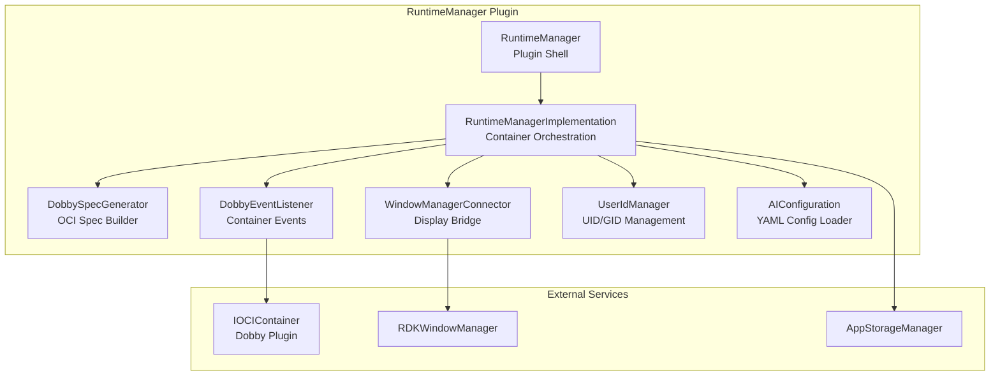
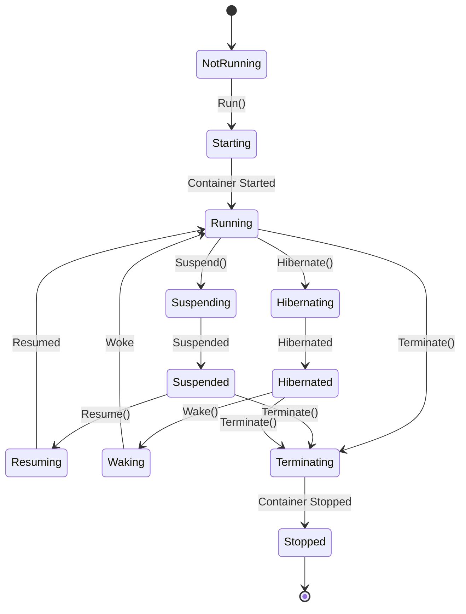
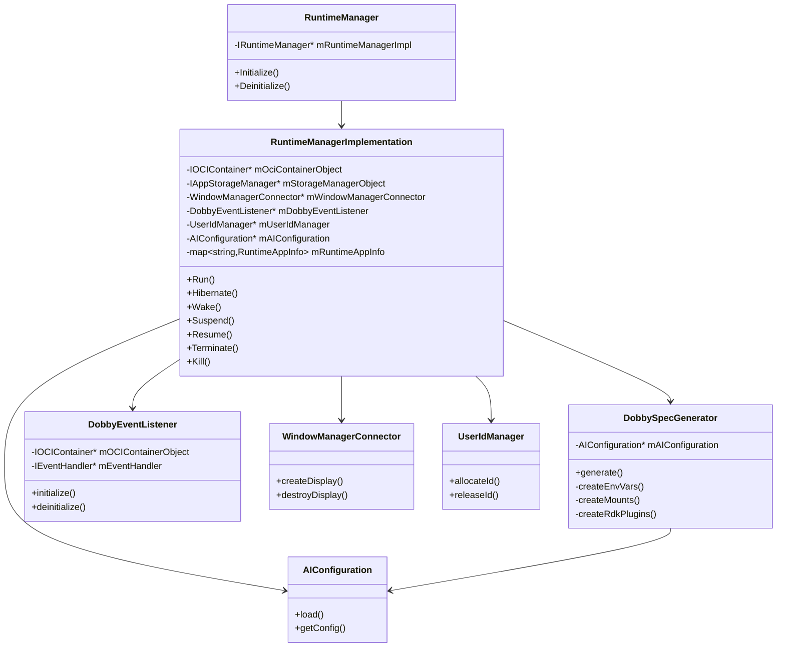
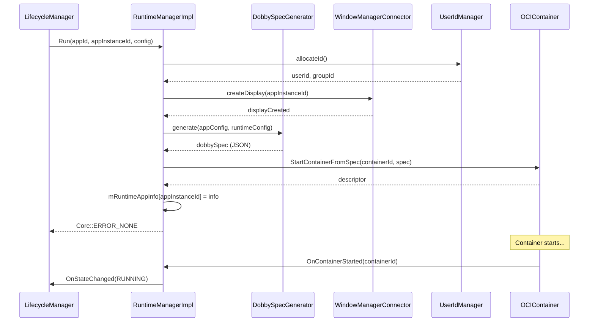
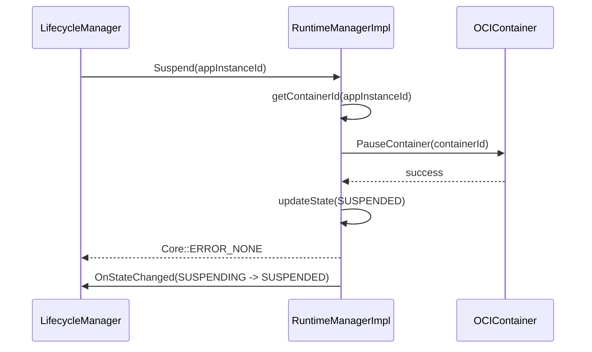
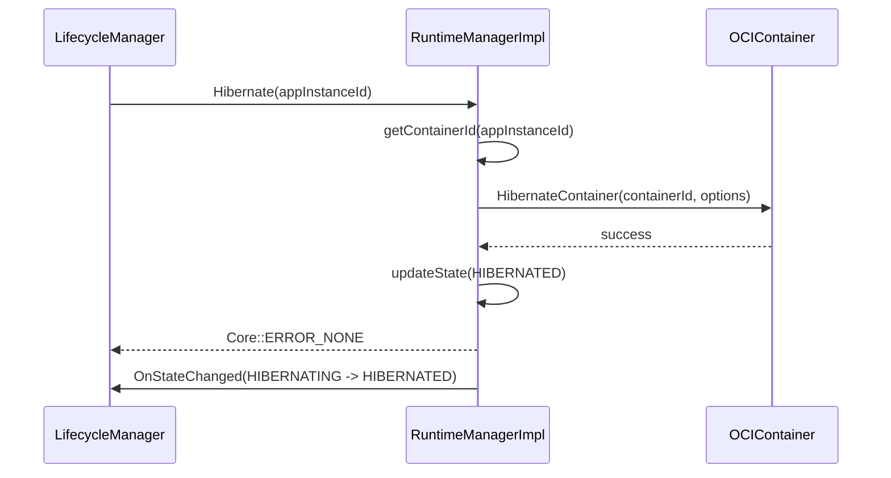
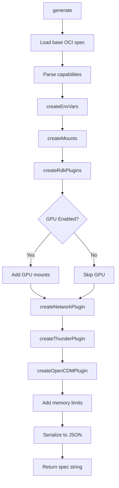
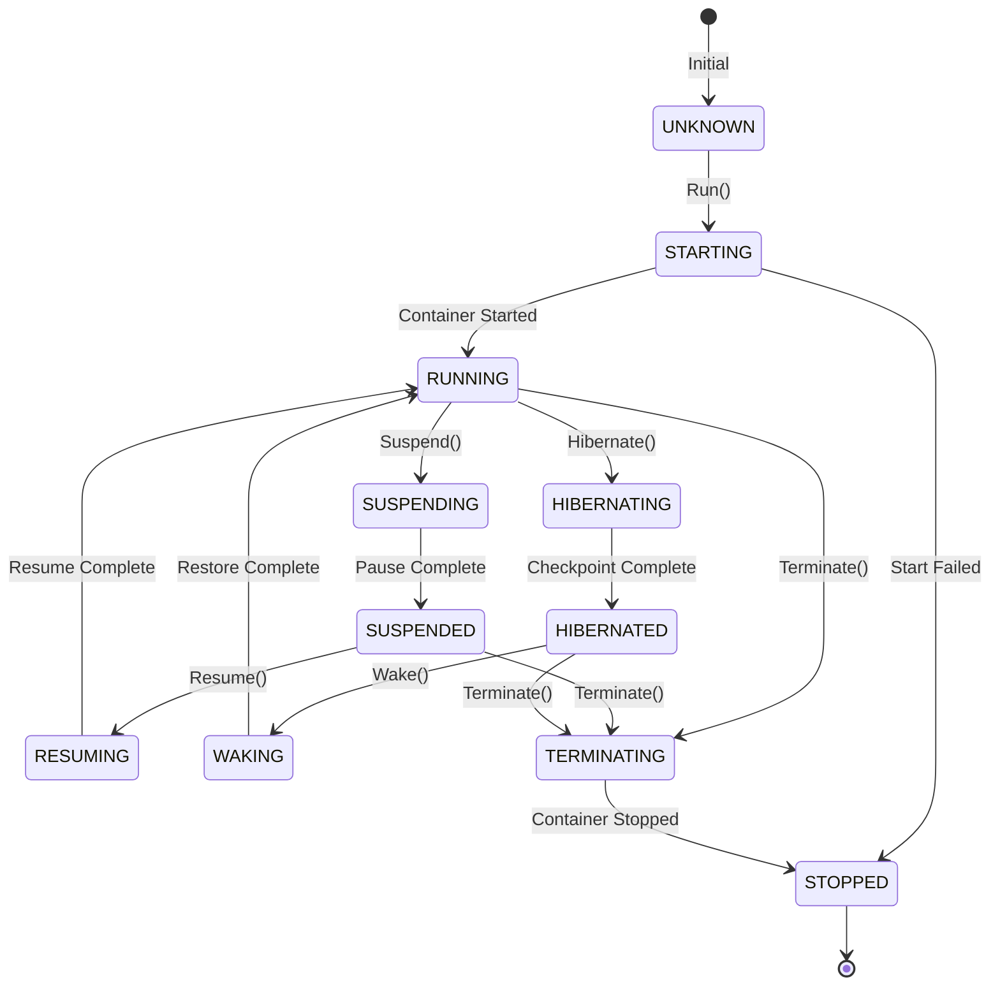
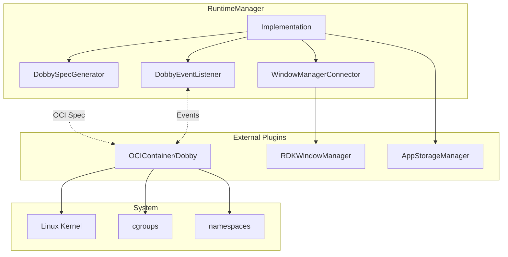
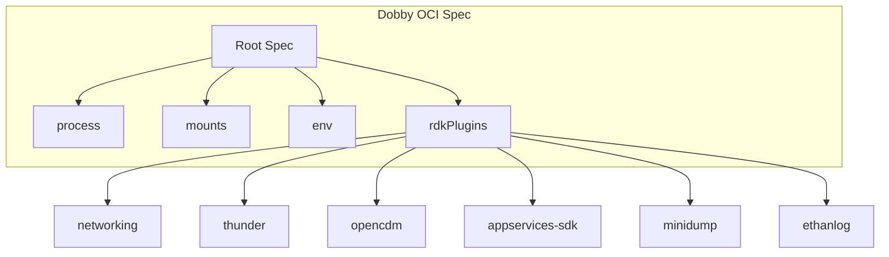

# RuntimeManager Plugin Documentation

> Container Runtime Management using Dobby OCI in RDK Infrastructure

## 1. High-Level Purpose & Architecture

### Role in ENT / RDK Infrastructure

The **RuntimeManager** plugin manages application execution through OCI-compliant containers using the Dobby container runtime. It handles container lifecycle operations including starting, suspending, hibernating, and terminating application containers.

### Responsibilities

- **Container Lifecycle**: Start, stop, suspend, resume, hibernate, and wake containers
- **OCI Spec Generation**: Generate Dobby-compatible OCI specifications via `DobbySpecGenerator`
- **Window Management**: Coordinate display creation with RDKWindowManager via `WindowManagerConnector`
- **Event Handling**: Process container events from Dobby via `DobbyEventListener`
- **User ID Management**: Manage container user/group IDs via `UserIdManager`
- **AI Configuration**: Load runtime configuration from YAML via `AIConfiguration`

### Interacting Subsystems

| Subsystem | Interaction Type | Purpose |
|-----------|-----------------|---------|
| LifecycleManager | COM-RPC (inbound) | Receives Run, Suspend, Resume, Hibernate, Wake, Terminate requests |
| RDKWindowManager | COM-RPC (outbound) | Creates displays for applications |
| OCIContainer (Dobby) | COM-RPC (outbound) | Executes container operations |
| AppStorageManager | COM-RPC (outbound) | Gets application storage paths |

### What It Does NOT Do

- Does not manage application lifecycle state machine (handled by LifecycleManager)
- Does not handle package installation (handled by PackageManager)
- Does not provide JSON-RPC API (internal service only)

---

## 2. Architectural Overview

### Major Components



### Container Lifecycle



---

## 3. Code Organization

### Directory Structure

```
RuntimeManager/
├── RuntimeManager.cpp              # Plugin shell
├── RuntimeManager.h                # Shell header
├── RuntimeManagerImplementation.cpp # Core container management
├── RuntimeManagerImplementation.h   # Implementation header
├── DobbySpecGenerator.cpp          # OCI spec generation
├── DobbySpecGenerator.h            # Spec generator header
├── DobbyEventListener.cpp          # Container event handling
├── DobbyEventListener.h            # Event listener header
├── WindowManagerConnector.cpp      # RDKWindowManager bridge
├── WindowManagerConnector.h        # Connector header
├── UserIdManager.cpp               # UID/GID management
├── UserIdManager.h                 # UserIdManager header
├── AIConfiguration.cpp             # YAML configuration loader
├── AIConfiguration.h               # AI config header
├── ApplicationConfiguration.h      # App config structure
├── IEventHandler.h                 # Event handler interface
├── RialtoConnector.cpp             # Rialto integration (optional)
├── RialtoConnector.h               # Rialto header
├── RuntimeManagerTelemetryReporting.cpp # Telemetry
├── RuntimeManagerTelemetryReporting.h   # Telemetry header
├── Module.cpp                      # Plugin module
├── Module.h                        # Module header
├── Gateway/                        # Gateway components
├── ralf/                           # RALF package support
├── CMakeLists.txt                  # Build configuration
├── RuntimeManager.config           # Plugin configuration
└── RuntimeManager.conf.in          # Configuration template
```

### File-by-File Breakdown

#### RuntimeManager.h / RuntimeManager.cpp

**Purpose**: Thin plugin shell that exposes the RuntimeManager to Thunder.

```cpp
// From RuntimeManager.h (lines 35-43)
class RuntimeManager : public PluginHost::IPlugin {
    BEGIN_INTERFACE_MAP(RuntimeManager)
    INTERFACE_ENTRY(PluginHost::IPlugin)
    INTERFACE_AGGREGATE(Exchange::IRuntimeManager, mRuntimeManagerImpl)
    END_INTERFACE_MAP

    const string Initialize(PluginHost::IShell* service) override;
    void Deinitialize(PluginHost::IShell* service) override;
};
```

#### RuntimeManagerImplementation.h / RuntimeManagerImplementation.cpp

**Purpose**: Core container orchestration logic implementing `IRuntimeManager`.

**Key Types**:
`RuntimeEventType` values:

| Value |
|-------|
| `RUNTIME_MANAGER_EVENT_UNKNOWN` |
| `RUNTIME_MANAGER_EVENT_STATECHANGED` |
| `RUNTIME_MANAGER_EVENT_CONTAINERSTARTED` |
| `RUNTIME_MANAGER_EVENT_CONTAINERSTOPPED` |
| `RUNTIME_MANAGER_EVENT_CONTAINERFAILED` |

`RequestType` values:

| Value |
|-------|
| `REQUEST_TYPE_NONE` |
| `REQUEST_TYPE_LAUNCH` |
| `REQUEST_TYPE_SUSPEND` |
| `REQUEST_TYPE_RESUME` |
| `REQUEST_TYPE_HIBERNATE` |
| `REQUEST_TYPE_WAKE` |
| `REQUEST_TYPE_TERMINATE` |
| `REQUEST_TYPE_KILL` |

`RuntimeAppInfo` fields:

| Field | Type | Description |
|-------|------|-------------|
| `appId` | `std::string` | Application identifier |
| `appInstanceId` | `std::string` | Runtime instance identifier |
| `descriptor` | `uint32_t` | Runtime/container descriptor |
| `containerState` | `RuntimeState` | Current runtime state |
| `requestTime` | `time_t` | Timestamp for active request |
| `requestType` | `RequestType` | Request type currently being processed |

**Key Methods**:
```cpp
// IRuntimeManager interface implementation
Core::hresult Run(const string& appId, const string& appInstanceId,
                  uint32_t userId, uint32_t groupId,
                  IValueIterator* const& ports,
                  IStringIterator* const& paths,
                  IStringIterator* const& debugSettings,
                  const RuntimeConfig& runtimeConfigObject);
Core::hresult Hibernate(const string& appInstanceId);
Core::hresult Wake(const string& appInstanceId, RuntimeState runtimeState);
Core::hresult Suspend(const string& appInstanceId);
Core::hresult Resume(const string& appInstanceId);
Core::hresult Terminate(const string& appInstanceId);
Core::hresult Kill(const string& appInstanceId);
Core::hresult GetInfo(const string& appInstanceId, string& info);
Core::hresult Annotate(const string& appInstanceId, const string& key, const string& value);
```

#### DobbySpecGenerator.h / DobbySpecGenerator.cpp

**Purpose**: Generates OCI-compliant container specifications for Dobby.

**Key Methods**:
```cpp
class DobbySpecGenerator {
public:
    DobbySpecGenerator(AIConfiguration& aiConfiguration);
    bool generate(const ApplicationConfiguration& config,
                  const RuntimeConfig& runtimeConfig,
                  string& outputJsonString);

private:
    Json::Value createEnvVars(const ApplicationConfiguration& config,
                              const RuntimeConfig& runtimeConfig,
                              const std::vector<std::pair<std::string, std::string>>& capabilities) const;
    Json::Value createMounts(const ApplicationConfiguration& config,
                             const RuntimeConfig& runtimeConfig) const;
    Json::Value createRdkPlugins(const ApplicationConfiguration& config,
                                 const RuntimeConfig& runtimeConfig,
                                 const std::vector<std::pair<std::string, std::string>>& capabilities) const;
    Json::Value createNetworkPlugin(...) const;
    Json::Value createThunderPlugin(...) const;
    Json::Value createOpenCDMPlugin(...) const;
    // ... additional plugin creation methods
};
```

#### DobbyEventListener.h / DobbyEventListener.cpp

**Purpose**: Listens for container events from the Dobby OCIContainer plugin.

```cpp
class DobbyEventListener {
    class OCIContainerNotification : public Exchange::IOCIContainer::INotification {
        void OnContainerStarted(const string& containerId, const string& name) override;
        void OnContainerStopped(const string& containerId, const string& name) override;
        void OnContainerFailed(const string& containerId, const string& name, uint32_t error) override;
        void OnContainerStateChanged(const string& containerId, ContainerState state) override;
    };

public:
    bool initialize(PluginHost::IShell* service, IEventHandler* eventHandler,
                    Exchange::IOCIContainer* ociContainerObject);
    bool deinitialize();
};
```

#### WindowManagerConnector.h / WindowManagerConnector.cpp

**Purpose**: Bridge to RDKWindowManager for display creation.

**Key Functionality**:
- Creates displays for applications before container start
- Monitors window manager events
- Handles display disconnection cleanup

#### UserIdManager.h / UserIdManager.cpp

**Purpose**: Manages unique user/group IDs for container isolation.

**Key Functionality**:
- Allocates unique UID/GID pairs for containers
- Tracks active allocations
- Releases IDs when containers stop

#### AIConfiguration.h / AIConfiguration.cpp

**Purpose**: Loads runtime configuration from YAML files.

**Configuration Sources**:
- Platform-wide runtime configuration
- Per-application overrides
- Memory limits, GPU settings, network configuration

---

## 4. Class & Interface Documentation

### Exchange::IRuntimeManager Interface

```cpp
interface IRuntimeManager {
    enum RuntimeState {
        UNKNOWN = 0,
        STARTING,
        RUNNING,
        SUSPENDING,
        SUSPENDED,
        RESUMING,
        HIBERNATING,
        HIBERNATED,
        WAKING,
        TERMINATING,
        STOPPED
    };

    interface INotification {
        void OnStateChanged(const string& appInstanceId, RuntimeState oldState,
                           RuntimeState newState, const string& errorReason);
    };

    hresult Register(INotification* notification);
    hresult Unregister(INotification* notification);
    hresult Run(const string& appId, const string& appInstanceId,
                uint32_t userId, uint32_t groupId,
                IValueIterator* ports, IStringIterator* paths,
                IStringIterator* debugSettings,
                const RuntimeConfig& runtimeConfig);
    hresult Hibernate(const string& appInstanceId);
    hresult Wake(const string& appInstanceId, RuntimeState state);
    hresult Suspend(const string& appInstanceId);
    hresult Resume(const string& appInstanceId);
    hresult Terminate(const string& appInstanceId);
    hresult Kill(const string& appInstanceId);
    hresult GetInfo(const string& appInstanceId, string& info);
    hresult Annotate(const string& appInstanceId, const string& key, const string& value);
    hresult Mount();
    hresult Unmount();
};
```

### IEventHandler Interface

Internal interface for event handling:

```cpp
class IEventHandler {
public:
    virtual void onOCIContainerStartedEvent(std::string name, JsonObject& data) = 0;
    virtual void onOCIContainerStoppedEvent(std::string name, JsonObject& data) = 0;
    virtual void onOCIContainerFailureEvent(std::string name, JsonObject& data) = 0;
    virtual void onOCIContainerStateChangedEvent(std::string name, JsonObject& data) = 0;
};
```

### Class Relationships



---

## 5. Configuration & Build Integration

### Plugin Configuration (RuntimeManager.config)

```cmake
set (autostart ${PLUGIN_RUNTIME_MANAGER_AUTOSTART})
set (preconditions Platform)
set (callsign "org.rdk.RuntimeManager")

map()
   key(root)
   map()
       kv(mode ${PLUGIN_RUNTIME_MANAGER_MODE})
       kv(locator lib${PLUGIN_IMPLEMENTATION}.so)
   end()
end()
ans(configuration)
```

### CMake Build Options

| Option | Description | Default |
|--------|-------------|---------|
| `PLUGIN_RUNTIME_MANAGER_MODE` | Execution mode (Off/Local) | Off |
| `PLUGIN_RUNTIME_MANAGER_AUTOSTART` | Auto-start on boot | false |
| `PLUGIN_RUNTIME_APP_PORTAL` | Runtime app portal identifier | "" |
| `PLUGIN_RUNTIME_CONFIG_FILE` | Path to runtime config YAML | "" |
| `RALF_PACKAGE_SUPPORT` | Enable RALF package support | OFF |
| `RIALTO_IN_DAC_FEATURE` | Enable Rialto in DAC | OFF |

### Dependencies

- `yaml-cpp` - For YAML configuration parsing
- `jsoncpp` - For JSON/OCI spec generation
- `WPEFramework` - Thunder framework
- `RialtoServerManager` (optional) - For Rialto integration

---

## 6. Internal Workflows & Execution Flow

### Container Start (Run) Flow



### Container Suspend Flow



### Container Hibernate Flow



### OCI Spec Generation Flow



---

## 7. Diagrams & Visual Aids

### Complete Runtime State Diagram



### Component Integration Diagram



### OCI Spec Structure



---

## 8. Testing & Quality Analysis

### Existing Tests

Located in `Tests/L1Tests/tests/test_RunTimeManager.cpp`:

| Test Category | Description |
|---------------|-------------|
| Run Tests | Container start with various configurations |
| Suspend/Resume Tests | Container pause/unpause |
| Hibernate/Wake Tests | Container checkpoint/restore |
| Terminate Tests | Graceful container shutdown |
| Kill Tests | Forced container termination |
| Event Tests | Container event handling |

### Test Coverage Gaps

1. **OCI Spec Generation**: Various capability combinations
2. **Error Recovery**: Container failure handling
3. **Resource Limits**: Memory/CPU limit enforcement
4. **Concurrent Operations**: Multiple container operations

### Suggested Test Cases

```cpp
// Test GPU-enabled container spec
TEST(RuntimeManagerTest, GenerateSpecWithGPU) {
    // Verify GPU mounts and environment variables
}

// Test memory limit configuration
TEST(RuntimeManagerTest, MemoryLimitEnforcement) {
    // Verify cgroup memory limits in spec
}

// Test container failure recovery
TEST(RuntimeManagerTest, ContainerFailureRecovery) {
    // Verify proper cleanup on container crash
}
```

---

## 9. Beginner-to-Expert Learning Path

### Must Know First

1. **OCI Containers**: Understand OCI runtime specification
2. **Dobby**: RDK's OCI-compliant container runtime
3. **Linux Namespaces/cgroups**: Container isolation fundamentals

### Beginner Level

1. Read `RuntimeManager.h` for the plugin structure
2. Examine a generated OCI spec to understand container configuration
3. Trace a simple Run() call through the code

### Intermediate Level

1. Study `DobbySpecGenerator` for OCI spec construction
2. Understand `DobbyEventListener` event flow
3. Examine `WindowManagerConnector` for display coordination

### Advanced Level

1. Study `AIConfiguration` YAML loading and merging
2. Understand capability-based plugin selection in spec generation
3. Analyze memory/GPU resource management

### Expert Level

1. Add new Dobby RDK plugins to spec generation
2. Implement custom container isolation features
3. Optimize container startup time
4. Add new runtime states for advanced lifecycle management
