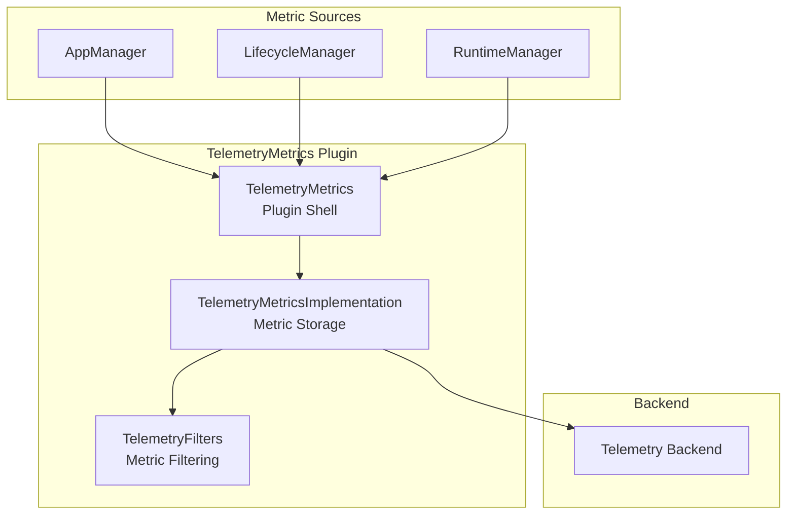
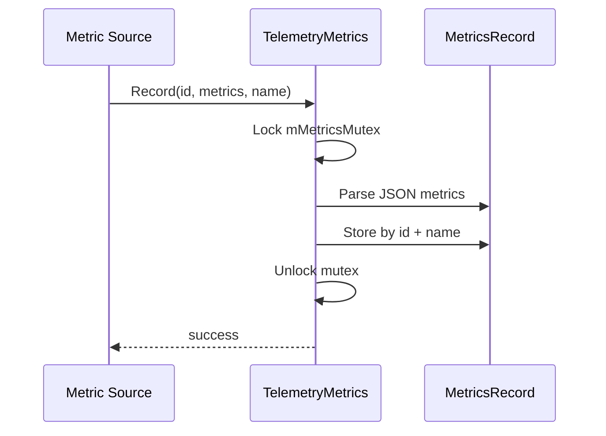
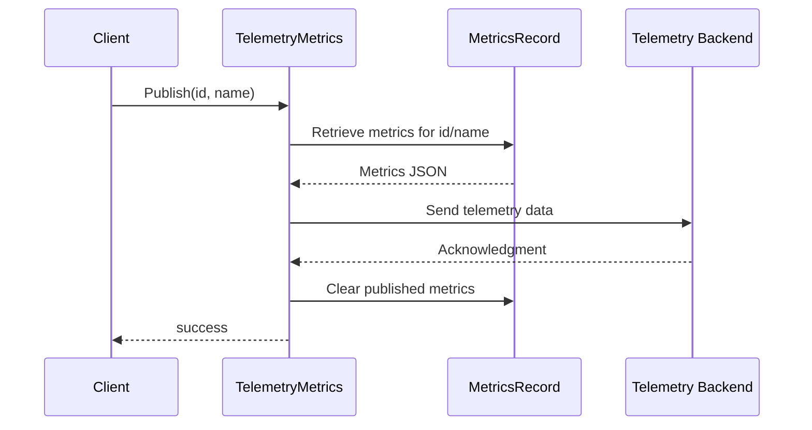

# TelemetryMetrics Plugin Documentation

> Performance Metrics and Analytics Collection for RDK Infrastructure

## 1. High-Level Purpose & Architecture

### Role in ENT / RDK Infrastructure

The **TelemetryMetrics** plugin provides a centralized service for recording and publishing application performance metrics and telemetry data. It collects metrics from various subsystems and publishes them to telemetry backends.

### Responsibilities

- **Metric Recording**: Store metrics with associated identifiers
- **Metric Publishing**: Publish collected metrics to telemetry systems
- **Data Aggregation**: Aggregate metrics by application and metric type

### Interacting Subsystems

| Subsystem | Interaction Type | Purpose |
|-----------|-----------------|---------|
| AppManager | COM-RPC (inbound) | Report app metrics |
| LifecycleManager | COM-RPC (inbound) | Report lifecycle metrics |
| RuntimeManager | COM-RPC (inbound) | Report container metrics |
| Telemetry Backend | Outbound | Publish metrics |

---

## 2. Architectural Overview



---

## 3. Code Organization

### Directory Structure

```
TelemetryMetrics/
├── TelemetryMetrics.cpp              # Plugin shell
├── TelemetryMetrics.h                # Shell header
├── TelemetryMetricsImplementation.cpp # Core implementation
├── TelemetryMetricsImplementation.h   # Implementation header
├── TelemetryFilters.h                # Metric filtering
├── Module.cpp                        # Plugin module
├── Module.h                          # Module header
├── CMakeLists.txt                    # Build configuration
├── TelemetryMetrics.config           # Plugin configuration
└── TelemetryMetrics.conf.in          # Configuration template
```

---

## 4. Class & Interface Documentation

### Exchange::ITelemetryMetrics Interface

```cpp
interface ITelemetryMetrics {
    hresult Record(const string& id, const string& metrics, const string& name);
    hresult Publish(const string& id, const string& name);
};
```

### TelemetryMetricsImplementation

```cpp
// From TelemetryMetricsImplementation.h
class TelemetryMetricsImplementation : public Exchange::ITelemetryMetrics {
public:
    TelemetryMetricsImplementation();
    ~TelemetryMetricsImplementation() override;

    BEGIN_INTERFACE_MAP(TelemetryMetricsImplementation)
    INTERFACE_ENTRY(Exchange::ITelemetryMetrics)
    END_INTERFACE_MAP

    Core::hresult Record(const string& id, const string& metrics, const string& name) override;
    Core::hresult Publish(const string& id, const string& name) override;

private:
    std::unordered_map<std::string, Json::Value> mMetricsRecord;
    std::mutex mMetricsMutex;
};
```

---

## 5. Internal Workflows

### Metric Recording Flow



### Metric Publishing Flow



---

## 6. Telemetry Markers

### Common Telemetry Markers

The following markers are defined in `TelemetryMarkers.h` across subsystems:

| Marker | Description | Source |
|--------|-------------|--------|
| `APP_LAUNCH_START` | App launch initiated | AppManager |
| `APP_LAUNCH_COMPLETE` | App launch completed | LifecycleManager |
| `CONTAINER_START` | Container starting | RuntimeManager |
| `CONTAINER_RUNNING` | Container running | RuntimeManager |
| `FIRST_FRAME` | First frame rendered | RDKWindowManager |
| `APP_SUSPEND` | App suspended | LifecycleManager |
| `APP_RESUME` | App resumed | LifecycleManager |
| `APP_TERMINATE` | App terminated | LifecycleManager |

### Telemetry Data Format

```json
{
    "id": "com.example.app",
    "name": "appLaunch",
    "metrics": {
        "startTime": 1640000000000,
        "endTime": 1640000002500,
        "duration": 2500,
        "success": true,
        "markers": {
            "APP_LAUNCH_START": 1640000000000,
            "CONTAINER_START": 1640000000500,
            "CONTAINER_RUNNING": 1640000001000,
            "FIRST_FRAME": 1640000002000,
            "APP_LAUNCH_COMPLETE": 1640000002500
        }
    }
}
```

---

## 7. Configuration

### Plugin Configuration

```cmake
set (autostart false)
set (preconditions Platform)
set (callsign "org.rdk.TelemetryMetrics")
```

### Build Option

```cmake
option(AIMANAGERS_TELEMETRY_METRICS_SUPPORT "Enable telemetry metrics" OFF)
```

---

## 8. Integration Pattern

### Recording Metrics from Other Plugins

```cpp
// In AppManagerTelemetryReporting.cpp
void recordLaunchMetric(const std::string& appId, uint64_t startTime, uint64_t endTime) {
    if (telemetryMetrics) {
        Json::Value metrics;
        metrics["startTime"] = startTime;
        metrics["endTime"] = endTime;
        metrics["duration"] = endTime - startTime;
        
        Json::FastWriter writer;
        telemetryMetrics->Record(appId, writer.write(metrics), "appLaunch");
    }
}
```

---

## 9. Testing

### Test Considerations

| Test | Description |
|------|-------------|
| Record | Metric recording |
| Publish | Metric publishing |
| Concurrent | Thread-safe access |
| Aggregation | Metric aggregation |
