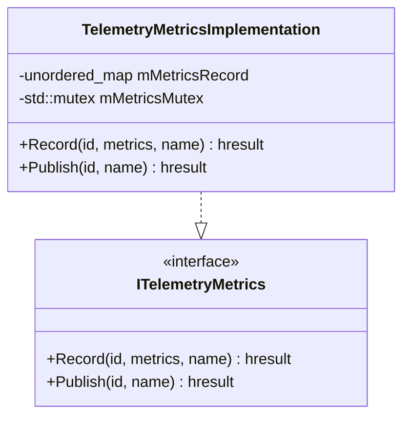
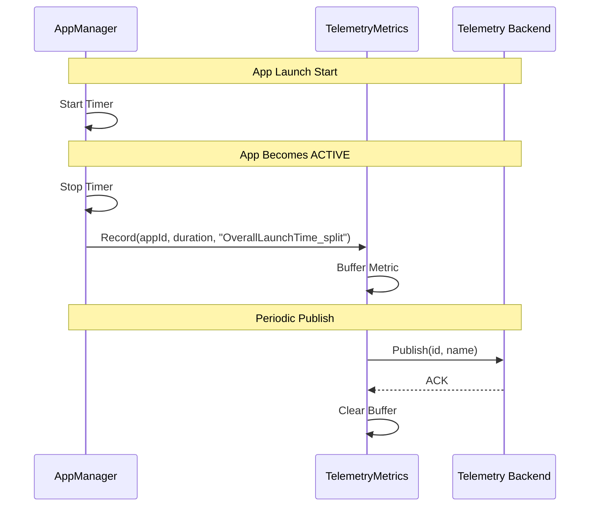
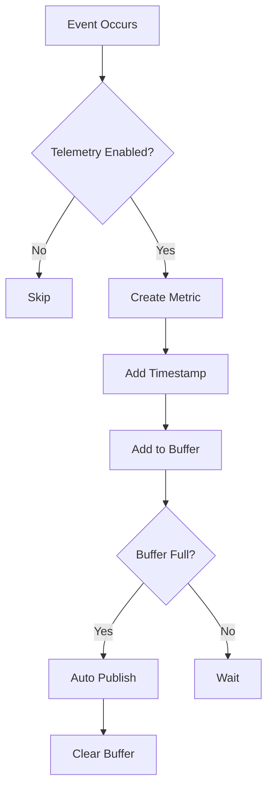

# TelemetryMetrics Module

> Performance Metrics & Analytics Collection

[← Back to Main](../README.md) | [← Previous: RDKWindowManager](../RDKWindowManager/RDKWindowManager.md)


---

## Purpose & Role

The **TelemetryMetrics** module provides telemetry data recording and publishing for performance metrics, operational analytics, and app lifecycle events.

### Core Responsibilities

- **Metric Recording:** Record timestamped metrics
- **Metric Publishing:** Publish metrics to backend
- **Event Correlation:** Correlate metrics with app events
- **Performance Tracking:** Track launch times, response times

### Clients

| Module | Metrics Reported |
|--------|------------------|
| AppManager | Launch time, close time, errors |
| LifecycleManager | State transition times |
| PackageManager | Install/uninstall times |

---

## Architecture

```mermaid
graph TB
    subgraph "TelemetryMetrics Module"
        TM[TelemetryMetrics<br/>Plugin]
        TMI[TelemetryMetricsImplementation]
        MR[Metrics Record<br/>(unordered_map)]
    end

    subgraph "Clients"
        AM[AppManager]
        LCM[LifecycleManager]
        PM[PackageManager]
    end

    subgraph "Backend"
        TS[Telemetry Service]
        Analytics[Analytics Platform]
    end

    AM -->|Record| TM
    LCM -->|Record| TM
    PM -->|Record| TM
    TM --> TMI
    TMI --> MR
    TMI -->|Publish| TS
    TS --> Analytics
```

---

## Class Diagram



### API Reference (Summary)

- `Record(id, metrics, name) -> hresult`  
  - `id` (string, required): Identifier for the metric record (e.g., a unique event or metric ID).
  - `metrics` (string, required): Metric payload or value(s) to be recorded (e.g., `"1234"` ms, `"true"`, `"ERROR_TIMEOUT"`).
  - `name` (string, required): Logical name associated with the metric (for example, an app or feature name).
- `Publish(id, name) -> hresult`  
  - As defined by the TelemetryMetrics implementation; not modified by this document.

---

## File Organization

```
TelemetryMetrics/
├── TelemetryMetrics.cpp           Plugin wrapper
├── TelemetryMetrics.h             Plugin class definition
├── TelemetryMetricsImplementation.cpp Core implementation
├── TelemetryMetricsImplementation.h   Implementation class
├── Module.cpp/h                   Module registration
├── CMakeLists.txt                 Build configuration
└── TelemetryMetrics.config        Runtime configuration
```

---

## API Reference

### ITelemetryMetrics Interface

| Method | Purpose |
|--------|---------|
| `Record(id, metrics, name)` | Record a metrics payload or value for a given id and metric name |
| `Publish(id, name)` | Publish recorded metrics for the given id and metric name |

---

## Metrics Types

### Application Lifecycle Metrics

| Metric Name | Description | Source |
|-------------|-------------|--------|
| `OverallLaunchTime_split` | Total time from launch request to ACTIVE | AppManager |
| `AppLaunchError_split` | Launch failure with error code | AppManager |
| `AppCloseTime_split` | Time from close request to completion | AppManager |
| `AppCrashed_split` | Application crash event | AppManager |
| `StateTransitionTime` | Time for state transition | LifecycleManager |

### Package Metrics

| Metric Name | Description |
|-------------|-------------|
| `PackageInstallTime` | Time to install package |
| `PackageUninstallTime` | Time to uninstall package |
| `PackageDownloadTime` | Time to download package |

---

## Telemetry Flow



---

## Metric Recording Flow



---

## AppManagerTelemetryReporting

The `AppManagerTelemetryReporting` helper in **AppManager** is responsible for reporting app-related telemetry (launch/close timings, state changes, errors, etc.) into the TelemetryMetrics pipeline.

At a high level, it exposes methods that wrap telemetry interactions, such as:

```cpp
// See AppManager/AppManagerTelemetryReporting.h for the full, authoritative API.

void reportTelemetryData(...);
void reportTelemetryDataOnStateChange(...);
// Additional helpers may exist for other app lifecycle and error events.
```

---

[← Back to Main](../README.md) | [Next: WebBridge →](../WebBridge/WebBridge.md)


