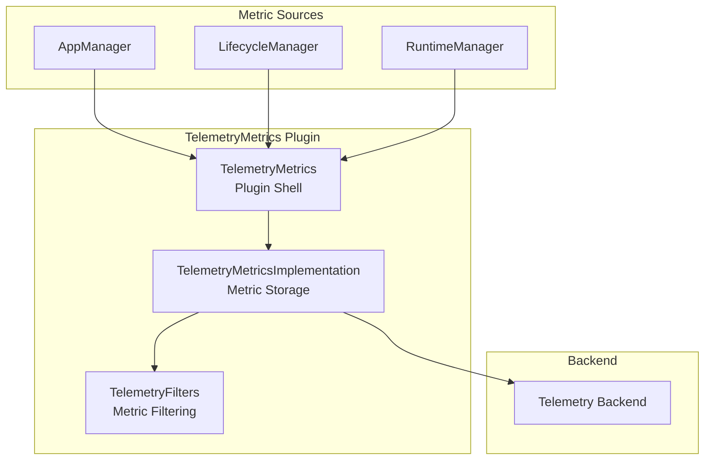
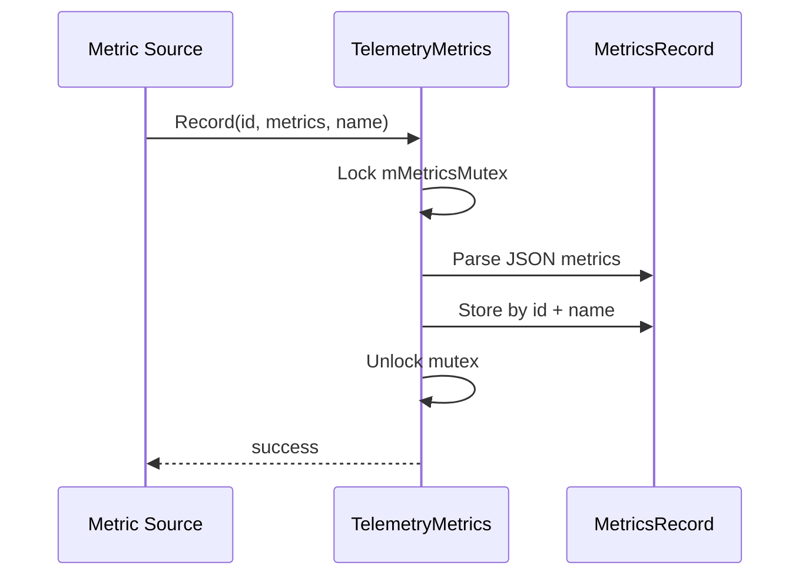
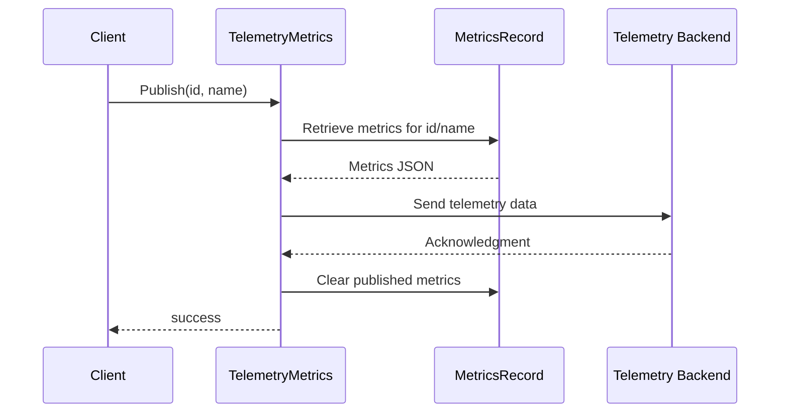
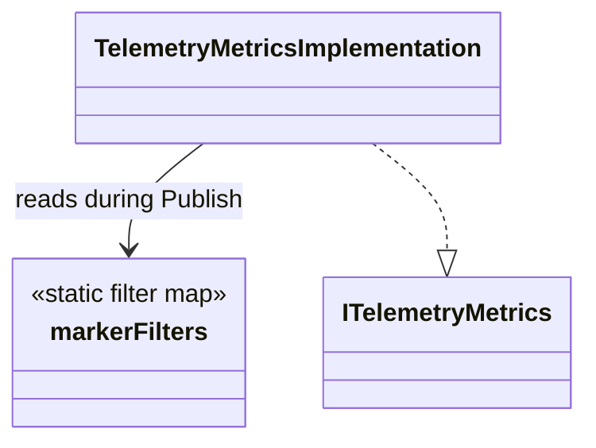
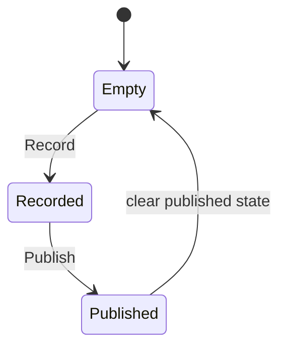

# TelemetryMetrics Plugin Documentation

> Performance Metrics and Analytics Collection for RDK Infrastructure

## 1. High-Level Purpose & Architecture

### Role in ENT / RDK Infrastructure

The **TelemetryMetrics** plugin provides a centralized service for recording and publishing application performance metrics and telemetry data. It collects metrics from various subsystems and publishes them to telemetry backends.

### Responsibilities

- **Metric Recording**: Store metrics with associated identifiers
- **Metric Publishing**: Publish collected metrics to telemetry systems
- **Data Aggregation**: Aggregate metrics by application and metric type

### Interacting Subsystems

| Subsystem | Interaction Type | Purpose |
|-----------|-----------------|---------|
| AppManager | COM-RPC (inbound) | Report app metrics |
| LifecycleManager | COM-RPC (inbound) | Report lifecycle metrics |
| RuntimeManager | COM-RPC (inbound) | Report container metrics |
| Telemetry Backend | Outbound | Publish metrics |

---

## 2. Architectural Overview


```mermaid
graph TB
    subgraph "TelemetryMetrics Plugin"
        Shell[TelemetryMetrics<br/>Plugin Shell]
        Impl[TelemetryMetricsImplementation<br/>Metric Storage]
        Filter[TelemetryFilters<br/>Metric Filtering]
    end

    subgraph "Metric Sources"
        AM[AppManager]
        LCM[LifecycleManager]
        RTM[RuntimeManager]
    end

    subgraph "Backend"
        TB[Telemetry Backend]
    end

    AM --> Shell
    LCM --> Shell
    RTM --> Shell
    Shell --> Impl
    Impl --> Filter
    Impl --> TB
```

---

## 3. Code Organization (Folder & File-Level)

### Directory Structure

```
TelemetryMetrics/
├── TelemetryMetrics.cpp              # Plugin shell
├── TelemetryMetrics.h                # Shell header
├── TelemetryMetricsImplementation.cpp # Core implementation
├── TelemetryMetricsImplementation.h   # Implementation header
├── TelemetryFilters.h                # Metric filtering
├── Module.cpp                        # Plugin module
├── Module.h                          # Module header
├── CMakeLists.txt                    # Build configuration
├── TelemetryMetrics.config           # Plugin configuration
└── TelemetryMetrics.conf.in          # Configuration template
```

---

## 4. Class & Interface Documentation

### Exchange::ITelemetryMetrics Interface

```cpp
interface ITelemetryMetrics {
    hresult Record(const string& id, const string& metrics, const string& name);
    hresult Publish(const string& id, const string& name);
};
```

### TelemetryMetricsImplementation

```cpp
// From TelemetryMetricsImplementation.h
class TelemetryMetricsImplementation : public Exchange::ITelemetryMetrics {
public:
    TelemetryMetricsImplementation();
    ~TelemetryMetricsImplementation() override;

    BEGIN_INTERFACE_MAP(TelemetryMetricsImplementation)
    INTERFACE_ENTRY(Exchange::ITelemetryMetrics)
    END_INTERFACE_MAP

    Core::hresult Record(const string& id, const string& metrics, const string& name) override;
    Core::hresult Publish(const string& id, const string& name) override;

private:
    std::unordered_map<std::string, Json::Value> mMetricsRecord;
    std::mutex mMetricsMutex;
};
```

---

## 5. Configuration & Build Integration

The plugin settings are `mode`, `locator`, `autostart`, and `startuporder`. `APPMANAGERS_ENABLE_T2_INIT` controls T2 initialization in [CMakeLists.txt](CMakeLists.txt). There is no direct TelemetryMetrics-specific L0 target in the current [Tests/L0Tests/CMakeLists.txt](../Tests/L0Tests/CMakeLists.txt); other subsystem telemetry tests exercise the integration indirectly.

## 6. Internal Workflows & Execution Flow

### Metric Recording Flow


```mermaid
sequenceDiagram
    participant Source as Metric Source
    participant TM as TelemetryMetrics
    participant Store as MetricsRecord

    Source->>TM: Record(id, metrics, name)
    TM->>TM: Lock mMetricsMutex
    TM->>Store: Parse JSON metrics
    TM->>Store: Store by id + name
    TM->>TM: Unlock mutex
    TM-->>Source: success
```

### Metric Publishing Flow


```mermaid
sequenceDiagram
    participant Client
    participant TM as TelemetryMetrics
    participant Store as MetricsRecord
    participant Backend as Telemetry Backend

    Client->>TM: Publish(id, name)
    TM->>Store: Retrieve metrics for id/name
    Store-->>TM: Metrics JSON
    TM->>Backend: Send telemetry data
    Backend-->>TM: Acknowledgment
    TM->>Store: Clear published metrics
    TM-->>Client: success
```

---

## 7. Diagrams & Visual Aids


```mermaid
classDiagram
    class TelemetryMetricsImplementation
    class markerFilters {
        <<static filter map>>
    }
    TelemetryMetricsImplementation --> markerFilters : reads during Publish
    TelemetryMetricsImplementation ..|> ITelemetryMetrics
```


```mermaid
stateDiagram-v2
    [*] --> Empty
    Empty --> Recorded: Record
    Recorded --> Published: Publish
    Published --> Empty: clear published state
```

## Telemetry Markers

### Common Telemetry Markers

The following markers are defined in `helpers/Telemetry/TelemetryMarkers.h`:

| Marker | Description |
|--------|-------------|
| `TELEMETRY_MARKER_DOWNLOAD_TIME` | Package download time |
| `TELEMETRY_MARKER_DOWNLOAD_ERROR` | Package download error |
| `TELEMETRY_MARKER_INSTALL_TIME` | Package install time |
| `TELEMETRY_MARKER_INSTALL_ERROR` | Package install error |
| `TELEMETRY_MARKER_UNINSTALL_TIME` | Package uninstall time |
| `TELEMETRY_MARKER_UNINSTALL_ERROR` | Package uninstall error |
| `TELEMETRY_MARKER_LAUNCH_TIME` | App launch time |
| `TELEMETRY_MARKER_LAUNCH_ERROR` | App launch error |
| `TELEMETRY_MARKER_CLOSE_TIME` | App close time |
| `TELEMETRY_MARKER_CLOSE_ERROR` | App close error |
### Telemetry Data Format

    {
        "appId": "com.example.app",
        "appInstanceId": "instance-123",
        "totalLaunchTime": 2500,
        "runtimeManagerRunTime": 1200,
        "markerName": "ENTS_INFO_RDKAMAppLaunchTime"
    }

---

## 8. Testing & Quality Analysis

There is no subsystem-specific L0 test target in the current workspace. Add focused tests for concurrent record/publish, malformed JSON, filtering, duplicate metric identities, T2-disabled behavior, and shutdown/uninitialization.

The visible [TelemetryMetrics.cpp](TelemetryMetrics.cpp) shutdown code contains a commented-out `result` declaration followed by an assertion using `result`; this source path is ambiguous and requires explicit compile/test confirmation.

## Configuration

### Plugin Configuration

```cmake
set (autostart false)
set (preconditions Platform)
set (callsign "org.rdk.TelemetryMetrics")
```

### Build Option

```cmake
option(AIMANAGERS_TELEMETRY_METRICS_SUPPORT "Enable telemetry metrics" OFF)
```

---

## 9. Beginner-to-Expert Teaching Mode

**Must know first:** `Record` accumulates JSON metrics and `Publish` is the emission boundary. Learn the identity parameters, mutex-protected map, and shared-service lookup pattern.

**Advanced path:** trace a subsystem reporter through `QueryInterfaceByCallsign`, inspect filter/merge semantics, and compare T2-enabled and T2-disabled builds.

## Integration Pattern

### Recording Metrics from Other Plugins

```cpp
// In AppManagerTelemetryReporting.cpp
void recordLaunchMetric(const std::string& appId, uint64_t startTime, uint64_t endTime) {
    if (telemetryMetrics) {
        Json::Value metrics;
        metrics["startTime"] = startTime;
        metrics["endTime"] = endTime;
        metrics["duration"] = endTime - startTime;
        
        Json::FastWriter writer;
        telemetryMetrics->Record(appId, writer.write(metrics), "appLaunch");
    }
}
```

---

## 10. Legacy Test Notes

### Test Considerations

| Test | Description |
|------|-------------|
| Record | Metric recording |
| Publish | Metric publishing |
| Concurrent | Thread-safe access |
| Aggregation | Metric aggregation |
