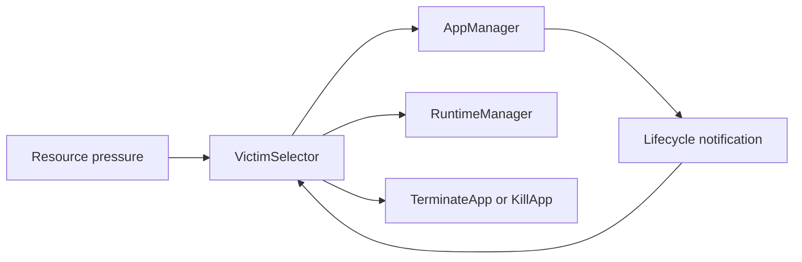
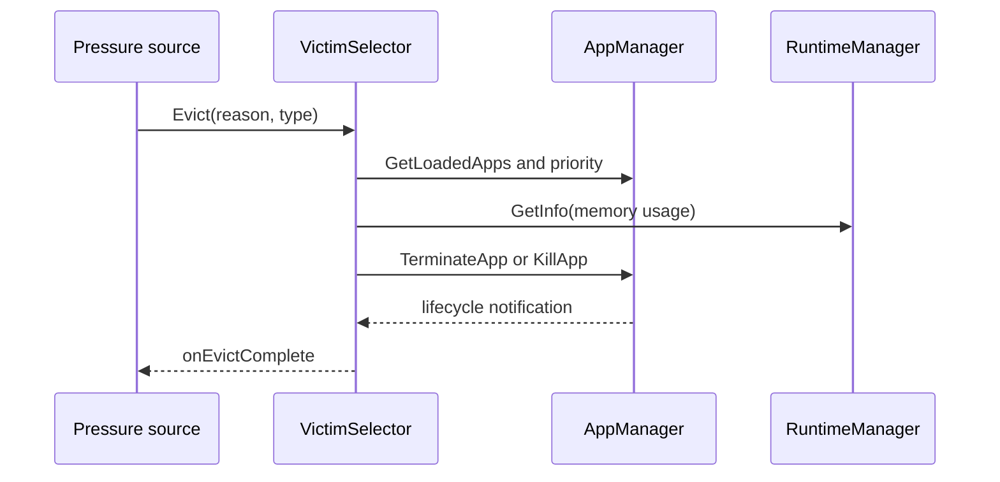
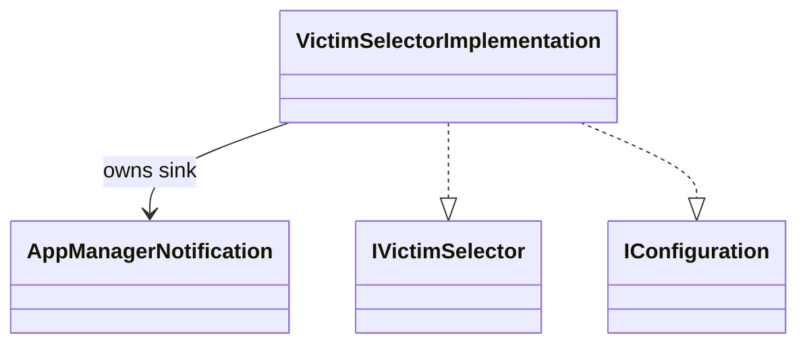
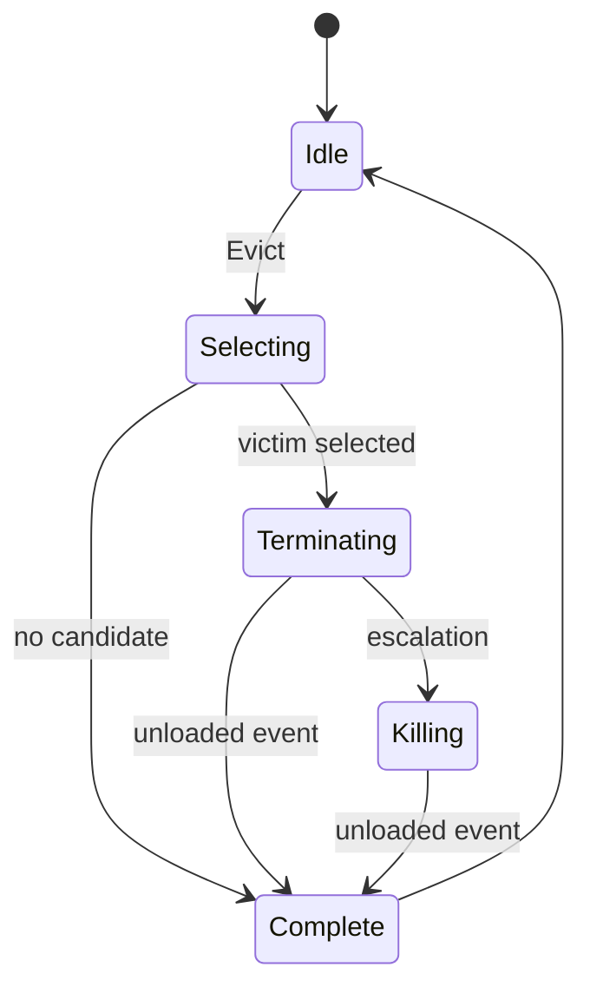

# Victim Selector

## 1. High-Level Purpose & Architecture

Victim Selector is a Thunder plugin that chooses an application to terminate when a resource-reclamation request is received. It exposes one Thunder API, `evict`, and uses the AppManager COM-RPC interface to inspect loaded applications and request termination.

The current implementation covers the **system memory** path. GPU memory and hibernation flash storage are reserved in the interface but are not implemented yet.

## 2. Architectural Overview



VictimSelector is a policy layer. It does not own lifecycle state, runtime memory measurement, or termination implementation. It queries AppManager and RuntimeManager and delegates the selected action to AppManager.

## 3. Code Organization (Folder & File-Level)

- [VictimSelector.h](VictimSelector.h), [VictimSelector.cpp](VictimSelector.cpp): Thunder wrapper, registration, and JSON-RPC dispatch.
- [VictimSelectorImplementation.h](VictimSelectorImplementation.h), [VictimSelectorImplementation.cpp](VictimSelectorImplementation.cpp): candidate selection, service resolution, eviction state, escalation, and completion.
- [Module.h](Module.h), [Module.cpp](Module.cpp): module dependencies and registration support.
- [CMakeLists.txt](CMakeLists.txt): wrapper/implementation targets and configuration generation.
- [VictimSelector.conf.in](VictimSelector.conf.in), [VictimSelector.config](VictimSelector.config): build-time and checked-in plugin configuration.

## 4. Class & Interface Documentation

`VictimSelectorImplementation` implements `IVictimSelector` and `IConfiguration`. It owns AppManager and RuntimeManager interfaces, an AppManager notification sink, the pending app id, eviction type, and two mutexes for serialized selection/completion. `AppManagerNotification` forwards lifecycle changes and ignores unrelated AppManager events.

Source excerpt from [VictimSelectorImplementation.h](VictimSelectorImplementation.h):

```cpp
Core::hresult Evict(const EvictionReason reason, const EvictionType type) override;
Core::hresult Configure(PluginHost::IShell* service) override;
```

## 5. Configuration & Build Integration

The plugin uses `mode`, `locator`, `autostart`, and `startuporder`. The root build enables it through `PLUGIN_VICTIM_SELECTOR`; [CMakeLists.txt](CMakeLists.txt) builds separate wrapper and implementation libraries. Candidate ranking depends on AppManager's most-recently-active ordering and the platform-defined `priority` app property.

## 6. Internal Workflows & Execution Flow

1. Configure and register the AppManager listener.
2. On `Evict`, select an eligible app using lifecycle state, priority, recency, and RuntimeManager memory information.
3. Submit `TerminateApp` for soft eviction or `KillApp` for hard eviction/hibernated selection.
4. Escalate a pending soft eviction when a hard request targets the same app.
5. Complete on an unloaded lifecycle event or report a termination failure.
6. Unregister listeners and release services during teardown.

## 7. Diagrams & Visual Aids







## 8. Testing & Quality Analysis

L0 implementation tests are under [Tests/L0Tests/VictimSelector](../Tests/L0Tests/VictimSelector), with L1 coverage. Add focused tests for candidate ranking, malformed priority/memory data, no candidates, concurrent eviction, terminate-to-kill escalation, missing services, notification loss, and unsupported GPU/FLASH reasons.

## Public API

The COM-RPC contract is defined in `entservices-apis/apis/VictimSelector/IVictimSelector.h`.

### `evict`

```text
evict(reason, type) -> Core::hresult
```

Parameters:

- `reason`: Resource that requires reclamation.
  - `RAM`
  - `GPU`
  - `FLASH`
- `type`: Termination mode.
  - `HARD`: calls AppManager `KillApp`.
  - `SOFT`: calls AppManager `TerminateApp`, except a selected `HIBERNATED` app is forcefully evicted with `KillApp`.

The method is synchronous with respect to selecting a victim and submitting the termination request. The actual completion is reported asynchronously through `onEvictComplete`.

Only one eviction can be pending at a time. A `HARD` request received while a `SOFT` request is pending escalates the same application from `TerminateApp` to `KillApp`. Other overlapping requests return `Core::ERROR_ILLEGAL_STATE`.

### `onEvictComplete`

```text
onEvictComplete(evicted, errorCode)
```

Parameters:

- `evicted`: `true` after the selected application reaches the unloaded state; otherwise `false`.
- `errorCode`:
  - `NONE`
  - `NO_CANDIDATE_FOUND`
  - `TERMINATION_FAILED`
  - `TIMEOUT`

The current implementation reports `TIMEOUT` in the contract for future use, but does not yet run a timeout timer. A termination request that fails immediately or produces an AppManager lifecycle error reports `TERMINATION_FAILED`.

## Runtime Flow

1. Thunder loads `org.rdk.VictimSelector`.
2. The plugin connects to `org.rdk.AppManager` through `QueryInterfaceByCallsign`.
3. Victim Selector registers an `IAppManager::INotification` listener.
4. A client calls `evict` with a resource reason and termination type.
5. For `RAM`, Victim Selector calls `GetLoadedApps`.
6. AppManager returns loaded applications in most-recently-active-first order.
7. Victim Selector reads each app's `priority` property from AppManager and filters by lifecycle state and priority.
8. For each eligible application, Victim Selector calls `RuntimeManager.GetInfo(appInstanceId)`.
9. Victim Selector parses `memory.user.usage` from the returned Dobby statistics JSON.
10. Candidates are sorted by priority, memory usage, and position in the AppManager ordering.
11. Victim Selector calls `TerminateApp` for a `SOFT` eviction, or `KillApp` for a `HARD` eviction and for any selected `HIBERNATED` app.
12. If a `HARD` request arrives while that application's `SOFT` eviction is pending, Victim Selector calls `KillApp` for the same application.
13. AppManager lifecycle notifications are monitored.
14. When the pending application reaches `APP_STATE_UNLOADED`, Victim Selector sends `onEvictComplete(true, NONE)`.
15. If no eligible application exists, it sends `onEvictComplete(false, NO_CANDIDATE_FOUND)`.

## System Memory Selection

The current state-based selection order follows the first part of the HLA:

1. A single application in `PAUSED` state.
2. Applications in `SUSPENDED` state.
3. Applications in `HIBERNATED` state as a last resort.

Priority is read through `IAppManager::GetAppProperty(appId, "priority", value)`:

- `0`: never eligible for Victim Selector termination.
- `1`: protected application; selected only after priority `2` candidates.
- `2`: ordinary eviction candidate.
- Missing, empty, malformed, or values larger than `uint32_t` default to priority `2`.
- Numeric values above `2` are currently accepted and are selected before lower numeric priorities.

Within the selected state group, numerically higher priority values are selected first, so priority `2` precedes priority `1`. For candidates with the same priority, the highest `memory.user.usage` is selected first. If memory usage is equal or unavailable, the app appearing later in the `GetLoadedApps` iterator is selected because that iterator is ordered most-recently-active first. The actual wall-clock timestamp is not exposed or used by Victim Selector.

Applications in other states, including `RUNNING`, `ACTIVE`, `LOADING`, `INITIALIZING`, `TERMINATING`, and `UNLOADED`, are not eligible.

If more than one application is paused, the paused group is not selected because the HLA describes the paused candidate as the only paused application. Selection then continues with suspended or hibernated candidates.

AppManager internally maintains a monotonic `lastActiveIndex`. `GetLoadedApps` uses it to sort applications most-recently-active first; apps that have never been active use index `0` and are returned last, ordered by `appId`. This preserves recency semantics without adding priority or recency fields to `IAppManager::LoadedAppInfo`.

RuntimeManager supplies per-app memory usage through its existing `GetInfo(appInstanceId, info)` method. Victim Selector reads `memory.user.usage` from that JSON response. If the stats request or field parsing fails, usage defaults to zero.

## Completion Handling

Victim Selector stores the application ID for the active eviction request. It listens to AppManager's `onAppLifecycleStateChanged` event.

A pending eviction is completed when either:

- The pending application reaches `APP_STATE_UNLOADED`, which is reported as success.
- AppManager reports a non-`APP_ERROR_NONE` lifecycle error, which is reported as a termination failure.

If a `KillApp` escalation fails synchronously, the original `SOFT` eviction remains pending and may still complete through its lifecycle notification. Exactly one completion notification is emitted for the pending application.

Completion notifications are copied with an additional reference and invoked outside the internal mutex. This prevents a client callback from causing lock re-entry or notification registration changes from deadlocking the plugin.

## Source Changes

### API repository

- `entservices-apis/apis/RuntimeManager/IRuntimeManager.h`
  - Existing `GetInfo(appInstanceId, info)` API provides the Dobby cgroup statistics JSON consumed by Victim Selector.
- `entservices-apis/apis/VictimSelector/IVictimSelector.h`
  - Defines RAM, GPU, and FLASH reasons.
  - Defines HARD and SOFT termination types.
  - Defines completion error codes.
  - Defines `Register`, `Unregister`, and `Evict`.
  - Defines the `onEvictComplete(bool, errorCode)` notification.
- `entservices-apis/apis/Ids.h`
  - Reserves `ID_VICTIM_SELECTOR` and `ID_VICTIM_SELECTOR_NOTIFICATION`.
  - The IDs use the `0x570` interface group.

### Appmanagers repository

- `VictimSelector/VictimSelector.h`
  - Thunder plugin wrapper.
  - Aggregates the COM-RPC implementation and JSON-RPC dispatcher.
- `VictimSelector/VictimSelector.cpp`
  - Registers `org.rdk.VictimSelector`.
  - Creates and configures the implementation.
  - Registers generated `JVictimSelector` dispatch methods.
- `VictimSelector/VictimSelectorImplementation.h`
  - Declares the COM-RPC implementation and AppManager notification sink.
- `VictimSelector/VictimSelectorImplementation.cpp`
  - Reads app priority through `GetAppProperty`, consumes AppManager's recency ordering, queries RuntimeManager statistics, parses memory usage, submits termination requests, and reports completion events.
- `AppManager/LifecycleInterfaceConnector.cpp`
  - Orders `GetLoadedApps` by internal `lastActiveIndex`, most recently active first, without changing the public iterator item structure.
- `VictimSelector/Module.h` and `VictimSelector/Module.cpp`
  - Define the plugin module dependencies.
- `VictimSelector/CMakeLists.txt`
  - Builds the plugin and implementation libraries.
  - Installs both libraries.
  - Generates the plugin configuration.
- `VictimSelector/VictimSelector.config`
  - Configures callsign, mode, autostart, startup order, and implementation locator.
- Top-level `CMakeLists.txt`
  - Adds the opt-in `PLUGIN_VICTIM_SELECTOR` build option.

## Build Configuration

Enable the plugin with:

```sh
cmake -DPLUGIN_VICTIM_SELECTOR=ON ...
```

The generated plugin callsign is:

```text
org.rdk.VictimSelector
```

The default mode is `Off`, consistent with the other app-manager plugins. Product builds can override:

```text
PLUGIN_VICTIM_SELECTOR_MODE
PLUGIN_VICTIM_SELECTOR_AUTOSTART
PLUGIN_VICTIM_SELECTOR_STARTUPORDER
```

## Current Limitations and Next Steps

1. Implement GPU selection using per-application GPU usage.
2. Implement FLASH selection using hibernation storage usage.
3. Add a termination timeout and report `TIMEOUT` when the lifecycle completion event does not arrive.
4. Add focused unit tests for candidate ordering, memory-stat parsing, no-candidate behavior, termination failures, lifecycle completion, escalation, and unsupported resource reasons.
5. Restrict configured priority values to the supported policy range `0..2`, or document and test an intentionally extensible priority range.

## Validation

The modified files pass VS Code diagnostics where the required project headers are available, and `git diff --check` passes in both repositories.

A full CMake build could not be run in the development environment because CMake and the Thunder/WPEFramework development headers were unavailable.

## 9. Beginner-to-Expert Teaching Mode

**Must know first:** VictimSelector chooses a victim and delegates the action; it does not terminate processes directly. Learn soft versus hard eviction and event-driven completion.

**Advanced path:** trace candidate ranking through AppManager and RuntimeManager, inspect mutex/state lifetime, and verify escalation and completion under concurrent lifecycle events.
