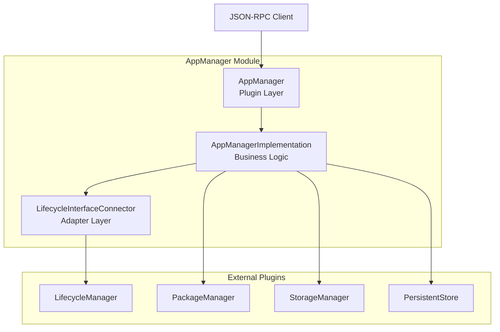
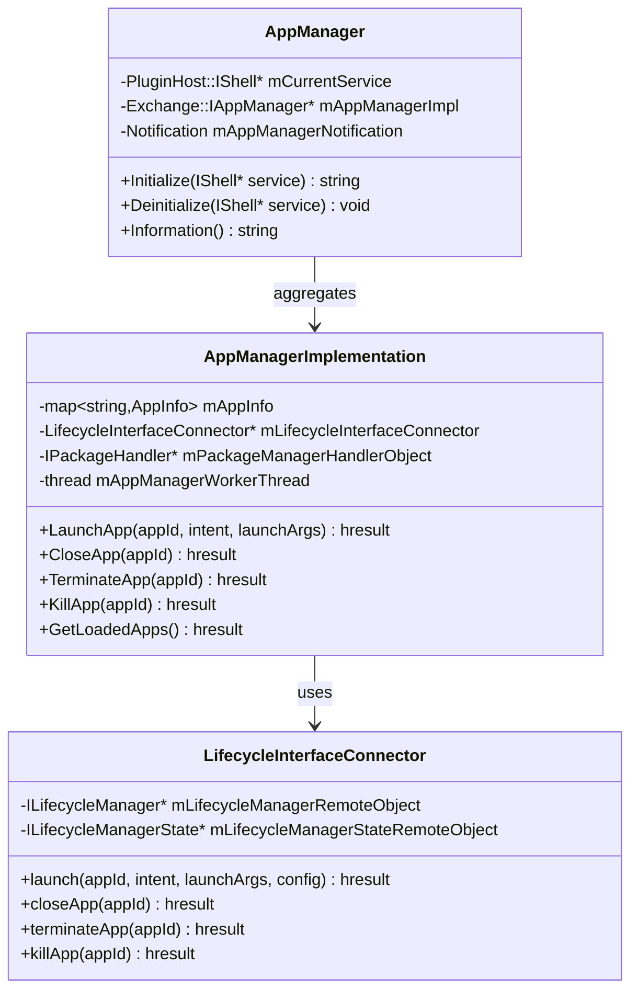
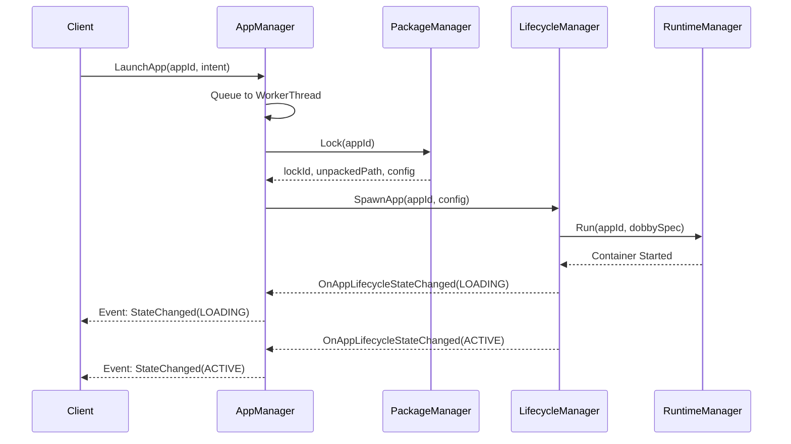
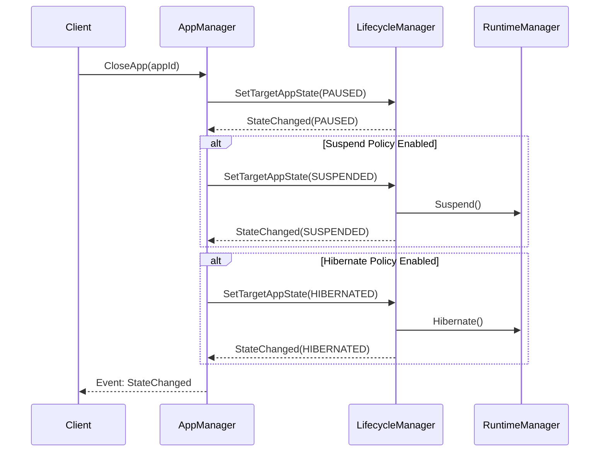
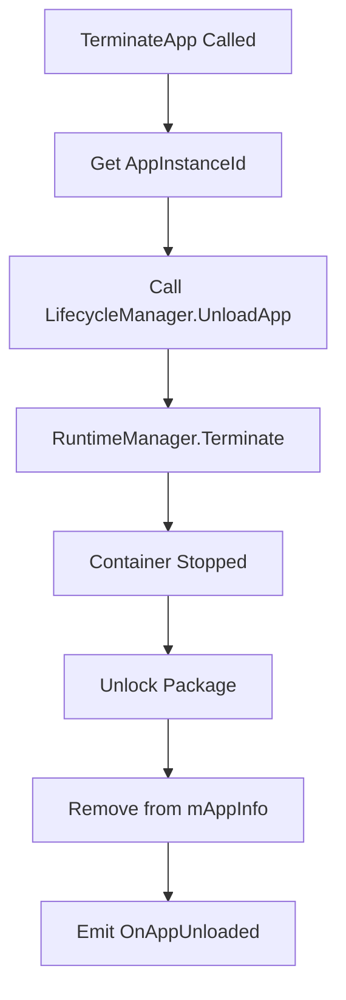

# AppManager Module

> Primary API for Application Lifecycle Management

[← Back to Main](../README.md)

---

## Purpose & Role

The **AppManager** is the primary entry point for all application lifecycle operations in the ENT Services infrastructure. It provides a unified JSON-RPC API for launching, managing, and terminating applications on RDK-based devices.

### Core Responsibilities

- **Application Launch:** Coordinate package locking, container creation, and display allocation
- **State Management:** Track loaded applications and their lifecycle states
- **App Close/Terminate:** Graceful and forceful application shutdown
- **Property Storage:** Get/Set application properties via PersistentStore
- **Event Propagation:** Notify clients of lifecycle state changes

### Dependencies

| Module | Purpose |
|--------|---------|
| LifecycleManager | State machine for app lifecycle transitions |
| PackageManager | Package lock/unlock during app execution |
| StorageManager | Clear app data operations |
| PersistentStore | App property storage |

---

## Architecture



---

## Class Diagram



---

## File Organization

```
AppManager/
├── AppManager.cpp              Plugin wrapper implementation
├── AppManager.h                Plugin class definition
├── AppManagerImplementation.cpp Business logic implementation
├── AppManagerImplementation.h  Implementation class definition
├── AppManagerTelemetryReporting.cpp Telemetry integration
├── AppManagerTelemetryReporting.h   Telemetry class definition
├── LifecycleInterfaceConnector.cpp  LifecycleManager adapter
├── LifecycleInterfaceConnector.h    Connector class definition
├── Module.cpp                  WPEFramework module registration
├── Module.h                    Module header
├── CMakeLists.txt              Build configuration
├── AppManager.conf.in          Configuration template
└── AppManager.config           Runtime configuration
```

---

## Key Data Structures

```cpp
typedef struct _PackageInfo {
    string version = "";
    uint32_t lockId = 0;
    string unpackedPath = "";
    WPEFramework::Exchange::RuntimeConfig configMetadata;
    string appMetadata = "";
    ApplicationType type;
} PackageInfo;

typedef struct _AppInfo {
    string appInstanceId;
    string activeSessionId;
    PackageInfo packageInfo;
    Exchange::IAppManager::AppLifecycleState appNewState;
    Exchange::ILifecycleManager::LifecycleState appLifecycleState;
    timespec lastActiveStateChangeTime;
    uint32_t lastActiveIndex;
    string appIntent;
    Exchange::IAppManager::AppLifecycleState targetAppState;
    Exchange::IAppManager::AppLifecycleState appOldState;
    CurrentAction currentAction;
} AppInfo;
```

---

## API Reference

### IAppManager Interface Methods

| Method | Purpose |
|--------|---------|
| `LaunchApp(appId, intent, launchArgs)` | Launch an application by appId |
| `CloseApp(appId)` | Move app from ACTIVE to background |
| `TerminateApp(appId)` | Clean shutdown of application |
| `KillApp(appId)` | Force terminate application |
| `PreloadApp(appId, launchArgs)` | Preload app in background (PAUSED state) |
| `GetLoadedApps()` | Get list of currently loaded applications |
| `GetInstalledApps()` | Get list of installed application packages |
| `IsInstalled(appId)` | Check if app package is installed |
| `GetAppProperty(appId, key)` | Get app property from PersistentStore |
| `SetAppProperty(appId, key, value)` | Set app property in PersistentStore |
| `ClearAppData(appId)` | Clear storage for specific app |
| `ClearAllAppData()` | Clear storage for all apps |

---

## Workflows

### Application Launch Sequence



### Application Close Sequence



### Application Terminate Flow



---

## Events

### OnAppLifecycleStateChanged

Emitted when an application's lifecycle state changes.

```json
{
    "appId": "com.example.app",
    "appInstanceId": "instance-uuid",
    "newState": "ACTIVE",
    "oldState": "LOADING",
    "errorReason": "APP_ERROR_NONE"
}
```

### Other Events

| Event | Description |
|-------|-------------|
| `OnAppInstalled` | Application package installed |
| `OnAppUninstalled` | Application package uninstalled |
| `OnAppUnloaded` | Application fully unloaded |
| `OnAppLaunchRequest` | External launch request received |

---

## Configuration

### Build Configuration (CMakeLists.txt)

| Option | Default | Description |
|--------|---------|-------------|
| `PLUGIN_APP_MANAGER_MODE` | "Off" | Process mode: Off/Local/Remote |
| `PLUGIN_APP_MANAGER_AUTOSTART` | false | Auto-start on system boot |
| `AIMANAGERS_TELEMETRY_METRICS_SUPPORT` | OFF | Enable telemetry reporting |

### Runtime Policy Files

| File | Purpose |
|------|---------|
| `/tmp/AI2.0Suspendable` | Enables SUSPENDED state on close |
| `/tmp/AI2.0Hibernatable` | Enables HIBERNATED state on close |

---

## Error Handling

### Error Codes (AppErrorReason)

| Error | Description | Recovery |
|-------|-------------|----------|
| `APP_ERROR_NONE` | Success | N/A |
| `APP_ERROR_NOT_INSTALLED` | Package not installed | Install package first |
| `APP_ERROR_PACKAGE_LOCK` | Failed to lock package | Check PackageManager |
| `APP_ERROR_CREATE_DISPLAY` | Display creation failed | Check WindowManager |
| `APP_ERROR_DOBBY_SPEC` | Container spec generation failed | Check RuntimeManager logs |
| `APP_ERROR_INVALID_PARAM` | Invalid parameter | Fix input parameters |
| `APP_ERROR_ABORT` | App crashed | Check app logs |

### Telemetry Markers

| Marker | Description |
|--------|-------------|
| `OverallLaunchTime_split` | Time from launch request to ACTIVE |
| `AppLaunchError_split` | Launch failure with error code |
| `AppCloseTime_split` | Time from close request to completion |
| `AppCrashed_split` | App crash detected |

---

[← Back to Main](../README.md) | [Next: LifecycleManager →](./LifecycleManager.md)

