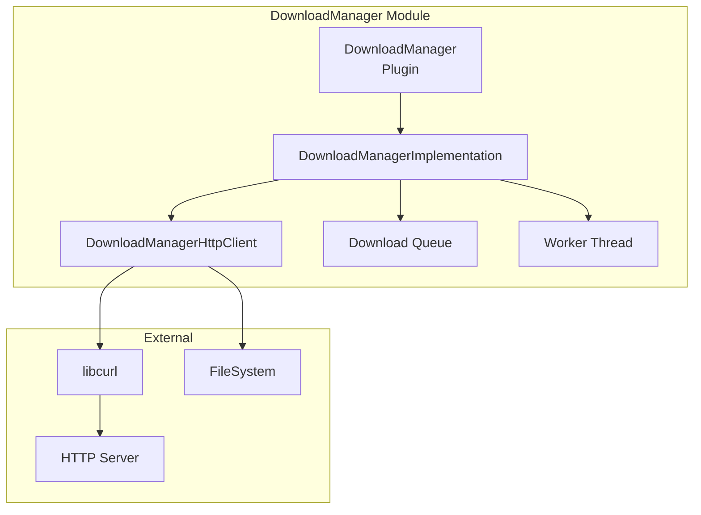
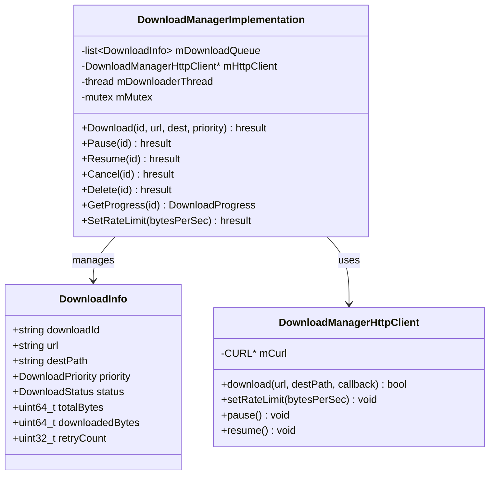
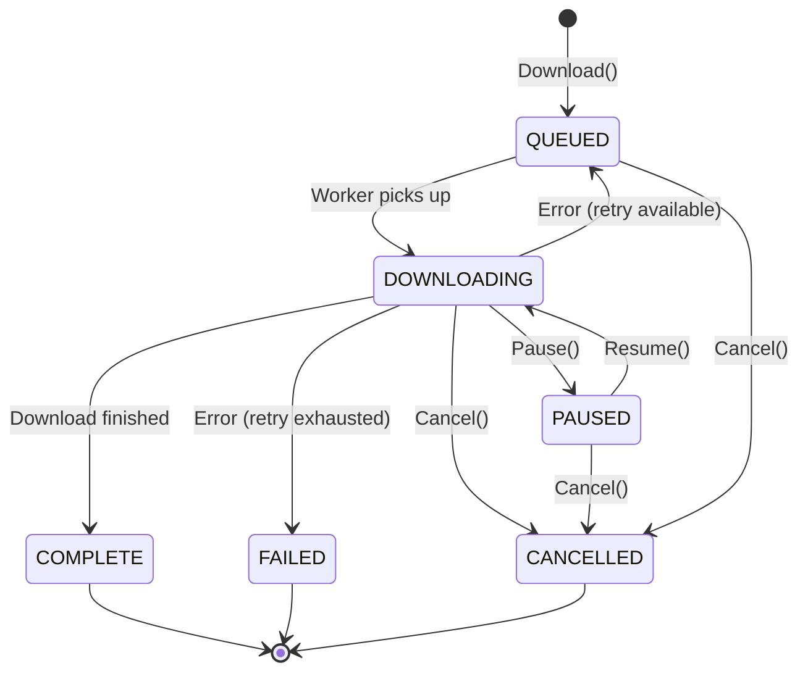

# DownloadManager Module

> HTTP Download Service with Queue Management

[← Back to Main](./README.md) | [← Previous: PackageManager](./PackageManager.md)

---

## Purpose & Role

The **DownloadManager** provides HTTP download services with advanced features like priority queuing, pause/resume, rate limiting, progress reporting, and automatic retry.

### Core Responsibilities

- **HTTP Downloads:** Download files via libcurl
- **Queue Management:** Priority-based download queue
- **Pause/Resume:** Support download interruption and continuation
- **Rate Limiting:** Control bandwidth usage
- **Progress Reporting:** Real-time download progress events
- **Retry Logic:** Automatic retry on transient failures

---

## Architecture



---

## Class Diagram



---

## File Organization

```
DownloadManager/
├── DownloadManager.cpp            Plugin wrapper
├── DownloadManager.h              Plugin class definition
├── DownloadManagerImplementation.cpp Core implementation
├── DownloadManagerImplementation.h   Implementation class
├── DownloadManagerHttpClient.cpp  libcurl HTTP client
├── DownloadManagerHttpClient.h    HTTP client class
├── Module.cpp/h                   Module registration
├── CMakeLists.txt                 Build configuration
└── DownloadManager.config         Runtime configuration
```

---

## Key Data Structures

```cpp
struct DownloadInfo {
    string downloadId;
    string url;
    string destPath;
    DownloadPriority priority;
    DownloadStatus status;  // QUEUED, DOWNLOADING, PAUSED, COMPLETE, FAILED
    uint64_t totalBytes;
    uint64_t downloadedBytes;
    uint32_t retryCount;
    uint32_t maxRetries;
};

enum DownloadPriority {
    LOW = 0,
    NORMAL = 1,
    HIGH = 2
};
```

---

## API Reference

### IDownloadManager Interface

| Method | Purpose |
|--------|---------|
| `Download(downloadId, url, destPath, priority)` | Queue a new download |
| `Pause(downloadId)` | Pause an active download |
| `Resume(downloadId)` | Resume a paused download |
| `Cancel(downloadId)` | Cancel a download |
| `Delete(downloadId)` | Delete a completed download file |
| `GetProgress(downloadId)` | Get current download progress |
| `SetRateLimit(bytesPerSecond)` | Set global download rate limit |

---

## Download State Machine



---

## Features

### Priority Queue

Downloads are processed based on priority:

| Priority | Value | Use Case |
|----------|-------|----------|
| HIGH | 2 | User-initiated downloads, critical updates |
| NORMAL | 1 | Standard app package downloads |
| LOW | 0 | Background prefetch, optional content |

### Retry Logic

- Configurable max retry count (default: 3)
- Exponential backoff between retries
- Only retries transient errors (network, timeout)
- Non-transient errors (404, 403) fail immediately

### Rate Limiting

Uses libcurl's `CURLOPT_MAX_RECV_SPEED_LARGE` for bandwidth throttling.

---

## Events

### OnDownloadStatusChanged

Emitted on status changes (started, paused, resumed, completed, failed).

```json
{
    "downloadId": "pkg-12345",
    "status": "COMPLETE",
    "url": "https://example.com/app.tar.gz",
    "destPath": "/tmp/downloads/app.tar.gz"
}
```

### OnDownloadProgress

Emitted periodically during active download.

```json
{
    "downloadId": "pkg-12345",
    "downloadedBytes": 52428800,
    "totalBytes": 104857600,
    "percentComplete": 50
}
```

---

## Threading Model

DownloadManager uses a dedicated worker thread (`downloaderRoutine`) that:

1. Picks highest priority download from queue
2. Executes download via HttpClient
3. Reports progress via notifications
4. Handles pause/resume/cancel requests

---

[← Back to Main](./README.md) | [Next: StorageManager →](./StorageManager.md)

