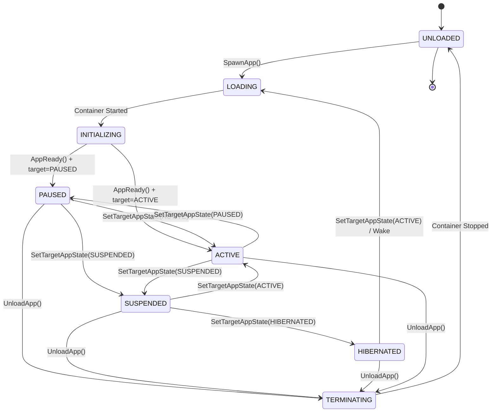
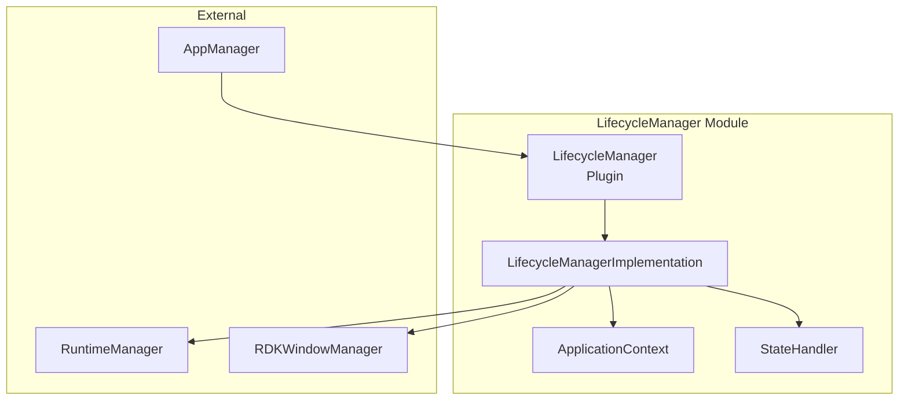
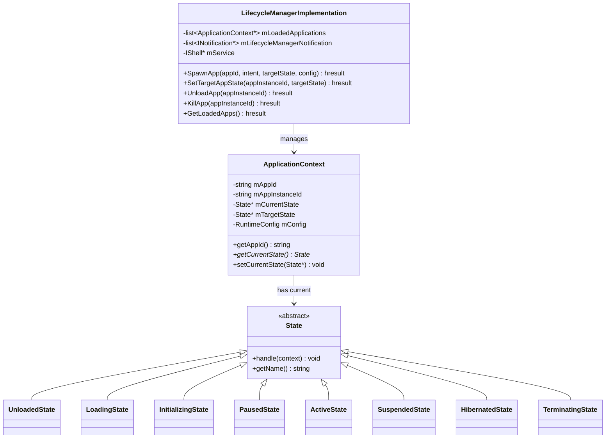
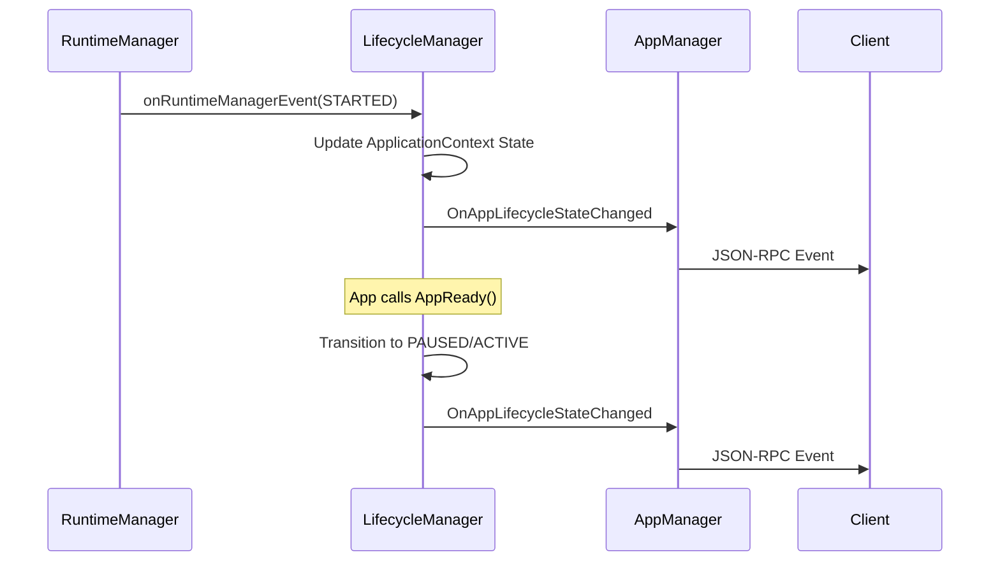

# LifecycleManager Module

> Application Lifecycle State Machine

[← Back to Main](../README.md) | [← Previous: AppManager](./AppManager.md)

---

## Purpose & Role

The **LifecycleManager** implements a state machine for managing application lifecycle transitions. It coordinates with RuntimeManager for container operations and RDKWindowManager for display management.

### Core Responsibilities

- Maintain per-application state (ApplicationContext)
- Validate and execute state transitions
- Coordinate with RuntimeManager for container operations
- Coordinate with WindowManager for display operations
- Emit state change notifications

### Dependencies

| Module | Purpose |
|--------|---------|
| RuntimeManager | Container run, suspend, resume, hibernate, terminate |
| RDKWindowManager | Display creation and destruction |

---

## Lifecycle States

| State | Value | Description |
|-------|-------|-------------|
| `UNLOADED` | 0 | Application not running, no resources allocated |
| `LOADING` | 1 | Container starting, resources being allocated |
| `INITIALIZING` | 2 | App performing initialization (not yet ready) |
| `PAUSED` | 3 | App loaded but hidden (display not visible) |
| `ACTIVE` | 4 | App visible and interactive (has focus) |
| `SUSPENDED` | 5 | App paused with reduced resources (SIGSTOP) |
| `HIBERNATED` | 6 | App state checkpointed to disk, container stopped |
| `TERMINATING` | 7 | App shutting down, cleanup in progress |

---

## State Diagram



---

## Architecture



---

## Class Hierarchy



---

## File Organization

```
LifecycleManager/
├── LifecycleManager.cpp           Plugin wrapper
├── LifecycleManager.h             Plugin class definition
├── LifecycleManagerImplementation.cpp State machine implementation
├── LifecycleManagerImplementation.h   Implementation class
├── ApplicationContext.cpp         Per-app context
├── ApplicationContext.h           Context class definition
├── State.cpp                      State class implementations
├── State.h                        State hierarchy
├── StateHandler.cpp               State transition handlers
├── StateHandler.h                 Handler class definitions
├── StateTransitionHandler.cpp     Transition orchestration
├── StateTransitionHandler.h       Transition handler class
├── StateTransitionRequest.h       Request data structure
├── RequestHandler.cpp             Incoming request processing
├── RequestHandler.h               Request handler class
├── RuntimeManagerHandler.cpp      RuntimeManager integration
├── RuntimeManagerHandler.h        Runtime handler class
├── WindowManagerHandler.cpp       WindowManager integration
├── WindowManagerHandler.h         Window handler class
├── IEventHandler.h                Event handler interface
├── Module.cpp/h                   Module registration
├── CMakeLists.txt                 Build configuration
└── LifecycleManager.config        Runtime configuration
```

---

## API Reference

### ILifecycleManager Interface

| Method | Purpose |
|--------|---------|
| `SpawnApp(appId, launchIntent, targetState, config, launchArgs)` | Create new application instance and start container |
| `SetTargetAppState(appInstanceId, targetState, launchIntent)` | Request state transition for existing app |
| `UnloadApp(appInstanceId)` | Clean shutdown of application (graceful termination) |
| `KillApp(appInstanceId)` | Force terminate application (SIGKILL) |
| `GetLoadedApps(verbose)` | Get JSON list of loaded applications |
| `IsAppLoaded(appId)` | Check if app is currently loaded |

### ILifecycleManagerState Interface

| Method | Purpose |
|--------|---------|
| `AppReady(appId)` | Called by app when initialization complete |
| `StateChangeComplete(appId, stateChangedId, success)` | Called by app to acknowledge state change |
| `CloseApp(appId, reason)` | App requests to close itself |

---

## State Transition Flow

```mermaid
flowchart TB
    subgraph "Launch Flow"
        A1[SpawnApp Called] --> A2[Create ApplicationContext]
        A2 --> A3[Create DobbySpec]
        A3 --> A4[Call RuntimeManager.Run]
        A4 --> A5[Set State = LOADING]
        A5 --> A6[Container Started Event]
        A6 --> A7[Set State = INITIALIZING]
        A7 --> A8[Wait for AppReady]
        A8 --> A9{Target State?}
        A9 -->|PAUSED| A10[Set State = PAUSED]
        A9 -->|ACTIVE| A11[Set State = ACTIVE]
    end

    subgraph "Background Flow"
        B1[SetTargetState SUSPENDED] --> B2[Call RuntimeManager.Suspend]
        B2 --> B3[Set State = SUSPENDED]
        B3 --> B4[SetTargetState HIBERNATED]
        B4 --> B5[Call RuntimeManager.Hibernate]
        B5 --> B6[Set State = HIBERNATED]
    end

    subgraph "Wake Flow"
        C1[SetTargetState ACTIVE from HIBERNATED] --> C2[Call RuntimeManager.Wake]
        C2 --> C3[Container Restored]
        C3 --> C4[Set State = ACTIVE]
    end
```



---

## Event Flow



---

## Valid State Transitions

| From | To | Trigger |
|------|-----|---------|
| UNLOADED | LOADING | SpawnApp() |
| LOADING | INITIALIZING | Container started |
| INITIALIZING | PAUSED | AppReady() + target=PAUSED |
| INITIALIZING | ACTIVE | AppReady() + target=ACTIVE |
| PAUSED | ACTIVE | SetTargetAppState(ACTIVE) |
| ACTIVE | PAUSED | SetTargetAppState(PAUSED) |
| PAUSED | SUSPENDED | SetTargetAppState(SUSPENDED) |
| ACTIVE | SUSPENDED | SetTargetAppState(SUSPENDED) |
| SUSPENDED | ACTIVE | SetTargetAppState(ACTIVE) |
| SUSPENDED | HIBERNATED | SetTargetAppState(HIBERNATED) |
| HIBERNATED | ACTIVE | SetTargetAppState(ACTIVE) |
| * | TERMINATING | UnloadApp() |
| TERMINATING | UNLOADED | Container stopped |

---

## Event Handlers

### IEventHandler Methods

| Method | Purpose |
|--------|---------|
| `onRuntimeManagerEvent()` | Container state changes |
| `onWindowManagerEvent()` | Display events |
| `onRippleEvent()` | Firebolt events |
| `onStateChangeEvent()` | Internal state change events |

### Notification: OnAppLifecycleStateChanged

Emitted on every state transition with:
- `appId`
- `appInstanceId`
- `oldState`
- `newState`
- `navigationIntent`

---

[← Back to Main](../README.md) | [Next: RuntimeManager →](./RuntimeManager.md)

