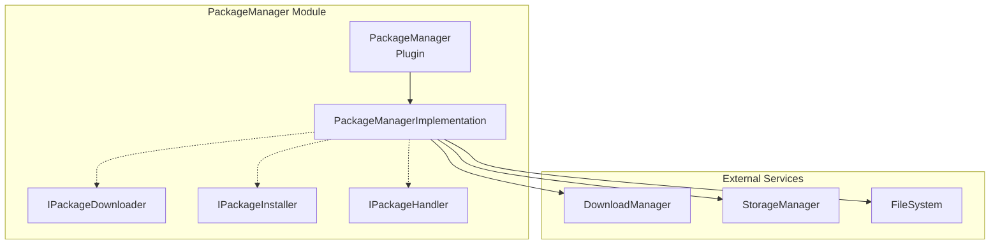
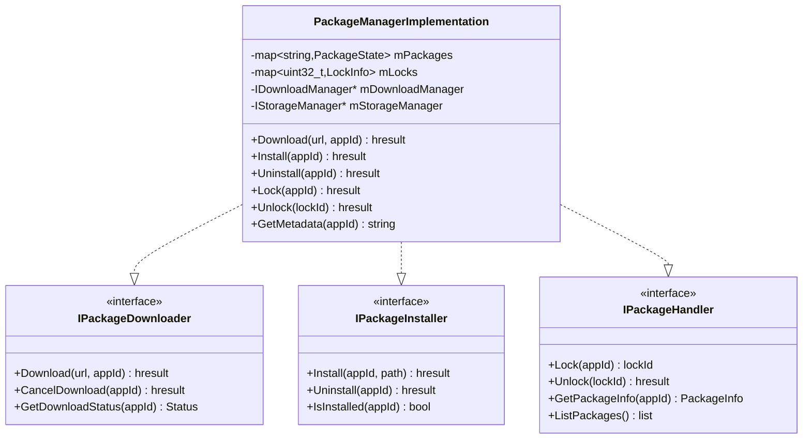
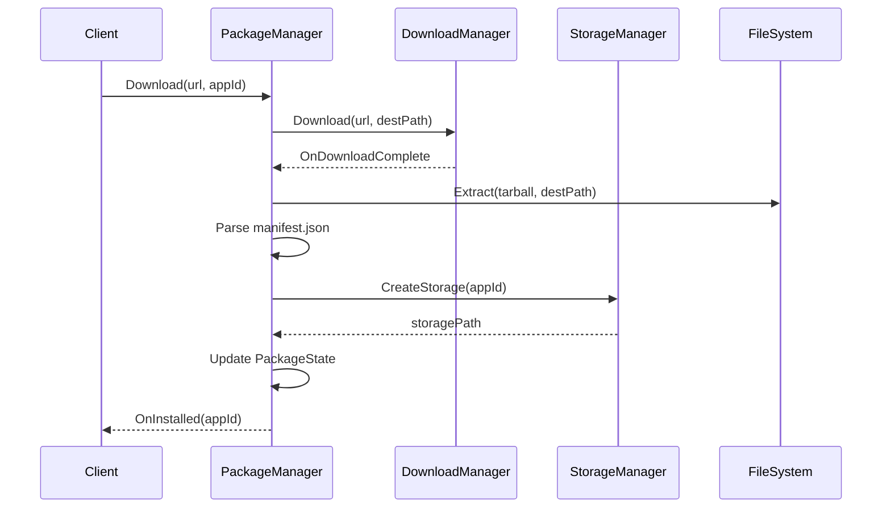
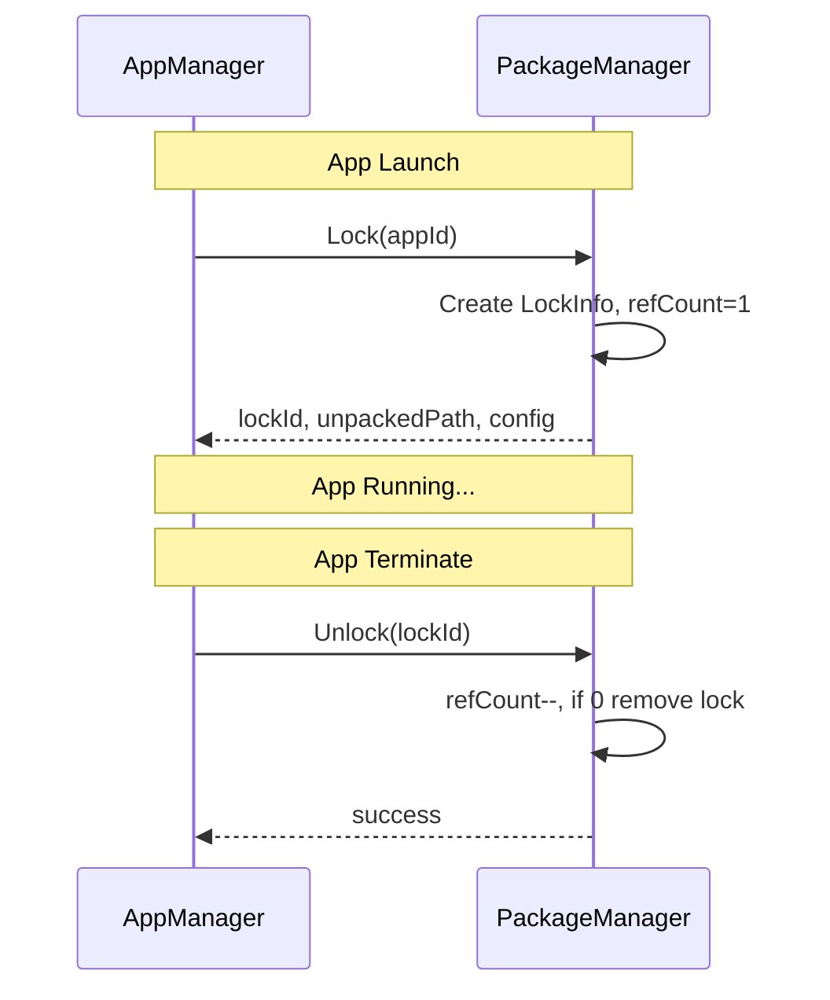
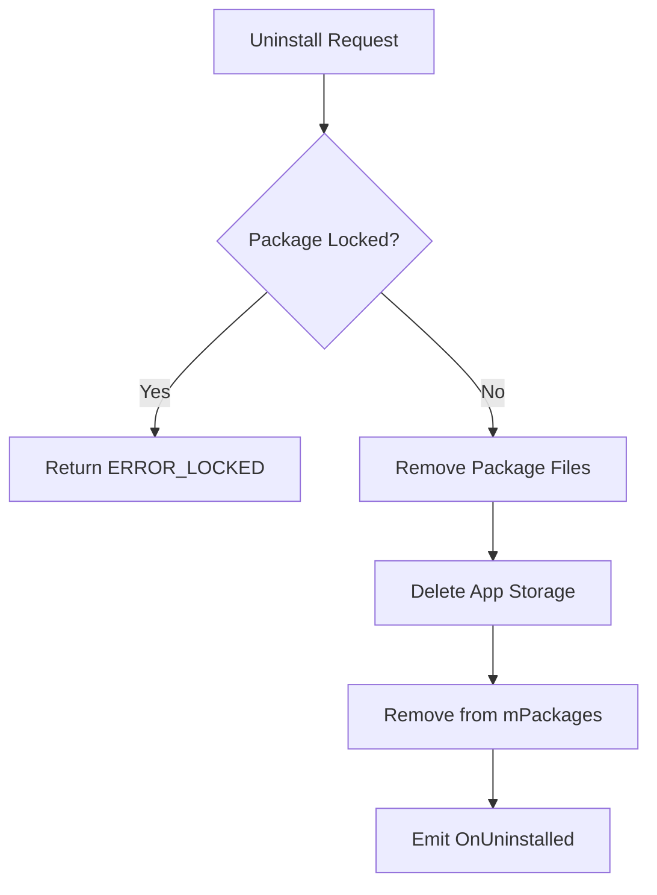

# PackageManager Module

> Application Package Lifecycle Management

[← Back to Main](./README.md) | [← Previous: RuntimeManager](./RuntimeManager.md)

---

## Purpose & Role

The **PackageManager** handles the complete lifecycle of application packages including download, installation, extraction, metadata parsing, locking during execution, and uninstallation.

### Core Responsibilities

- **Package Download:** Coordinate with DownloadManager for HTTP downloads
- **Installation:** Extract packages, parse manifests, setup storage
- **Package Locking:** Prevent uninstall while app is running
- **Metadata Management:** Parse and serve app configuration
- **Uninstallation:** Clean removal of packages and storage

### Dependencies

| Module | Purpose |
|--------|---------|
| DownloadManager | HTTP download operations |
| StorageManager | App storage allocation |

---

## Architecture



---

## Class Diagram



---

## File Organization

```
PackageManager/
├── PackageManager.cpp             Plugin wrapper
├── PackageManager.h               Plugin class definition
├── PackageManagerImplementation.cpp Core implementation
├── PackageManagerImplementation.h   Implementation class
├── HttpClient.cpp                 HTTP download client
├── HttpClient.h                   HTTP client class
├── Module.cpp/h                   Module registration
├── CMakeLists.txt                 Build configuration
└── PackageManager.conf.in         Configuration template
```

---

## Key Data Structures

```cpp
struct PackageState {
    string appId;
    string version;
    string installedPath;
    string downloadPath;
    PackageStatus status; // DOWNLOADING, INSTALLED, etc.
    RuntimeConfig config;
    string appMetadata;
};

struct LockInfo {
    uint32_t lockId;
    string appId;
    uint32_t refCount;
};
```

---

## API Reference

### IPackageDownloader Interface

| Method | Purpose |
|--------|---------|
| `Download(url, appId, downloadLocation)` | Download package from URL |
| `CancelDownload(appId)` | Cancel in-progress download |
| `GetDownloadStatus(appId)` | Get download progress |

### IPackageInstaller Interface

| Method | Purpose |
|--------|---------|
| `Install(appId, packagePath, appMetadata)` | Install package: extract, parse manifest, create storage |
| `Uninstall(appId)` | Uninstall package: remove files, cleanup storage |
| `IsInstalled(appId)` | Check if package is installed |

### IPackageHandler Interface

| Method | Purpose |
|--------|---------|
| `Lock(appId)` | Lock package to prevent uninstall during app execution |
| `Unlock(lockId)` | Release package lock after app terminates |
| `GetMetadata(appId)` | Get application metadata JSON |
| `ListPackages()` | List all installed packages |

---

## Workflows

### Package Installation Flow



### Package Lock/Unlock Flow



### Package Uninstall Flow



---

## Package Locking

Package locking prevents uninstallation while an application is running. When AppManager launches an app, it first locks the package. The lock is released when the app terminates.

### Lock States

| Scenario | Lock Count | Uninstall Allowed |
|----------|------------|-------------------|
| No app running | 0 | Yes |
| One app instance | 1 | No |
| Multiple instances | N | No |

> **Important:** Always ensure `Unlock()` is called in all termination paths (normal, crash, kill) to prevent package lock leaks.

---

[← Back to Main](./README.md) | [Next: DownloadManager →](./DownloadManager.md)

