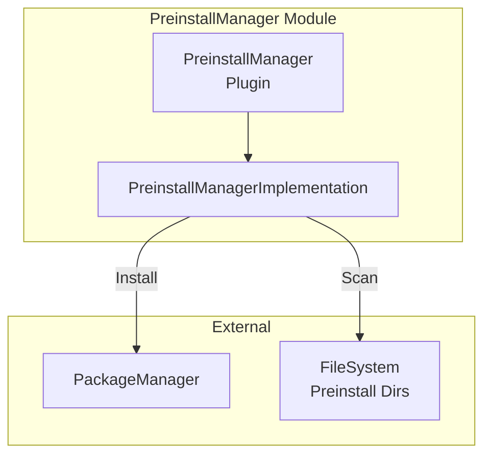
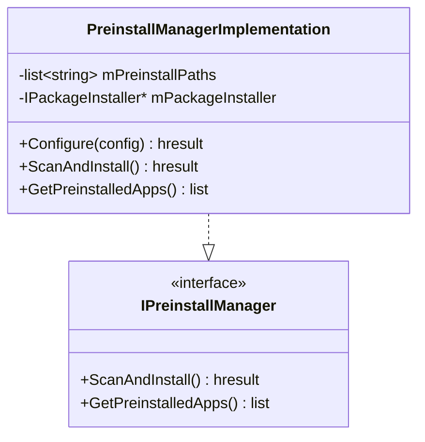
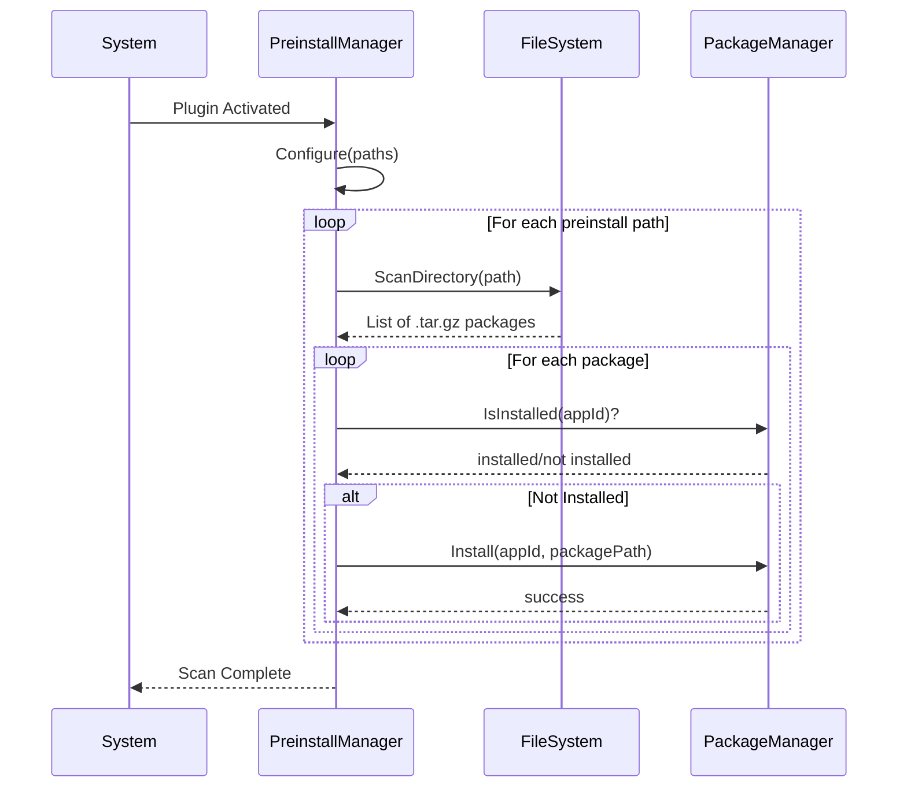
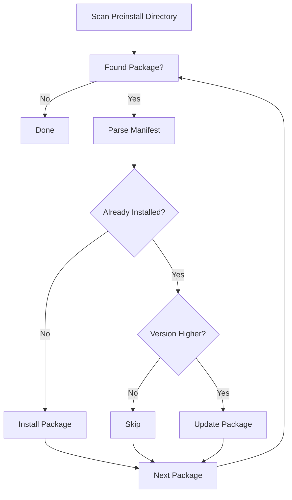

# PreinstallManager Module

> Pre-installed Application Management

[← Back to Main](../README.md) | [← Previous: StorageManager](./StorageManager.md)

---

## Purpose & Role

The **PreinstallManager** handles applications that are pre-installed on the device image. It scans configured directories for preinstalled packages and triggers their installation through PackageManager on system startup.

### Core Responsibilities

- **Directory Scanning:** Scan preinstall directories for app packages
- **Package Detection:** Identify new preinstalled packages
- **Installation Trigger:** Request PackageManager to install packages
- **Version Management:** Handle preinstalled app updates

### Dependencies

| Module | Purpose |
|--------|---------|
| PackageManager | Package installation |

---

## Architecture



---

## Class Diagram



---

## File Organization

```
PreinstallManager/
├── PreinstallManager.cpp          Plugin wrapper
├── PreinstallManager.h            Plugin class definition
├── PreinstallManagerImplementation.cpp Core implementation
├── PreinstallManagerImplementation.h   Implementation class
├── Module.cpp/h                   Module registration
├── CMakeLists.txt                 Build configuration
└── PreinstallManager.config       Runtime configuration
```

---

## API Reference

### IPreinstallManager Interface

| Method | Purpose |
|--------|---------|
| `ScanAndInstall()` | Scan preinstall directories and install found packages |
| `GetPreinstalledApps()` | Get list of preinstalled application IDs |

---

## Startup Scan Flow



---

## Preinstall Decision Flow



---

## Preinstall Directory Structure

```
/opt/preinstall/
├── com.app.one/
│   ├── manifest.json
│   ├── bundle.tar.gz
│   └── metadata.json
├── com.app.two/
│   ├── manifest.json
│   ├── bundle.tar.gz
│   └── metadata.json
└── ...
```

---

## Configuration

Loaded from `PreinstallManager.config`:

| Parameter | Description |
|-----------|-------------|
| `preinstallpaths` | List of directories containing preinstalled packages |

---

[← Back to Main](../README.md) | [Next: RDKWindowManager →](./RDKWindowManager.md)

