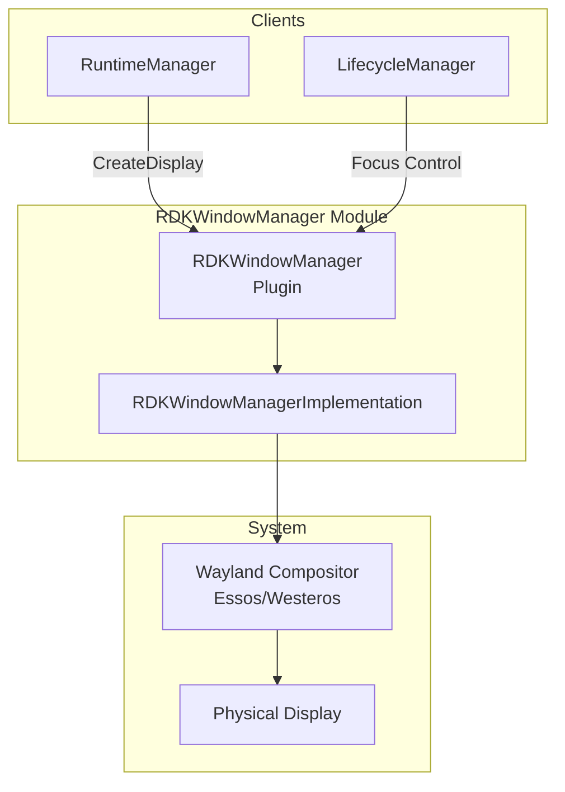
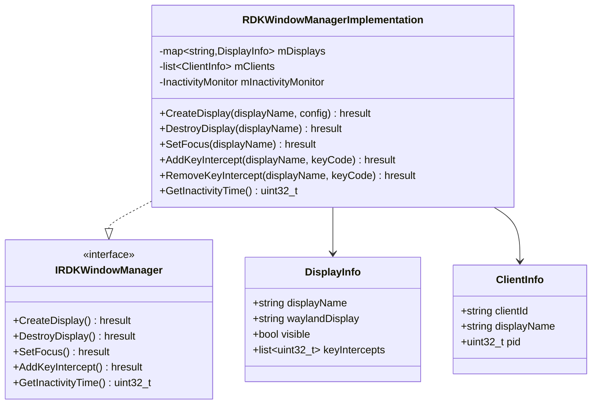
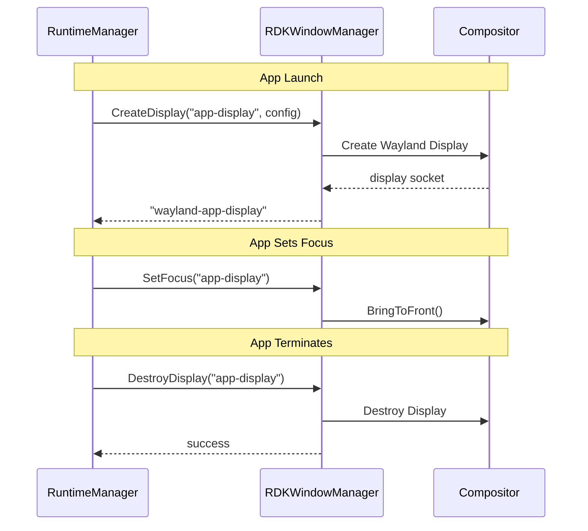
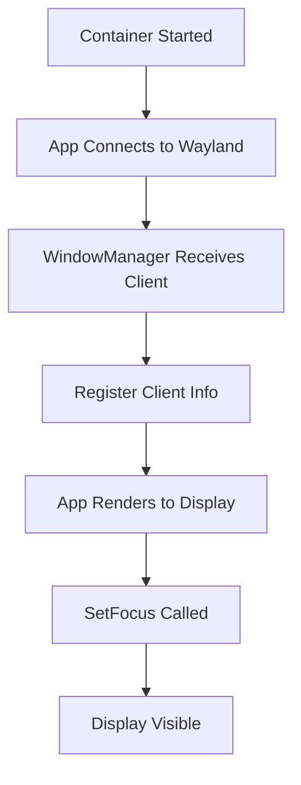

# RDKWindowManager Module

> Display & Window Management for RDK Platform

[← Back to Main](./README.md) | [← Previous: PreinstallManager](./PreinstallManager.md)

---

## Purpose & Role

The **RDKWindowManager** manages Wayland display creation, client interactions, key intercepts, focus control, and user inactivity detection for applications running on RDK platform.

### Core Responsibilities

- **Display Management:** Create/destroy Wayland displays for apps
- **Client Management:** Track connected Wayland clients
- **Key Intercepts:** Configure key interception for apps
- **Focus Control:** Manage window focus and visibility
- **Inactivity Detection:** Report user inactivity periods

### Dependencies

| Module | Purpose |
|--------|---------|
| Compositor (Essos/Westeros) | Wayland compositor backend |

---

## Architecture



---

## Class Diagram



---

## File Organization

```
RDKWindowManager/
├── RDKWindowManager.cpp           Plugin wrapper
├── RDKWindowManager.h             Plugin class definition
├── RDKWindowManagerImplementation.cpp Core implementation
├── RDKWindowManagerImplementation.h   Implementation class
├── Module.cpp/h                   Module registration
├── CMakeLists.txt                 Build configuration
└── RDKWindowManager.config        Runtime configuration
```

---

## API Reference

### IRDKWindowManager Interface

| Method | Purpose |
|--------|---------|
| `CreateDisplay(displayName, config)` | Create a new Wayland display for an application |
| `DestroyDisplay(displayName)` | Destroy a Wayland display when app terminates |
| `SetFocus(displayName)` | Give focus to a specific display/application |
| `AddKeyIntercept(displayName, keyCode)` | Add key code to intercept list for app |
| `RemoveKeyIntercept(displayName, keyCode)` | Remove key code from intercept list |
| `GetInactivityTime()` | Get time since last user input |

---

## Display Lifecycle



---

## Key Intercept

Allows applications to receive specific key events even when not focused:

| Key Code | Common Use |
|----------|------------|
| KEY_HOME | Return to launcher |
| KEY_BACK | Navigation back |
| KEY_MENU | Options menu |
| KEY_POWER | Power management |

---

## Inactivity Monitoring

Tracks time since last user input for:

- Screen saver activation
- Power saving mode
- Auto-suspend of background apps

---

## Client Connection Flow



---

[← Back to Main](./README.md) | [Next: TelemetryMetrics →](./TelemetryMetrics.md)

