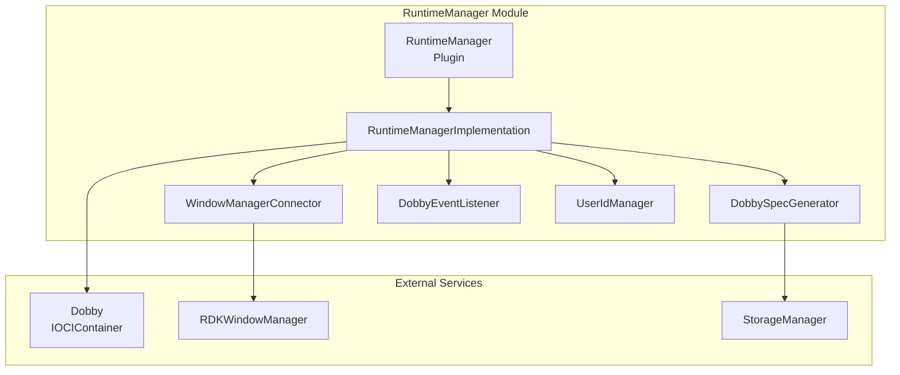
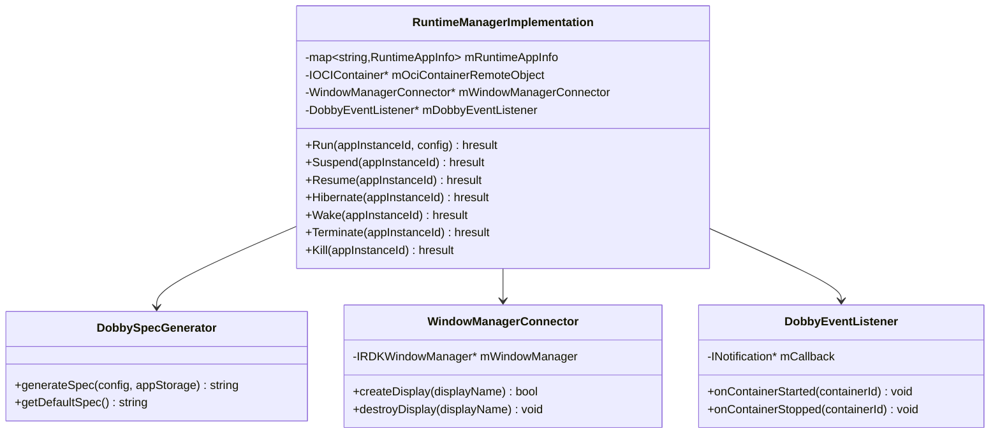
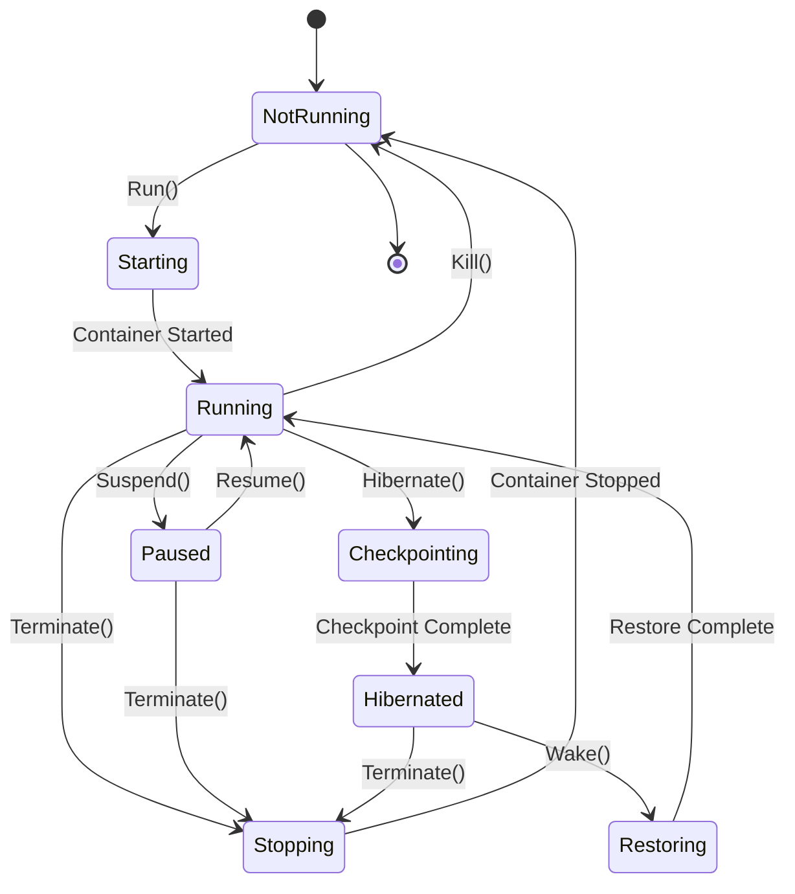
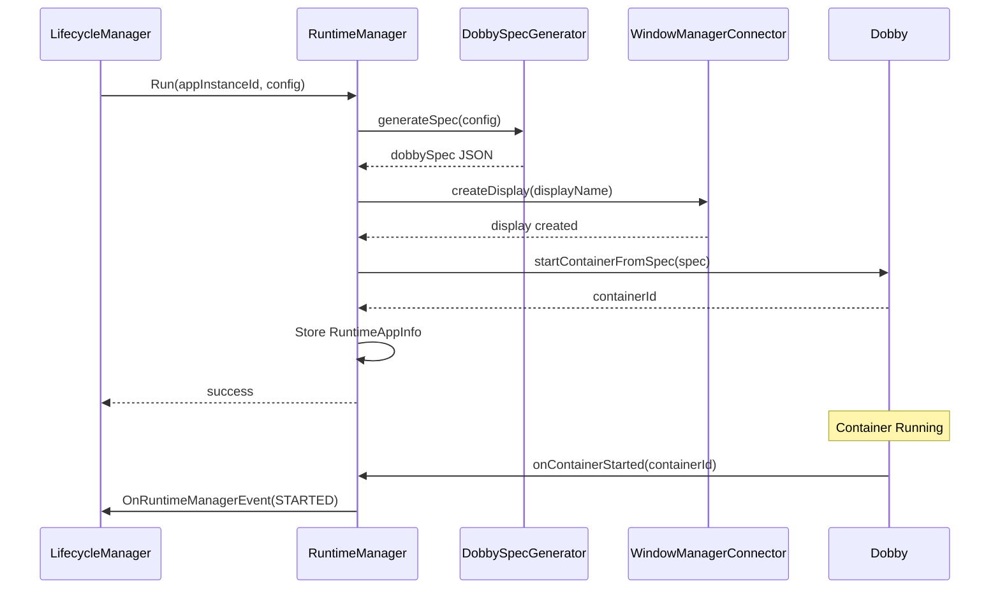
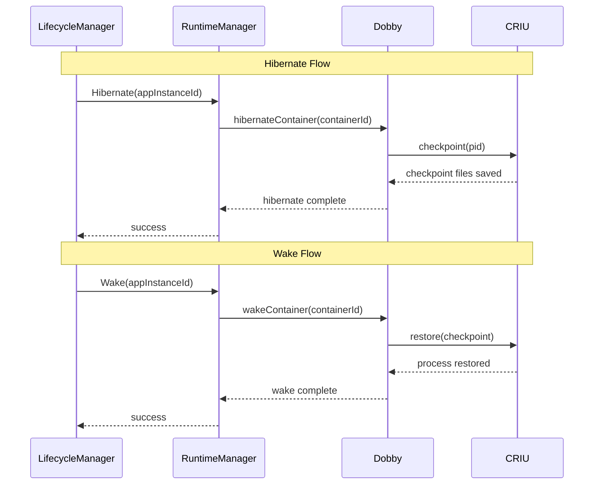

# RuntimeManager Module

> Container Runtime & Execution Management

[← Back to Main](../README.md) | [← Previous: LifecycleManager](./LifecycleManager.md)

---

## Purpose & Role

The **RuntimeManager** manages OCI container lifecycle using Dobby. It handles application execution, suspension, hibernation (CRIU checkpoint), wake (restore), and termination.

### Core Responsibilities

- **Container Execution:** Start apps in isolated OCI containers
- **Resource Management:** CPU, memory, network namespace isolation
- **Suspend/Resume:** SIGSTOP/SIGCONT for pausing containers
- **Hibernate/Wake:** CRIU checkpoint/restore for memory efficiency
- **Display Integration:** Coordinate with WindowManager for Wayland

### Dependencies

| Module | Purpose |
|--------|---------|
| Dobby (IOCIContainer) | OCI container runtime |
| RDKWindowManager | Wayland display creation |
| StorageManager | App storage paths |

---

## Architecture



---

## Class Diagram



---

## File Organization

```
RuntimeManager/
├── RuntimeManager.cpp             Plugin wrapper
├── RuntimeManager.h               Plugin class definition
├── RuntimeManagerImplementation.cpp Core implementation
├── RuntimeManagerImplementation.h   Implementation class
├── DobbySpecGenerator.cpp         OCI spec generation
├── DobbySpecGenerator.h           Spec generator class
├── WindowManagerConnector.cpp     WindowManager integration
├── WindowManagerConnector.h       Connector class
├── DobbyEventListener.cpp         Dobby event handling
├── DobbyEventListener.h           Event listener class
├── UserIdManager.cpp              User ID allocation
├── UserIdManager.h                User ID manager class
├── IEventHandler.h                Event handler interface
├── Module.cpp/h                   Module registration
├── CMakeLists.txt                 Build configuration
└── RuntimeManager.config          Runtime configuration
```

---

## Key Data Structures

```cpp
typedef struct _RuntimeAppInfo {
    string appId;
    string appInstanceId;
    int32_t containerId;
    string containerName;
    string displayName;
    RuntimeConfig config;
    ContainerState state;
} RuntimeAppInfo;
```

---

## API Reference

### IRuntimeManager Interface

| Method | Purpose |
|--------|---------|
| `Run(appInstanceId, config)` | Start application in OCI container |
| `Suspend(appInstanceId)` | Pause container (SIGSTOP to all processes) |
| `Resume(appInstanceId)` | Resume suspended container (SIGCONT) |
| `Hibernate(appInstanceId)` | Checkpoint container to disk using CRIU |
| `Wake(appInstanceId)` | Restore container from CRIU checkpoint |
| `Terminate(appInstanceId)` | Graceful container shutdown (SIGTERM + timeout) |
| `Kill(appInstanceId)` | Force kill container (SIGKILL) |

---

## Container Lifecycle



---

## Run Container Sequence



---

## Hibernate/Wake Flow



---

## Dobby Integration

### Dobby Spec Generation

RuntimeManager generates OCI-compliant container specifications including:

| Component | Description |
|-----------|-------------|
| `rootfs` | Application bundle path from PackageManager |
| `mounts` | Bind mounts for storage, Wayland socket, device nodes |
| `env` | WAYLAND_DISPLAY, XDG_RUNTIME_DIR, app-specific vars |
| `cgroups` | Memory limits, CPU shares |
| `namespaces` | PID, network, mount isolation |

### Event Handling

| Dobby Event | RuntimeManager Action |
|-------------|----------------------|
| Container Started | Notify LifecycleManager → LOADING complete |
| Container Stopped | Cleanup display, notify LifecycleManager |
| Container Crashed | Notify with error, cleanup resources |

---

[← Back to Main](../README.md) | [Next: PackageManager →](./PackageManager.md)

