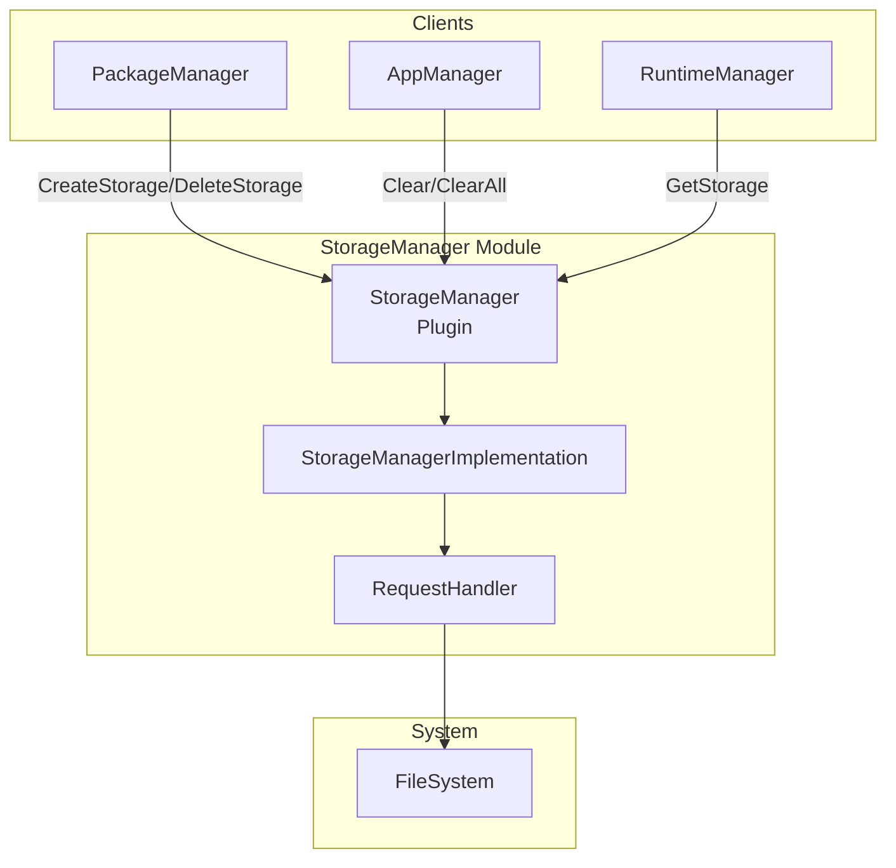
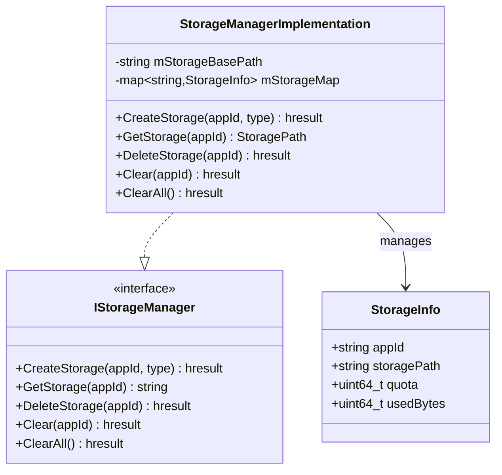
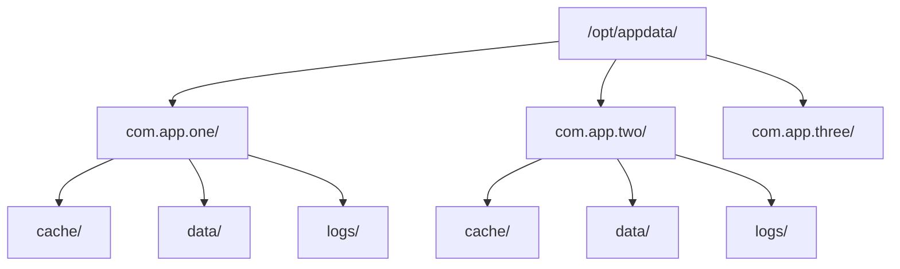
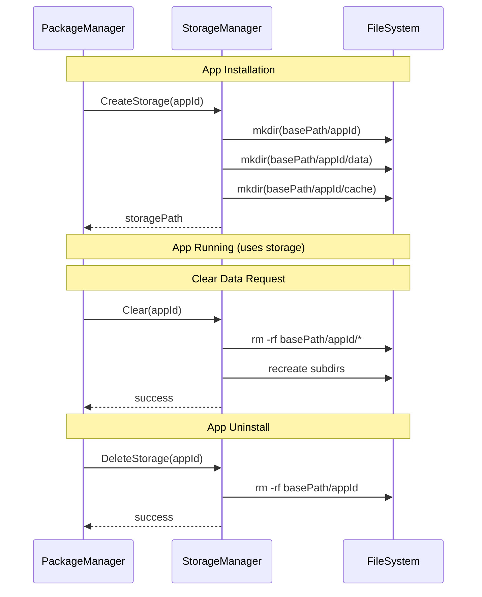

# StorageManager Module

> Application Storage Allocation & Management

[← Back to Main](./README.md) | [← Previous: DownloadManager](./DownloadManager.md)

---

## Purpose & Role

The **StorageManager** provides application-specific persistent storage allocation, management, and cleanup. Each installed app gets a dedicated storage directory with configurable quotas.

### Core Responsibilities

- **Storage Creation:** Allocate app-specific storage directories
- **Storage Query:** Get storage paths for apps
- **Data Clear:** Clear app data while preserving structure
- **Storage Deletion:** Remove storage on app uninstall
- **Quota Management:** Enforce storage limits (if configured)

---

## Architecture



---

## Class Diagram



---

## File Organization

```
StorageManager/
├── StorageManager.cpp             Plugin wrapper
├── StorageManager.h               Plugin class definition
├── StorageManagerImplementation.cpp Core implementation
├── StorageManagerImplementation.h   Implementation class
├── RequestHandler.cpp             File system operations
├── RequestHandler.h               Request handler class
├── Module.cpp/h                   Module registration
├── CMakeLists.txt                 Build configuration
└── StorageManager.config          Runtime configuration
```

---

## API Reference

### IStorageManager Interface

| Method | Purpose |
|--------|---------|
| `CreateStorage(appId, type)` | Create storage directory for an application |
| `GetStorage(appId)` | Get the storage path for an application |
| `DeleteStorage(appId)` | Remove all storage for an application |
| `Clear(appId)` | Clear app data but keep storage allocated |
| `ClearAll()` | Clear data for all applications |

---

## Storage Structure



### Storage Types

| Type | Path | Purpose |
|------|------|---------|
| DATA | `{appId}/data/` | Persistent app data |
| CACHE | `{appId}/cache/` | Cacheable data (may be cleared) |
| LOGS | `{appId}/logs/` | Application logs |

---

## Storage Lifecycle



---

## Configuration

Loaded from `StorageManager.config`:

| Parameter | Default | Description |
|-----------|---------|-------------|
| `storagepath` | `/opt/appdata` | Base storage directory |
| `defaultQuota` | (unlimited) | Default storage quota per app |

---

[← Back to Main](./README.md) | [Next: PreinstallManager →](./PreinstallManager.md)

