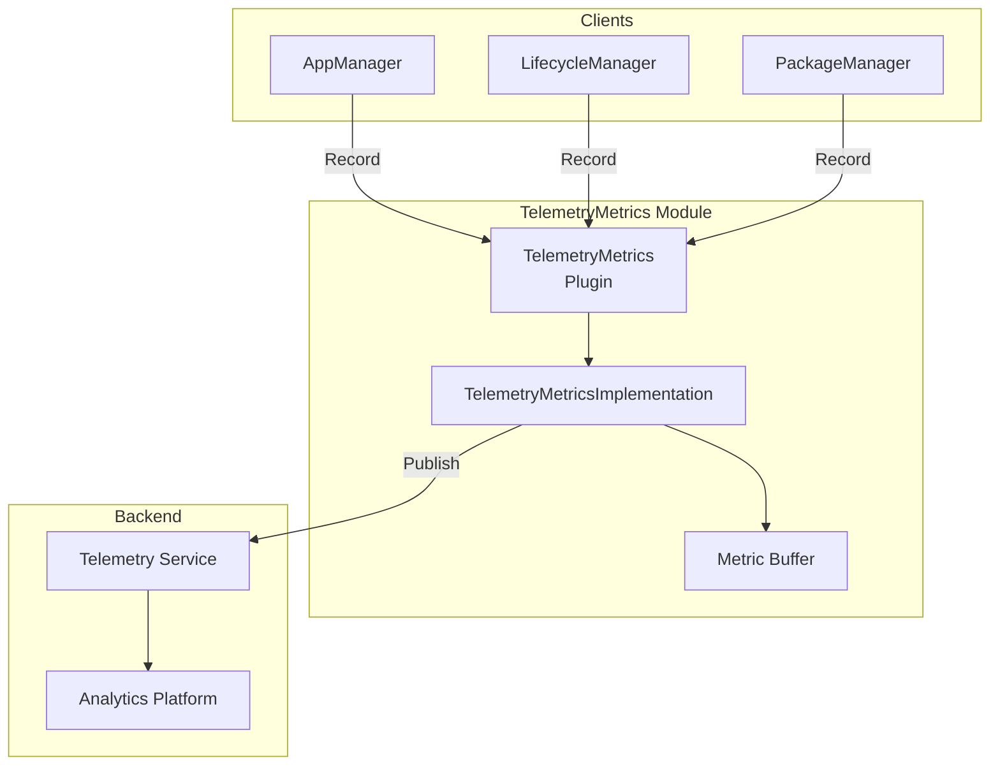
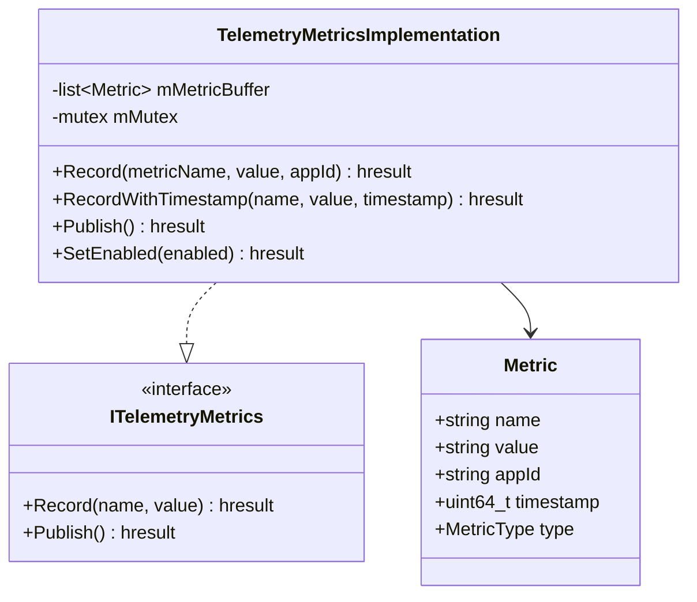
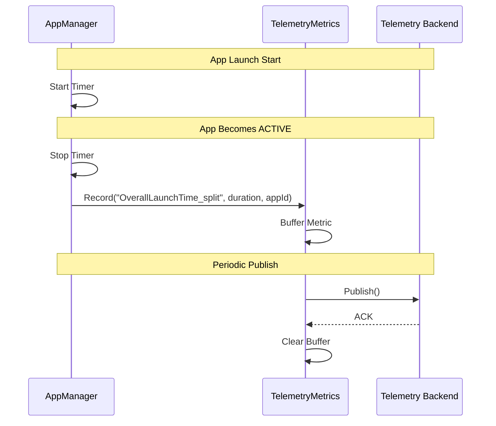
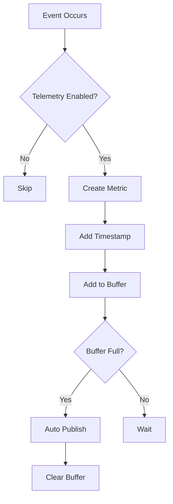

# TelemetryMetrics Module

> Performance Metrics & Analytics Collection

[← Back to Main](../README.md) | [← Previous: RDKWindowManager](./RDKWindowManager.md)

---

## Purpose & Role

The **TelemetryMetrics** module provides telemetry data recording and publishing for performance metrics, operational analytics, and app lifecycle events.

### Core Responsibilities

- **Metric Recording:** Record timestamped metrics
- **Metric Publishing:** Publish metrics to backend
- **Event Correlation:** Correlate metrics with app events
- **Performance Tracking:** Track launch times, response times

### Clients

| Module | Metrics Reported |
|--------|------------------|
| AppManager | Launch time, close time, errors |
| LifecycleManager | State transition times |
| PackageManager | Install/uninstall times |

---

## Architecture



---

## Class Diagram



---

## File Organization

```
TelemetryMetrics/
├── TelemetryMetrics.cpp           Plugin wrapper
├── TelemetryMetrics.h             Plugin class definition
├── TelemetryMetricsImplementation.cpp Core implementation
├── TelemetryMetricsImplementation.h   Implementation class
├── Module.cpp/h                   Module registration
├── CMakeLists.txt                 Build configuration
└── TelemetryMetrics.config        Runtime configuration
```

---

## API Reference

### ITelemetryMetrics Interface

| Method | Purpose |
|--------|---------|
| `Record(metricName, value, appId)` | Record a metric with current timestamp |
| `RecordWithTimestamp(name, value, timestamp)` | Record a metric with specific timestamp |
| `Publish()` | Publish buffered metrics to backend |
| `SetEnabled(enabled)` | Enable/disable telemetry collection |

---

## Metrics Types

### Application Lifecycle Metrics

| Metric Name | Description | Source |
|-------------|-------------|--------|
| `OverallLaunchTime_split` | Total time from launch request to ACTIVE | AppManager |
| `AppLaunchError_split` | Launch failure with error code | AppManager |
| `AppCloseTime_split` | Time from close request to completion | AppManager |
| `AppCrashed_split` | Application crash event | AppManager |
| `StateTransitionTime` | Time for state transition | LifecycleManager |

### Package Metrics

| Metric Name | Description |
|-------------|-------------|
| `PackageInstallTime` | Time to install package |
| `PackageUninstallTime` | Time to uninstall package |
| `PackageDownloadTime` | Time to download package |

---

## Telemetry Flow



---

## Metric Recording Flow



---

## AppManagerTelemetryReporting

The `AppManagerTelemetryReporting` class in AppManager provides helper methods:

```cpp
class AppManagerTelemetryReporting {
public:
    void recordLaunchStart(const string& appId);
    void recordLaunchEnd(const string& appId, bool success);
    void recordCloseStart(const string& appId);
    void recordCloseEnd(const string& appId);
    void recordCrash(const string& appId);
    void recordError(const string& appId, const string& error);
};
```

---

[← Back to Main](../README.md) | [Next: WebBridge →](./WebBridge.md)

