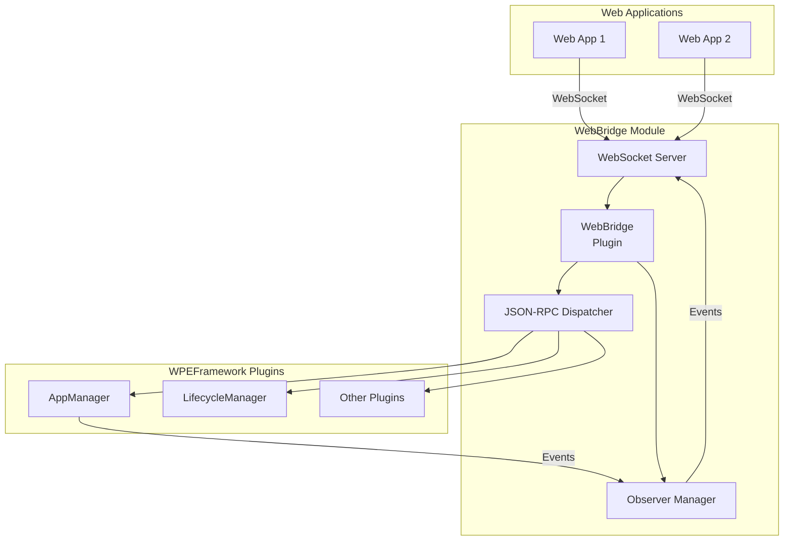
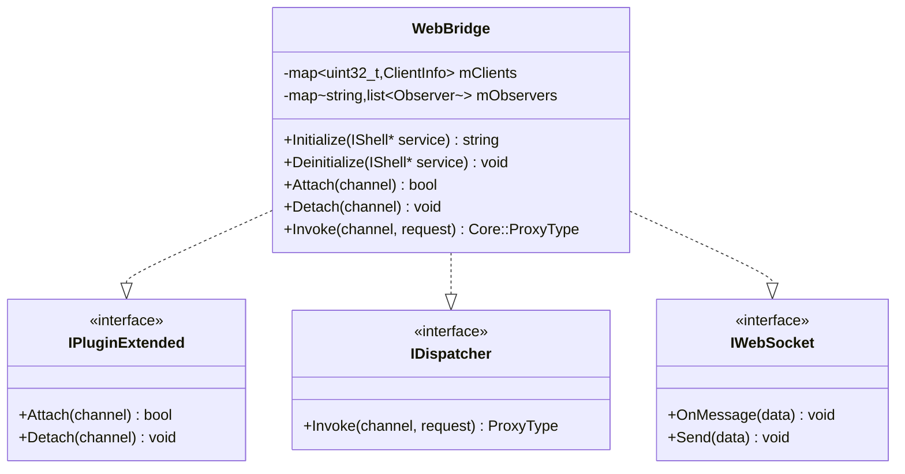
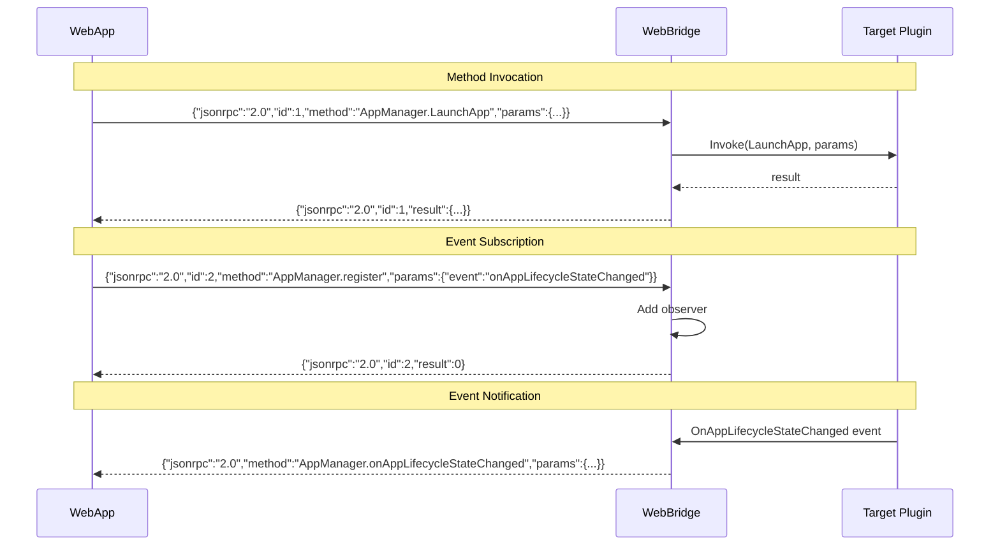
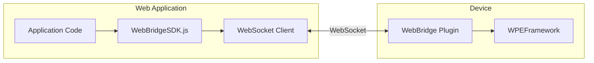

# WebBridge Module

> WebSocket Bridge for JSON-RPC Communication

[← Back to Main](../README.md) | [← Previous: TelemetryMetrics](./TelemetryMetrics.md)

---

## Purpose & Role

The **WebBridge** provides a WebSocket interface enabling web applications to communicate with WPEFramework plugins via JSON-RPC. It acts as a bridge between browser-based apps and native Thunder services.

### Core Responsibilities

- **WebSocket Server:** Accept WebSocket connections from web apps
- **JSON-RPC Routing:** Route JSON-RPC requests to plugins
- **Event Subscription:** Manage event subscriptions for clients
- **Response Handling:** Return responses to web clients
- **Connection Management:** Handle connect/disconnect

---

## Architecture



---

## Class Diagram



---

## File Organization

```
WebBridge/
├── WebBridge.cpp              Plugin implementation
├── WebBridge.h                Plugin class definition
├── Module.cpp/h               Module registration
├── CMakeLists.txt             Build configuration
├── WebBridge.config           Runtime configuration
├── js/
│   ├── WebBridgeClient.js     JavaScript client library
│   └── WebBridgeSDK.js        SDK wrapper
└── docs/
    └── API.md                 API documentation
```

---

## API Reference

### Plugin Interfaces

| Method | Purpose |
|--------|---------|
| `Attach(channel)` | Handle new WebSocket client connection |
| `Detach(channel)` | Handle client disconnection, cleanup subscriptions |
| `Invoke(channel, request)` | Route JSON-RPC request to appropriate plugin |

---

## Protocol

### JSON-RPC Message Flow



---

## Message Formats

### Request Format

```json
{
    "jsonrpc": "2.0",
    "id": 1,
    "method": "PluginName.methodName",
    "params": {
        "param1": "value1",
        "param2": "value2"
    }
}
```

### Response Format

```json
{
    "jsonrpc": "2.0",
    "id": 1,
    "result": {
        "success": true,
        "data": {}
    }
}
```

### Error Response

```json
{
    "jsonrpc": "2.0",
    "id": 1,
    "error": {
        "code": -32601,
        "message": "Method not found"
    }
}
```

### Event Notification

```json
{
    "jsonrpc": "2.0",
    "method": "AppManager.onAppLifecycleStateChanged",
    "params": {
        "appId": "com.example.app",
        "newState": "ACTIVE",
        "oldState": "LOADING"
    }
}
```

---

## Client SDK

### JavaScript Client Usage

```javascript
// Initialize client
const thunder = new ThunderJS({
    host: '127.0.0.1',
    port: 9998
});

// Call plugin method
const result = await thunder.call('AppManager', 'LaunchApp', {
    appId: 'com.example.app',
    intent: 'home'
});

// Subscribe to events
thunder.on('AppManager', 'onAppLifecycleStateChanged', (event) => {
    console.log('State changed:', event.appId, event.newState);
});

// Unsubscribe
thunder.off('AppManager', 'onAppLifecycleStateChanged');
```

---

## SDK Architecture



---

## SDK Methods

| Method | Description |
|--------|-------------|
| `call(plugin, method, params)` | Invoke plugin method |
| `on(plugin, event, callback)` | Subscribe to event |
| `off(plugin, event)` | Unsubscribe from event |
| `connect()` | Establish WebSocket connection |
| `disconnect()` | Close WebSocket connection |

---

[← Back to Main](../README.md)

