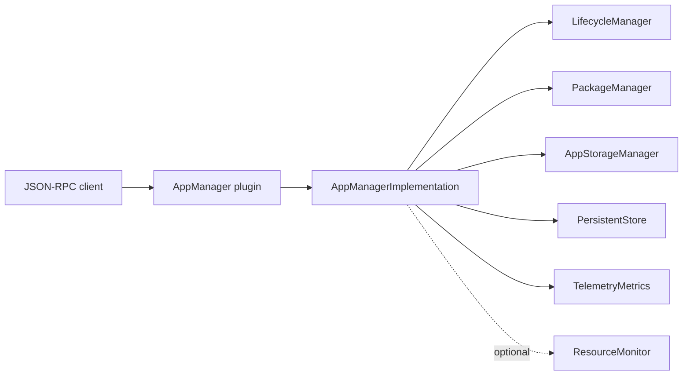
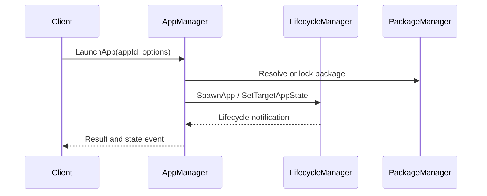
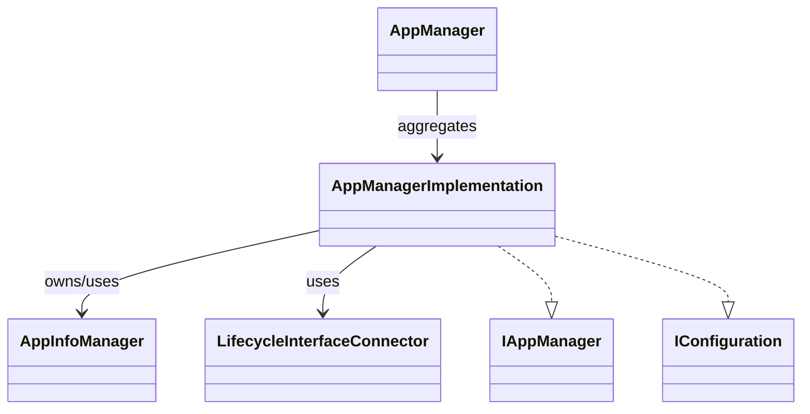
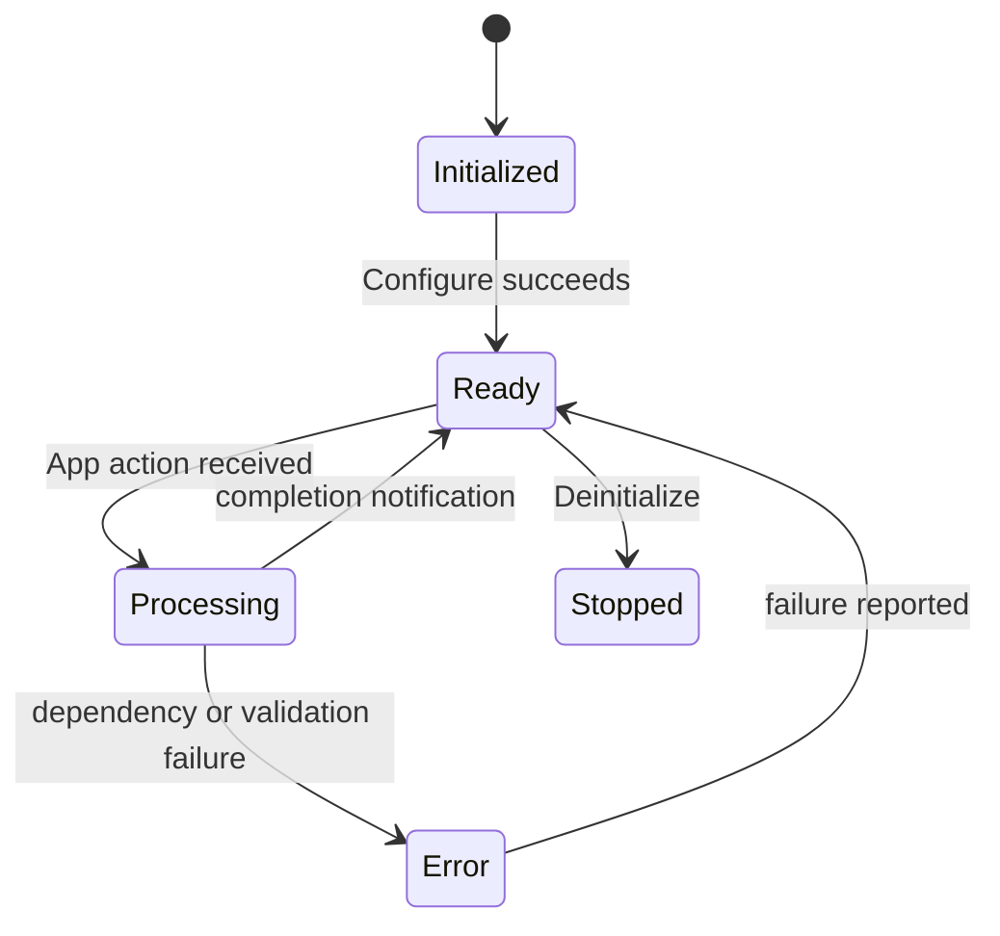

# AppManager

## 1. High-Level Purpose & Architecture

AppManager is the primary application-facing orchestration plugin in the ENT/RDK application-management stack. It exposes application launch, preload, close, terminate, kill, metadata, properties, and lifecycle-notification operations.

Responsibilities include coordinating package and storage services, forwarding lifecycle work to LifecycleManager, maintaining application metadata through `AppInfoManager`, and publishing JSON-RPC events. It does not implement the container runtime, filesystem storage primitives, package installation engine, or display compositor itself.

The principal collaborators are LifecycleManager, PackageManager/AppPackageManager, AppStorageManager, PersistentStore, TelemetryMetrics, and optionally ResourceMonitor.

## 2. Architectural Overview

`AppManager` is the Thunder plugin shell and JSON-RPC facade. `AppManagerImplementation` implements `IAppManager` and `IConfiguration`; connectors and managers perform the subsystem-specific work.



## 3. Code Organization (Folder & File-Level)

- [AppManager.h](../AppManager/AppManager.h): Thunder plugin class, interface map, notification bridge, and `Initialize`/`Deinitialize` declarations.
- [AppManager.cpp](../AppManager/AppManager.cpp): plugin registration and shell lifecycle.
- [AppManagerImplementation.h](../AppManager/AppManagerImplementation.h): `IAppManager`/`IConfiguration` implementation, action and event types, jobs, and collaborators.
- [AppManagerImplementation.cpp](../AppManager/AppManagerImplementation.cpp): request handling, remote interface acquisition, state changes, and cleanup.
- [AppInfo.h](../AppManager/AppInfo.h), [AppInfo.cpp](../AppManager/AppInfo.cpp): application metadata value object.
- [AppInfoManager.h](../AppManager/AppInfoManager.h), [AppInfoManager.cpp](../AppManager/AppInfoManager.cpp): application metadata collection and lookup.
- [AppStateTransitionManager.h](../AppManager/AppStateTransitionManager.h), [AppStateTransitionManager.cpp](../AppManager/AppStateTransitionManager.cpp): optional resource-driven transitions.
- [LifecycleInterfaceConnector.h](../AppManager/LifecycleInterfaceConnector.h), [LifecycleInterfaceConnector.cpp](../AppManager/LifecycleInterfaceConnector.cpp): LifecycleManager RPC connection handling.
- [AppManagerTelemetryReporting.h](../AppManager/AppManagerTelemetryReporting.h), `.cpp`: telemetry reporting integration.
- [AppManagerTypes.h](../AppManager/AppManagerTypes.h): shared action and application types.
- [Module.h](../AppManager/Module.h), [Module.cpp](../AppManager/Module.cpp): module-wide includes, registration support, and build metadata.
- [CMakeLists.txt](../AppManager/CMakeLists.txt): target, dependencies, options, and test-facing compile definitions.
- [AppManager.conf.in](../AppManager/AppManager.conf.in), [AppManager.config](../AppManager/AppManager.config): generated and checked-in plugin configuration forms.

## 4. Class & Interface Documentation

### `AppManager`

The wrapper implements `IPlugin` and `IDispatcher`, aggregates `IAppManager`, owns the shell reference, and bridges implementation notifications to JSON-RPC events. Its `Notification` nested class handles installation, uninstallation, lifecycle-state, launch-request, and unloaded events.

### `AppManagerImplementation`

This class implements `IAppManager` and `IConfiguration`. Its action vocabulary includes launch, preload, suspend, resume, close, terminate, hibernate, and kill. It owns metadata, package/storage/lifecycle interfaces, queued jobs, and optional resource-monitor state.

Annotated declaration from [AppManagerImplementation.h](../AppManager/AppManagerImplementation.h):

```cpp
class AppManagerImplementation : public Exchange::IAppManager, public Exchange::IConfiguration {
public:
    AppManagerImplementation();
    ~AppManagerImplementation() override;

    BEGIN_INTERFACE_MAP(AppManagerImplementation)
    INTERFACE_ENTRY(Exchange::IAppManager)
    INTERFACE_ENTRY(Exchange::IConfiguration)
    END_INTERFACE_MAP
```

### Lifecycle and relationships

`AppManager::Initialize` roots/configures the implementation and installs notification plumbing. Requests are dispatched through the implementation and may become asynchronous jobs. Destruction releases remote interfaces and worker resources. The exact ordering of every state transition is distributed between this class, LifecycleManager, and the external interface contracts.

## 5. Configuration & Build Integration

The plugin configuration contains `mode`, `locator`, `autostart`, and `startuporder`. When `APP_MANAGER_RESOURCE_MONITOR` is enabled, `pausedToSuspendedTimeout`, `suspendedToHibernatedTimeout`, and `hibernationStoragePath` are emitted by [AppManager.conf.in](../AppManager/AppManager.conf.in). The checked-in [AppManager.config](../AppManager/AppManager.config) expresses the same values through CMake helper syntax.

`CMakeLists.txt` builds the implementation and can enable `APP_MANAGER_RESOURCE_MONITOR`, enhanced logging, telemetry, and related interface dependencies. The root build includes this folder only when `PLUGIN_APPMANAGER` is enabled.

## 6. Internal Workflows & Execution Flow

- **Startup:** Thunder calls `Initialize`; the wrapper retains the shell, roots `AppManagerImplementation`, configures it, and registers notification handling.
- **Request flow:** JSON-RPC dispatch reaches an `IAppManager` method; the implementation validates action/state and coordinates LifecycleManager, PackageManager, AppStorageManager, or PersistentStore.
- **Read flow:** metadata and loaded-app queries use `AppInfoManager` and lifecycle/package interfaces.
- **Write/action flow:** launch, preload, close, terminate, hibernate, and kill become stateful actions; completion and failures are reflected in notifications.
- **Shutdown:** the wrapper deinitializes the implementation, joins pending work, unregisters notifications, and releases remote interfaces.
- **Error handling:** the implementation defines explicit action error categories such as invalid parameters, package failures, spawn/unload/kill failures, and target-state failures.

## 7. Diagrams & Visual Aids







## 8. Testing & Quality Analysis

L0 coverage exists under [Tests/L0Tests/AppManager](../Tests/L0Tests/AppManager) for implementation, lifecycle, component, telemetry, `AppInfo`, and `AppInfoManager`; L1 and L2 coverage also exist. The most valuable additional tests would exercise cross-service failure ordering, optional resource-monitor builds, duplicate concurrent actions, and shutdown while work is queued.

The source does not fully specify all remote-service retry and ordering guarantees. Those contracts must be verified against the generated exchange interfaces and integration tests.

## 9. Beginner-to-Expert Teaching Mode

**Must know first:** Thunder plugins expose interfaces through an `IPlugin` wrapper; AppManager is an orchestration layer, not the runtime or package engine. Learn `IAppManager`, the lifecycle states, and the difference between synchronous results and asynchronous notifications.

**Advanced path:** trace one launch from JSON-RPC dispatch through `AppManagerImplementation`, `LifecycleInterfaceConnector`, LifecycleManager, RuntimeManager, and notification callbacks. Then study package locks, metadata caching, worker dispatch, and the compile-time ResourceMonitor path.
