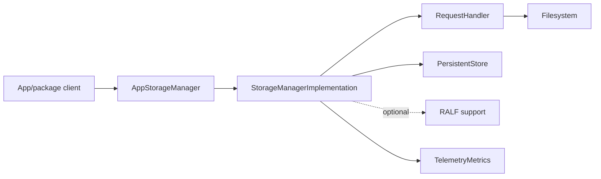
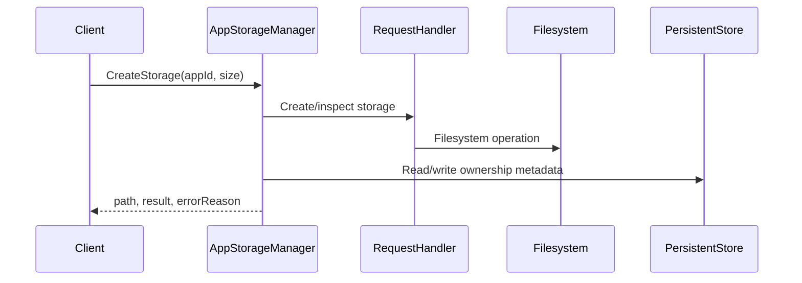
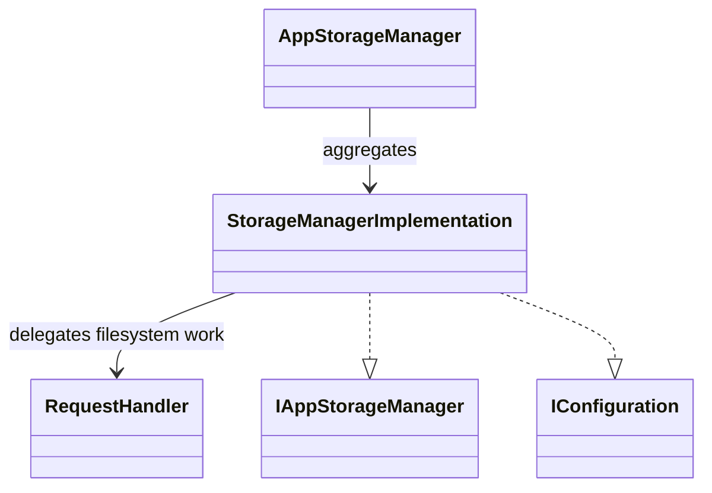
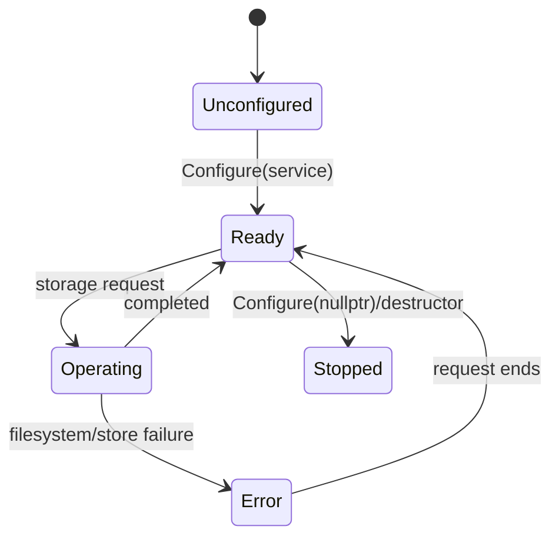

# AppStorageManager

## 1. High-Level Purpose & Architecture

AppStorageManager provides per-application persistent storage in the ENT/RDK stack. It creates, locates, deletes, clears, and quota-checks application storage while maintaining ownership metadata through PersistentStore.

It owns storage policy and filesystem coordination. It does not install packages, run containers, manage application lifecycle, or define the platform's final default storage root when configuration supplies an empty path.

Its direct collaborators are PersistentStore, filesystem helpers in `RequestHandler`, AppPackageManager/package metadata, TelemetryMetrics, and optionally RALF package support.

## 2. Architectural Overview



## 3. Code Organization (Folder & File-Level)

- [AppStorageManager.h](../AppStorageManager/AppStorageManager.h): plugin wrapper and interface exposure.
- [AppStorageManager.cpp](../AppStorageManager/AppStorageManager.cpp): plugin lifecycle and registration.
- [AppStorageManagerImplementation.h](../AppStorageManager/AppStorageManagerImplementation.h): `StorageManagerImplementation`, configuration object, and public storage methods.
- [AppStorageManagerImplementation.cpp](../AppStorageManager/AppStorageManagerImplementation.cpp): configuration, cache, storage operations, PersistentStore access, and cleanup.
- [RequestHandler.h](../AppStorageManager/RequestHandler.h), [RequestHandler.cpp](../AppStorageManager/RequestHandler.cpp): filesystem-oriented request operations.
- [AppStorageManagerTelemetryReporting.h](../AppStorageManager/AppStorageManagerTelemetryReporting.h), `.cpp`: storage telemetry.
- [Module.h](../AppStorageManager/Module.h), [Module.cpp](../AppStorageManager/Module.cpp): module registration support.
- [CMakeLists.txt](../AppStorageManager/CMakeLists.txt): build dependencies and optional RALF support.
- [AppStorageManager.conf.in](../AppStorageManager/AppStorageManager.conf.in), [AppStorageManager.config](../AppStorageManager/AppStorageManager.config): plugin and implementation configuration.

## 4. Class & Interface Documentation

### `AppStorageManager`

The wrapper exposes the Thunder plugin and aggregates the storage interface. It owns the shell-facing lifecycle but delegates storage decisions to the implementation.

### `StorageManagerImplementation`

The implementation provides `IAppStorageManager` and `IConfiguration`. Its public contract is `CreateStorage`, `GetStorage`, `DeleteStorage`, `Clear`, and `ClearAll`; it also owns the configured base path and service reference.

Source excerpt from [AppStorageManagerImplementation.h](../AppStorageManager/AppStorageManagerImplementation.h):

```cpp
class StorageManagerImplementation : public Exchange::IAppStorageManager ,public Exchange::IConfiguration{
public:
    Core::hresult CreateStorage(const string& appId, const uint32_t& size, string& path, string& errorReason) override;
    Core::hresult GetStorage(const string& appId, const int32_t& userId, const int32_t& groupId, string& path, uint32_t& size, uint32_t& used) override;
    Core::hresult DeleteStorage(const string& appId, string& errorReason) override;
    Core::hresult Clear(const string& appId, string& errorReason) override;
    Core::hresult ClearAll(const string& exemptionAppIds, string& errorReason) override;
```

Lifecycle begins with `Configure(service)`, which parses `path`, initializes PersistentStore-related state, sets the storage-path environment, and populates the cache. Teardown releases the implementation's service and remote objects.

## 5. Configuration & Build Integration

The implementation configuration defines `path`; the plugin configuration also carries Thunder `mode`, `locator`, `autostart`, and `startuporder`. [AppStorageManager.conf.in](../AppStorageManager/AppStorageManager.conf.in) is the authoritative generated template; the checked-in `.config` is a CMake helper representation.

[CMakeLists.txt](../AppStorageManager/CMakeLists.txt) includes filesystem wrappers for L1 tests and optionally enables `RALF_PACKAGE_SUPPORT`. The root build selects this folder with `PLUGIN_APP_STORAGE_MANAGER`.

## 6. Internal Workflows & Execution Flow

- **Initialization:** retain the shell, parse the base path, connect to PersistentStore, establish environment/cache state, and become available.
- **Create/read:** `CreateStorage` establishes app-owned storage; `GetStorage` resolves path, quota, and used bytes, using request handling and metadata.
- **Delete/clear:** delete removes an app's storage; clear operations preserve requested exemptions where applicable.
- **Sync/metadata:** PersistentStore tracks ownership and storage-related records; filesystem state is the materialized data.
- **Shutdown:** release PersistentStore and shell references and discard cached state.
- **Errors:** filesystem, quota, ownership, and remote-store failures are returned through HRESULT/error-reason outputs.

## 7. Diagrams & Visual Aids







## 8. Testing & Quality Analysis

L0 lifecycle, implementation, and component tests are under [Tests/L0Tests/AppStorageManager](../Tests/L0Tests/AppStorageManager); L1 and L2 tests also exist. Recommended additions are quota-boundary tests, ownership/path traversal tests, recovery after partial filesystem failure, empty-path deployment tests, and RALF-enabled coverage.

The implementation accepts an empty configured path into `mBaseStoragePath`; the platform default is not established locally. The effective default must be documented by the deployment integration.

## 9. Beginner-to-Expert Teaching Mode

**Must know first:** distinguish persistent app data from package contents and runtime state. Learn the storage interface methods and how a base path becomes per-app directories.

**Advanced path:** trace `Configure` through PersistentStore/cache initialization, inspect locking and filesystem wrappers in `RequestHandler`, then compare normal and `RALF_PACKAGE_SUPPORT` builds and their ownership semantics.
