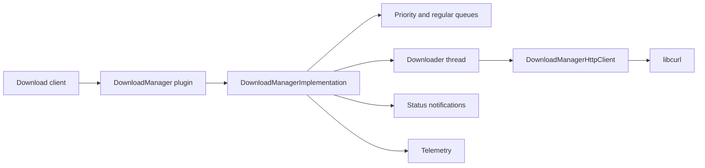
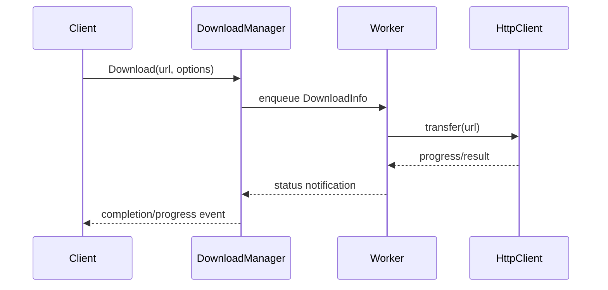
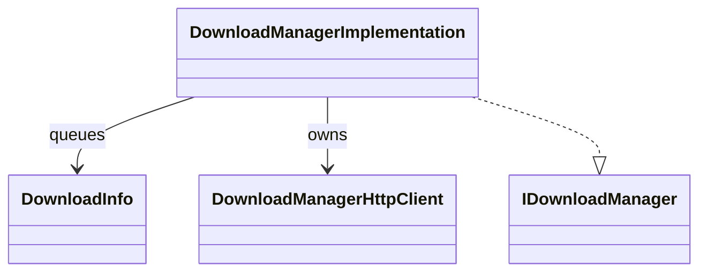
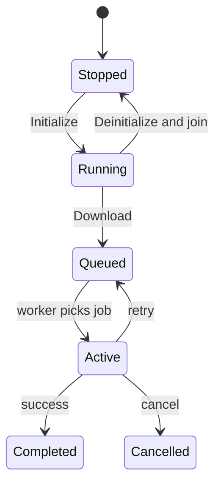

# DownloadManager

## 1. High-Level Purpose & Architecture

DownloadManager provides asynchronous HTTP downloads for ENT/RDK services. It supports priority scheduling, pause/resume/cancel/delete, progress, rate limits, retries, and status notifications.

It does not install packages, validate package metadata, manage application state, or own the network stack beyond its libcurl client wrapper. PackageManager has a separate package-download path and should not be assumed to share DownloadManager's queue.

## 2. Architectural Overview



## 3. Code Organization (Folder & File-Level)

- [DownloadManager.h](../DownloadManager/DownloadManager.h), [DownloadManager.cpp](../DownloadManager/DownloadManager.cpp): Thunder wrapper and registration.
- [DownloadManagerImplementation.h](../DownloadManager/DownloadManagerImplementation.h), `.cpp`: queues, worker thread, public API, retry and notification logic.
- [DownloadManagerHttpClient.h](../DownloadManager/DownloadManagerHttpClient.h), `.cpp`: HTTP/libcurl operations.
- [DownloadManagerTelemetryReporting.h](../DownloadManager/DownloadManagerTelemetryReporting.h), `.cpp`: telemetry markers/reporting.
- [Module.h](../DownloadManager/Module.h), [Module.cpp](../DownloadManager/Module.cpp): module support.
- [CMakeLists.txt](../DownloadManager/CMakeLists.txt): libcurl and target integration.
- [DownloadManager.conf.in](../DownloadManager/DownloadManager.conf.in), [DownloadManager.config](../DownloadManager/DownloadManager.config): generated and checked-in configuration.

## 4. Class & Interface Documentation

### `DownloadManager`

The plugin shell exposes the `IDownloadManager` interface and owns the Thunder lifecycle boundary.

### `DownloadManagerImplementation`

The implementation owns `DownloadInfo`, priority and regular queues, `DownloadManagerHttpClient`, the downloader thread, notification subscribers, and current-download state.

Excerpt from [DownloadManagerImplementation.h](../DownloadManager/DownloadManagerImplementation.h):

```cpp
Core::hresult Download(const string &url, const Exchange::IDownloadManager::Options &options, string &downloadId) override;
Core::hresult Pause(const string &downloadId) override;
Core::hresult Resume(const string &downloadId) override;
Core::hresult Cancel(const string &downloadId) override;
Core::hresult Delete(const string &fileLocator) override;
```

`DownloadInfo` stores URL, id, priority, retry count, rate limit, file locator, and cancellation state. The worker uses a mutex/condition variable and an atomic run flag.

## 5. Configuration & Build Integration

The implementation configuration declares `downloadDir` and `downloadId`; the plugin-level values include `mode`, `locator`, `autostart`, and `startuporder`. However, checked-in [DownloadManager.config](../DownloadManager/DownloadManager.config) does not contain `downloadDir` or `downloadId` even though [DownloadManager.conf.in](../DownloadManager/DownloadManager.conf.in) emits them. Deployment generation must resolve this discrepancy.

[CMakeLists.txt](../DownloadManager/CMakeLists.txt) requires libcurl and builds the plugin/implementation and telemetry support. Root inclusion is controlled by `PLUGIN_DOWNLOADMANAGER`.

## 6. Internal Workflows & Execution Flow

- **Initialization:** parse download path/id, create the directory, retain the shell, initialize telemetry, and start the downloader thread.
- **Queueing:** `Download` creates `DownloadInfo` and places it in the priority or regular queue.
- **Execution:** the worker selects a job, invokes the HTTP client, applies rate limits, and reports progress/status.
- **Retry:** failed downloads use a retry count and backoff based on the implementation's retry-duration helper.
- **Control:** pause, resume, cancel, rate-limit, and delete update queued/current work and notify subscribers.
- **Shutdown:** clear the run flag, wake and join the worker, clear queues, and release the shell.

## 7. Diagrams & Visual Aids







## 8. Testing & Quality Analysis

L0 lifecycle, implementation, HTTP client, telemetry, retry/queue, and shutdown tests are under [Tests/L0Tests/DownloadManager](../Tests/L0Tests/DownloadManager); L1 coverage exists. Add tests for directory creation failure, worker-start failure, concurrent cancel versus completion, retry exhaustion, and configuration parity between `.conf.in` and `.config`.

The exact HTTP/TLS policy is delegated to libcurl and is not fully specified in this repository.

## 9. Beginner-to-Expert Teaching Mode

**Must know first:** understand producer/consumer queues, worker-thread shutdown, and the distinction between a download id and a file locator.

**Advanced path:** inspect queue locking, cancellation visibility, retry backoff, libcurl error mapping, and notification lifetime under deinitialization.
