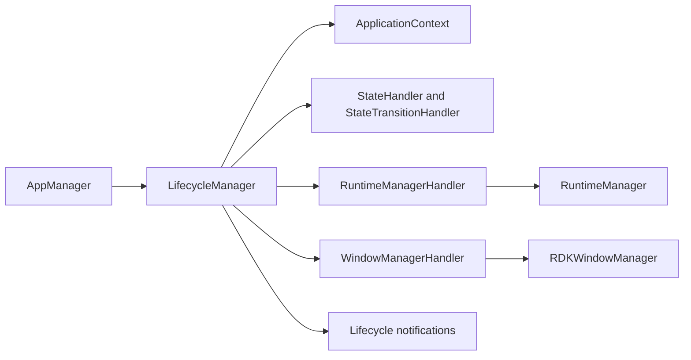
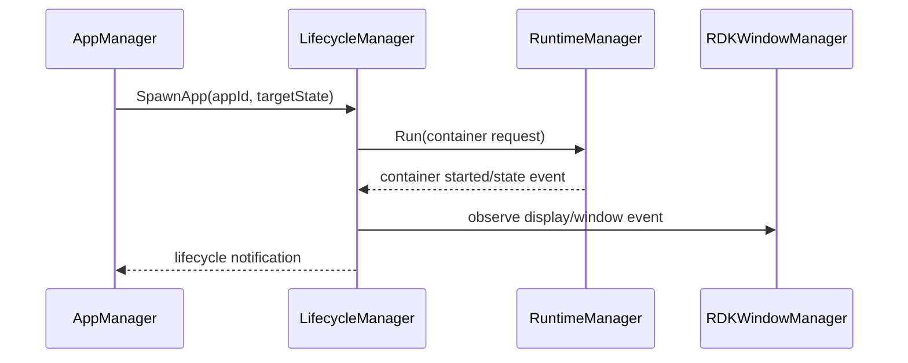
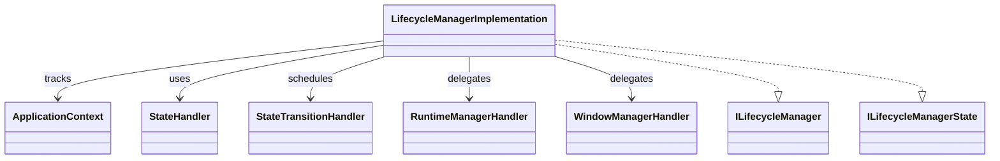
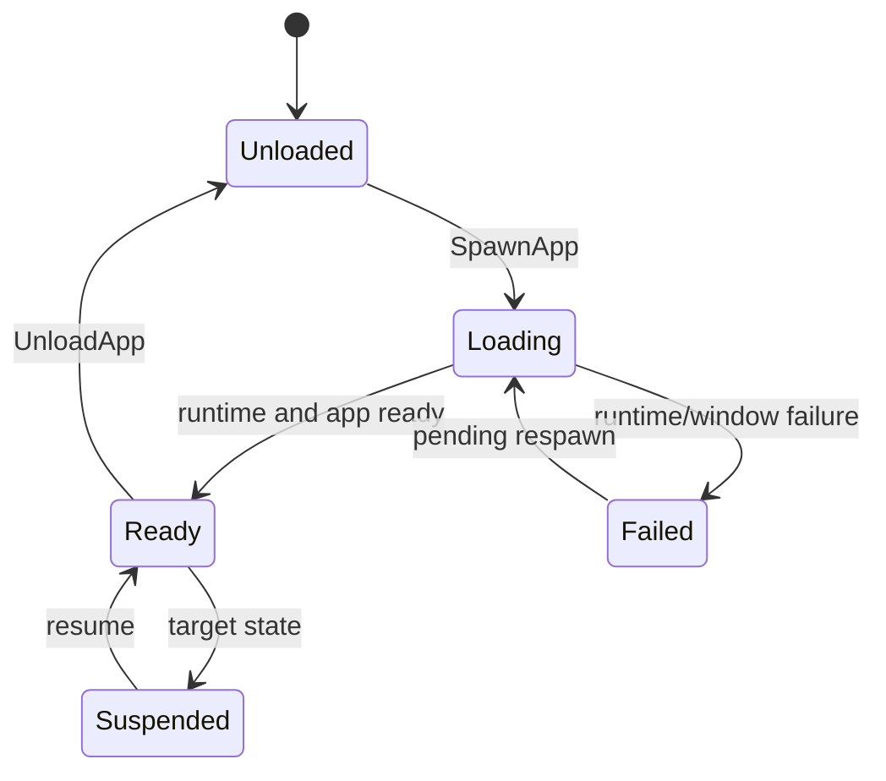

# LifecycleManager

## 1. High-Level Purpose & Architecture

LifecycleManager coordinates application state transitions in ENT/RDK. It tracks loaded application contexts, requests runtime spawn/unload/kill operations, processes runtime and window events, handles respawn requests, and emits lifecycle notifications.

It does not create OCI containers directly, own package installation, or implement compositor behavior. RuntimeManager and RDKWindowManager are remote collaborators; the lifecycle state machine and notification policy live here.

## 2. Architectural Overview



## 3. Code Organization (Folder & File-Level)

- [LifecycleManager.h](../LifecycleManager/LifecycleManager.h), [LifecycleManager.cpp](../LifecycleManager/LifecycleManager.cpp): Thunder wrapper and registration.
- [LifecycleManagerImplementation.h](../LifecycleManager/LifecycleManagerImplementation.h), `.cpp`: interfaces, loaded contexts, event dispatch, and lifecycle operations.
- [ApplicationContext.h](../LifecycleManager/ApplicationContext.h), `.cpp`: per-app-instance context and state data.
- [State.h](../LifecycleManager/State.h), [State.cpp](../LifecycleManager/State.cpp): lifecycle state definitions.
- [StateHandler.h](../LifecycleManager/StateHandler.h), `.cpp`: state-specific behavior.
- [StateTransitionHandler.h](../LifecycleManager/StateTransitionHandler.h), `.cpp`: transition request execution.
- [StateTransitionRequest.h](../LifecycleManager/StateTransitionRequest.h): transition request representation.
- [RuntimeManagerHandler.h](../LifecycleManager/RuntimeManagerHandler.h), `.cpp`: runtime service event/request bridge.
- [WindowManagerHandler.h](../LifecycleManager/WindowManagerHandler.h), `.cpp`: window service event/request bridge.
- [RequestHandler.h](../LifecycleManager/RequestHandler.h), `.cpp`: request processing and termination.
- [IEventHandler.h](../LifecycleManager/IEventHandler.h): event callback contract.
- [LifecycleManagerTelemetryReporting.h](../LifecycleManager/LifecycleManagerTelemetryReporting.h), `.cpp`: telemetry integration.
- [CMakeLists.txt](../LifecycleManager/CMakeLists.txt), [LifecycleManager.conf.in](../LifecycleManager/LifecycleManager.conf.in), [LifecycleManager.config](../LifecycleManager/LifecycleManager.config): build and plugin configuration.

## 4. Class & Interface Documentation

### `LifecycleManager`

The wrapper exposes `IPlugin`, JSON-RPC dispatch, and the lifecycle interfaces through the implementation.

### `LifecycleManagerImplementation`

It implements `ILifecycleManager`, `ILifecycleManagerState`, `IConfiguration`, and `IEventHandler`. It owns notification lists, loaded `ApplicationContext` objects, pending respawns, an administrative lock, and the service reference.

Excerpt from [LifecycleManagerImplementation.h](../LifecycleManager/LifecycleManagerImplementation.h):

```cpp
virtual Core::hresult SpawnApp(const string& appId, const string& launchIntent,
    const Exchange::ILifecycleManager::LifecycleState targetLifecycleState,
    const WPEFramework::Exchange::RuntimeConfig& runtimeConfigObject,
    const string& launchArgs, string& appInstanceId,
    string& errorReason, bool& success) override;
virtual Core::hresult SetTargetAppState(const string& appInstanceId,
    const Exchange::ILifecycleManager::LifecycleState targetLifecycleState,
    const string& launchIntent) override;
```

The nested `Job` retains the implementation while queued and dispatches runtime/window/state events on the framework worker mechanism. Configure with a null service is used as teardown and invokes request-handler termination.

## 5. Configuration & Build Integration

The plugin configuration defines `mode` and `locator`; the checked-in config hardcodes `autostart = false`. Build options include `ENABLE_UNIT_TESTS`, `ENABLE_RIALTO_CONTROL`, and telemetry support. The root build selects the folder using `PLUGIN_LIFECYCLE_MANAGER`.

The CMake option `PLUGIN_LIFECYCLE_MANAGER_AUTOSTART` is declared but is not emitted in the checked-in [LifecycleManager.conf.in](../LifecycleManager/LifecycleManager.conf.in); startup-order behavior is likewise not emitted there. This is a source-level configuration gap, not an inferred runtime guarantee.

## 6. Internal Workflows & Execution Flow

- **Startup:** initialize the wrapper, configure handlers, acquire RuntimeManager/RDKWindowManager interfaces, and register notification paths.
- **Spawn:** create an `ApplicationContext`, request runtime startup, and drive state transitions toward the target state.
- **Events:** runtime/window callbacks become queued jobs, then update contexts and notify registered clients.
- **Respawn/failure:** failures are converted to lifecycle failure notifications and pending respawn data may be replayed.
- **Unload/kill:** request handlers coordinate runtime termination and remove or update context state.
- **Shutdown:** `Configure(nullptr)` terminates request processing and state-transition work before releasing service dependencies.

## 7. Diagrams & Visual Aids







## 8. Testing & Quality Analysis

L0 shell, implementation, context/state, and lifecycle tests are under [Tests/L0Tests/LifecycleManager](../Tests/L0Tests/LifecycleManager); L1 coverage also exists. Add focused tests for event ordering across runtime/window callbacks, duplicate respawn requests, shutdown with queued jobs, and the mismatch between declared autostart CMake options and emitted configuration.

Some transition semantics are distributed across `ApplicationContext`, state handlers, and generated exchange definitions; a complete contract cannot be reconstructed from this folder alone.

## 9. Beginner-to-Expert Teaching Mode

**Must know first:** lifecycle management is a state machine around an app instance, not a process launcher alone. Learn contexts, target states, notifications, and asynchronous event dispatch.

**Advanced path:** follow a `SpawnApp` request through `StateTransitionHandler`, `RuntimeManagerHandler`, and `WindowManagerHandler`, then study failure/respawn behavior and lock/queue teardown.
