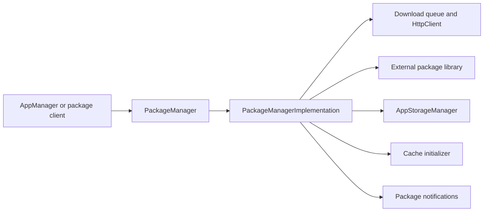
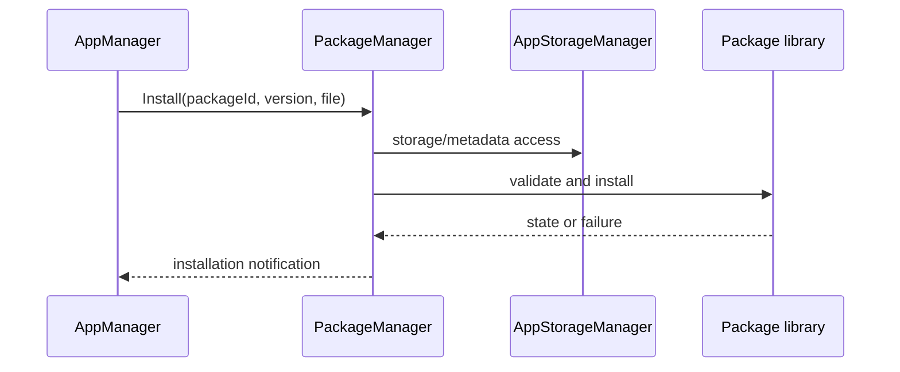
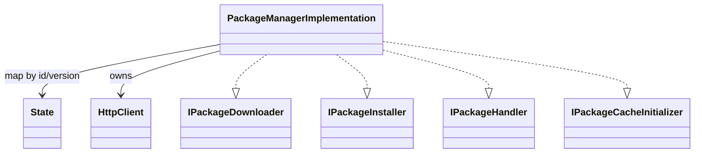
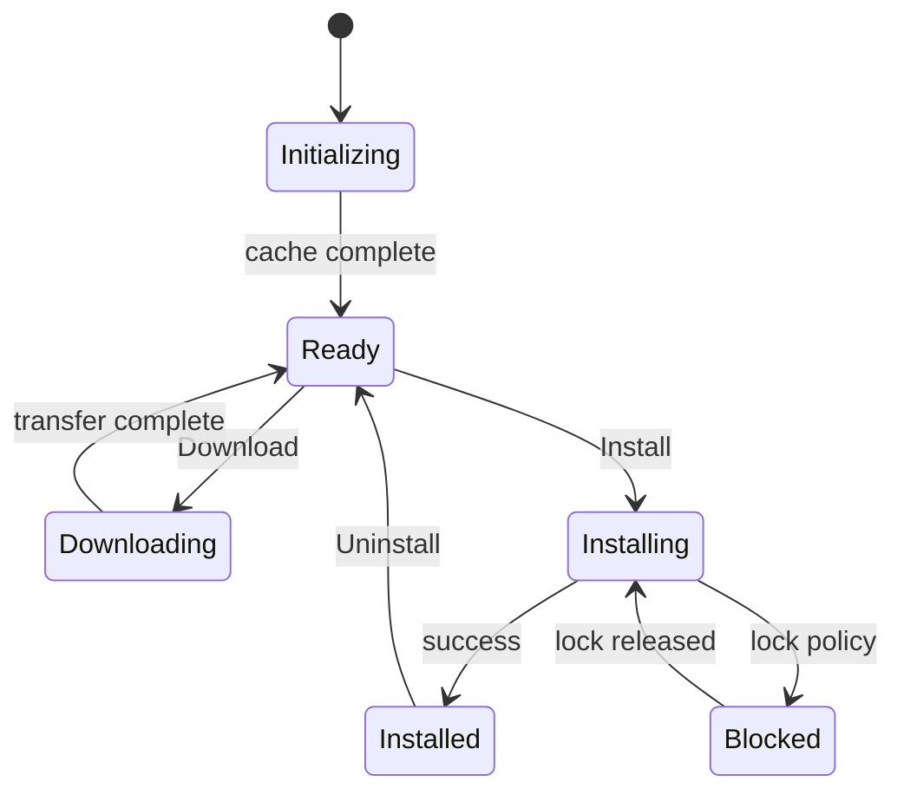

# PackageManager

## 1. High-Level Purpose & Architecture

PackageManager is the package service for ENT/RDK applications. It combines package download, installation, uninstall, package locking, runtime metadata/configuration, package-state tracking, and cache initialization.

It does not own per-app persistent storage or container execution. It uses AppStorageManager for storage and an external package implementation/library for package mechanics.

## 2. Architectural Overview



## 3. Code Organization (Folder & File-Level)

- [PackageManager.h](../PackageManager/PackageManager.h), [Module.cpp](../PackageManager/Module.cpp), [Module.h](../PackageManager/Module.h): plugin wrapper and module registration.
- [PackageManagerImplementation.h](../PackageManager/PackageManagerImplementation.h), `.cpp`: package interfaces, state map, queues, locks, cache initialization, and lifecycle.
- [HttpClient.h](../PackageManager/HttpClient.h), [HttpClient.cpp](../PackageManager/HttpClient.cpp): package download HTTP operations.
- [PackageManagerTelemetryReporting.h](../PackageManager/PackageManagerTelemetryReporting.h), `.cpp`: telemetry.
- [cmake/](../PackageManager/cmake/): package-specific build helpers and dependency discovery.
- [CMakeLists.txt](../PackageManager/CMakeLists.txt): external package, curl, JSON, RALF, and feature flags.
- [PackageManager.conf.in](../PackageManager/PackageManager.conf.in): generated plugin configuration. No checked-in `PackageManager.config` exists in this workspace.

## 4. Class & Interface Documentation

### `PackageManager`

The wrapper exposes the package plugin through Thunder. Its public surface is supplied by the aggregated package implementation.

### `PackageManagerImplementation`

The implementation simultaneously provides `IPackageDownloader`, `IPackageInstaller`, `IPackageHandler`, `IAppPackageManagerConfig`, and `IPackageCacheInitializer`. It owns a package state map keyed by package id/version, download queues, notifications, storage references, and the package library object.

Excerpt from [PackageManagerImplementation.h](../PackageManager/PackageManagerImplementation.h):

```cpp
class PackageManagerImplementation
    : public Exchange::IPackageDownloader
    , public Exchange::IPackageInstaller
    , public Exchange::IPackageHandler
    , public Exchange::IAppPackageManagerConfig
    , public Exchange::IPackageCacheInitializer
```

Key operations include `Download`, `Install`, `Uninstall`, `ListPackages`, `Config`, `PackageState`, `Lock`, `Unlock`, and `StartCacheInitialization`. `State` records install state, lock count, runtime config, digest, unpacked paths, failure reason, and blocked install data.

## 5. Configuration & Build Integration

The implementation configuration declares `downloadDir`; plugin settings include `mode` and `autostart` in [PackageManager.conf.in](../PackageManager/PackageManager.conf.in). There is no checked-in `PackageManager.config` in this workspace, so a generated deployment configuration is required.

Build flags include `USE_LIBPACKAGE_RALF`, `ENABLE_INSTALL_WHILE_LOCKED`, `DEFER_CACHE_INIT`, unit-test package mocks, libcurl, and JSON-C++. The marker file `/tmp/package_manager_ready` is used by the implementation to indicate readiness. Root inclusion is controlled by `PLUGIN_PACKAGE_MANAGER`.

## 6. Internal Workflows & Execution Flow

- **Startup:** resolve AppStorageManager, parse `downloadDir`, construct package implementation, and begin cache initialization unless `DEFER_CACHE_INIT` is enabled.
- **Download:** enqueue a package artifact, transfer through `HttpClient`, and report progress/status.
- **Install:** validate/store package state, unpack or delegate to the package library, persist runtime metadata, and notify listeners.
- **Locking:** `Lock` protects package use and returns unpacked/config metadata; `Unlock` decrements the corresponding lock state.
- **Blocked work:** package locks can defer install/uninstall work; optional `ENABLE_INSTALL_WHILE_LOCKED` changes this behavior.
- **Shutdown:** signal and join the downloader, remove the readiness marker, and release storage, package, and shell resources.

## 7. Diagrams & Visual Aids







## 8. Testing & Quality Analysis

L0 shell, implementation, component, package-locking, cache, HTTP, and notification tests are under [Tests/L0Tests/PackageManager](../Tests/L0Tests/PackageManager); L1 coverage exists. Add tests for missing storage service, package-library failure, interrupted download cleanup, blocked install/uninstall policy, cache-init failure, and the non-deferred downloader thread failure path.

The workspace does not specify the external package-library validation rules in this folder. Those are an integration dependency.

## 9. Beginner-to-Expert Teaching Mode

**Must know first:** package state is more than installed/uninstalled: locks, versions, runtime metadata, and storage paths affect whether an operation can proceed.

**Advanced path:** trace download-to-install state transitions, inspect lock accounting and blocked operations, then compare RALF and non-RALF package paths and cache initialization modes.
