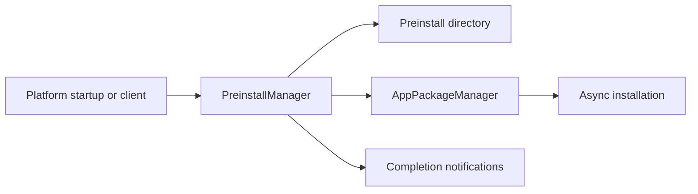
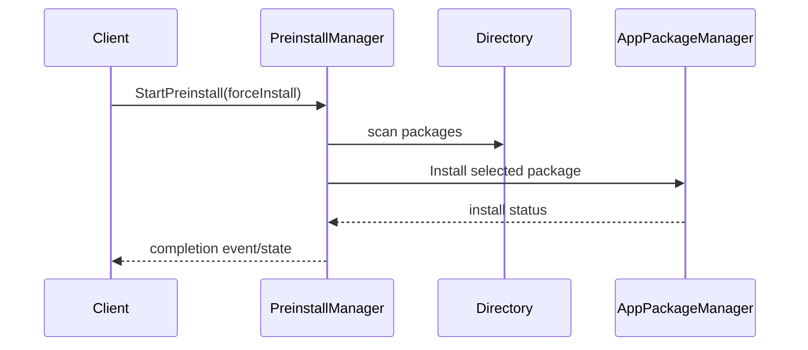
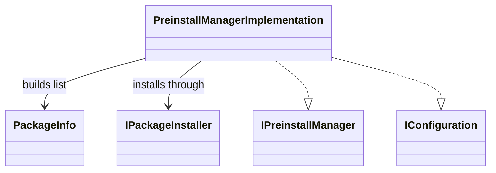
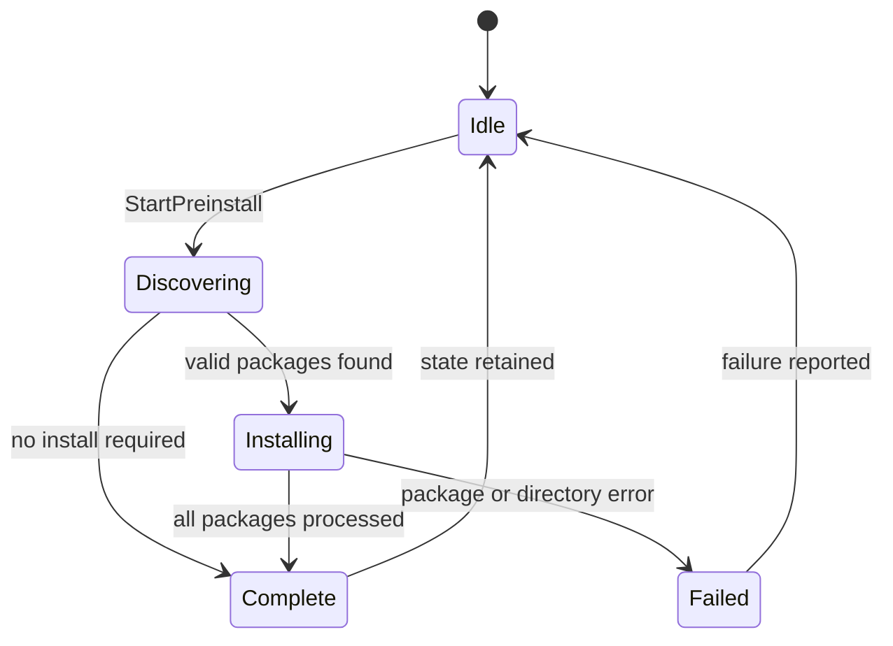

# PreinstallManager

## 1. High-Level Purpose & Architecture

PreinstallManager discovers packages in a configured preinstall directory, filters package versions, installs selected packages through AppPackageManager, tracks progress/state, and emits a completion event.

It does not implement package installation, package storage, application lifecycle, or runtime startup; those responsibilities belong to PackageManager and downstream services.

## 2. Architectural Overview



## 3. Code Organization (Folder & File-Level)

- [PreinstallManager.h](../PreinstallManager/PreinstallManager.h), [PreinstallManager.cpp](../PreinstallManager/PreinstallManager.cpp): plugin wrapper and public lifecycle.
- [PreinstallManagerImplementation.h](../PreinstallManager/PreinstallManagerImplementation.h), `.cpp`: configuration, package discovery, version filtering, install thread, and notifications.
- [Module.h](../PreinstallManager/Module.h), [Module.cpp](../PreinstallManager/Module.cpp): module support.
- [CMakeLists.txt](../PreinstallManager/CMakeLists.txt): target and L1 filesystem wrappers.
- [PreinstallManager.conf.in](../PreinstallManager/PreinstallManager.conf.in), [PreinstallManager.config](../PreinstallManager/PreinstallManager.config): plugin configuration.
- [PreinstallManagerPlugin.json](../PreinstallManager/PreinstallManagerPlugin.json): plugin metadata used by the component.

## 4. Class & Interface Documentation

### `PreinstallManager`

The wrapper exposes `IPreinstallManager` through Thunder and delegates configuration and operations to the implementation.

### `PreinstallManagerImplementation`

The implementation also exposes `IConfiguration`. It owns the preinstall directory, package-manager interface, notification list, install thread, and current state. Key methods are `StartPreinstall`, `GetPreinstallState`, `readPreinstallDirectory`, `installPackages`, `isValidSemVer`, and `isNewerVersion`.

Excerpt from [PreinstallManagerImplementation.h](../PreinstallManager/PreinstallManagerImplementation.h):

```cpp
class PreinstallManagerImplementation : public Exchange::IPreinstallManager, public Exchange::IConfiguration
{
public:
    Core::hresult StartPreinstall(bool forceInstall) override;
    Core::hresult GetPreinstallState(State& state) override;
    uint32_t Configure(PluginHost::IShell *service) override;
```

The nested `Job` keeps the implementation alive while completion events are dispatched asynchronously. `StartPreinstall` prevents duplicate active runs and joins a previous thread when needed.

## 5. Configuration & Build Integration

The implementation configuration key is `appPreinstallDirectory`; plugin-level settings include `mode`, `locator`, and `autostart`. The checked-in [PreinstallManager.config](../PreinstallManager/PreinstallManager.config) omits `appPreinstallDirectory`, although [PreinstallManager.conf.in](../PreinstallManager/PreinstallManager.conf.in) declares it. Runtime behavior therefore depends on generated/external configuration.

[CMakeLists.txt](../PreinstallManager/CMakeLists.txt) wraps filesystem calls for L1 tests and supports the root `PLUGIN_PREINSTALL_MANAGER` selection.

## 6. Internal Workflows & Execution Flow

- **Configure:** parse the preinstall directory and retain the service.
- **Discovery:** obtain AppPackageManager, scan the directory, parse package metadata, and filter versions.
- **Installation:** install packages asynchronously, record status, and handle package-manager failure reasons.
- **Completion:** dispatch the completion event to registered listeners.
- **Force mode:** `forceInstall` controls whether an active/previous state may be rerun according to implementation policy.
- **Shutdown:** join the install thread and release package-manager/service references.

## 7. Diagrams & Visual Aids







## 8. Testing & Quality Analysis

Extensive L0 lifecycle, implementation, component, version-filtering, failure, event, and thread tests are under [Tests/L0Tests/PreinstallManager](../Tests/L0Tests/PreinstallManager); L1 coverage also exists. Add tests for malformed package filenames/metadata, duplicate versions, directory permission failure, forced reruns, and shutdown during installation.

The source does not document the complete package filename/metadata schema; consult the package interface and deployment artifacts for that contract.

## 9. Beginner-to-Expert Teaching Mode

**Must know first:** this is a coordinator that turns a directory of package artifacts into AppPackageManager install calls. Learn asynchronous completion and semantic-version filtering.

**Advanced path:** trace package discovery into `PackageInfo`, inspect install-state/error mapping, then study thread ownership, event dispatch, and generated configuration behavior.
