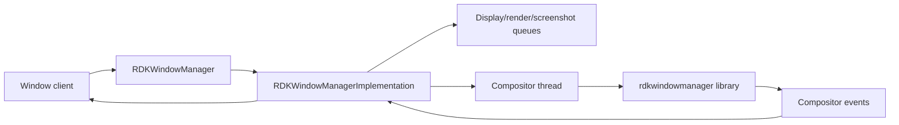
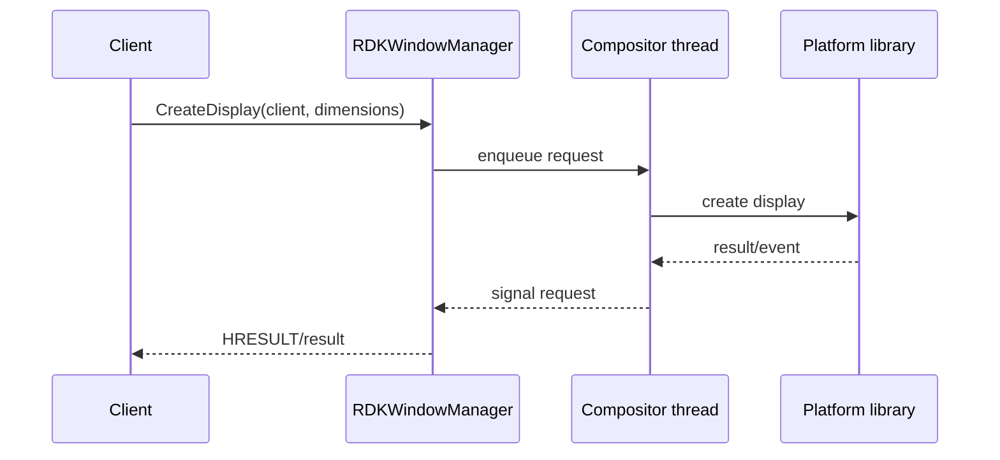
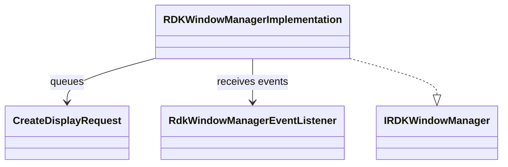
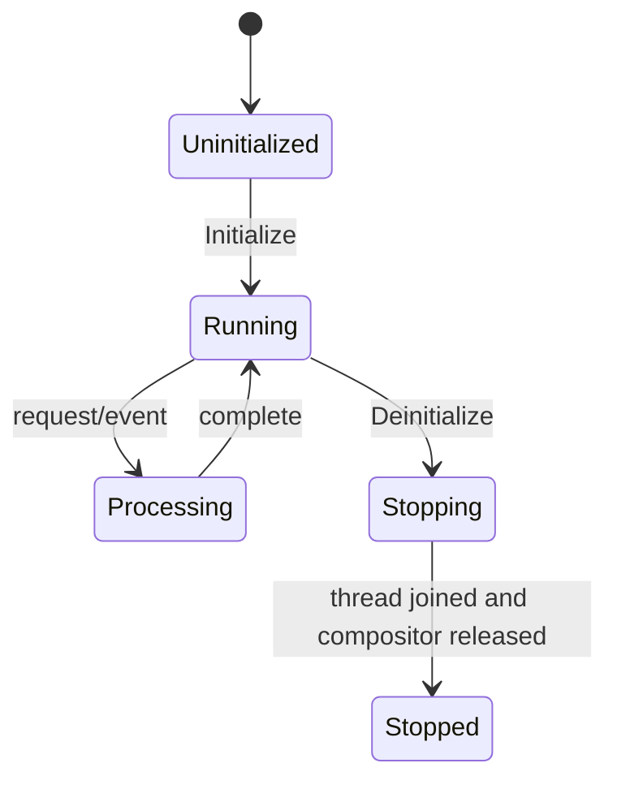

# RDKWindowManager

## 1. High-Level Purpose & Architecture

RDKWindowManager provides display and compositor control for applications: display creation, visibility, focus, z-order, bounds, scale, input/key interception, inactivity reporting, screenshots, VNC, splash-screen control, and render coordination.

It does not implement application lifecycle or container execution. The platform `rdkwindowmanager` library owns the compositor behavior; this plugin adapts that platform API to Thunder interfaces.

## 2. Architectural Overview



## 3. Code Organization (Folder & File-Level)

- [RDKWindowManager.h](../RDKWindowManager/RDKWindowManager.h), [RDKWindowManager.cpp](../RDKWindowManager/RDKWindowManager.cpp): plugin wrapper and registration.
- [RDKWindowManagerImplementation.h](../RDKWindowManager/RDKWindowManagerImplementation.h), `.cpp`: interface methods, event jobs, queues, compositor thread, and platform calls.
- [Module.h](../RDKWindowManager/Module.h), [Module.cpp](../RDKWindowManager/Module.cpp): module support.
- [RDKWindowManagerTelemetryReporting.h](../RDKWindowManager/RDKWindowManagerTelemetryReporting.h), `.cpp`: telemetry integration.
- [test/RDKWMJsonL3Test.sh](../RDKWindowManager/test/RDKWMJsonL3Test.sh): shell-based L3 JSON test.
- [CMakeLists.txt](../RDKWindowManager/CMakeLists.txt): platform library and test fake integration.
- [RDKWindowManager.conf.in](../RDKWindowManager/RDKWindowManager.conf.in), [RDKWindowManager.config](../RDKWindowManager/RDKWindowManager.config): plugin configuration.

## 4. Class & Interface Documentation

### `RDKWindowManager`

The Thunder wrapper exposes `IRDKWindowManager` and owns the plugin shell lifecycle.

### `RDKWindowManagerImplementation`

The implementation owns compositor event handling, shell/render thread state, request queues, semaphores, and screenshot state. It implements display, input, focus, geometry, VNC, and splash operations.

Excerpt from [RDKWindowManagerImplementation.h](../RDKWindowManager/RDKWindowManagerImplementation.h):

```cpp
Core::hresult CreateDisplay(const string &clientId, const string &displayName,
    const uint32_t displayWidth, const uint32_t displayHeight,
    const bool virtualDisplay, const uint32_t virtualWidth,
    const uint32_t virtualHeight, const uint32_t ownerId,
    const uint32_t groupId, const bool topmost, const bool focus,
    const string &capabilities) override;
Core::hresult SetFocus(const string &client) override;
Core::hresult SetVisible(const std::string &client, bool visible) override;
```

`CreateDisplayRequest` carries request data, a semaphore, and a result so caller-facing methods can synchronize with platform-thread work. The nested `Job` converts platform events into framework dispatches.

## 5. Configuration & Build Integration

The plugin uses `mode`, `locator`, `autostart`, and `startuporder`. [CMakeLists.txt](../RDKWindowManager/CMakeLists.txt) links `-lrdkwindowmanager` outside test builds and substitutes fakes for L0 tests. Root inclusion uses `PLUGIN_RDK_WINDOW_MANAGER`.

Platform behavior is mostly outside this repository in the `rdkwindowmanager` dependency. The local configuration describes plugin loading, not compositor policy.

## 6. Internal Workflows & Execution Flow

- **Initialization:** clear `WAYLAND_DISPLAY`, install compositor listeners, enable inactivity reporting, initialize the platform compositor, and start the shell/render thread.
- **Display/input:** public methods enqueue or invoke platform operations for display, visibility, focus, geometry, scale, key interception, and input events.
- **Events:** platform callbacks become jobs and are sent to registered notifications.
- **Screenshots/rendering:** screenshot and render requests are synchronized through queue/semaphore state.
- **Shutdown:** stop and wake the thread, join it, deinitialize the compositor, remove listeners, and clear queues/buffers.
- **Errors:** wrapper return values reflect platform initialization and operation failures; detailed platform behavior requires the external library.

## 7. Diagrams & Visual Aids







## 8. Testing & Quality Analysis

L0 lifecycle and implementation tests with a fake platform manager are under [Tests/L0Tests/RDKWindowManager](../Tests/L0Tests/RDKWindowManager). L1 tests and the L3 JSON script also exist. Add tests for thread wake/join races, semaphore timeout/failure, listener removal, screenshot cleanup, and platform initialization failure.

Several compositor semantics cannot be validated locally because the real `rdkwindowmanager` implementation is external.

## 9. Beginner-to-Expert Teaching Mode

**Must know first:** this plugin is an adapter around a compositor API and has a dedicated platform thread. Learn client/window identity, focus/visibility, and asynchronous event delivery.

**Advanced path:** trace a `CreateDisplay` request through `CreateDisplayRequest`, semaphore synchronization, platform callbacks, and deinitialization; then study input interception and render/screenshot queue lifetime.
