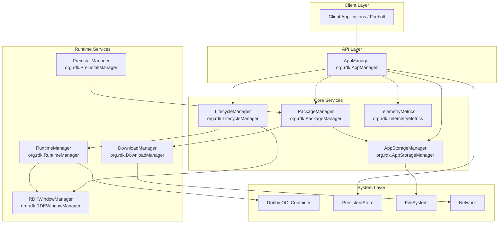
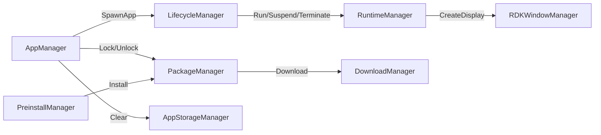

# ENT Services AppManagers - Technical Documentation

> Comprehensive Technical Documentation for RDK Application Management Infrastructure

## Overview

The **entservices-appmanagers** repository provides a comprehensive suite of WPEFramework (Thunder) plugins for managing application lifecycle, package installation, runtime containers, and system resources on RDK-based set-top boxes and streaming devices.

This documentation covers the architecture, implementation details, and usage patterns for all subsystems in the repository.

---

## Documentation Index

| Document | Description |
|----------|-------------|
| [AppManager](./AppManager.md) | Primary API for application management - orchestrates app lifecycle operations |
| [LifecycleManager](./LifecycleManager.md) | State machine for application lifecycle transitions |
| [RuntimeManager](./RuntimeManager.md) | Container runtime using Dobby OCI - handles execution and hibernation |
| [PackageManager](./PackageManager.md) | Package download, installation, locking, and uninstallation |
| [DownloadManager](./DownloadManager.md) | HTTP downloads with priority queuing and rate limiting |
| [AppStorageManager](./AppStorageManager.md) | Application-specific storage allocation and management |
| [PreinstallManager](./PreinstallManager.md) | Pre-installed application scanning and installation |
| [RDKWindowManager](./RDKWindowManager.md) | Display creation, focus control, and key intercepts |
| [TelemetryMetrics](./TelemetryMetrics.md) | Performance metrics and analytics collection |
| [Testing](./Testing.md) | Testing framework and test coverage information |

---

## System Architecture



---

## Module Interaction Flow



---

## Repository Structure

```
entservices-appmanagers/
├── AppManager/              # Primary application management API
├── AppStorageManager/       # Application storage management
├── DownloadManager/         # HTTP download management
├── LifecycleManager/        # Application lifecycle state machine
├── PackageManager/          # Package installation and management
├── PreinstallManager/       # Pre-installed app management
├── RDKWindowManager/        # Window/display management
├── RuntimeManager/          # OCI container runtime management
├── TelemetryMetrics/        # Telemetry and metrics collection
├── Tests/                   # Test suites (L0, L1, L2)
│   ├── L0Tests/            # Unit tests
│   ├── L1Tests/            # Integration tests
│   └── L2Tests/            # System tests
├── helpers/                 # Shared utility code
├── cmake/                   # CMake configuration modules
├── openspec/               # OpenAPI specifications
├── resources/              # Resource files (OCI specs, etc.)
├── CMakeLists.txt          # Root CMake configuration
├── services.cmake          # Service feature definitions
└── build_dependencies.sh   # Build dependency script
```

---

## Plugin Communication Model

All plugins in this repository follow the WPEFramework plugin architecture:

1. **Shell Plugin** (`*Manager.cpp/.h`) - JSON-RPC endpoint and event dispatcher
2. **Implementation** (`*ManagerImplementation.cpp/.h`) - Business logic and state management
3. **Module** (`Module.cpp/.h`) - Plugin registration and namespace management
4. **Configuration** (`*.config`) - Plugin startup configuration

### Inter-Plugin Communication

Plugins communicate via:
- **COM-RPC**: For synchronous method calls between plugins
- **JSON-RPC**: For external client communication
- **Notifications**: For asynchronous event propagation

---

## Build System

The repository uses CMake with WPEFramework integration:

```bash
# Configure build
cmake -B build \
    -DCMAKE_INSTALL_PREFIX=/usr \
    -DPLUGIN_APP_MANAGER_MODE=Local \
    -DPLUGIN_LIFECYCLE_MANAGER_MODE=Local \
    -DPLUGIN_RUNTIME_MANAGER_MODE=Local

# Build
cmake --build build

# Install
cmake --install build
```

### Key Build Options

| Option | Description | Default |
|--------|-------------|---------|
| `PLUGIN_APP_MANAGER_MODE` | Plugin execution mode (Off/Local/Container) | Off |
| `PLUGIN_APP_MANAGER_AUTOSTART` | Auto-start on Thunder boot | false |
| `AIMANAGERS_TELEMETRY_METRICS_SUPPORT` | Enable telemetry metrics | OFF |
| `RALF_PACKAGE_SUPPORT` | Enable RALF package support | OFF |
| `RIALTO_IN_DAC_FEATURE` | Enable Rialto in DAC feature | OFF |

---

## Quick Start

### Prerequisites

- WPEFramework (Thunder) SDK
- C++11 or later compiler
- CMake 3.3+
- jsoncpp library
- yaml-cpp library (for RuntimeManager)

### Building

```bash
# Clone repository
git clone https://github.com/rdkcentral/entservices-appmanagers.git
cd entservices-appmanagers

# Run dependency setup
./build_dependencies.sh

# Configure and build
cmake -B build
cmake --build build
```

### Running Tests

```bash
cd Tests/L1Tests
./run_l1_from_l1build.sh
```

---

## API Overview

### AppManager JSON-RPC API

```javascript
// Launch an application
{
    "jsonrpc": "2.0",
    "id": 1,
    "method": "org.rdk.AppManager.LaunchApp",
    "params": {
        "appId": "com.example.app",
        "intent": "{\"action\":\"launch\"}",
        "launchArgs": ""
    }
}

// Close an application
{
    "jsonrpc": "2.0",
    "id": 2,
    "method": "org.rdk.AppManager.CloseApp",
    "params": {
        "appId": "com.example.app"
    }
}
```

---

## License

Apache License 2.0 - See [LICENSE](../LICENSE) file for details.

---

## Contributing

See [CONTRIBUTING.md](../CONTRIBUTING.md) for contribution guidelines.
