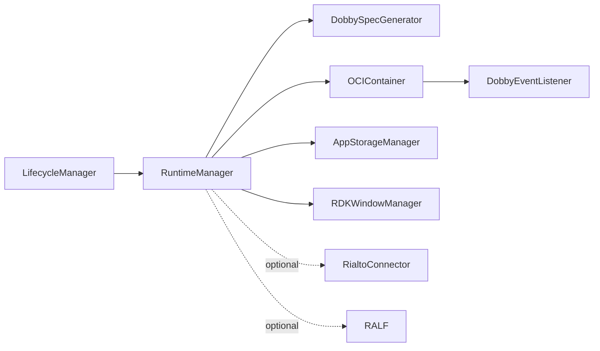
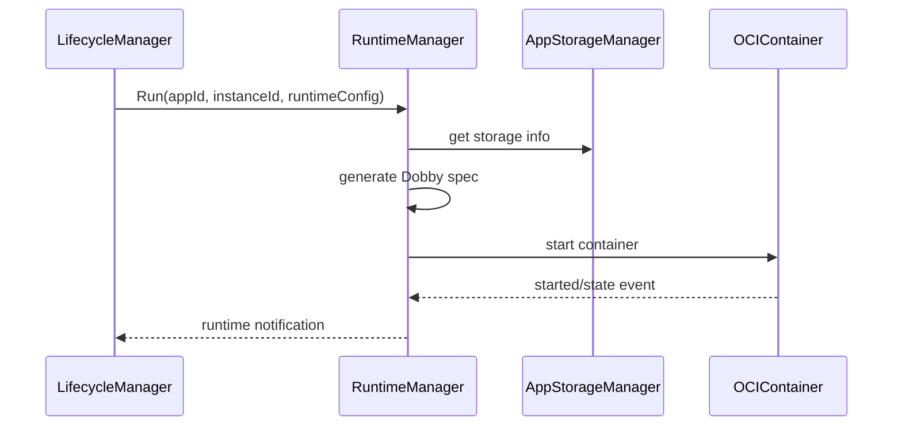
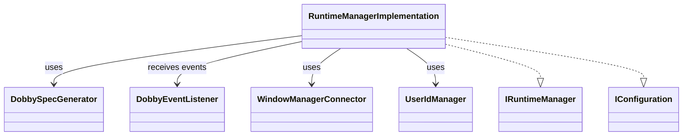
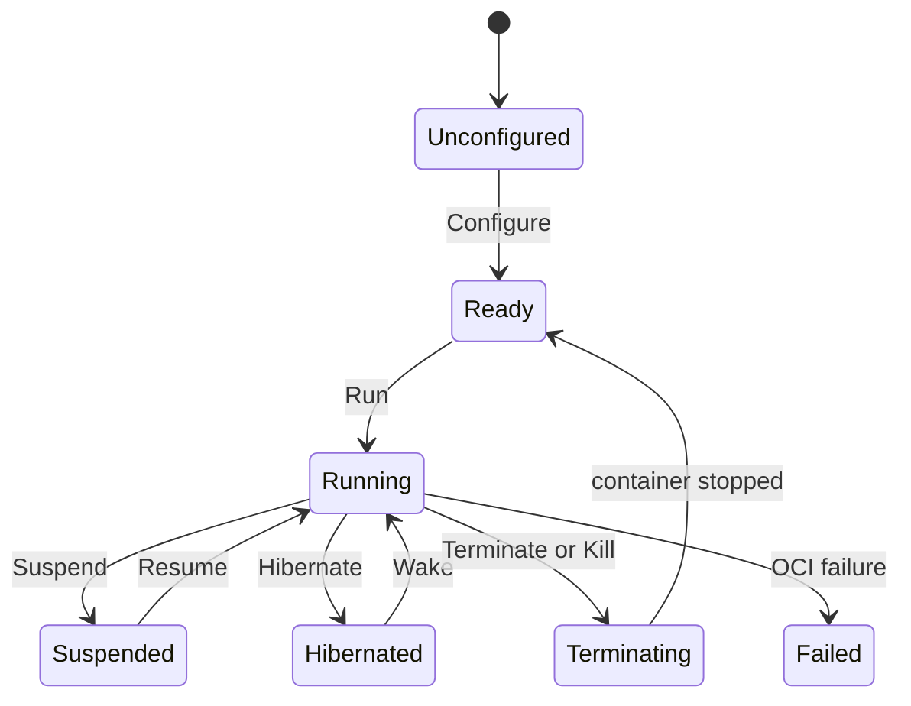

# RuntimeManager

## 1. High-Level Purpose & Architecture

RuntimeManager runs application containers and manages runtime state in ENT/RDK. It supports run, suspend, resume, hibernate, wake, terminate, kill, runtime information, annotations, mount, and unmount.

It does not own high-level lifecycle policy, package installation, or compositor implementation. It generates container specifications and drives the external OCIContainer service, while consulting AppStorageManager and RDKWindowManager.

## 2. Architectural Overview



## 3. Code Organization (Folder & File-Level)

- [RuntimeManager.h](../RuntimeManager/RuntimeManager.h), [RuntimeManager.cpp](../RuntimeManager/RuntimeManager.cpp): plugin wrapper and registration.
- [RuntimeManagerImplementation.h](../RuntimeManager/RuntimeManagerImplementation.h), `.cpp`: runtime API, configuration, event handling, and runtime-app map.
- [DobbySpecGenerator.h](../RuntimeManager/DobbySpecGenerator.h), `.cpp`: OCI/Dobby specification generation.
- [DobbyEventListener.h](../RuntimeManager/DobbyEventListener.h), `.cpp`: OCI event adaptation.
- [WindowManagerConnector.h](../RuntimeManager/WindowManagerConnector.h), `.cpp`: RDKWindowManager access.
- [UserIdManager.h](../RuntimeManager/UserIdManager.h), `.cpp`: runtime user/group identity support.
- [AIConfiguration.h](../RuntimeManager/AIConfiguration.h), `.cpp`: AI/runtime settings loading.
- [GStreamerRegistry.h](../RuntimeManager/GStreamerRegistry.h), `.cpp`: GStreamer-related runtime setup.
- [RialtoConnector.h](../RuntimeManager/RialtoConnector.h), `.cpp`: optional Rialto integration.
- [ralf/](../RuntimeManager/ralf/), [Gateway/](../RuntimeManager/Gateway/): optional package/runtime support and debug gateway code.
- [RuntimeManagerTelemetryReporting.h](../RuntimeManager/RuntimeManagerTelemetryReporting.h), `.cpp`: telemetry.
- [CMakeLists.txt](../RuntimeManager/CMakeLists.txt), [RuntimeManager.conf.in](../RuntimeManager/RuntimeManager.conf.in), [RuntimeManager.config](../RuntimeManager/RuntimeManager.config): build/configuration.

## 4. Class & Interface Documentation

### `RuntimeManager`

The wrapper exposes `IRuntimeManager` through Thunder and owns the plugin boundary.

### `RuntimeManagerImplementation`

It implements `IRuntimeManager`, `IConfiguration`, and `IEventHandler`. It owns OCI/storage/window interfaces, runtime notification subscribers, a map of `RuntimeAppInfo`, and optional Rialto/debug state.

Excerpt from [RuntimeManagerImplementation.h](../RuntimeManager/RuntimeManagerImplementation.h):

```cpp
virtual Core::hresult Run(const string& appId, const string& appInstanceId,
    const uint32_t userId, const uint32_t groupId, IValueIterator* const& ports,
    IStringIterator* const& paths, IStringIterator* const& debugSettings,
    const WPEFramework::Exchange::RuntimeConfig& runtimeConfigObject) override;
virtual Core::hresult Hibernate(const string& appInstanceId) override;
virtual Core::hresult Wake(const string& appInstanceId, const RuntimeState runtimeState) override;
virtual Core::hresult Suspend(const string& appInstanceId) override;
virtual Core::hresult Resume(const string& appInstanceId) override;
```

`RuntimeAppInfo` associates app and instance ids with a container id, descriptor, state, request time, and request type. The nested `Job` keeps the implementation alive while OCI events are dispatched.

## 5. Configuration & Build Integration

Implementation keys are `runtimeAppPortal` and `runtimeConfigFile`; plugin settings include `mode`, `locator`, `autostart`, and `startuporder`. The checked-in [RuntimeManager.config](../RuntimeManager/RuntimeManager.config) omits the two implementation keys declared by [RuntimeManager.conf.in](../RuntimeManager/RuntimeManager.conf.in), so generated deployment configuration is required.

Build flags include `RIALTO_SUPPORT`, `RALF_PACKAGE_SUPPORT`, `ENABLE_RDKAPPMANAGERS_RUNTIMECONFIG`, `RDK_APPMANAGERS_DEBUG`, YAML-C++, iptables, JSON-C++, and curl. AI settings additionally come from the hard-coded `/etc/rdk/rdkappmanagers.json` path in [AIConfiguration.cpp](../RuntimeManager/AIConfiguration.cpp).

## 6. Internal Workflows & Execution Flow

- **Configure:** parse runtime portal/config paths, create OCI/storage/window/event/user-ID helpers, load AI/runtime configuration, and register event listeners.
- **Run:** obtain app storage information, generate a Dobby spec, ask OCIContainer to start it, and record `RuntimeAppInfo`.
- **State control:** suspend/resume/hibernate/wake/terminate/kill map to container operations and request types.
- **Events:** OCI start/stop/failure/state events become implementation jobs and update runtime state/notifications.
- **Metadata:** `GetInfo`, `Annotate`, mount, and unmount expose runtime/container support operations.
- **Shutdown:** release event listeners, remote interfaces, connectors, configuration, and runtime state.

## 7. Diagrams & Visual Aids







## 8. Testing & Quality Analysis

Broad L0 coverage exists under [Tests/L0Tests/RuntimeManager](../Tests/L0Tests/RuntimeManager) for lifecycle, implementation, AI configuration, Dobby events/spec generation, window connector, RALF, and Gateway; L1 coverage also exists. Add tests for missing storage/window/OCI services, malformed runtime configuration, event ordering, hibernate recovery, optional Rialto/RALF builds, and the external configuration-file path.

Container semantics, Dobby policy, and some platform resource behavior are external and cannot be fully inferred from this repository.

## 9. Beginner-to-Expert Teaching Mode

**Must know first:** RuntimeManager is the container execution adapter. Learn app id versus app instance id, runtime state, OCI events, and generated specifications.

**Advanced path:** trace `Run` through storage lookup and `DobbySpecGenerator`, inspect event correlation and request types, then study Rialto, RALF, user identity, and runtime configuration feature flags.
