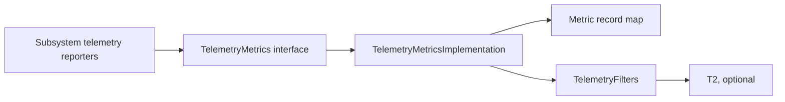
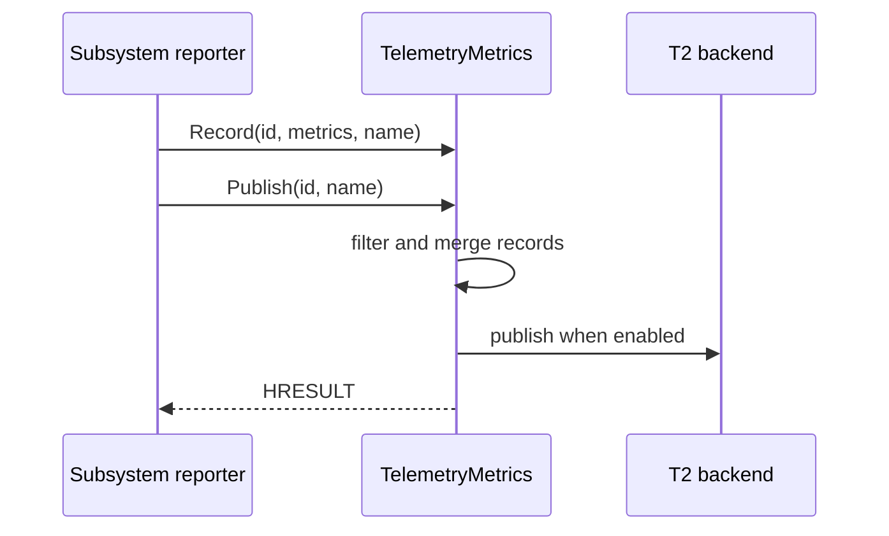
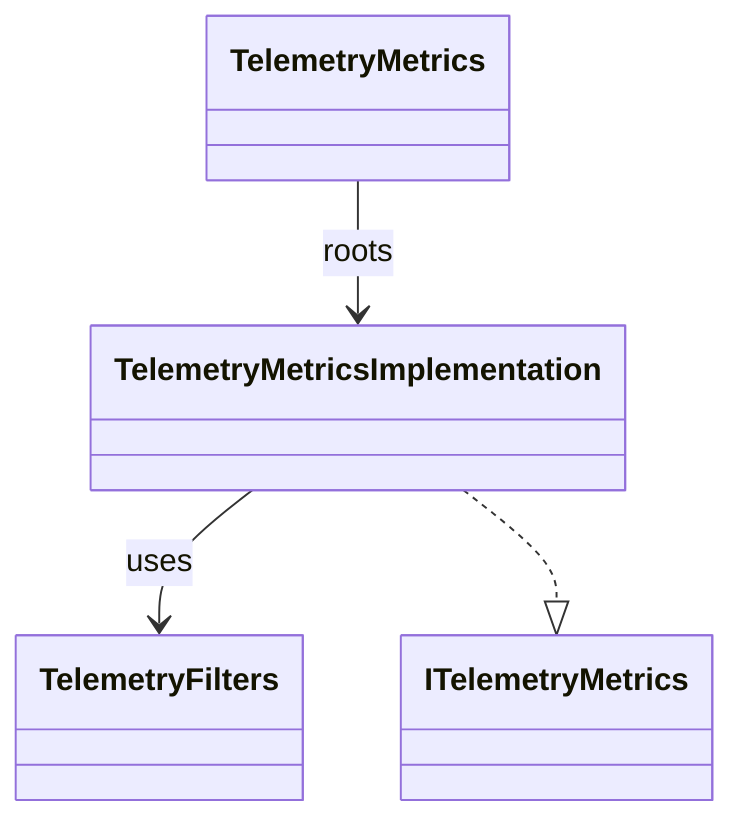
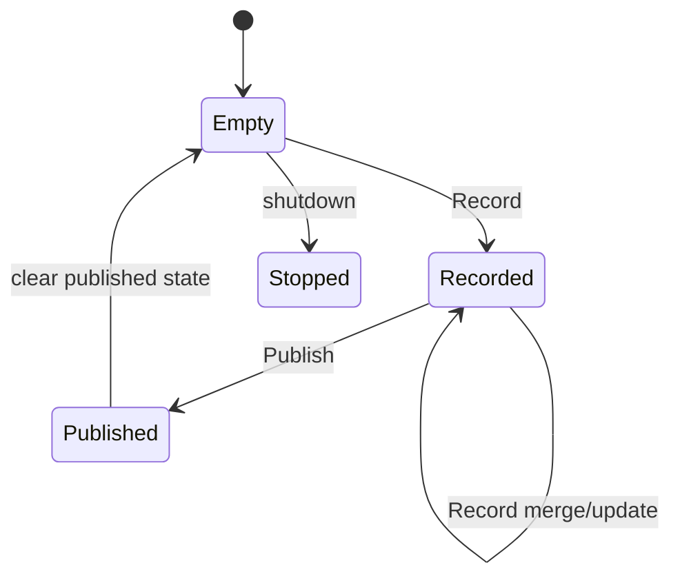

# TelemetryMetrics

## 1. High-Level Purpose & Architecture

TelemetryMetrics records JSON metric objects, indexes them by an `id`/`marker` identity, applies publish filtering/merge behavior, sends data through T2 when enabled, and clears published records.

It does not define subsystem-specific metrics or own application lifecycle. Other plugins report through shared telemetry helpers and query this service by callsign.

## 2. Architectural Overview



## 3. Code Organization (Folder & File-Level)

- [TelemetryMetrics.h](../TelemetryMetrics/TelemetryMetrics.h), [TelemetryMetrics.cpp](../TelemetryMetrics/TelemetryMetrics.cpp): plugin wrapper, registration, root/release lifecycle.
- [TelemetryMetricsImplementation.h](../TelemetryMetrics/TelemetryMetricsImplementation.h), `.cpp`: metric map, mutex, `Record`, and `Publish` implementation.
- [TelemetryFilters.h](../TelemetryMetrics/TelemetryFilters.h): publish filtering support.
- [Module.h](../TelemetryMetrics/Module.h), [Module.cpp](../TelemetryMetrics/Module.cpp): module support.
- [CMakeLists.txt](../TelemetryMetrics/CMakeLists.txt): target and optional T2 initialization.
- [TelemetryMetrics.conf.in](../TelemetryMetrics/TelemetryMetrics.conf.in), [TelemetryMetrics.config](../TelemetryMetrics/TelemetryMetrics.config): plugin configuration.

## 4. Class & Interface Documentation

### `TelemetryMetrics`

The wrapper implements the Thunder plugin lifecycle and roots `TelemetryMetricsImplementation` using the service shell.

### `TelemetryMetricsImplementation`

It implements `ITelemetryMetrics`, stores records in an unordered map, and protects them with a mutex. The constructor/destructor optionally initialize/uninitialize T2.

Excerpt from [TelemetryMetricsImplementation.h](../TelemetryMetrics/TelemetryMetricsImplementation.h):

```cpp
class TelemetryMetricsImplementation : public Exchange::ITelemetryMetrics {
public:
    Core::hresult Record(const string& id, const string& metrics, const string& name) override;
    Core::hresult Publish(const string& id, const string& name) override;
private:
    std::unordered_map<std::string, Json::Value> mMetricsRecord;
    std::mutex mMetricsMutex;
};
```

The wrapper's `Initialize` roots the implementation; `Deinitialize` releases it and terminates the remote connection when applicable.

## 5. Configuration & Build Integration

Plugin settings are `mode`, `locator`, `autostart`, and `startuporder`. `APPMANAGERS_ENABLE_T2_INIT` controls T2 setup in [CMakeLists.txt](../TelemetryMetrics/CMakeLists.txt). The root build includes this folder with `PLUGIN_TELEMETRYMETRICS`.

No TelemetryMetrics-specific L0 target is present in [Tests/L0Tests/CMakeLists.txt](../Tests/L0Tests/CMakeLists.txt); other subsystem telemetry tests and helper mocks exercise the integration indirectly.

## 6. Internal Workflows & Execution Flow

- **Startup:** Thunder calls `Initialize`; the wrapper roots the implementation. The implementation optionally initializes T2.
- **Record:** parse/merge a JSON metric under its identity while holding `mMetricsMutex`.
- **Publish:** apply filtering/merge rules, send the selected record through T2 when enabled, and clear published state.
- **Failure:** return an HRESULT or retain state according to implementation behavior; the exact T2 backend behavior is external.
- **Shutdown:** release the implementation, uninitialize T2, terminate the remote connection if applicable, and release the shell.

## 7. Diagrams & Visual Aids







## 8. Testing & Quality Analysis

There is no direct TelemetryMetrics-specific L0 test target in the current test CMake structure. Indirect telemetry tests exist in subsystem suites. Add focused tests for concurrent record/publish, malformed JSON, filtering, duplicate markers, T2-disabled behavior, and destructor/uninitialization behavior.

The shutdown path asserts on an undeclared `result` because its declaration is commented out at [TelemetryMetrics.cpp](../TelemetryMetrics/TelemetryMetrics.cpp#L107); this is a compile error that requires a source fix.

## 9. Beginner-to-Expert Teaching Mode

**Must know first:** telemetry is a shared record/publish service; `Record` accumulates data and `Publish` is the emission boundary. Learn the id/marker/name relationship and mutex-protected state.

**Advanced path:** inspect filtering and JSON merge semantics, follow a subsystem reporter through `QueryInterfaceByCallsign`, then study T2 feature-flag behavior and shutdown correctness.
