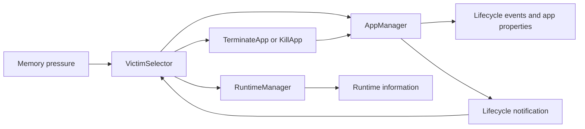
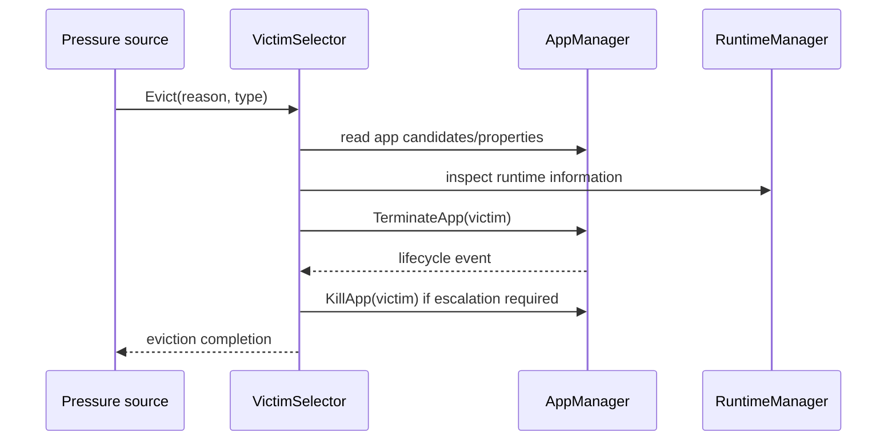
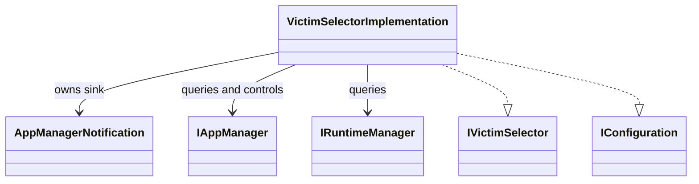
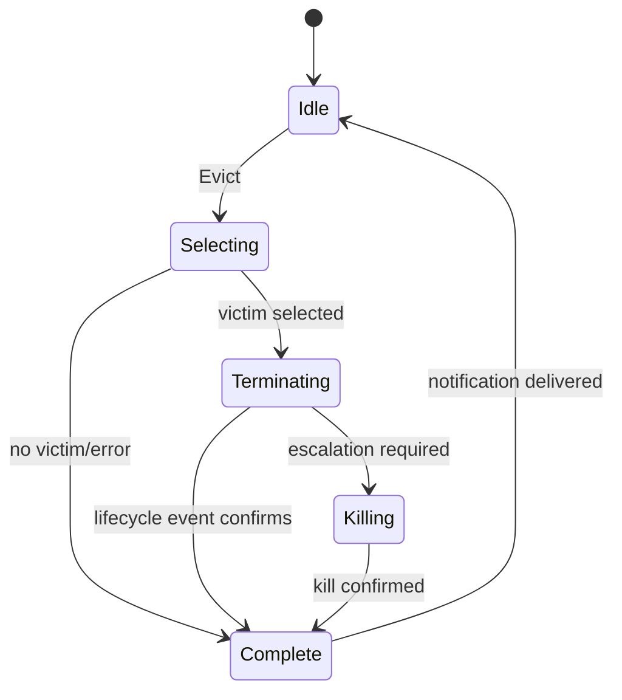

# VictimSelector

## 1. High-Level Purpose & Architecture

VictimSelector chooses an application to evict under memory pressure. It considers lifecycle state, memory usage, priority, recency, soft termination, hard kill, and escalation, then reports completion through its notification interface.

It does not own the lifecycle state machine, runtime memory measurement, or process/container termination implementation. It queries AppManager and RuntimeManager and asks AppManager to terminate or kill the selected app.

## 2. Architectural Overview



## 3. Code Organization (Folder & File-Level)

- [VictimSelector.h](../VictimSelector/VictimSelector.h), [VictimSelector.cpp](../VictimSelector/VictimSelector.cpp): plugin wrapper and registration.
- [VictimSelectorImplementation.h](../VictimSelector/VictimSelectorImplementation.h), `.cpp`: candidate selection, eviction state, service resolution, and event handling.
- [Module.h](../VictimSelector/Module.h), [Module.cpp](../VictimSelector/Module.cpp): module support.
- [VictimSelector.md](../VictimSelector/VictimSelector.md): pre-existing subsystem notes in the source folder.
- [CMakeLists.txt](../VictimSelector/CMakeLists.txt): wrapper/implementation targets and dependencies.
- [VictimSelector.conf.in](../VictimSelector/VictimSelector.conf.in), [VictimSelector.config](../VictimSelector/VictimSelector.config): plugin configuration.

## 4. Class & Interface Documentation

### `VictimSelector`

The wrapper exposes `IVictimSelector` through Thunder and owns the plugin lifecycle.

### `VictimSelectorImplementation`

It implements `IVictimSelector` and `IConfiguration`. It retains AppManager and RuntimeManager, registers an AppManager notification sink, tracks the pending app and eviction type, serializes eviction with two mutexes, and reports completion.

Excerpt from [VictimSelectorImplementation.h](../VictimSelector/VictimSelectorImplementation.h):

```cpp
Core::hresult Evict(const EvictionReason reason, const EvictionType type) override;
Core::hresult Configure(PluginHost::IShell* service) override;

private:
    Core::hresult selectVictim(std::string& appId, bool& isHibernated);
    uint32_t getAppPriority(const std::string& appId) const;
```

`AppManagerNotification` ignores unrelated event types and forwards lifecycle-state changes to the implementation. `releaseAppManager` unregisters/release dependencies and clears in-flight state.

## 5. Configuration & Build Integration

The plugin configuration contains `mode`, `locator`, `autostart`, and `startuporder`. The root build enables the folder through `PLUGIN_VICTIM_SELECTOR`; [CMakeLists.txt](../VictimSelector/CMakeLists.txt) builds separate wrapper and implementation libraries.

Selection depends on the AppManager priority property and AppManager's ordering guarantee that candidates are most-recently-active first. Neither contract is enforced locally.

## 6. Internal Workflows & Execution Flow

- **Configure:** resolve AppManager and RuntimeManager, register the AppManager listener, and clear prior eviction state.
- **Select:** inspect candidate apps, lifecycle state, memory/runtime information, priority, recency, and hibernation status.
- **Soft eviction:** request `TerminateApp` for the selected candidate.
- **Escalation:** if a hard `Evict` request arrives while a soft eviction is pending for the same app, request `KillApp`; termination failures are reported rather than automatically escalated.
- **Completion:** lifecycle notification for the pending app calls `complete`, which reports success or an error reason.
- **Shutdown:** unregister the listener, release service interfaces, and reset pending state.

## 7. Diagrams & Visual Aids







## 8. Testing & Quality Analysis

L0 implementation tests are under [Tests/L0Tests/VictimSelector](../Tests/L0Tests/VictimSelector); L1 coverage exists. Add lifecycle/component tests for candidate ranking, hibernated candidates, priority parsing, concurrent `Evict` calls, terminate-to-kill escalation, missing services, and notification loss.

The exact priority-property schema and AppManager ordering guarantee are external assumptions. They should be captured in an interface contract or integration test.

## 9. Beginner-to-Expert Teaching Mode

**Must know first:** VictimSelector is a policy layer that chooses a victim and delegates the action. Learn candidate ranking, soft versus hard eviction, and event-driven completion.

**Advanced path:** trace selection inputs from AppManager and RuntimeManager, inspect mutex/state ownership, then test ranking stability and escalation under concurrent lifecycle events.
