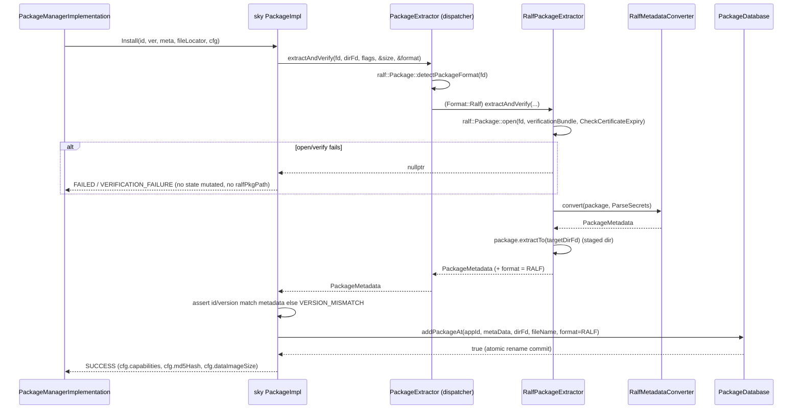

# Architecture & Design

## 1. Two candidate integration models

### Model A — "appserviced parity" (libralf reader only)
`libralf` replaces the zip reader; RALF packages are mounted and their metadata converted into
the existing Sky `PackageMetadata`; the container config is still produced by the Sky
`ISystemConfigProvider::getDobbySpec()` path and shipped as the `spec=` capability.

* ✅ Maximum reuse of Sky logic, no `RuntimeManager` change at all.
* ❌ **Fails AC4/AC5** — `RALFOCIGenerator` is never invoked; containers launch from a Dobby
  spec, not an OCI bundle.

### Model B — "entservices parity" (ralfPkgPath only)
`libpackage-sky` mimics `libpackage`'s `RalfPackageImpl`: mount with `libralf`, write the
`ralfPkgPath` JSON, let `RalfPackageBuilder`/`RalfOCIConfigGenerator` build the OCI bundle.

* ✅ Satisfies AC3/AC4/AC5 with zero downstream change.
* ❌ Bypasses `PackageExtractor`/`PackageDatabase`, so it is effectively the dead
  `RALF/PackageImpl.cpp` again — loses secrets, DIAL, DataImage, UserId, sysconfig,
  `extraMounts`, `resolution=`. **Fails AC6 in spirit** and creates two divergent code paths.

### ✅ Recommended — Model C: hybrid

> **Read/verify/mount with `libralf` inside the existing Sky pipeline (Model A), then emit
> `ralfPkgPath` instead of `spec=` for RALF packages only (Model B's transport).**

```
                                  ┌───────────────────────── libpackage-sky ─────────────────────────┐
                                  │                                                                  │
 fileLocator (fd) ──► PackageExtractor (dispatcher)                                                  │
                          │  detectPackageFormat(fd)                                                 │
            ┌─────────────┴──────────────┐                                                           │
   Format::Widget                  Format::Ralf                                                      │
            │                            │                                                           │
   (existing zip/XmlDSig path)   RalfPackageExtractor ──► RalfMetadataConverter                       │
            │                            │                        │                                   │
            └──────────┬─────────────────┘                        ▼                                   │
                       ▼                                  shared PackageMetadata                      │
               PackageDatabase  (unchanged: secrets, DataImage, UserId, DIAL, md5, version map)       │
                       │                                                                              │
                       ▼                                                                              │
              PackageImpl::Lock                                                                       │
                       │                                                                              │
       ┌───────────────┴──────────────────┐                                                           │
  format == ZIP                     format == RALF                                                    │
       │                                   │                                                          │
 getDobbySpec()  ──► capabilities          RalfPackageMounter ──► mounts + per-pkg config.json         │
                       "spec=<json>"               │                                                   │
                                                   └──► ralfPkgPath = /tmp/<id>_<ver>_metadata.json    │
                                  │                                                                   │
                                  └───────────────────────────────────────────────────────────────────┘
                                                  │
                                    ConfigMetaData { capabilities | ralfPkgPath }
                                                  │
                        PackageManagerImplementation::getRuntimeConfig()   (unchanged)
                                                  │
                                  Exchange::RuntimeConfig { capabilities, ralfPkgPath }
                                                  │
                          RuntimeManagerImplementation::generate()   ◄── MUST become runtime dispatch
                             ├─ ralfPkgPath.empty()  → DobbySpecGenerator → StartContainerFromDobbySpec
                             └─ else                 → RalfPackageBuilder → RalfOCIConfigGenerator
                                                                          → StartContainer(ociRootfsPath)
```

**Invariant that makes the whole design work:**
`ralfPkgPath` is non-empty **iff** the package is a Bolt/RALF package.
Everything downstream keys off that one string — no new field, no new flag, no schema change.

---

## 2. Component inventory

### New in `ref/libpackage-sky-ralf` (all compiled only when `ENABLE_RALF_PACKAGE_SUPPORT=ON`)

| Class | Port source | Responsibility |
|---|---|---|
| `RalfPackageExtractor : IPackageExtractor` | appserviced `RalfPackageExtractor` | Open/verify via `ralf::Package`, extract to dir fd, read single file, report `PackageFormat` |
| `RalfMetadataConverter` | appserviced `RalfMetadataConverter` | `ralf::PackageMetaData` → Sky `PackageMetadata` (app info, permissions, icons, DIAL, ports, audio, input, log levels, display, lifecycle, vendor configs, secrets) |
| `RalfMountedPackage : IExtractedPackage` | appserviced `RalfMountedPackage` | Thin wrapper over `ralf::PackageMount`; unmount + mount-point cleanup on destruction |
| `RalfPackageMounter` | *new* (blends `libpackage::RalfPackageImpl::lockPackage` + appserviced `MountedPackagesManager::mountWithLibRalf`) | Recursive dependency lock/mount, refcounting, per-package `config.json` emission, `ralfPkgPath` JSON serialization, unlock/unmount |

### Modified in `ref/libpackage-sky-ralf`

| File | Change |
|---|---|
| `IPackageExtractor.h` | Widen: add `packageFormat` out-param, add `SkipSignatureVerification` / `AllowSecretsFailure` flags. Internal header — safe. |
| `PackageExtractor.{h,cpp}` | Becomes a **dispatcher**: owns optional `mRalfExtractor`, routes on `detectPackageFormat`. Existing zip logic moves untouched into a private `ZipPackageExtractor` (or stays in place and is selected as `this`). |
| `PackageDatabase.{h,cpp}` | Record `PackageFormat` per package; `loadPackage()` returns `RalfMountedPackage` for RALF entries |
| `common/IPackageManagerConfig.h` + `Config/` | Add `getRalfPackagesEnabled()`, `useRalfUtilsForWidgets()`, read `.packages.ralf.*` from `/etc/sky/aisettings.json`, default `false` |
| `PackageImpl.{h,cpp}` | Own `RalfPackageMounter`; in `Lock()` branch on format — `spec=` for ZIP, `ralfPkgPath` for RALF; in `Unlock()` release the mount; in `GetFileMetadata()` report format |
| `CMakeLists.txt` | `option(ENABLE_RALF_PACKAGE_SUPPORT ... OFF)` → `find_package(libralf)`, add `Ralf*.cpp`, link `ralf` |

### Modified in this repo (minimal, additive)

| File | Change | Why |
|---|---|---|
| `RuntimeManager/RuntimeManagerImplementation.cpp` | Convert 7 `#ifdef RALF_PACKAGE_SUPPORT_ENABLED` blocks from **compile-time exclusive** to **runtime dispatch on `ralfPkgPath`** | Without this, one image cannot serve both widgets and Bolt packages → AC2 + AC6 impossible |
| `RuntimeManager/RuntimeManagerImplementation.h` | Add `bool ralfMode` to the per-instance `RuntimeAppInfo` | Terminate/failure cleanup must only unmount overlayfs for instances actually launched in RALF mode |

**No change** to `RuntimeManager/ralf/*`, `RalfOCIConfigGenerator`, `RalfPackageBuilder`,
`RalfSupport`, or `PackageManagerImplementation::getRuntimeConfig` is required.

---

## 3. Sequence: install a Bolt Package



## 4. Sequence: lock + launch a Bolt Package

```mermaid
sequenceDiagram
  participant PM as PackageManagerImplementation
  participant PI as sky PackageImpl
  participant RM as RalfPackageMounter
  participant RT as RuntimeManagerImplementation
  participant RB as ralf::RalfPackageBuilder
  participant OG as ralf::RalfOCIConfigGenerator
  participant OCI as OCIContainer

  PM->>PI: Lock(id, ver, &unpackedPath, &cfg, &additionalLocks)
  PI->>RM: lock(package)
  loop each dependency (recursive)
    RM->>RM: identifyDependencyVersion + openPackage + mount
  end
  RM->>RM: package.verify(); package.mount(/tmp/mounts/<id>_<ver>/rootfs)
  RM->>RM: emit <mount>/config.json  (aux metadata, or synthesized)
  RM-->>PI: vector<{pkgMountPath, pkgMetaDataPath}>
  PI->>PI: serialize to /tmp/<id>_<ver>_metadata.json
  PI-->>PM: SUCCESS, cfg.ralfPkgPath = <that path>   (cfg has NO "spec=" capability)
  PM->>RT: Run(...) with RuntimeConfig.ralfPkgPath set
  RT->>RT: generate(): ralfPkgPath non-empty → RALF branch
  RT->>RB: generateRalfDobbySpec(config, runtimeConfig, &ociRootfsPath)
  RB->>RB: parseRalPkgInfo + generateOCIRootfs (overlayfs)
  RB->>OG: generateRalfOCIConfig(config, runtimeConfig)
  OG-->>RB: /tmp/ralf/<instance>/config.json
  RB-->>RT: true
  RT->>OCI: StartContainer(containerId, ociRootfsPath, "", "", ...)
```

## 5. Sequence: EntOS Widget — unchanged

```mermaid
sequenceDiagram
  participant PI as sky PackageImpl
  participant PE as PackageExtractor (dispatcher)
  participant SC as ISystemConfigProvider
  participant RT as RuntimeManagerImplementation
  participant DG as DobbySpecGenerator
  participant OCI as OCIContainer

  PI->>PE: extractAndVerify(fd, ...)
  PE->>PE: detectPackageFormat == Widget && !useRalfUtilsForWidgets
  PE->>PE: existing MiniUnzip + XmlDSig path (byte-identical)
  PI->>SC: getDobbySpec(package, capabilities, runtimeExec, runtimePath)
  PI->>PI: capabilities += "spec=" + escaped(json);  ralfPkgPath stays EMPTY
  RT->>RT: generate(): ralfPkgPath empty → legacy branch
  RT->>DG: generate(config, runtimeConfig, &dobbySpec)
  RT->>OCI: StartContainerFromDobbySpec(containerId, dobbySpec, "", westerosSocket, ...)
```

---

## 6. Contracts, frozen

### 6.1 `ralfPkgPath` file (produced by libpackage-sky, consumed by `ralf::parseRalPkgInfo`)

```jsonc
{
  "packages": [
    { "pkgMountPath": "/tmp/mounts/<id>_<ver>/rootfs",
      "pkgMetaDataPath": "/tmp/mounts/<id>_<ver>/config.json" }
    // dependencies first is NOT required; RalfPackageBuilder reverse-iterates
    // to build overlayfs lowerdirs, so the app package must be LAST in the array
    // (matching libpackage's post-order push_back).
  ]
}
```
Field names are **exact** — `RalfSupport.cpp:321` reads `pkgMetaDataPath` and `pkgMountPath`.

> ⚠️ **Ordering matters.** `RalfPackageBuilder::generateOCIRootfsPackage` builds
> `lowerdir = gpu-layer:pkg[n-1]:pkg[n-2]:...:pkg[0]` by reverse iteration. `libpackage`
> appends dependencies before the app (post-order recursion), so the app package ends up
> first in the lowerdir chain (highest priority). **Replicate the post-order push order
> exactly.**

### 6.2 Per-package `config.json` (consumed by `RalfOCIConfigGenerator`)

MIME type `application/vnd.rdk.package.config.v1+json`. Keys read today:

| Key | Used for |
|---|---|
| `packageType` (`application`\|`runtime`\|`base`\|`resource`\|`service`) | layer role, override selection |
| `configuration` (object, required) | root of everything below |
| `entryPoint`, `entryArgs` | OCI `process.args` |
| `urn:rdk:config:env` | `process.env` |
| `urn:rdk:config:memory.systemMemory` | cgroup memory limit |
| `urn:rdk:config:storage.maxLocalStorage` | storage mount sizing |
| `urn:rdk:config:network` | netns / bridge config |
| `urn:rdk:config:overrides.{application,runtime}` | per-role overrides |
| `urn:rdk:permission:{internet,firebolt,thunder}` | capability gating |

### 6.3 `ConfigMetaData` fields used by this design

Authoritative header: `ref/eshelpers/packager/IPackageImpl.h`.
`ralfPkgPath`, `capabilities`, `packageFormat`, `mimeType`, `appPath`, `userId`, `groupId`,
`dial`, `appType`, `md5Hash`, `dataImageSize` — **all already exist. No header change needed.**

---

## 7. Design rules (non-negotiable)

1. **No free-standing helper functions.** Every new helper lives inside a class or an explicit
   namespace, per repo convention.
2. **All new libpackage-sky code lives in `namespace packagemanager { ... }`** (or matches
   the surrounding file's existing namespace — note appserviced's `Ralf*` classes are
   global-scope; in libpackage-sky they must be namespaced to match `PackageImpl.cpp`).
3. **Widget path is touched only at the dispatch point.** Zero edits inside the zip reader,
   `ManifestFileParser`, `PackageConfigParser`, secrets, DIAL or migration-mount logic.
4. **Default build is unchanged.** With `ENABLE_RALF_PACKAGE_SUPPORT=OFF` no `libralf`
   symbol, header, or `find_package` is referenced, and the produced `libPackage.so` is
   functionally identical to today's.
5. **Fail before mutating.** Verification failure must return `VERIFICATION_FAILURE`/`FAILED`
   *before* any rename-into-place and *before* `ralfPkgPath` is assigned, so `RuntimeManager`
   can never be handed a path to garbage (AC7).
