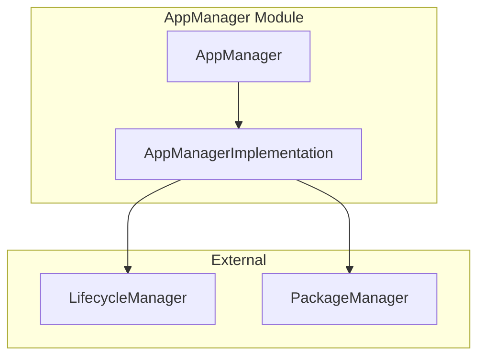

# OpenSpec Explore: Spec Inference Guide

This guide documents how OpenSpec explore should systematically extract and infer module specifications from the entservices-appmanagers codebase.

## Overview

Specs can be automatically inferred from:
1. **CMakeLists.txt** - Dependencies, build options, configuration
2. **Module Headers** (.h files) - Public API interfaces, capabilities
3. **Module Documentation** (.md files) - Purpose, architecture, responsibilities
4. **Module Implementation** (.cpp files) - Integration patterns, data flow
5. **Config Files** (.conf.in, .config) - Runtime configuration, options

---

## Extraction Patterns

### Pattern 1: Identifying Module Purpose & Responsibility

**Source**: `<MODULE>/<MODULE>.md` files

**Extraction Logic**:
```
1. Read the "Purpose & Role" section
2. Extract "Core Responsibilities" bullet list
3. Extract "Non-Goals" (if present)
4. Map to spec "Capabilities" section
```

**Example**:
- File: `AppManager/AppManager.md` → Capabilities → Primary Responsibilities
- File: `RuntimeManager/RuntimeManager.md` → Capabilities → Primary Responsibilities

---

### Pattern 2: Identifying External Dependencies

**Source**: `<MODULE>/CMakeLists.txt` - `find_package()` calls

**Extraction Logic**:
```cmake
find_package(WPEFramework)                    → Framework dependency
find_package(${NAMESPACE}Plugins REQUIRED)    → WPEFramework plugins
find_package(${NAMESPACE}Definitions REQUIRED)→ API definitions
find_package(CompileSettingsDebug)            → Build settings
find_package(Curl REQUIRED)                   → System library (curl)
find_package(yaml-cpp CONFIG REQUIRED)        → Optional: YAML support (if guarded)
```

**Output Structure**:
```
External Repositories:
  ├─ entservices-apis → from find_package(${NAMESPACE}Definitions)
  ├─ Dobby → mentioned in docs + RuntimeManager code
  └─ rdk-window-manager → RDKWindowManager module

System Libraries:
  ├─ WPEFramework
  ├─ curl
  ├─ yaml-cpp (optional, guarded by if statement)
  ├─ jsoncpp
  └─ crun (runtime dependency, not build)
```

**Rules**:
- If `find_package(...REQUIRED)` → Mandatory
- If `find_package(...QUIET)` → Optional
- If inside `if(OPTION)` block → Optional feature
- If only in comments/docs → Inferred dependency

---

### Pattern 3: Identifying Build Configuration Options

**Source**: `<MODULE>/CMakeLists.txt` - `set()` and `option()` directives

**Extraction Logic**:
```cmake
set(PLUGIN_NAME AppManager)
set(PLUGIN_APP_MANAGER_MODE "Off" CACHE STRING "...")  
    → Option: PLUGIN_APP_MANAGER_MODE
    → Type: String
    → Default: "Off"
    → Description: extracted from comment

option(AIMANAGERS_TELEMETRY_METRICS_SUPPORT "..." OFF)
    → Option: AIMANAGERS_TELEMETRY_METRICS_SUPPORT
    → Type: ON/OFF (boolean)
    → Default: OFF
    → Description: extracted from option() description

if(ENABLE_RDKAPPMANAGERS_RUNTIMECONFIG)
    find_package(yaml-cpp CONFIG REQUIRED)
    add_definitions(-DENABLE_RDKAPPMANAGERS_RUNTIMECONFIG)
    → Conditional Option: ENABLE_RDKAPPMANAGERS_RUNTIMECONFIG
    → Enables: yaml-cpp dependency + compile definitions
    → Type: ON/OFF
    → Default: OFF (inferred from silent if-block)
```

**Output Structure**:
```
CMake Configuration:
  ├─ PLUGIN_APP_MANAGER_MODE (String: Off) - Plugin execution mode
  ├─ PLUGIN_APP_MANAGER_AUTOSTART (Boolean: false) - Auto-start behavior
  ├─ AIMANAGERS_TELEMETRY_METRICS_SUPPORT (ON/OFF: OFF) - Telemetry enable
  └─ ENABLE_RDKAPPMANAGERS_RUNTIMECONFIG (ON/OFF: OFF) - Runtime config
```

---

### Pattern 4: Identifying Module Internal Dependencies

**Source**: Root-level `CMakeLists.txt` - `add_subdirectory()` calls + `target_link_libraries()`

**Extraction Logic**:
```cmake
# Root CMakeLists.txt
add_subdirectory(helpers)
add_subdirectory(RDKWindowManager)
add_subdirectory(LifecycleManager)
add_subdirectory(AppManager)
add_subdirectory(RuntimeManager)

# Per-module CMakeLists.txt
target_link_libraries(${MODULE_NAME} PRIVATE
    CompileSettingsDebug::CompileSettingsDebug
    ${NAMESPACE}Plugins::${NAMESPACE}Plugins
    AppManagersHelpers                    ← Internal dependency
    ${CURL_LIBRARY}
)
```

**Rules**:
- `AppManagersHelpers` → Internal library
- Other modules → Inter-module plugin dependencies (not link-time)
- Modules communicate via JSON-RPC/DBus at runtime

**Output Structure**:
```
Internal Dependencies:
  ├─ AppManagersHelpers (Library)
  ├─ LifecycleManager (Plugin - JSON-RPC)
  ├─ RuntimeManager (Plugin - JSON-RPC)
  └─ PackageManager (Plugin - JSON-RPC)
```

---

### Pattern 5: Identifying API Interfaces

**Source**: `<MODULE>/<MODULE>.h` - Class/interface definitions

**Extraction Logic**:
```cpp
// AppManager.h
class AppManager : public PluginHost::IPlugin {
    DECLARE_INTERFACE_ID;
public:
    virtual uint32_t Initialize(...) = 0;
    virtual uint32_t Deinitialize(...) = 0;
};

// AppManagerImplementation.h
class AppManagerImplementation : public Exchange::IAppManager {
public:
    uint32_t LaunchApp(...) override;
    uint32_t CloseApp(...) override;
    uint32_t TerminateApp(...) override;
    // ... methods → API surface
};
```

**Output Structure**:
```
Public APIs (JSON-RPC):
  ├─ LaunchApp(appId, intent, launchArgs)
  ├─ CloseApp(appId)
  ├─ TerminateApp(appId)
  ├─ GetLoadedApps()
  └─ SetTargetAppState(appId, targetState)
```

**Rules**:
- Extract public methods from `IXxxx` interfaces
- Skip internal helper methods (private/protected)
- Map method names → API names

---

### Pattern 6: Identifying Configuration Files

**Source**: `<MODULE>/<MODULE>.conf.in` and `<MODULE>/<MODULE>.config`

**Extraction Logic**:
```
Presence of *.conf.in and *.config files → Module is configurable

Example:
├─ AppManager.conf.in
├─ AppManager.config

Output:
  Config File: AppManager.conf.in / AppManager.config
  Configurable Settings: (extracted from file content)
    └─ Plugin mode, autostart, library paths, settings
```

---

### Pattern 7: Identifying Data Flow & Integration

**Source**: Module documentation (.md) - Architecture diagrams + code analysis

**Extraction Logic**:

From **Architecture Diagrams** in module .md files:
```

→ Extract module connections and interaction patterns
```

From **Code Structure**:
```cpp
class AppManagerImplementation {
private:
    LifecycleInterfaceConnector* mLifecycleInterfaceConnector;
    IPackageHandler* mPackageManagerHandlerObject;
};
```
→ Identifies which plugins are used

---

## Automated Spec Generation Algorithm

### Step 1: Inventory Discovery
```
For each directory in root:
    If matches pattern [A-Z][a-zA-Z]+/ (e.g., AppManager/):
        Create ModuleInfo entry
        - moduleName = directory name
        - type = "Plugin" (inferred)
        - apiVersion = extract from CMakeLists.txt
        - status = "found"
```

### Step 2: Build Configuration Extraction
```
For each module's CMakeLists.txt:
    Extract:
    ├─ find_package() calls
    ├─ option() declarations
    ├─ set(...CACHE...) declarations
    ├─ add_definitions() calls
    ├─ target_link_libraries()
    └─ add_subdirectory() calls
```

### Step 3: Documentation Synthesis
```
For each module's <MODULE>.md file:
    Extract sections:
    ├─ Purpose & Role → Overview.Purpose
    ├─ Core Responsibilities → Capabilities.Primary
    ├─ Dependencies table → Dependencies.InternalDependencies
    ├─ Architecture diagram → Integration.DataFlow
    └─ Class diagrams → Interfaces.PublicAPIs
```

### Step 4: API Surface Extraction
```
For each module's <MODULE>Implementation.h:
    Extract:
    ├─ Class name → Implementation class
    ├─ Public virtual methods → API methods
    ├─ Method signatures → Parameters, return types
    └─ Comment blocks → API descriptions
```

### Step 5: Optional Features Analysis
```
For each CMakeLists.txt:
    Scan for:
    if(OPTION_NAME)
        find_package(...)
        add_definitions(...)
    endif()
    → Mark dependency as Optional
    → Link to enabling option
```

### Step 6: Cross-Reference Building
```
For each module:
    ├─ Scan for target_link_libraries(... AppManagersHelpers ...)
    │   → Internal dependency on helpers
    ├─ Scan CMakeLists.txt for other module references
    │   → But note: Plugin dependencies are runtime (JSON-RPC)
    └─ Cross-reference with entservices-apis for interface definitions
        → Map to external repo dependency
```

### Step 7: Template Rendering
```
For each module with extracted data:
    Render SPEC_TEMPLATE.md with:
    ├─ Module metadata
    ├─ Extracted capabilities
    ├─ Extracted dependencies
    ├─ Extracted CMake configuration
    ├─ Extracted APIs (from .h files)
    └─ Data flow (from architecture diagrams)

Output: <MODULE>.spec.md
```

---

## File Patterns for Extraction

### Critical Files to Read
```
/AppManager/
├─ CMakeLists.txt          ← Build config, options, deps
├─ AppManager.md           ← Purpose, responsibilities, architecture
├─ AppManager.h            ← Plugin interface
├─ AppManagerImplementation.h  ← API surface (IAppManager)
├─ AppManager.conf.in      ← Configuration options
└─ Module.cpp              ← Module registration (register APIs)
```

### Regular Expression Patterns

**Module Discovery**:
```
Pattern: ^[A-Z][a-zA-Z0-9]+/(CMakeLists\.txt|[A-Z][a-zA-Z0-9]+\.md)$
Matches: AppManager/CMakeLists.txt, RuntimeManager/RuntimeManager.md
```

**CMake Package Detection**:
```
Pattern: find_package\((\${NAMESPACE})?([a-zA-Z]+)([^)]*)\)
Captures: Package name, modifiers (REQUIRED, QUIET), conditions
```

**Option Detection**:
```
Pattern: option\(([A-Z_]+)\s+"([^"]+)"\s+([A-Z]+|OFF)\)
Captures: Option name, description, default value
```

**API Method Extraction**:
```
Pattern: virtual\s+(uint32_t|int|void|hresult)\s+([a-zA-Z]+)\((.*)\)
Captures: Return type, method name, parameters
```

---

## Validation Rules

After extraction, validate:

1. **Dependency Consistency**
   - All `find_package()` packages documented in External Repos
   - No undocumented external dependencies
   - Version constraints noted if present

2. **Internal Dependency Cycles**
   - Detect circular dependencies between modules
   - Flag as warning if found (may indicate design issue)

3. **API-to-Implementation Mapping**
   - All public APIs documented
   - Implementation classes link to interfaces

4. **Configuration Completeness**
   - All CMake options in template
   - Option descriptions from CMakeLists.txt

---

## Example: AppManager Spec Inference

```
1. Directory: AppManager/ → Module: AppManager
2. Purpose: From AppManager.md → "Primary API for application lifecycle management"
3. Capabilities: From responsibilities list → LaunchApp, CloseApp, state management
4. Dependencies from CMakeLists.txt:
   └─ find_package(${NAMESPACE}Plugins REQUIRED)
   └─ find_package(${NAMESPACE}Definitions REQUIRED)
   └─ No curl/yaml/external libs → No system deps needed
5. APIs from AppManagerImplementation.h:
   └─ LaunchApp, CloseApp, TerminateApp, GetLoadedApps, etc.
6. CMake options from CMakeLists.txt:
   └─ PLUGIN_APP_MANAGER_MODE, PLUGIN_APP_MANAGER_AUTOSTART
   └─ AIMANAGERS_TELEMETRY_METRICS_SUPPORT
7. Output: AppManager.spec.md (auto-generated)
```

---

## Future Enhancements

1. **Automatic Version Extraction** - Parse version from CMakeLists.txt (add_definitions)
2. **Test Coverage Mapping** - Scan Tests/ directory for test locations
3. **Configuration Schema** - Parse .conf.in files for configuration details
4. **Deprecation Detection** - Scan for TODO/DEPRECATED comments
5. **Breaking Change Detection** - Compare spec versions for API changes
6. **Dependency Graph Visualization** - Auto-generate mermaid diagrams from extracted data

