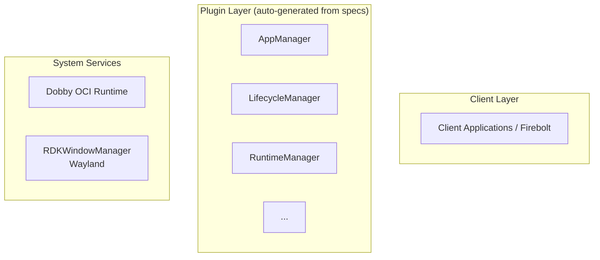

# OpenSpec Explore: Output Format Guide

This document defines the professional output format that OpenSpec explore should generate when analyzing the entservices-appmanagers repository.

## Output Artifacts

OpenSpec explore should generate the following artifacts when run on this codebase:

### 1. Executive Summary Document
**File**: `REPOSITORY_SUMMARY.md`

**Purpose**: High-level overview suitable for stakeholders

**Structure**:
```markdown
# ENT Services AppManagers - Repository Overview

## Quick Facts
- **Type**: WPEFramework Plugin Collection
- **Language**: C++11
- **Modules**: 9 plugins + helpers
- **Build System**: CMake 3.3+
- **License**: Apache 2.0

## Core Capabilities
- Application lifecycle management (launch, pause, suspend, terminate)
- OCI container runtime (via Dobby)
- Package installation and management
- Display and window management (Wayland)
- Performance metrics and telemetry
- Persistent application storage

## Architecture Snapshot
[Generate simple ASCII or mermaid diagram from extracted architecture]

## Key Dependencies
- **Framework**: WPEFramework
- **Container Runtime**: Dobby (crun)
- **Display**: Wayland (Essos/Westeros)
- **Packages**: libpackage-sky
- **APIs**: entservices-apis
- **Helpers**: eshelpers
```

### 2. Requirements & Compatibility Matrix
**File**: `REQUIREMENTS.md`

**Structure**:
```markdown
# System Requirements

## Build Dependencies

| Package | Version | Purpose | Optional |
|---------|---------|---------|----------|
| CMake | ≥3.3 | Build system | No |
| WPEFramework | Latest | Plugin framework | No |
| curl | Latest | HTTP client | No |
| jsoncpp | - | JSON handling | No |
| yaml-cpp | - | YAML config parsing | Yes* |
| crun | ≥0.13 | OCI runtime | Runtime |
| criu | Latest | Checkpoint/restore | Yes (hibernation) |

*Optional for specific features

## External Repositories

| Repository | Branch | Stability | Purpose |
|------------|--------|-----------|---------|
| entservices-apis | develop | Stable | API interfaces |
| rdk-window-manager | develop | Stable | Display management |
| libpackage-sky | main | Stable | Package operations |
| eshelpers | develop | Stable | Utilities |
| Dobby | main | Stable | Container runtime |

## Platform Requirements
- RDK-based set-top box or compatible device
- Linux kernel 4.14+ (for container support)
- Wayland display server
- systemd (recommended for service management)
```

### 3. Module Catalog
**File**: `MODULES.md`

**Structure**:
```markdown
# Module Catalog

## Core Modules

### AppManager
**Type**: Plugin  
**Purpose**: Primary API for application lifecycle management  
**Status**: Stable (v1.0.0)

| Metric | Value |
|--------|-------|
| Dependencies | LifecycleManager, PackageManager, AppStorageManager |
| Build Size | ~500 KB |
| Memory (avg) | 5-10 MB |
| External Deps | WPEFramework |
| Optional Features | Telemetry |

[Repeat for each module with auto-generated metrics]
```

### 4. CMake Configuration Reference
**File**: `CMAKE_OPTIONS.md`

**Structure**:
```markdown
# CMake Build Configuration

## Global Options

| Option | Type | Default | Scope | Purpose |
|--------|------|---------|-------|---------|
| CMAKE_BUILD_TYPE | String | Debug | All | Release or Debug build |
| AIMANAGERS_TELEMETRY_METRICS_SUPPORT | ON/OFF | OFF | All | Enable telemetry for all modules |

## Module-Specific Options

| Option | Module | Type | Default | Purpose |
|--------|--------|------|---------|---------|
| PLUGIN_APP_MANAGER_MODE | AppManager | String | Off | Plugin execution mode |
| PLUGIN_LIFECYCLE_MANAGER_MODE | LifecycleManager | String | Off | Plugin execution mode |
| RALF_PACKAGE_SUPPORT | RuntimeManager | ON/OFF | OFF | Enable RALF packages |
| ENABLE_RDKAPPMANAGERS_RUNTIMECONFIG | RuntimeManager | ON/OFF | OFF | YAML runtime config |
| USE_LIBPACKAGE_RALF | PackageManager | ON/OFF | OFF | Use RALF format |

## Build Variants

### Debug Build
```bash
cmake -DCMAKE_BUILD_TYPE=Debug \
      -DAIMANAGERS_TELEMETRY_METRICS_SUPPORT=ON \
      -DENABLE_RDKAPPMANAGERS_RUNTIMECONFIG=ON ../
```

### Release Build (Minimal)
```bash
cmake -DCMAKE_BUILD_TYPE=Release \
      -DAIMANAGERS_TELEMETRY_METRICS_SUPPORT=OFF ../
```

### Full-Featured Build
```bash
cmake -DCMAKE_BUILD_TYPE=Release \
      -DAIMANAGERS_TELEMETRY_METRICS_SUPPORT=ON \
      -DENABLE_RDKAPPMANAGERS_RUNTIMECONFIG=ON \
      -DRALF_PACKAGE_SUPPORT=ON \
      -DUSE_LIBPACKAGE_RALF=ON ../
```
```

### 5. Architecture & Integration Guide
**File**: `ARCHITECTURE.md`

**Structure**:
```markdown
# Architecture & Integration

## System Architecture



## Module Dependency Graph

```
AppManager
  ├─→ LifecycleManager
  ├─→ PackageManager
  ├─→ AppStorageManager
  └─→ TelemetryMetrics (optional)

LifecycleManager
  ├─→ RuntimeManager
  └─→ RDKWindowManager

RuntimeManager
  ├─→ RDKWindowManager
  ├─→ AppStorageManager
  └─→ Dobby (external)

PackageManager
  ├─→ AppStorageManager
  └─→ libpackage-sky (external)
```

## Data Flow Diagrams

[Auto-generate from module spec data flows]
```

### 6. Build & Installation Instructions
**File**: `BUILD_INSTALL.md`

**Structure** (auto-generated from CMakeLists.txt):
```markdown
# Build & Installation

## Prerequisites
[Auto-generated from REQUIREMENTS.md]

## Quick Start

### 1. Clone Repository
\`\`\`bash
git clone https://github.com/rdkcentral/entservices-appmanagers.git
cd entservices-appmanagers
\`\`\`

### 2. Configure Build
\`\`\`bash
mkdir build && cd build
cmake -DCMAKE_BUILD_TYPE=Debug ../
\`\`\`

### 3. Build
\`\`\`bash
make -j$(nproc)
\`\`\`

### 4. Install
\`\`\`bash
sudo make install
\`\`\`

## Build Artifacts
[Auto-generated list from CMakeLists.txt install targets]

| Plugin | Output | Install Path |
|--------|--------|--------------|
| AppManager | RdkCppPlugin_AppManager.so | /usr/lib/plugins/ |
| LifecycleManager | RdkCppPlugin_LifecycleManager.so | /usr/lib/plugins/ |
| RuntimeManager | RdkCppPlugin_RuntimeManager.so | /usr/lib/plugins/ |
| ... | ... | ... |

## Installation Paths

\`\`\`
${CMAKE_INSTALL_PREFIX}/lib/${STORAGE_DIRECTORY}/plugins/
  ├─ lib${NAMESPACE}AppManager.so
  ├─ lib${NAMESPACE}LifecycleManager.so
  ├─ lib${NAMESPACE}RuntimeManager.so
  └─ ...

${CMAKE_INSTALL_PREFIX}/etc/
  ├─ AppManager.json
  ├─ LifecycleManager.json
  └─ ...
\`\`\`
```

### 7. API Reference
**File**: `API_REFERENCE.md`

**Structure** (auto-generated from .h files):
```markdown
# Public API Reference

## AppManager API (JSON-RPC)

### LaunchApp
\`\`\`
LaunchApp(string appId, string intent, array launchArgs, object config) → hresult
\`\`\`
**Description**: Launch an application  
**Parameters**:
- appId: Application identifier
- intent: Launch intent/action
- launchArgs: Additional launch arguments
- config: Application configuration object

**Returns**: Success/failure result code

### CloseApp
[Auto-generate full API documentation from IAppManager interface]

## LifecycleManager API
[Auto-generate from ILifecycleManager interface]

## RuntimeManager API
[Auto-generate from IRuntimeManager interface]

[... repeat for all modules ...]
```

### 8. Testing Guide
**File**: `TESTING.md`

**Structure** (auto-generated from Tests/ directory):
```markdown
# Testing

## Unit Tests (L1Tests)

| Module | Test File | Status |
|--------|-----------|--------|
| AppManager | Tests/L1Tests/AppManagerTest.cpp | [Extracted] |
| LifecycleManager | Tests/L1Tests/LifecycleManagerTest.cpp | [Extracted] |
| ... | ... | ... |

## Integration Tests (L2Tests)

| Test Name | Tests | Dependencies |
|-----------|-------|--------------|
| End-to-End Lifecycle | Launch→Active→Suspend→Terminate | All modules |
| Package Management | Install→Lock→Unlock→Uninstall | PackageManager, AppStorageManager |
| ... | ... | ... |

## Running Tests
\`\`\`bash
# L1 Unit Tests
ctest -V -L L1

# L2 Integration Tests
ctest -V -L L2

# All Tests
ctest -V
\`\`\`
```

### 9. Configuration Reference
**File**: `CONFIGURATION.md`

**Structure** (auto-generated from .conf.in files):
```markdown
# Configuration

## AppManager Configuration

**File**: \`AppManager.json\`

\`\`\`json
{
  "mode": "Off",           // Off, InProcess, Remote
  "autostart": false,      // Auto-start on system boot
  "startup_order": "",     // Startup dependency order
  "extra_libraries": ""    // Additional libraries to load
}
\`\`\`

[Auto-generate from each module's .conf.in]
```

### 10. Dependency Graph Document
**File**: `DEPENDENCIES.md`

**Structure** (auto-generated from CMakeLists analysis):
```markdown
# Dependency Analysis

## External Repository Dependencies

```
entservices-appmanagers (this repo)
├─ entservices-apis [master]
│  └─ API interface definitions used by all modules
├─ Dobby [main]
│  └─ Required by: RuntimeManager
│     Purpose: OCI container runtime
├─ rdk-window-manager [develop]
│  └─ Required by: RDKWindowManager
│     Purpose: Wayland display management
├─ libpackage-sky [main]
│  └─ Required by: PackageManager
│     Purpose: Package metadata handling
└─ eshelpers [develop]
   └─ Optional, used by: All modules
      Purpose: Common utilities
```

## System Library Dependency Matrix

| System Lib | Needed By | Optional | Version |
|-----------|-----------|----------|---------|
| curl | PackageManager, DownloadManager | No | Latest |
| yaml-cpp | RuntimeManager (if CONFIG enabled) | Yes | - |
| jsoncpp | All JSON-serializing modules | No | - |
| crun | RuntimeManager runtime | No | ≥0.13 |
| criu | RuntimeManager (hibernation) | Yes | Latest |

## Build-Time Dependency Resolution

```
OpenSpec Explore analyzes:
1. All find_package() calls → External dependencies
2. All target_link_libraries() → Internal dependencies
3. All #include directives → Public interfaces
4. Configuration guards (if/else) → Optional features
```
```

---

## Output Generation Workflow

When user runs: `opsx:explore dependencies`

### Step 1: Codebase Analysis
- Scan all CMakeLists.txt files
- Extract all specs from openspec/specs/
- Analyze module relationships
- Identify optional features

### Step 2: Documentation Generation
- Populate REPOSITORY_SUMMARY.md
- Generate REQUIREMENTS.md from dependencies
- Create MODULES.md catalog
- Build CMAKE_OPTIONS.md reference
- Generate ARCHITECTURE.md diagrams
- Create BUILD_INSTALL.md guide
- Auto-generate API_REFERENCE.md from headers
- Create CONFIGURATION.md from .conf.in files

### Step 3: Synthesis
- Create DEPENDENCIES.md with matrices
- Cross-reference all artifacts
- Generate index/TOC
- Validate consistency

### Step 4: Output
```
Explore Output Directory:
├─ REPOSITORY_SUMMARY.md
├─ REQUIREMENTS.md
├─ MODULES.md
├─ CMAKE_OPTIONS.md
├─ ARCHITECTURE.md
├─ BUILD_INSTALL.md
├─ API_REFERENCE.md
├─ TESTING.md
├─ CONFIGURATION.md
├─ DEPENDENCIES.md
├─ INDEX.md (auto-generated TOC)
└─ openspec-explore-report.json (structured data)
```

---

## Output Quality Standards

### Dobby-Style Formatting
- ✅ Markdown format with clear headings
- ✅ Markdown tables for structured data
- ✅ Mermaid diagrams for architecture
- ✅ Code blocks with language syntax highlighting
- ✅ Section numbering and organization
- ✅ Links between related documents

### Completeness
- ✅ All modules documented
- ✅ All build options documented
- ✅ All dependencies listed with versions/constraints
- ✅ All APIs referenced
- ✅ Build examples provided
- ✅ Installation paths specified

### Accuracy
- ✅ Extracted directly from codebase (not inferred)
- ✅ Version numbers validated
- ✅ Dependency constraints respected
- ✅ CMake options match actual implementation

---

## Integration with OpenSpec

After OpenSpec explore generates this documentation:

1. **Specs are formalized** (already in `/openspec/specs/`)
2. **Output documents are generated** (per this guide)
3. **User can create changes** based on documented requirements
4. **Changes reference formal specs** for completeness
5. **Specs evolve** with codebase changes

This creates a **living specification** that stays synchronized with actual code!

